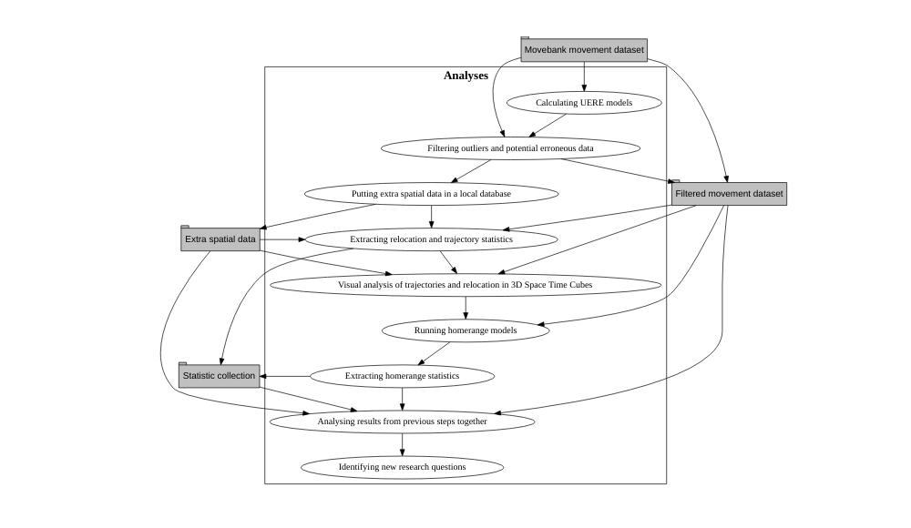

Building an analysis plan from the ‘movement ecology’ literature
================
Marius Bottin
2023-04-28

- [Analyses: literature and
  possibilities](#analyses-literature-and-possibilities)
  - [Current analyses](#current-analyses)
  - [Analysis flow](#analysis-flow)
  - [Future potential analyses](#future-potential-analyses)
- [References](#references)

``` r
knitr::opts_chunk$set(cache=T,tidy.opts = list(width.cutoff = 70), tidy = TRUE, fig.path="Fig/plan",echo=T)
```

In order to create an analysis plan for the animal tracking data in
Medellin and the Aburrá valley, we consulted a few recent papers on the
subject. The literature on the topic of movement ecology has
considerably increased in the last decade and all authors seem to
consider that the recent development in the device designs has boosted
the analysis possibilities.

In this document, we will present the potential analyses for our data,
accounting for the nature of our data, and the objectives of the
project: tracking movement of animals in a large Colombian metropolis,
and deducing some implications in terms of ecological connectivity.

# Analyses: literature and possibilities

While the arena is evolving rapidly and the movement data analysis
framework is not completely stables, the literature usually separate two
main fields of analyses (Seidel et al. 2018; Demšar et al. 2015):

1.  trajectory analyses
2.  space-use analyses

Most of the analyses that we can find are dependent on the types and
quality of available data (Edelhoff, Signer, and Balkenhol 2016; Hertel
et al. 2020; Thurfjell, Ciuti, and Boyce 2014; Seidel et al. 2018). For
example, one of the main challenge in relocation data analysis is to
attribute trajectories and locations to particular behaviors of the
individuals (e.g. Seidel et al. 2018; Demšar et al. 2015; Hertel et al.
2020). It is clear that having access to a fine spatial description of
the environment, a very frequent and precise relocation dataset, and
many individuals from species population is necessary to be able to
assess and classify precisely the behaviors of the individuals. We do
not have access in our project to a precise spatial description of the
environment in the Metropolitan Area of Medellin (spatial classification
of resources), and technical constraints (energy consumption of the GPS
collars) do not allow us to have an extremely fine frequency of the
relocation data. However, several analyses are possible to conduct in
our dataset.

## Current analyses

The current possibilities explored for our dataset are:

- **Analyses of data errors and outliers through User Equivalent Range
  Error Model (UERE) calibration** from the `ctmm` package (Calabrese,
  Fleming, and Gurarie 2016)
- **Calculation of statistics from the clean relocation data and path
  metrics** (e.g. Seidel et al. 2018). There are many statistics to be
  extracted from a relocation dataset (See table 1 in Seidel et al. 2018
  for a list of such statistics)
- **Visualization (and visual analyses) of relocation data and
  trajectories through Space Time Cubes** (Demšar et al. 2015). One of
  the main difficulties with relocation and trajectory analyses is that
  the visualization of such quantities of overlapping data. So, in order
  to be able to distinguish the data, a simple solution consists in
  using time as a third dimension.
- **Basic homerange representation** (Calabrese, Fleming, and Gurarie
  2016): homerange analyses are one of the most used analyses for animal
  movement data. While there are many options to explore in homerange
  analyses, `ctmm` propose possibilities to automatically apply these
  analyses in a “basic” batch setup
- **Analysis of the homerange, relocation and path statistics**:
  Finally, statistics calculated on homerange, relocation and path
  analyses will be analysed and presented in a last recapitulative
  document for all individuals

## Analysis flow

<!-- -->

## Future potential analyses

In the future, extra-analyses may be applied:

- Dodge et al. (2013) shows how to use the “Env-DATA” system in order to
  add some environmental data to the movement dataset. If further
  questions (for example the effect of meterology on the movement
  behavior of the animals) are to be explored with these dataset,
  Env-DATA might come in handy!
- Jeltsch et al. (2013) discuss conceptually the relationships between
  movement ecology and biodiversity ecology. It may be a good reference
  for going further in the analysis of this dataset in relations to
  other questions which are developped in the *Instuto Alexander Von
  Humboldt*

# References

<div id="refs" class="references csl-bib-body hanging-indent">

<div id="ref-Calabrese2016" class="csl-entry">

Calabrese, Justin M., Chris H. Fleming, and Eliezer Gurarie. 2016.
“Ctmm: An <span class="smallcaps">r</span> Package for Analyzing Animal
Relocation Data as a Continuous-Time Stochastic Process.” Edited by
Robert Freckleton. *Methods in Ecology and Evolution* 7 (9): 1124–32.
doi:[10.1111/2041-210X.12559](https://doi.org/10.1111/2041-210X.12559).

</div>

<div id="ref-Demsar2015" class="csl-entry">

Demšar, Urška, Kevin Buchin, Francesca Cagnacci, Kamran Safi, Bettina
Speckmann, Nico Van de Weghe, Daniel Weiskopf, and Robert Weibel. 2015.
“Analysis and Visualisation of Movement: An Interdisciplinary Review.”
*Movement Ecology* 3 (1): 5.
doi:[10.1186/s40462-015-0032-y](https://doi.org/10.1186/s40462-015-0032-y).

</div>

<div id="ref-Dodge2013" class="csl-entry">

Dodge, Somayeh, Gil Bohrer, Rolf Weinzierl, Sarah C Davidson, Roland
Kays, David Douglas, Sebastian Cruz, Jiawei Han, David Brandes, and
Martin Wikelski. 2013. “The Environmental-Data Automated Track
Annotation (Env-DATA) System: Linking Animal Tracks with Environmental
Data.” *Movement Ecology* 1 (1): 3.
doi:[10.1186/2051-3933-1-3](https://doi.org/10.1186/2051-3933-1-3).

</div>

<div id="ref-Edelhoff2016" class="csl-entry">

Edelhoff, Hendrik, Johannes Signer, and Niko Balkenhol. 2016. “Path
Segmentation for Beginners: An Overview of Current Methods for Detecting
Changes in Animal Movement Patterns.” *Movement Ecology* 4 (1): 21.
doi:[10.1186/s40462-016-0086-5](https://doi.org/10.1186/s40462-016-0086-5).

</div>

<div id="ref-Hertel2020" class="csl-entry">

Hertel, Anne G., Petri T. Niemelä, Niels J. Dingemanse, and Thomas
Mueller. 2020. “A Guide for Studying Among-Individual Behavioral
Variation from Movement Data in the Wild.” *Movement Ecology* 8 (1): 30.
doi:[10.1186/s40462-020-00216-8](https://doi.org/10.1186/s40462-020-00216-8).

</div>

<div id="ref-Jeltsch2013a" class="csl-entry">

Jeltsch, Florian, Dries Bonte, Guy Pe’er, Björn Reineking, Peter
Leimgruber, Niko Balkenhol, Boris Schröder, et al. 2013. “Integrating
Movement Ecology with Biodiversity Research - Exploring New Avenues to
Address Spatiotemporal Biodiversity Dynamics.” *Movement Ecology* 1 (1):
6. doi:[10.1186/2051-3933-1-6](https://doi.org/10.1186/2051-3933-1-6).

</div>

<div id="ref-Seidel2018" class="csl-entry">

Seidel, Dana Paige, Eric Dougherty, Colin Carlson, and Wayne M. Getz.
2018. “Ecological Metrics and Methods for GPS Movement Data.” Review.
*International Journal of Geographical Information Science* 32 (11).
Taylor and Francis Ltd.: 2272–93.
doi:[10.1080/13658816.2018.1498097](https://doi.org/10.1080/13658816.2018.1498097).

</div>

<div id="ref-Thurfjell2014" class="csl-entry">

Thurfjell, Henrik, Simone Ciuti, and Mark S Boyce. 2014. “Applications
of Step-Selection Functions in Ecology and Conservation.” *Movement
Ecology* 2 (1): 4.
doi:[10.1186/2051-3933-2-4](https://doi.org/10.1186/2051-3933-2-4).

</div>

</div>
