Spatial error calibration
================
Marius Bottin
2023-05-01

- [Getting main information from
  movebank](#getting-main-information-from-movebank)
- [Importing Calibration data](#importing-calibration-data)
  - [Correcting errors in the calibration
    files](#correcting-errors-in-the-calibration-files)
    - [Dealing with wrong names](#dealing-with-wrong-names)
    - [Errors in coordinates](#errors-in-coordinates)
  - [Getting the calibration data in `ctmm`
    format](#getting-the-calibration-data-in-ctmm-format)
- [Analysing calibration data](#analysing-calibration-data)
  - [Main informations](#main-informations)
  - [Maps of calibration data](#maps-of-calibration-data)
- [Getting the movebank data, animal by
  animal](#getting-the-movebank-data-animal-by-animal)
- [Calculating UERE](#calculating-uere)

Telemetry data from movebank comes with the HDOP measurement of GPS
errors. This measurement, however does not give the real error in meter.
In order to make it interpretable, it should be accompanied by a User
Equivalent Range Error (UERE). The `ctmm` package propose to fit the
UERE with a calibration dataset. Thus, calibrated data should be used to
extract an estimation of spatial error in each point. However, the
documentation on how to do that is not very clear. In this document, I
will explore the calibration process in `ctmm`, in order to better
understand how to manage the errors later.

# Getting main information from movebank

We first import movebank data, to get the information about animals and
deployment, in case they are useful later…

See corresponding R files and/or
[importingCleaningFormatting.Rmd](importingCleaningFormatting.md) for
more information.

``` r
source(file = "./importingMovebankData.R")
```

# Importing Calibration data

The calibration data consist in a set of csv files in the movebank csv
export format, before deployment, in a place where devices where stored
without moving during a period.

``` r
folCalib <- "../../../uwt_repo_data/calibration/"
(calibFiles <- dir(folCalib, pattern = "csv"))
```

    ##  [1] "Garza1.csv"      "Garza4.csv"      "Guacharaca1.csv" "Guacharaca3.csv"
    ##  [5] "Phimosus2.csv"   "Phimosus4.csv"   "Pigua2.csv"      "Zarigueya1.csv" 
    ##  [9] "Zarigueya2.csv"  "Zarigueya3.csv"  "Zarigueya4.csv"  "Zorro2.csv"     
    ## [13] "Zorro3.csv"      "Zorro4.csv"      "Zorro5.csv"      "Zorro6.csv"     
    ## [17] "Zorro7.csv"

``` r
# read.csv files
CSV_calib <- lapply(paste0(folCalib, calibFiles), read.csv, sep = ";")
names(CSV_calib) <- gsub("\\.csv$", "", calibFiles)
```

## Correcting errors in the calibration files

There are various errors in the calibration files. My guess is that they
have been created and/or modified in Excel (which almost always results
in errors).

### Dealing with wrong names

The names of the animals are wrong in the files, so we will have to
modify them to avoid errors.

The first thing to do is to find the correspondance between movebank
names and the calibration files:

``` r
aniNames <- animals$local_identifier[animals$number_of_events > 20]
# The calibration files do not have exactly the same names as the
# animals
caliNames <- gsub("\\.csv", "", dir("../../../uwt_repo_data/calibration/",
    pattern = "csv"))

tabNames <- data.frame(aniNames = aniNames, partLetter = gsub("-", "",
    gsub("^([-A-Za-z]+)([0-9]+)$", "\\1", aniNames)), partNumber = as.integer(gsub("^([-A-Za-z]+)([0-9]+)$",
    "\\2", aniNames)), calibName = NA)
matches <- sapply(caliNames, function(x, tab) {
    let <- gsub("^([A-Za-z]+)([0-9]+$)", "\\1", x)
    num <- gsub("^([A-Za-z]+)([0-9]+$)", "\\2", x)
    which((tab$partLetter == let | (tab$partLetter == "GarzaAve" & let ==
        "Garza")) & tab$partNumber == num)
}, tab = tabNames)
tabNames$calibName[matches] <- caliNames
save(tabNames, file = "tabNames.RData")
kable(tabNames[c("aniNames", "calibName")], colnames = c("Movebank name",
    "Calibration file name"))
```

<table>
<thead>
<tr>
<th style="text-align:left;">
aniNames
</th>
<th style="text-align:left;">
calibName
</th>
</tr>
</thead>
<tbody>
<tr>
<td style="text-align:left;">
Zorro02
</td>
<td style="text-align:left;">
Zorro2
</td>
</tr>
<tr>
<td style="text-align:left;">
Zorro03
</td>
<td style="text-align:left;">
Zorro3
</td>
</tr>
<tr>
<td style="text-align:left;">
Zorro04
</td>
<td style="text-align:left;">
Zorro4
</td>
</tr>
<tr>
<td style="text-align:left;">
Zorro05
</td>
<td style="text-align:left;">
Zorro5
</td>
</tr>
<tr>
<td style="text-align:left;">
Zorro06
</td>
<td style="text-align:left;">
Zorro6
</td>
</tr>
<tr>
<td style="text-align:left;">
Zorro07
</td>
<td style="text-align:left;">
Zorro7
</td>
</tr>
<tr>
<td style="text-align:left;">
Guacharaca01
</td>
<td style="text-align:left;">
Guacharaca1
</td>
</tr>
<tr>
<td style="text-align:left;">
Guacharaca03
</td>
<td style="text-align:left;">
Guacharaca3
</td>
</tr>
<tr>
<td style="text-align:left;">
Phimosus01
</td>
<td style="text-align:left;">
—
</td>
</tr>
<tr>
<td style="text-align:left;">
Phimosus02
</td>
<td style="text-align:left;">
Phimosus2
</td>
</tr>
<tr>
<td style="text-align:left;">
Pigua1
</td>
<td style="text-align:left;">
—
</td>
</tr>
<tr>
<td style="text-align:left;">
Zarigueya1
</td>
<td style="text-align:left;">
Zarigueya1
</td>
</tr>
<tr>
<td style="text-align:left;">
Zarigueya2
</td>
<td style="text-align:left;">
Zarigueya2
</td>
</tr>
<tr>
<td style="text-align:left;">
Zarigueya3
</td>
<td style="text-align:left;">
Zarigueya3
</td>
</tr>
<tr>
<td style="text-align:left;">
Zarigueya4
</td>
<td style="text-align:left;">
Zarigueya4
</td>
</tr>
<tr>
<td style="text-align:left;">
Phimosus04
</td>
<td style="text-align:left;">
Phimosus4
</td>
</tr>
<tr>
<td style="text-align:left;">
Pigua2
</td>
<td style="text-align:left;">
Pigua2
</td>
</tr>
<tr>
<td style="text-align:left;">
Garza1
</td>
<td style="text-align:left;">
Garza1
</td>
</tr>
<tr>
<td style="text-align:left;">
GarzaAve4
</td>
<td style="text-align:left;">
Garza4
</td>
</tr>
<tr>
<td style="text-align:left;">
Zarigueya5
</td>
<td style="text-align:left;">
—
</td>
</tr>
<tr>
<td style="text-align:left;">
Pigua5
</td>
<td style="text-align:left;">
—
</td>
</tr>
<tr>
<td style="text-align:left;">
Guacharaca06
</td>
<td style="text-align:left;">
—
</td>
</tr>
<tr>
<td style="text-align:left;">
Ardilla1
</td>
<td style="text-align:left;">
—
</td>
</tr>
<tr>
<td style="text-align:left;">
GarzaAve2
</td>
<td style="text-align:left;">
—
</td>
</tr>
<tr>
<td style="text-align:left;">
GarzaAve3
</td>
<td style="text-align:left;">
—
</td>
</tr>
<tr>
<td style="text-align:left;">
Zarigueya6
</td>
<td style="text-align:left;">
—
</td>
</tr>
<tr>
<td style="text-align:left;">
Phimosus05
</td>
<td style="text-align:left;">
—
</td>
</tr>
<tr>
<td style="text-align:left;">
Phimosus07
</td>
<td style="text-align:left;">
—
</td>
</tr>
<tr>
<td style="text-align:left;">
Phimosus06
</td>
<td style="text-align:left;">
—
</td>
</tr>
<tr>
<td style="text-align:left;">
Zarigueya7
</td>
<td style="text-align:left;">
—
</td>
</tr>
<tr>
<td style="text-align:left;">
Guacharaca02
</td>
<td style="text-align:left;">
—
</td>
</tr>
<tr>
<td style="text-align:left;">
PavaGarza-4
</td>
<td style="text-align:left;">
—
</td>
</tr>
<tr>
<td style="text-align:left;">
Asio2
</td>
<td style="text-align:left;">
—
</td>
</tr>
<tr>
<td style="text-align:left;">
BuhoPigua6
</td>
<td style="text-align:left;">
—
</td>
</tr>
<tr>
<td style="text-align:left;">
Ardilla2
</td>
<td style="text-align:left;">
—
</td>
</tr>
<tr>
<td style="text-align:left;">
PavaGuacharaca5
</td>
<td style="text-align:left;">
—
</td>
</tr>
<tr>
<td style="text-align:left;">
Guacharaca04
</td>
<td style="text-align:left;">
—
</td>
</tr>
<tr>
<td style="text-align:left;">
PerezosoZorro1
</td>
<td style="text-align:left;">
—
</td>
</tr>
<tr>
<td style="text-align:left;">
Titi4
</td>
<td style="text-align:left;">
—
</td>
</tr>
<tr>
<td style="text-align:left;">
Phimosus03
</td>
<td style="text-align:left;">
—
</td>
</tr>
<tr>
<td style="text-align:left;">
GuacharacaAsio-4
</td>
<td style="text-align:left;">
—
</td>
</tr>
<tr>
<td style="text-align:left;">
GarzaTiti3
</td>
<td style="text-align:left;">
—
</td>
</tr>
</tbody>
</table>

We now replace the names in the data imported from the CSV files:

``` r
m_names <- match(names(CSV_calib), tabNames$calibName)
(m_movebank_names <- tabNames[m_names, "aniNames"])
```

    ##  [1] "Garza1"       "GarzaAve4"    "Guacharaca01" "Guacharaca03" "Phimosus02"  
    ##  [6] "Phimosus04"   "Pigua2"       "Zarigueya1"   "Zarigueya2"   "Zarigueya3"  
    ## [11] "Zarigueya4"   "Zorro02"      "Zorro03"      "Zorro04"      "Zorro05"     
    ## [16] "Zorro06"      "Zorro07"

``` r
names(CSV_calib) <- m_movebank_names
for (i in 1:length(CSV_calib)) {
    CSV_calib[[i]]$individual.local.identifier <- m_movebank_names[i]
}
```

### Errors in coordinates

The coordinates of many of the calibration files are wrong in their
digits. For example, *Garza1*

``` r
head(CSV_calib$Garza1[c("location.long", "location.lat")])
```

<div class="kable-table">

<table>
<thead>
<tr>
<th style="text-align:left;">
location.long
</th>
<th style="text-align:left;">
location.lat
</th>
</tr>
</thead>
<tbody>
<tr>
<td style="text-align:left;">
-75.595.673
</td>
<td style="text-align:left;">
625.713
</td>
</tr>
<tr>
<td style="text-align:left;">
-75.594.841
</td>
<td style="text-align:left;">
6.257.148
</td>
</tr>
<tr>
<td style="text-align:left;">
-75.594.772
</td>
<td style="text-align:left;">
6.256.346
</td>
</tr>
<tr>
<td style="text-align:left;">
-75.594.955
</td>
<td style="text-align:left;">
6.256.629
</td>
</tr>
<tr>
<td style="text-align:left;">
-75.594.841
</td>
<td style="text-align:left;">
6.256.818
</td>
</tr>
<tr>
<td style="text-align:left;">
-75.595.055
</td>
<td style="text-align:left;">
6.256.812
</td>
</tr>
</tbody>
</table>

</div>

It is the case for:

``` r
(pbCoord <- sapply(CSV_calib, function(x) is.character(x$location.long) |
    is.character(x$location.lat)))
```

    ##       Garza1    GarzaAve4 Guacharaca01 Guacharaca03   Phimosus02   Phimosus04 
    ##         TRUE         TRUE         TRUE         TRUE        FALSE        FALSE 
    ##       Pigua2   Zarigueya1   Zarigueya2   Zarigueya3   Zarigueya4      Zorro02 
    ##         TRUE        FALSE        FALSE        FALSE        FALSE        FALSE 
    ##      Zorro03      Zorro04      Zorro05      Zorro06      Zorro07 
    ##        FALSE        FALSE        FALSE        FALSE        FALSE

It may be corrected with the following code:

``` r
for (i in 1:length(CSV_calib)) {
    if (pbCoord[i]) {
        if (is.character(CSV_calib[[i]]$location.long)) {
            CSV_calib[[i]]$location.long <- as.numeric(gsub("^-75", "-75.",
                gsub("\\.", "", CSV_calib[[i]]$location.long)))
        }
        if (is.character(CSV_calib[[i]]$location.lat)) {
            CSV_calib[[i]]$location.lat <- as.numeric(gsub("^6", "6.",
                gsub("\\.", "", CSV_calib[[i]]$location.lat)))
        }
    }
}
```

## Getting the calibration data in `ctmm` format

Then, when the errors are fixed, we can transform it as a `ctmm` object:

``` r
calibData <- lapply(CSV_calib, as.telemetry)
```

Because calibration in `ctmm` is based on “location classes” it is safer
to nullify classes in the calibration `telemetry` object (and in the
tracking dataset as well). (See explanation in:
<https://github.com/ctmm-initiative/ctmm/issues/47>)

``` r
for (i in 1:length(calibData)) {
    calibData[[i]]$class <- NULL
}
```

# Analysing calibration data

## Main informations

We can calculate statistics on the calibration data:

``` r
nbPoints <- sapply(calibData, function(x) nrow(x))
calibDistPoints <- lapply(calibData, function(x) gDistance(SpatialPointsDataFrame.telemetry(x),
    byid = T))
calibConvexHull <- lapply(calibData, function(x) gConvexHull(SpatialPointsDataFrame.telemetry(x)))
data.frame(nbPoints = nbPoints, average = sapply(calibDistPoints, function(x) mean(as.dist(x))),
    min = sapply(calibDistPoints, function(x) min(as.dist(x))), max = sapply(calibDistPoints,
        function(x) max(as.dist(x))), areaChull = sapply(calibConvexHull,
        gArea), hdop_aver = sapply(calibData, function(x) mean(x$HDOP)),
    hdop_min = sapply(calibData, function(x) min(x$HDOP)), hdop_max = sapply(calibData,
        function(x) max(x$HDOP))) %>%
    kable(col.names = c("Number of points", "Average", "Minimum", "Maximum",
        "Area", "Average", "Minimum", "Maximum")) %>%
    add_header_above(c(` ` = 2, `Distance between calibration points (m)` = 3,
        `Convex hull (m2)` = 1, HDOP = 3))
```

<table>
<thead>
<tr>
<th style="empty-cells: hide;border-bottom:hidden;" colspan="2">
</th>
<th style="border-bottom:hidden;padding-bottom:0; padding-left:3px;padding-right:3px;text-align: center; " colspan="3">

<div style="border-bottom: 1px solid #ddd; padding-bottom: 5px; ">

Distance between calibration points (m)

</div>

</th>
<th style="border-bottom:hidden;padding-bottom:0; padding-left:3px;padding-right:3px;text-align: center; " colspan="1">

<div style="border-bottom: 1px solid #ddd; padding-bottom: 5px; ">

Convex hull (m2)

</div>

</th>
<th style="border-bottom:hidden;padding-bottom:0; padding-left:3px;padding-right:3px;text-align: center; " colspan="3">

<div style="border-bottom: 1px solid #ddd; padding-bottom: 5px; ">

HDOP

</div>

</th>
</tr>
<tr>
<th style="text-align:left;">
</th>
<th style="text-align:right;">
Number of points
</th>
<th style="text-align:right;">
Average
</th>
<th style="text-align:right;">
Minimum
</th>
<th style="text-align:right;">
Maximum
</th>
<th style="text-align:right;">
Area
</th>
<th style="text-align:right;">
Average
</th>
<th style="text-align:right;">
Minimum
</th>
<th style="text-align:right;">
Maximum
</th>
</tr>
</thead>
<tbody>
<tr>
<td style="text-align:left;">
Garza1
</td>
<td style="text-align:right;">
152
</td>
<td style="text-align:right;">
44.45556
</td>
<td style="text-align:right;">
0.2226806
</td>
<td style="text-align:right;">
195.64223
</td>
<td style="text-align:right;">
13580.167
</td>
<td style="text-align:right;">
1.230592
</td>
<td style="text-align:right;">
0.75
</td>
<td style="text-align:right;">
3.87
</td>
</tr>
<tr>
<td style="text-align:left;">
GarzaAve4
</td>
<td style="text-align:right;">
12
</td>
<td style="text-align:right;">
82.29622
</td>
<td style="text-align:right;">
10.2578445
</td>
<td style="text-align:right;">
186.71716
</td>
<td style="text-align:right;">
12029.997
</td>
<td style="text-align:right;">
2.421667
</td>
<td style="text-align:right;">
1.86
</td>
<td style="text-align:right;">
3.51
</td>
</tr>
<tr>
<td style="text-align:left;">
Guacharaca01
</td>
<td style="text-align:right;">
74
</td>
<td style="text-align:right;">
54.51919
</td>
<td style="text-align:right;">
0.1105150
</td>
<td style="text-align:right;">
323.40260
</td>
<td style="text-align:right;">
30108.991
</td>
<td style="text-align:right;">
1.428649
</td>
<td style="text-align:right;">
0.83
</td>
<td style="text-align:right;">
3.72
</td>
</tr>
<tr>
<td style="text-align:left;">
Guacharaca03
</td>
<td style="text-align:right;">
51
</td>
<td style="text-align:right;">
60.85785
</td>
<td style="text-align:right;">
1.6741282
</td>
<td style="text-align:right;">
398.37751
</td>
<td style="text-align:right;">
40862.988
</td>
<td style="text-align:right;">
1.515686
</td>
<td style="text-align:right;">
0.82
</td>
<td style="text-align:right;">
3.36
</td>
</tr>
<tr>
<td style="text-align:left;">
Phimosus02
</td>
<td style="text-align:right;">
411
</td>
<td style="text-align:right;">
61.23944
</td>
<td style="text-align:right;">
0.0000000
</td>
<td style="text-align:right;">
300.00427
</td>
<td style="text-align:right;">
38915.278
</td>
<td style="text-align:right;">
1.473601
</td>
<td style="text-align:right;">
0.70
</td>
<td style="text-align:right;">
3.77
</td>
</tr>
<tr>
<td style="text-align:left;">
Phimosus04
</td>
<td style="text-align:right;">
110
</td>
<td style="text-align:right;">
43.72383
</td>
<td style="text-align:right;">
0.2223393
</td>
<td style="text-align:right;">
161.44035
</td>
<td style="text-align:right;">
13475.387
</td>
<td style="text-align:right;">
1.566545
</td>
<td style="text-align:right;">
0.86
</td>
<td style="text-align:right;">
3.89
</td>
</tr>
<tr>
<td style="text-align:left;">
Pigua2
</td>
<td style="text-align:right;">
152
</td>
<td style="text-align:right;">
44.45556
</td>
<td style="text-align:right;">
0.2226806
</td>
<td style="text-align:right;">
195.64223
</td>
<td style="text-align:right;">
13580.167
</td>
<td style="text-align:right;">
1.230592
</td>
<td style="text-align:right;">
0.75
</td>
<td style="text-align:right;">
3.87
</td>
</tr>
<tr>
<td style="text-align:left;">
Zarigueya1
</td>
<td style="text-align:right;">
13
</td>
<td style="text-align:right;">
33.35162
</td>
<td style="text-align:right;">
2.8241846
</td>
<td style="text-align:right;">
77.52745
</td>
<td style="text-align:right;">
3004.590
</td>
<td style="text-align:right;">
1.409231
</td>
<td style="text-align:right;">
0.96
</td>
<td style="text-align:right;">
2.71
</td>
</tr>
<tr>
<td style="text-align:left;">
Zarigueya2
</td>
<td style="text-align:right;">
21
</td>
<td style="text-align:right;">
105.85865
</td>
<td style="text-align:right;">
3.0153608
</td>
<td style="text-align:right;">
264.43292
</td>
<td style="text-align:right;">
27034.244
</td>
<td style="text-align:right;">
1.147143
</td>
<td style="text-align:right;">
0.82
</td>
<td style="text-align:right;">
2.33
</td>
</tr>
<tr>
<td style="text-align:left;">
Zarigueya3
</td>
<td style="text-align:right;">
20
</td>
<td style="text-align:right;">
74.70424
</td>
<td style="text-align:right;">
1.4224545
</td>
<td style="text-align:right;">
200.16957
</td>
<td style="text-align:right;">
15138.936
</td>
<td style="text-align:right;">
1.189500
</td>
<td style="text-align:right;">
0.85
</td>
<td style="text-align:right;">
2.14
</td>
</tr>
<tr>
<td style="text-align:left;">
Zarigueya4
</td>
<td style="text-align:right;">
116
</td>
<td style="text-align:right;">
25.92568
</td>
<td style="text-align:right;">
0.0000000
</td>
<td style="text-align:right;">
195.09685
</td>
<td style="text-align:right;">
10763.026
</td>
<td style="text-align:right;">
1.550345
</td>
<td style="text-align:right;">
0.86
</td>
<td style="text-align:right;">
7.85
</td>
</tr>
<tr>
<td style="text-align:left;">
Zorro02
</td>
<td style="text-align:right;">
18
</td>
<td style="text-align:right;">
43.09779
</td>
<td style="text-align:right;">
5.0704404
</td>
<td style="text-align:right;">
139.68814
</td>
<td style="text-align:right;">
4363.835
</td>
<td style="text-align:right;">
1.797778
</td>
<td style="text-align:right;">
0.88
</td>
<td style="text-align:right;">
3.47
</td>
</tr>
<tr>
<td style="text-align:left;">
Zorro03
</td>
<td style="text-align:right;">
31
</td>
<td style="text-align:right;">
33.41816
</td>
<td style="text-align:right;">
2.7831309
</td>
<td style="text-align:right;">
112.55032
</td>
<td style="text-align:right;">
4663.727
</td>
<td style="text-align:right;">
1.706129
</td>
<td style="text-align:right;">
0.97
</td>
<td style="text-align:right;">
2.91
</td>
</tr>
<tr>
<td style="text-align:left;">
Zorro04
</td>
<td style="text-align:right;">
147
</td>
<td style="text-align:right;">
42.46291
</td>
<td style="text-align:right;">
0.4473420
</td>
<td style="text-align:right;">
171.00763
</td>
<td style="text-align:right;">
14313.409
</td>
<td style="text-align:right;">
1.430272
</td>
<td style="text-align:right;">
0.81
</td>
<td style="text-align:right;">
3.24
</td>
</tr>
<tr>
<td style="text-align:left;">
Zorro05
</td>
<td style="text-align:right;">
54
</td>
<td style="text-align:right;">
37.77133
</td>
<td style="text-align:right;">
0.4452619
</td>
<td style="text-align:right;">
110.97454
</td>
<td style="text-align:right;">
5827.415
</td>
<td style="text-align:right;">
1.343519
</td>
<td style="text-align:right;">
0.91
</td>
<td style="text-align:right;">
2.47
</td>
</tr>
<tr>
<td style="text-align:left;">
Zorro06
</td>
<td style="text-align:right;">
16
</td>
<td style="text-align:right;">
34.12327
</td>
<td style="text-align:right;">
1.3358038
</td>
<td style="text-align:right;">
79.46239
</td>
<td style="text-align:right;">
2918.510
</td>
<td style="text-align:right;">
1.475000
</td>
<td style="text-align:right;">
0.97
</td>
<td style="text-align:right;">
2.81
</td>
</tr>
<tr>
<td style="text-align:left;">
Zorro07
</td>
<td style="text-align:right;">
12
</td>
<td style="text-align:right;">
36.75812
</td>
<td style="text-align:right;">
1.1088925
</td>
<td style="text-align:right;">
81.24635
</td>
<td style="text-align:right;">
2760.883
</td>
<td style="text-align:right;">
1.491667
</td>
<td style="text-align:right;">
0.97
</td>
<td style="text-align:right;">
2.02
</td>
</tr>
</tbody>
</table>

## Maps of calibration data

**Garza1**:

``` r
leaflet(spTransform(SpatialPointsDataFrame.telemetry(calibData[["Garza1"]]),
    CRS("+proj=longlat +datum=WGS84"))) %>%
    addProviderTiles("Esri.WorldImagery") %>%
    addPolygons(data = spTransform(calibConvexHull$Garza1, CRS("+proj=longlat +datum=WGS84"))) %>%
    addCircleMarkers(radius = 1, color = "red", fill = "red")
```

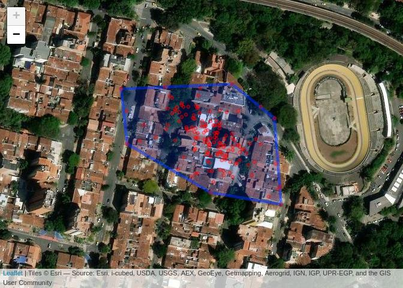<!-- -->

**GarzaAve4**:

``` r
leaflet(spTransform(SpatialPointsDataFrame.telemetry(calibData[["GarzaAve4"]]),
    CRS("+proj=longlat +datum=WGS84"))) %>%
    addProviderTiles("Esri.WorldImagery") %>%
    addPolygons(data = spTransform(calibConvexHull$GarzaAve4, CRS("+proj=longlat +datum=WGS84"))) %>%
    addCircleMarkers(radius = 1, color = "red", fill = "red")
```

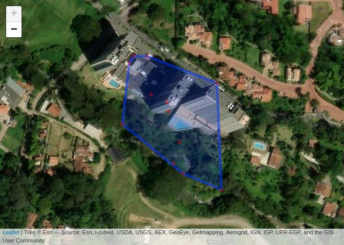<!-- -->

**Guacharaca01**:

``` r
leaflet(spTransform(SpatialPointsDataFrame.telemetry(calibData[["Guacharaca01"]]),
    CRS("+proj=longlat +datum=WGS84"))) %>%
    addProviderTiles("Esri.WorldImagery") %>%
    addPolygons(data = spTransform(calibConvexHull$Guacharaca01, CRS("+proj=longlat +datum=WGS84"))) %>%
    addCircleMarkers(radius = 1, color = "red", fill = "red")
```

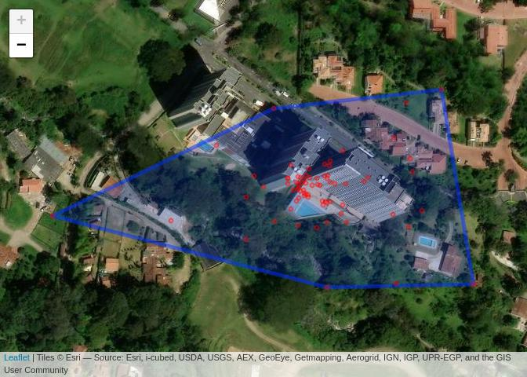<!-- -->

**Guacharaca03**:

``` r
leaflet(spTransform(SpatialPointsDataFrame.telemetry(calibData[["Guacharaca03"]]),
    CRS("+proj=longlat +datum=WGS84"))) %>%
    addProviderTiles("Esri.WorldImagery") %>%
    addPolygons(data = spTransform(calibConvexHull$Guacharaca03, CRS("+proj=longlat +datum=WGS84"))) %>%
    addCircleMarkers(radius = 1, color = "red", fill = "red")
```

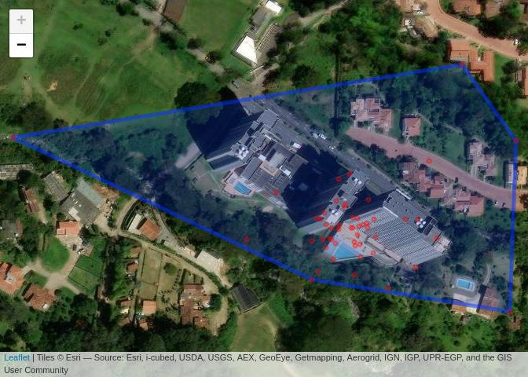<!-- -->

**Phimosus02**:

``` r
leaflet(spTransform(SpatialPointsDataFrame.telemetry(calibData[["Phimosus02"]]),
    CRS("+proj=longlat +datum=WGS84"))) %>%
    addProviderTiles("Esri.WorldImagery") %>%
    addPolygons(data = spTransform(calibConvexHull$Phimosus02, CRS("+proj=longlat +datum=WGS84"))) %>%
    addCircleMarkers(radius = 1, color = "red", fill = "red")
```

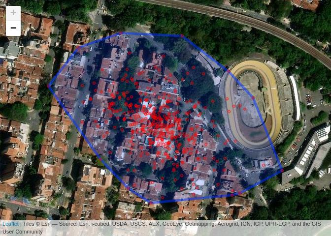<!-- -->

**Phimosus04**:

``` r
leaflet(spTransform(SpatialPointsDataFrame.telemetry(calibData[["Phimosus04"]]),
    CRS("+proj=longlat +datum=WGS84"))) %>%
    addProviderTiles("Esri.WorldImagery") %>%
    addPolygons(data = spTransform(calibConvexHull$Phimosus04, CRS("+proj=longlat +datum=WGS84"))) %>%
    addCircleMarkers(radius = 1, color = "red", fill = "red")
```

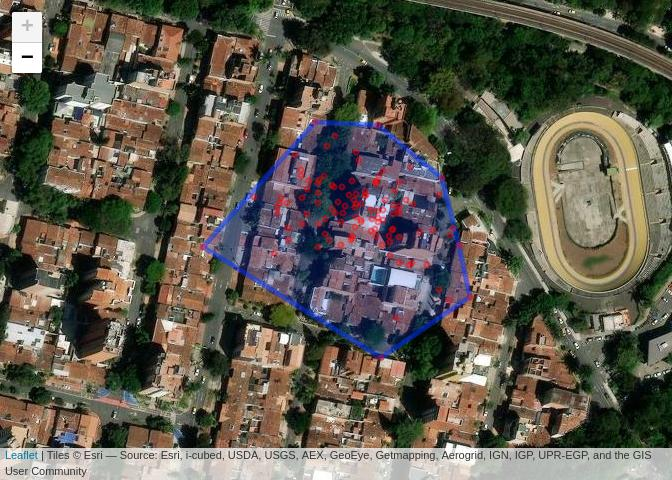<!-- -->

**Pigua2**:

``` r
leaflet(spTransform(SpatialPointsDataFrame.telemetry(calibData[["Pigua2"]]),
    CRS("+proj=longlat +datum=WGS84"))) %>%
    addProviderTiles("Esri.WorldImagery") %>%
    addPolygons(data = spTransform(calibConvexHull$Pigua2, CRS("+proj=longlat +datum=WGS84"))) %>%
    addCircleMarkers(radius = 1, color = "red", fill = "red")
```

<!-- -->

**Zarigueya1**:

``` r
leaflet(spTransform(SpatialPointsDataFrame.telemetry(calibData[["Zarigueya1"]]),
    CRS("+proj=longlat +datum=WGS84"))) %>%
    addProviderTiles("Esri.WorldImagery") %>%
    addPolygons(data = spTransform(calibConvexHull$Zarigueya1, CRS("+proj=longlat +datum=WGS84"))) %>%
    addCircleMarkers(radius = 1, color = "red", fill = "red")
```

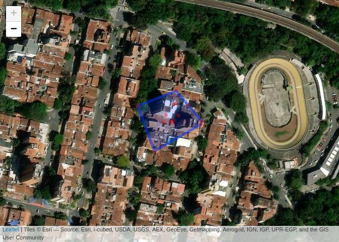<!-- -->

**Zarigueya2**:

``` r
leaflet(spTransform(SpatialPointsDataFrame.telemetry(calibData[["Zarigueya2"]]),
    CRS("+proj=longlat +datum=WGS84"))) %>%
    addProviderTiles("Esri.WorldImagery") %>%
    addPolygons(data = spTransform(calibConvexHull$Zarigueya2, CRS("+proj=longlat +datum=WGS84"))) %>%
    addCircleMarkers(radius = 1, color = "red", fill = "red")
```

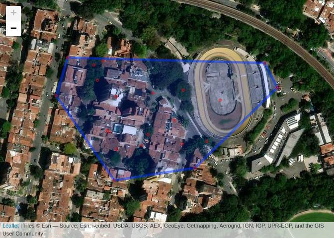<!-- -->

**Zarigueya3**:

``` r
leaflet(spTransform(SpatialPointsDataFrame.telemetry(calibData[["Zarigueya3"]]),
    CRS("+proj=longlat +datum=WGS84"))) %>%
    addProviderTiles("Esri.WorldImagery") %>%
    addPolygons(data = spTransform(calibConvexHull$Zarigueya3, CRS("+proj=longlat +datum=WGS84"))) %>%
    addCircleMarkers(radius = 1, color = "red", fill = "red")
```

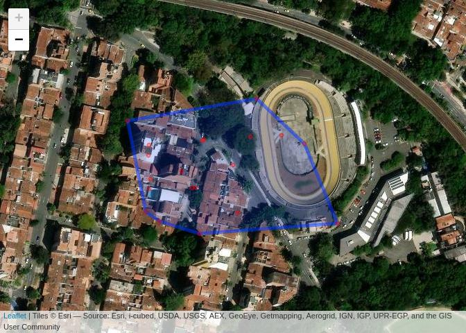<!-- -->

**Zarigueya4**:

``` r
leaflet(spTransform(SpatialPointsDataFrame.telemetry(calibData[["Zarigueya4"]]),
    CRS("+proj=longlat +datum=WGS84"))) %>%
    addProviderTiles("Esri.WorldImagery") %>%
    addPolygons(data = spTransform(calibConvexHull$Zarigueya4, CRS("+proj=longlat +datum=WGS84"))) %>%
    addCircleMarkers(radius = 1, color = "red", fill = "red")
```

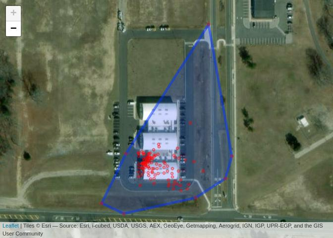<!-- -->

**Zorro02**:

``` r
leaflet(spTransform(SpatialPointsDataFrame.telemetry(calibData[["Zorro02"]]),
    CRS("+proj=longlat +datum=WGS84"))) %>%
    addProviderTiles("Esri.WorldImagery") %>%
    addPolygons(data = spTransform(calibConvexHull$Zorro02, CRS("+proj=longlat +datum=WGS84"))) %>%
    addCircleMarkers(radius = 1, color = "red", fill = "red")
```

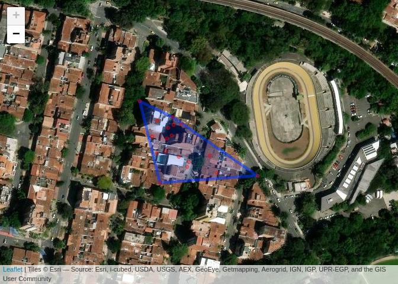<!-- -->

**Zorro03**:

``` r
leaflet(spTransform(SpatialPointsDataFrame.telemetry(calibData[["Zorro03"]]),
    CRS("+proj=longlat +datum=WGS84"))) %>%
    addProviderTiles("Esri.WorldImagery") %>%
    addPolygons(data = spTransform(calibConvexHull$Zorro03, CRS("+proj=longlat +datum=WGS84"))) %>%
    addCircleMarkers(radius = 1, color = "red", fill = "red")
```

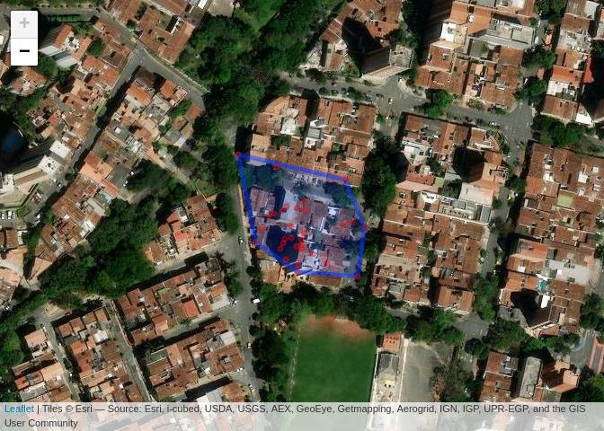<!-- -->

**Zorro04**:

``` r
leaflet(spTransform(SpatialPointsDataFrame.telemetry(calibData[["Zorro04"]]),
    CRS("+proj=longlat +datum=WGS84"))) %>%
    addProviderTiles("Esri.WorldImagery") %>%
    addPolygons(data = spTransform(calibConvexHull$Zorro04, CRS("+proj=longlat +datum=WGS84"))) %>%
    addCircleMarkers(radius = 1, color = "red", fill = "red")
```

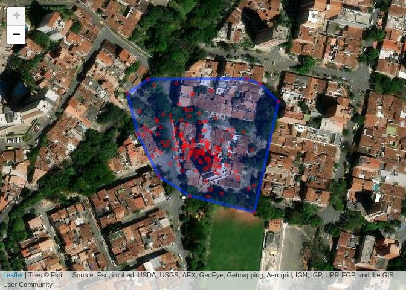<!-- -->

**Zorro05**:

``` r
leaflet(spTransform(SpatialPointsDataFrame.telemetry(calibData[["Zorro05"]]),
    CRS("+proj=longlat +datum=WGS84"))) %>%
    addProviderTiles("Esri.WorldImagery") %>%
    addPolygons(data = spTransform(calibConvexHull$Zorro05, CRS("+proj=longlat +datum=WGS84"))) %>%
    addCircleMarkers(radius = 1, color = "red", fill = "red")
```

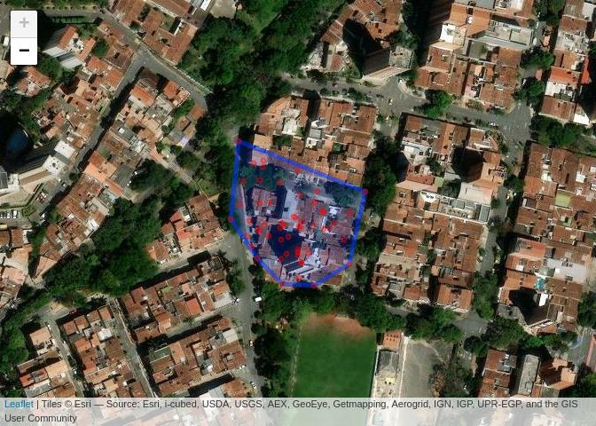<!-- -->

**Zorro06**:

``` r
leaflet(spTransform(SpatialPointsDataFrame.telemetry(calibData[["Zorro06"]]),
    CRS("+proj=longlat +datum=WGS84"))) %>%
    addProviderTiles("Esri.WorldImagery") %>%
    addPolygons(data = spTransform(calibConvexHull$Zorro06, CRS("+proj=longlat +datum=WGS84"))) %>%
    addCircleMarkers(radius = 1, color = "red", fill = "red")
```

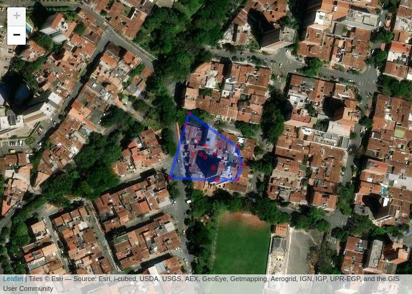<!-- -->

**Zorro07**:

``` r
leaflet(spTransform(SpatialPointsDataFrame.telemetry(calibData[["Zorro07"]]),
    CRS("+proj=longlat +datum=WGS84"))) %>%
    addProviderTiles("Esri.WorldImagery") %>%
    addPolygons(data = spTransform(calibConvexHull$Zorro07, CRS("+proj=longlat +datum=WGS84"))) %>%
    addCircleMarkers(radius = 1, color = "red", fill = "red")
```

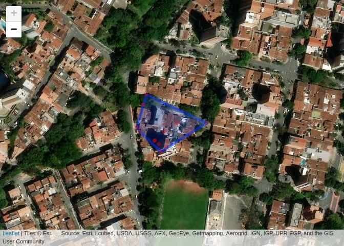<!-- -->

# Getting the movebank data, animal by animal

``` r
rawList <- list()
for (i in 1:nrow(tabNames)) {
    rawList[[tabNames$aniNames[i]]] <- list()
    rawList[[i]]$moveData = getMovebankData(study = study_id, login = lgin,
        animalName = tabNames$aniNames[i])
    rawList[[i]]$ctmmData = as.telemetry(rawList[[i]]$moveData)
    rawList[[i]]$ctmmData$class <- NULL
}
```

# Calculating UERE

The User Equivalent Range Error (UERE) correspond to the homoskedastic
(i.e. it does not vary as a function of time) part of a location error
model. The Dilution Of Precision (DOP) correspond to the heteroskedastic
(i.e. it does vary through time) part of the location error model, and
it is usually given for each relocation of a movement dataset.

$location~error(t)= DOP(t) × UERE(t)$

Calculating UERE is done in `ctmm` using a calibration dataset.

``` r
UERE_list <- lapply(calibData, uere.fit)
save("UERE_list", file = "uere.RData")
```

When you look at the `ctmm` telemetry object of Zorro02 before applying
the UERE calibration, for instance:

``` r
zorro02_ctmm <- rawList$Zorro02$ctmmData
head(zorro02_ctmm) %>%
    kable()
```

<table>
<thead>
<tr>
<th style="text-align:left;">
timestamp
</th>
<th style="text-align:right;">
longitude
</th>
<th style="text-align:right;">
latitude
</th>
<th style="text-align:right;">
t
</th>
<th style="text-align:right;">
HDOP
</th>
<th style="text-align:right;">
z
</th>
<th style="text-align:right;">
VDOP
</th>
<th style="text-align:right;">
speed
</th>
<th style="text-align:right;">
heading
</th>
<th style="text-align:right;">
SDOP
</th>
<th style="text-align:right;">
x
</th>
<th style="text-align:right;">
y
</th>
<th style="text-align:right;">
vx
</th>
<th style="text-align:right;">
vy
</th>
</tr>
</thead>
<tbody>
<tr>
<td style="text-align:left;">
2022-11-16 07:03:51
</td>
<td style="text-align:right;">
-75.60974
</td>
<td style="text-align:right;">
6.231113
</td>
<td style="text-align:right;">
1668582231
</td>
<td style="text-align:right;">
0.91
</td>
<td style="text-align:right;">
1680
</td>
<td style="text-align:right;">
0.91
</td>
<td style="text-align:right;">
0.0565889
</td>
<td style="text-align:right;">
0
</td>
<td style="text-align:right;">
0.91
</td>
<td style="text-align:right;">
-196.810568
</td>
<td style="text-align:right;">
-32.82631
</td>
<td style="text-align:right;">
0.0564003
</td>
<td style="text-align:right;">
0.0046164
</td>
</tr>
<tr>
<td style="text-align:left;">
2022-11-16 09:03:45
</td>
<td style="text-align:right;">
-75.61013
</td>
<td style="text-align:right;">
6.232648
</td>
<td style="text-align:right;">
1668589425
</td>
<td style="text-align:right;">
2.04
</td>
<td style="text-align:right;">
1675
</td>
<td style="text-align:right;">
2.04
</td>
<td style="text-align:right;">
0.6893556
</td>
<td style="text-align:right;">
0
</td>
<td style="text-align:right;">
2.04
</td>
<td style="text-align:right;">
-30.020616
</td>
<td style="text-align:right;">
24.02955
</td>
<td style="text-align:right;">
0.6870533
</td>
<td style="text-align:right;">
0.0562923
</td>
</tr>
<tr>
<td style="text-align:left;">
2022-11-16 12:32:31
</td>
<td style="text-align:right;">
-75.61104
</td>
<td style="text-align:right;">
6.232956
</td>
<td style="text-align:right;">
1668601951
</td>
<td style="text-align:right;">
1.46
</td>
<td style="text-align:right;">
1607
</td>
<td style="text-align:right;">
1.46
</td>
<td style="text-align:right;">
0.1028889
</td>
<td style="text-align:right;">
0
</td>
<td style="text-align:right;">
1.46
</td>
<td style="text-align:right;">
-4.053079
</td>
<td style="text-align:right;">
126.97421
</td>
<td style="text-align:right;">
0.1025451
</td>
<td style="text-align:right;">
0.0084037
</td>
</tr>
<tr>
<td style="text-align:left;">
2022-11-16 14:32:35
</td>
<td style="text-align:right;">
-75.61098
</td>
<td style="text-align:right;">
6.232893
</td>
<td style="text-align:right;">
1668609155
</td>
<td style="text-align:right;">
2.06
</td>
<td style="text-align:right;">
1612
</td>
<td style="text-align:right;">
2.06
</td>
<td style="text-align:right;">
0.1852000
</td>
<td style="text-align:right;">
0
</td>
<td style="text-align:right;">
2.06
</td>
<td style="text-align:right;">
-10.563906
</td>
<td style="text-align:right;">
120.55611
</td>
<td style="text-align:right;">
0.1845812
</td>
<td style="text-align:right;">
0.0151269
</td>
</tr>
<tr>
<td style="text-align:left;">
2022-11-16 16:31:58
</td>
<td style="text-align:right;">
-75.61112
</td>
<td style="text-align:right;">
6.232890
</td>
<td style="text-align:right;">
1668616318
</td>
<td style="text-align:right;">
1.18
</td>
<td style="text-align:right;">
1586
</td>
<td style="text-align:right;">
1.18
</td>
<td style="text-align:right;">
0.3086667
</td>
<td style="text-align:right;">
0
</td>
<td style="text-align:right;">
1.18
</td>
<td style="text-align:right;">
-12.134613
</td>
<td style="text-align:right;">
135.63887
</td>
<td style="text-align:right;">
0.3076365
</td>
<td style="text-align:right;">
0.0251972
</td>
</tr>
<tr>
<td style="text-align:left;">
2022-11-16 18:32:34
</td>
<td style="text-align:right;">
-75.61073
</td>
<td style="text-align:right;">
6.233078
</td>
<td style="text-align:right;">
1668623554
</td>
<td style="text-align:right;">
1.37
</td>
<td style="text-align:right;">
1601
</td>
<td style="text-align:right;">
1.37
</td>
<td style="text-align:right;">
0.0411556
</td>
<td style="text-align:right;">
0
</td>
<td style="text-align:right;">
1.37
</td>
<td style="text-align:right;">
12.310658
</td>
<td style="text-align:right;">
93.56174
</td>
<td style="text-align:right;">
0.0410181
</td>
<td style="text-align:right;">
0.0033606
</td>
</tr>
</tbody>
</table>

Now, we apply the UERE:

``` r
uere(zorro02_ctmm) <- UERE_list$Zorro02
head(zorro02_ctmm) %>%
    kable()
```

<table>
<thead>
<tr>
<th style="text-align:left;">
timestamp
</th>
<th style="text-align:right;">
longitude
</th>
<th style="text-align:right;">
latitude
</th>
<th style="text-align:right;">
t
</th>
<th style="text-align:right;">
HDOP
</th>
<th style="text-align:right;">
z
</th>
<th style="text-align:right;">
VDOP
</th>
<th style="text-align:right;">
speed
</th>
<th style="text-align:right;">
heading
</th>
<th style="text-align:right;">
SDOP
</th>
<th style="text-align:right;">
x
</th>
<th style="text-align:right;">
y
</th>
<th style="text-align:right;">
vx
</th>
<th style="text-align:right;">
vy
</th>
<th style="text-align:right;">
VAR.xy
</th>
<th style="text-align:right;">
VAR.z
</th>
<th style="text-align:right;">
VAR.v
</th>
</tr>
</thead>
<tbody>
<tr>
<td style="text-align:left;">
2022-11-16 07:03:51
</td>
<td style="text-align:right;">
-75.60974
</td>
<td style="text-align:right;">
6.231113
</td>
<td style="text-align:right;">
1668582231
</td>
<td style="text-align:right;">
0.91
</td>
<td style="text-align:right;">
1680
</td>
<td style="text-align:right;">
0.91
</td>
<td style="text-align:right;">
0.0565889
</td>
<td style="text-align:right;">
0
</td>
<td style="text-align:right;">
0.91
</td>
<td style="text-align:right;">
-196.810568
</td>
<td style="text-align:right;">
-32.82631
</td>
<td style="text-align:right;">
0.0564003
</td>
<td style="text-align:right;">
0.0046164
</td>
<td style="text-align:right;">
200.1847
</td>
<td style="text-align:right;">
239.2377
</td>
<td style="text-align:right;">
0.41405
</td>
</tr>
<tr>
<td style="text-align:left;">
2022-11-16 09:03:45
</td>
<td style="text-align:right;">
-75.61013
</td>
<td style="text-align:right;">
6.232648
</td>
<td style="text-align:right;">
1668589425
</td>
<td style="text-align:right;">
2.04
</td>
<td style="text-align:right;">
1675
</td>
<td style="text-align:right;">
2.04
</td>
<td style="text-align:right;">
0.6893556
</td>
<td style="text-align:right;">
0
</td>
<td style="text-align:right;">
2.04
</td>
<td style="text-align:right;">
-30.020616
</td>
<td style="text-align:right;">
24.02955
</td>
<td style="text-align:right;">
0.6870533
</td>
<td style="text-align:right;">
0.0562923
</td>
<td style="text-align:right;">
1006.0244
</td>
<td style="text-align:right;">
1202.2842
</td>
<td style="text-align:right;">
2.08080
</td>
</tr>
<tr>
<td style="text-align:left;">
2022-11-16 12:32:31
</td>
<td style="text-align:right;">
-75.61104
</td>
<td style="text-align:right;">
6.232956
</td>
<td style="text-align:right;">
1668601951
</td>
<td style="text-align:right;">
1.46
</td>
<td style="text-align:right;">
1607
</td>
<td style="text-align:right;">
1.46
</td>
<td style="text-align:right;">
0.1028889
</td>
<td style="text-align:right;">
0
</td>
<td style="text-align:right;">
1.46
</td>
<td style="text-align:right;">
-4.053079
</td>
<td style="text-align:right;">
126.97421
</td>
<td style="text-align:right;">
0.1025451
</td>
<td style="text-align:right;">
0.0084037
</td>
<td style="text-align:right;">
515.2926
</td>
<td style="text-align:right;">
615.8182
</td>
<td style="text-align:right;">
1.06580
</td>
</tr>
<tr>
<td style="text-align:left;">
2022-11-16 14:32:35
</td>
<td style="text-align:right;">
-75.61098
</td>
<td style="text-align:right;">
6.232893
</td>
<td style="text-align:right;">
1668609155
</td>
<td style="text-align:right;">
2.06
</td>
<td style="text-align:right;">
1612
</td>
<td style="text-align:right;">
2.06
</td>
<td style="text-align:right;">
0.1852000
</td>
<td style="text-align:right;">
0
</td>
<td style="text-align:right;">
2.06
</td>
<td style="text-align:right;">
-10.563906
</td>
<td style="text-align:right;">
120.55611
</td>
<td style="text-align:right;">
0.1845812
</td>
<td style="text-align:right;">
0.0151269
</td>
<td style="text-align:right;">
1025.8471
</td>
<td style="text-align:right;">
1225.9739
</td>
<td style="text-align:right;">
2.12180
</td>
</tr>
<tr>
<td style="text-align:left;">
2022-11-16 16:31:58
</td>
<td style="text-align:right;">
-75.61112
</td>
<td style="text-align:right;">
6.232890
</td>
<td style="text-align:right;">
1668616318
</td>
<td style="text-align:right;">
1.18
</td>
<td style="text-align:right;">
1586
</td>
<td style="text-align:right;">
1.18
</td>
<td style="text-align:right;">
0.3086667
</td>
<td style="text-align:right;">
0
</td>
<td style="text-align:right;">
1.18
</td>
<td style="text-align:right;">
-12.134613
</td>
<td style="text-align:right;">
135.63887
</td>
<td style="text-align:right;">
0.3076365
</td>
<td style="text-align:right;">
0.0251972
</td>
<td style="text-align:right;">
336.5985
</td>
<td style="text-align:right;">
402.2637
</td>
<td style="text-align:right;">
0.69620
</td>
</tr>
<tr>
<td style="text-align:left;">
2022-11-16 18:32:34
</td>
<td style="text-align:right;">
-75.61073
</td>
<td style="text-align:right;">
6.233078
</td>
<td style="text-align:right;">
1668623554
</td>
<td style="text-align:right;">
1.37
</td>
<td style="text-align:right;">
1601
</td>
<td style="text-align:right;">
1.37
</td>
<td style="text-align:right;">
0.0411556
</td>
<td style="text-align:right;">
0
</td>
<td style="text-align:right;">
1.37
</td>
<td style="text-align:right;">
12.310658
</td>
<td style="text-align:right;">
93.56174
</td>
<td style="text-align:right;">
0.0410181
</td>
<td style="text-align:right;">
0.0033606
</td>
<td style="text-align:right;">
453.7215
</td>
<td style="text-align:right;">
542.2355
</td>
<td style="text-align:right;">
0.93845
</td>
</tr>
</tbody>
</table>

As you can see there are now new columns in the table, among which
*“VAR.xy”* represent the variation (or the error) on the horizontal
dimensions.

The square root of the *“VAR.xy”* variable is linearly dependent of the
*HDOP*:

``` r
plot(zorro02_ctmm$HDOP, sqrt(zorro02_ctmm$VAR.xy), main = "Zorro02", xlab = "HDOP",
    ylab = "VAR.xy")
```

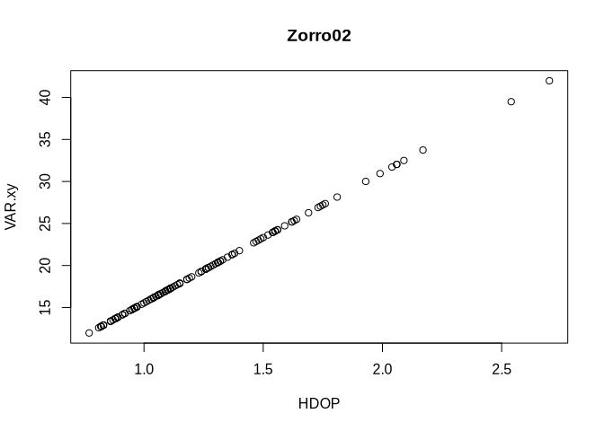<!-- -->

So this linear relationship may be described by a linear model such as:

``` r
(LM_errorZorro02 <- lm(sqrt(zorro02_ctmm$VAR.xy) ~ zorro02_ctmm$HDOP))
```

    ## 
    ## Call:
    ## lm(formula = sqrt(zorro02_ctmm$VAR.xy) ~ zorro02_ctmm$HDOP)
    ## 
    ## Coefficients:
    ##       (Intercept)  zorro02_ctmm$HDOP  
    ##         5.231e-14          1.555e+01

Now if we apply the same treatment to another animal:

``` r
zarigueya2_ctmm <- rawList$Zarigueya2$ctmmData
uere(zarigueya2_ctmm) <- UERE_list$Zarigueya2
plot(zarigueya2_ctmm$HDOP, sqrt(zarigueya2_ctmm$VAR.xy), main = "zarigueya2",
    xlab = "HDOP", ylab = "VAR.xy")
```

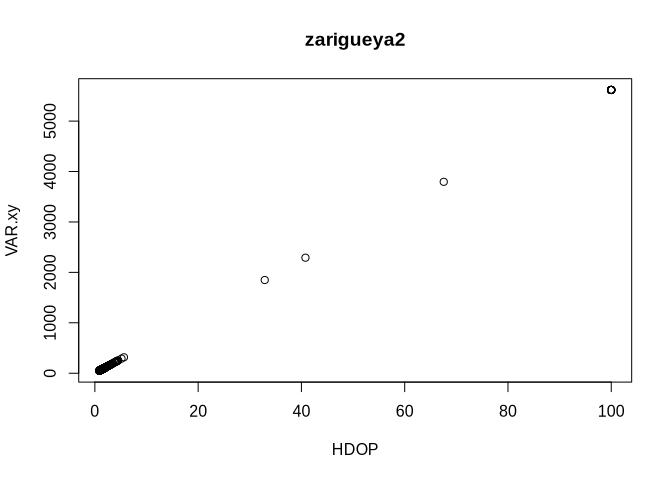<!-- -->

``` r
(LM_errorzarigueya2 <- lm(sqrt(zarigueya2_ctmm$VAR.xy) ~ zarigueya2_ctmm$HDOP))
```

    ## 
    ## Call:
    ## lm(formula = sqrt(zarigueya2_ctmm$VAR.xy) ~ zarigueya2_ctmm$HDOP)
    ## 
    ## Coefficients:
    ##          (Intercept)  zarigueya2_ctmm$HDOP  
    ##           -3.727e-13             5.618e+01

You may see that Zarigueya 2 had larger errors, which explains why the
slope is higher as well!

Applying the respective UERE on the individual datasets:

``` r
for (i in 1:length(rawList)) {
    if (names(rawList)[i] %in% names(UERE_list)) {
        uere(rawList[[i]]$ctmmData <- UERE_list[[names(rawList)[i]]])
    }
}
save(rawList, file = "calibratedRawList.RData")
```
