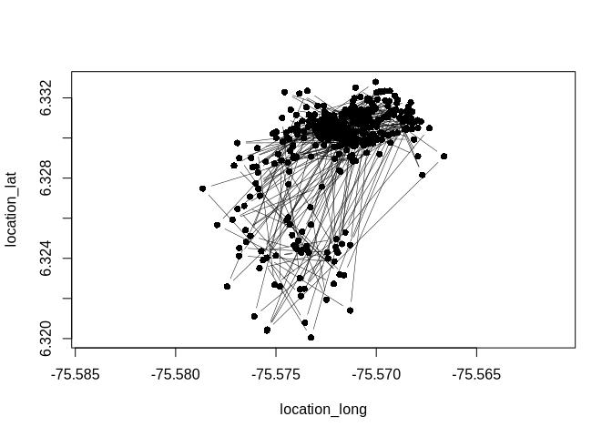
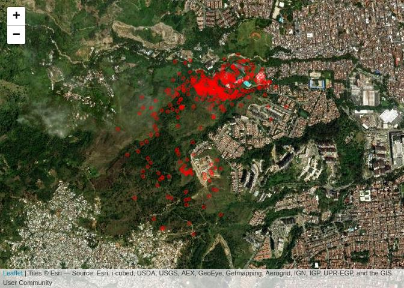
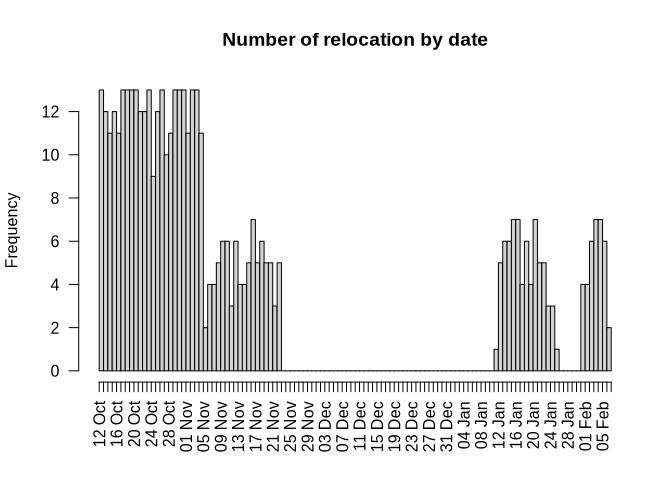
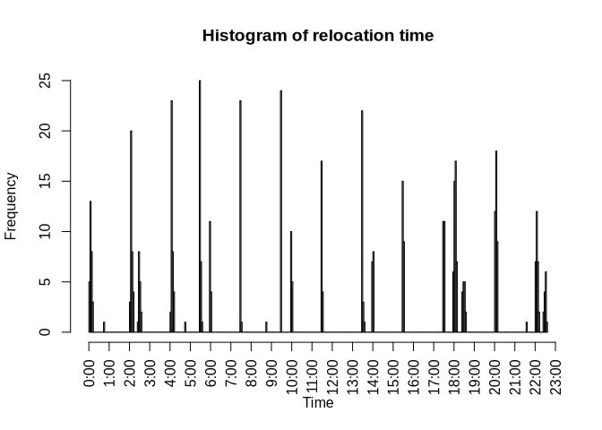
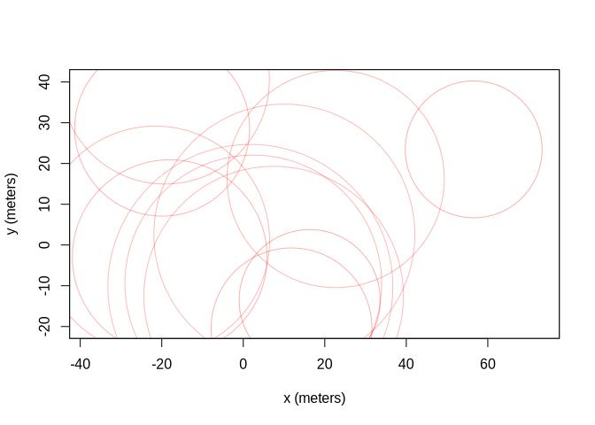
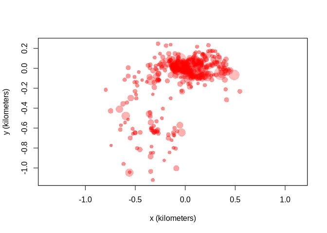
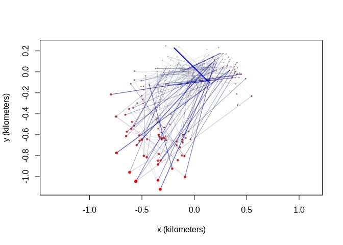
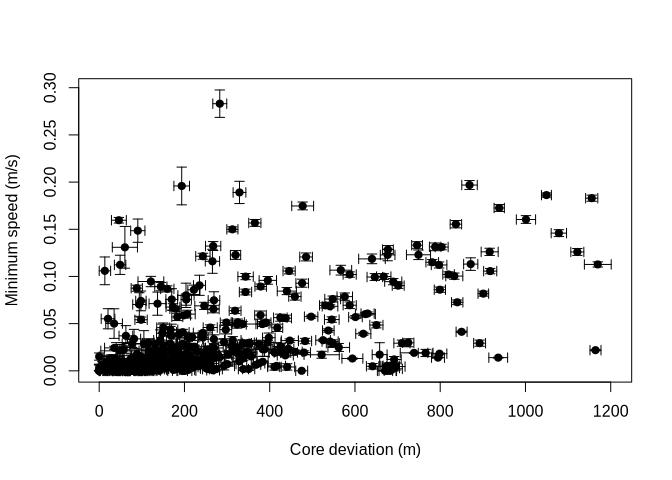

Importing, cleaning and formatting data
================
Marius Bottin
2023-04-24

- [Importing data](#importing-data)
  - [From movebank with *move*](#from-movebank-with-move)
  - [From a direct call to the movebank
    API](#from-a-direct-call-to-the-movebank-api)
  - [Itis taxonomy](#itis-taxonomy)
  - [Transforming to a ctmm object](#transforming-to-a-ctmm-object)
- [Checking and cleaning data](#checking-and-cleaning-data)
  - [Individual animal data : Zorro07](#individual-animal-data--zorro07)
    - [Spatial representation](#spatial-representation)
    - [Looking at dates and times](#looking-at-dates-and-times)
    - [Calibration with ctmm](#calibration-with-ctmm)

The packages *move* and *ctmm* allow one to import data from the
\<movebank.org\> platform. Then, various functions are useful to
cleaning the imported data and to format it in different object types,
specific to the analyses which will be used.

# Importing data

## From movebank with *move*

The data from the \<movebank.org\> platform might be imported with the
package move. Various functions are used to download the data
concerning:

1.  the reference data containing the information about the animals, the
    tags, and the deployments
2.  more specific information concerning the animals
3.  the relocation data, automatically imported as a “MoveStack” object
    in R. Note that the data may or may not include the “outliers”
    defined in movebank depending on the value argument
    *includeOutliers* in the function call

``` r
require(move)
passWord <- read.csv("password.csv", h = F)[1, 1]
lgin <- movebankLogin(username = "Humboldt_AreaMetropolitana", password = passWord)
study_id <- getMovebankID("Rastreo fauna área metropolitana del Valle de Aburrá, Colombia",
    login = lgin)
refData <- getMovebankReferenceTable(study_id, lgin, allAttributes = T)
animals <- getMovebankAnimals(study_id, lgin)
mvData <- getMovebankData(study_id, animalName = animals$animalName, login = lgin,
    includeOutliers = T)
mvData_clean <- getMovebankData(study_id, animalName = animals$animalName,
    login = lgin, includeOutliers = F)
all(mvData_clean$tag_id %in% refData$tag_id)
```

    ## [1] TRUE

## From a direct call to the movebank API

In order to have more control on the data which is imported from
movebank, it is also possible to use directly the movebank API from R,
without using the functions from the *move* package. One of the
advantage here is that it is possible to control the type of data in
which we want to import the various ids from movebank. Because these ids
are sometimes very large integer values, movebank tend to simplify these
numbers, and by doing so various ids might be confounded.

``` r
# Using direcly the API (without dedicated R package) in order to
# extract unformatted and complete tag ids
require("httr")
myauth <- authenticate(user = "Humboldt_AreaMetropolitana", password = passWord)
url <- paste0("https://www.movebank.org/movebank/service/direct-read?entity_type=tag&study_id=",
    as.character(study_id))
outFile <- tempfile()
A <- GET(url, config = myauth)
B <- content(A, as = "text")
```

    ## No encoding supplied: defaulting to UTF-8.

``` r
writeLines(B, con = outFile)
tag_from_api <- read.csv(file = outFile, colClasses = "character", h = T,
    sep = ",")
tracker <- tag_from_api[, c("id", "local_identifier", "serial_no")]
colnames(tracker) <- c("movebank_tag", "supplier_id", "serial")
tracker$movebank_tag <- as.numeric(tracker$movebank_tag)
tracker$model <- ifelse((grepl("^89012", tracker$supplier_id) | grepl("^89460",
    tracker$supplier_id)) & nchar(tracker$supplier_id) > 18, "ES-400",
    "TGW-4570-4")
```

In the direct API download, we read the tag ids as text, while *move*
read them as numbers:

``` r
# From the move package
head(unique(refData$tag_local_identifier))
```

    ## [1] 8.946080e+19 8.946080e+19 8.946080e+19 8.946080e+19 8.901261e+18
    ## [6] 7.330310e+05

``` r
length(unique(refData$tag_local_identifier))
```

    ## [1] 9

``` r
# From the controlled API use
head(unique(tracker$supplier_id))
```

    ## [1] "733007"               "733031"               "89012400800088626369"
    ## [4] "89012400800088627565" "8901260852391558954"  "89460800120091097178"

``` r
length(unique(tracker$supplier_id))
```

    ## [1] 81

## Itis taxonomy

Movebank uses the Itis taxonomy database to manage taxonomic
information. Our issue here is that some of the species as defined in
our study are not registered in the Itis database (*Ortalis columbiana*)

``` r
# taxonomic information from Itis:
require(ritis)
taxa <- unique(animals$taxon_canonical_name)
taxa <- taxa[taxa != ""]
tsn <- mapply(function(tab, tax) tab[which(tab$combinedName == tax), "tsn"],
    lapply(taxa, search_scientific), taxa)
taxSup <- lapply(tsn, hierarchy_full)
taxo <- data.frame(scientific_name = taxa, kingdom = unlist(sapply(taxSup,
    function(x) x[x$rankname == "Kingdom", "taxonname"])), phylum = unlist(sapply(taxSup,
    function(x) x[x$rankname == "Phylum", "taxonname"])), class = unlist(sapply(taxSup,
    function(x) x[x$rankname == "Class", "taxonname"])), order = unlist(sapply(taxSup,
    function(x) x[x$rankname == "Order", "taxonname"])), family = unlist(sapply(taxSup,
    function(x) x[x$rankname == "Family", "taxonname"])), genus = unlist(sapply(taxSup,
    function(x) x[x$rankname == "Genus", "taxonname"])), specific_epithet = sapply(strsplit(taxa,
    " "), function(x) x[2]), tsn = unlist(tsn))
taxo <- rbind(taxo, data.frame(scientific_name = "Ortalis columbiana",
    kingdom = "Animalia", phylum = "Chordata", class = "Aves", order = "Galliformes",
    family = "Cracidae", genus = "Ortalis", specific_epithet = "columbiana",
    tsn = NA))
```

``` r
kableExtra::kbl(taxo)
```

<table>
<thead>
<tr>
<th style="text-align:left;">
scientific_name
</th>
<th style="text-align:left;">
kingdom
</th>
<th style="text-align:left;">
phylum
</th>
<th style="text-align:left;">
class
</th>
<th style="text-align:left;">
order
</th>
<th style="text-align:left;">
family
</th>
<th style="text-align:left;">
genus
</th>
<th style="text-align:left;">
specific_epithet
</th>
<th style="text-align:left;">
tsn
</th>
</tr>
</thead>
<tbody>
<tr>
<td style="text-align:left;">
Cerdocyon thous
</td>
<td style="text-align:left;">
Animalia
</td>
<td style="text-align:left;">
Chordata
</td>
<td style="text-align:left;">
Mammalia
</td>
<td style="text-align:left;">
Carnivora
</td>
<td style="text-align:left;">
Canidae
</td>
<td style="text-align:left;">
Cerdocyon
</td>
<td style="text-align:left;">
thous
</td>
<td style="text-align:left;">
183825
</td>
</tr>
<tr>
<td style="text-align:left;">
Phimosus infuscatus
</td>
<td style="text-align:left;">
Animalia
</td>
<td style="text-align:left;">
Chordata
</td>
<td style="text-align:left;">
Aves
</td>
<td style="text-align:left;">
Pelecaniformes
</td>
<td style="text-align:left;">
Threskiornithidae
</td>
<td style="text-align:left;">
Phimosus
</td>
<td style="text-align:left;">
infuscatus
</td>
<td style="text-align:left;">
174969
</td>
</tr>
<tr>
<td style="text-align:left;">
Milvago chimachima
</td>
<td style="text-align:left;">
Animalia
</td>
<td style="text-align:left;">
Chordata
</td>
<td style="text-align:left;">
Aves
</td>
<td style="text-align:left;">
Falconiformes
</td>
<td style="text-align:left;">
Falconidae
</td>
<td style="text-align:left;">
Milvago
</td>
<td style="text-align:left;">
chimachima
</td>
<td style="text-align:left;">
175667
</td>
</tr>
<tr>
<td style="text-align:left;">
Didelphis marsupialis
</td>
<td style="text-align:left;">
Animalia
</td>
<td style="text-align:left;">
Chordata
</td>
<td style="text-align:left;">
Mammalia
</td>
<td style="text-align:left;">
Didelphimorphia
</td>
<td style="text-align:left;">
Didelphidae
</td>
<td style="text-align:left;">
Didelphis
</td>
<td style="text-align:left;">
marsupialis
</td>
<td style="text-align:left;">
552536
</td>
</tr>
<tr>
<td style="text-align:left;">
Bubulcus ibis
</td>
<td style="text-align:left;">
Animalia
</td>
<td style="text-align:left;">
Chordata
</td>
<td style="text-align:left;">
Aves
</td>
<td style="text-align:left;">
Pelecaniformes
</td>
<td style="text-align:left;">
Ardeidae
</td>
<td style="text-align:left;">
Bubulcus
</td>
<td style="text-align:left;">
ibis
</td>
<td style="text-align:left;">
174803
</td>
</tr>
<tr>
<td style="text-align:left;">
Ortalis
</td>
<td style="text-align:left;">
Animalia
</td>
<td style="text-align:left;">
Chordata
</td>
<td style="text-align:left;">
Aves
</td>
<td style="text-align:left;">
Galliformes
</td>
<td style="text-align:left;">
Cracidae
</td>
<td style="text-align:left;">
Ortalis
</td>
<td style="text-align:left;">
—
</td>
<td style="text-align:left;">
175715
</td>
</tr>
<tr>
<td style="text-align:left;">
Sciurus granatensis
</td>
<td style="text-align:left;">
Animalia
</td>
<td style="text-align:left;">
Chordata
</td>
<td style="text-align:left;">
Mammalia
</td>
<td style="text-align:left;">
Rodentia
</td>
<td style="text-align:left;">
Sciuridae
</td>
<td style="text-align:left;">
Sciurus
</td>
<td style="text-align:left;">
granatensis
</td>
<td style="text-align:left;">
632427
</td>
</tr>
<tr>
<td style="text-align:left;">
Chamaepetes goudotii
</td>
<td style="text-align:left;">
Animalia
</td>
<td style="text-align:left;">
Chordata
</td>
<td style="text-align:left;">
Aves
</td>
<td style="text-align:left;">
Galliformes
</td>
<td style="text-align:left;">
Cracidae
</td>
<td style="text-align:left;">
Chamaepetes
</td>
<td style="text-align:left;">
goudotii
</td>
<td style="text-align:left;">
175748
</td>
</tr>
<tr>
<td style="text-align:left;">
Asio
</td>
<td style="text-align:left;">
Animalia
</td>
<td style="text-align:left;">
Chordata
</td>
<td style="text-align:left;">
Aves
</td>
<td style="text-align:left;">
Strigiformes
</td>
<td style="text-align:left;">
Strigidae
</td>
<td style="text-align:left;">
Asio
</td>
<td style="text-align:left;">
—
</td>
<td style="text-align:left;">
177931
</td>
</tr>
<tr>
<td style="text-align:left;">
Choloepus hoffmanni
</td>
<td style="text-align:left;">
Animalia
</td>
<td style="text-align:left;">
Chordata
</td>
<td style="text-align:left;">
Mammalia
</td>
<td style="text-align:left;">
Pilosa
</td>
<td style="text-align:left;">
Megalonychidae
</td>
<td style="text-align:left;">
Choloepus
</td>
<td style="text-align:left;">
hoffmanni
</td>
<td style="text-align:left;">
624909
</td>
</tr>
<tr>
<td style="text-align:left;">
Saguinus
</td>
<td style="text-align:left;">
Animalia
</td>
<td style="text-align:left;">
Chordata
</td>
<td style="text-align:left;">
Mammalia
</td>
<td style="text-align:left;">
Primates
</td>
<td style="text-align:left;">
Callitrichidae
</td>
<td style="text-align:left;">
Saguinus
</td>
<td style="text-align:left;">
—
</td>
<td style="text-align:left;">
572809
</td>
</tr>
<tr>
<td style="text-align:left;">
Ortalis columbiana
</td>
<td style="text-align:left;">
Animalia
</td>
<td style="text-align:left;">
Chordata
</td>
<td style="text-align:left;">
Aves
</td>
<td style="text-align:left;">
Galliformes
</td>
<td style="text-align:left;">
Cracidae
</td>
<td style="text-align:left;">
Ortalis
</td>
<td style="text-align:left;">
columbiana
</td>
<td style="text-align:left;">
—
</td>
</tr>
</tbody>
</table>

## Transforming to a ctmm object

The packages `move` and `ctmm` use different class of objects for the
movement data, in order to transform `move` objects to the `ctmm` ones,
use the following code:

``` r
require(ctmm)
ctmmData_clean <- as.telemetry(mvData_clean)
```

# Checking and cleaning data

## Individual animal data : Zorro07

### Spatial representation

In order to clean movement (relocation) data sets, there are various
tools in movebank, `move` and `ctmm`. For showing how to apply `move`
and `ctmm` functions, we will first focus on one animal: Zorro07

``` r
mvData_zorro07 <- getMovebankData(study = study_id, login = lgin, animalName = "Zorro07")
```

Let’s have a first look at the relocation data:

``` r
plot(mvData_zorro07, type = "b", pch = 16, lwd = 0.5)
```

<!-- -->

Since it is not easy to look at the relocation data without any spatial
reference, we may use some external spatial data:

``` r
require(leaflet)
leaflet(mvData_zorro07) %>%
    addProviderTiles("Esri.WorldImagery") %>%
    addCircleMarkers(radius = 1, color = "red")
```

<!-- -->

### Looking at dates and times

The first thing to do is to transform the times to the local timezone:

``` r
require(lubridate)
```

    ## Loading required package: lubridate

    ## 
    ## Attaching package: 'lubridate'

    ## The following objects are masked from 'package:rgeos':
    ## 
    ##     intersect, setdiff, union

    ## The following objects are masked from 'package:raster':
    ## 
    ##     intersect, union

    ## The following objects are masked from 'package:base':
    ## 
    ##     date, intersect, setdiff, union

``` r
timestamps(mvData_zorro07) <- with_tz(timestamps(mvData_zorro07), tz = "America/Bogota")
```

``` r
hist(timestamps(mvData_zorro07), breaks = "days", freq = T, las = 2, format = "%d %b",
    xlab = NA, main = "Number of relocation by date")
```

<!-- -->

We can see that there has been a long period without relocation data,
between the end of November and the beginning of January, and another
small one at the end of January.

Now let’s make an histogram of the time of the day of the relocations:

``` r
# First we extract the hours, min, seconds
hms_t <- lapply(strsplit(format(timestamps(mvData_zorro07), "%H:%M:%S"),
    ":"), as.integer)
# Then we calculate the number of seconds from 00:00, and represent
# it in a histogram:
hist(sapply(hms_t, function(x) x[3] + (60 * x[2]) + (3600 * x[1])), nclass = 500,
    xaxt = "n", xlab = "Time", main = "Histogram of relocation time")
axis(1, at = seq(0, 23 * 60 * 60, 60 * 60), paste(0:23, ":00", sep = ""),
    las = 2)
```

<!-- -->

It seems difficult to find the regularity of time in this data, probably
because the frequency have been reprogrammed, so we have two frequency
regimes mixed in the data.

### Calibration with ctmm

In order to calibrate the devices for coordinates errors, we use
datasets of locations that were obtained in the places where the devices
were stocked before their deployments. These calibration datasets are
downloaded in the movebank format. Then a “User Equivalent Range Error”
model is made with the function uere.fit:

``` r
calibData_zorro07 <- as.telemetry("../../../uwt_repo_data/calibration/Zorro7.csv")
```

    ## Minimum sampling interval of 41.7 minutes in Zorro 7

``` r
plot(calibData_zorro07)
```

<!-- -->

``` r
UERE <- uere.fit(calibData_zorro07)
```

Then the model is applied to the telemetry data after deployment:

``` r
ctmm_zorro07 <- as.telemetry(mvData_zorro07)
```

    ## Warning in Move2CSV(object, timeformat = timeformat, timezone = timezone, :
    ## Move objects in geographic coordinates are automatically projected.

    ## VDOP not found. HDOP used as an approximate VDOP.

    ## Minimum sampling interval of 26.9 minutes in Zorro07

``` r
uere(ctmm_zorro07) <- UERE
```

In the following graph, location are represented in a red scale
depending on their distance to the previous location, and a blue scale
represent the average speed of the trajectories

``` r
plot(ctmm_zorro07, error = 2)
```

<!-- -->

`ctmm` allows then to find outliers, based on these error and the
calculation of average speed of the individual between 2 relocations.

``` r
outlie(ctmm_zorro07) -> OUT
```

<!-- -->

``` r
plot(OUT, units = F)
```

<!-- -->

In this particular case, there is no particularly clear outlier (note
that the highest average velocity correspond to 0.3 $m.s^{-1}$, or
approx. 1 $km.h^{-1}$).

<!--
```r
require(parallel)
GUESS<-ctmm.guess(ctmm_zorro07,CTMM=ctmm(error=T),interactive = F)
FIT<-ctmm.select(ctmm_zorro07,GUESS,trace=T, cores=0)
```
&#10;```r
save(list=c("GUESS","FIT"),file="ctmm_zorro07.RData")
```
&#10;-->
