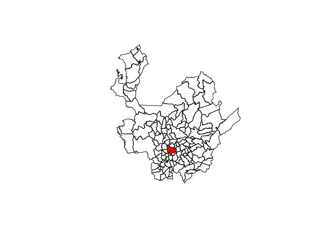
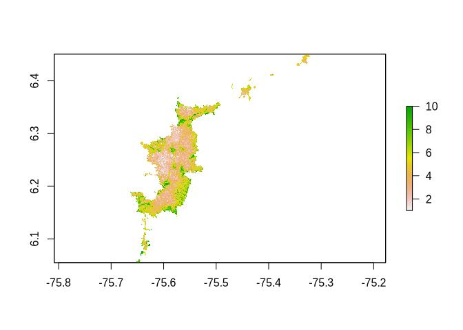
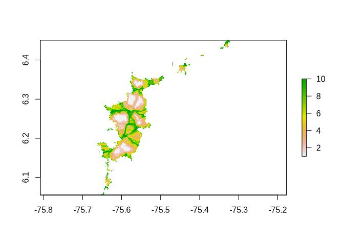
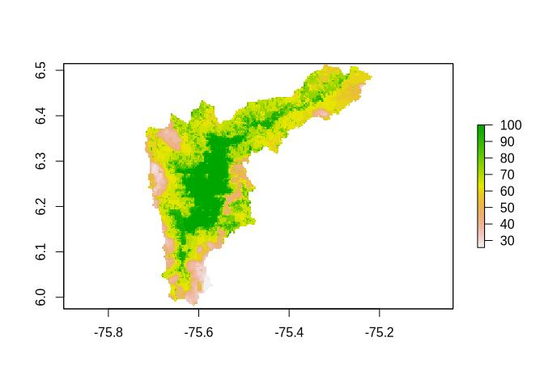

Creating a local database of extra spatial data to be associated with
movement data
================
Marius Bottin
2023-04-26

- [Creating the database](#creating-the-database)
- [Administrative boundaries](#administrative-boundaries)
- [Rasters from connectivity
  analyses](#rasters-from-connectivity-analyses)
  - [Circuit theory](#circuit-theory)
  - [Least cost path](#least-cost-path)
  - [Node degree](#node-degree)
- [Human pressure index](#human-pressure-index)
- [Turning off the light and
  leaving](#turning-off-the-light-and-leaving)

In order to do analyses of movement data, it may be useful to have a
database running a spatial data-management system. Here I will use a
postgres database with the postgis extension (I run already various
databases with this setup on my computer). However, in most of the case,
you will find the spatialite extension of SQLite more adequate at the
scale of one study, particularly when all the analyses are made in a
single computer.

The main advantages of having a local database with spatial data are:

1.  all the data can be accessed from a same source, and in the same way
2.  you can control and check efficiently the projections used and the
    structure of the spatial data

------------------------------------------------------------------------

**Note**:

A large part of the extra data that we will use here are not yet public,
so I won’t be able to share them. When the files are public, the code
will include the downloading with wget, or sometimes directly in R. My
personal setup for this data consists in a folder called “uwt_data_repo”
which shares the same root as this repository. Local files are copied to
this folder.

------------------------------------------------------------------------

# Creating the database

In bash, if you have postgreSQL installed, one of the easiest solution
to create a database is:

``` bash
createdb move_extra_sp
```

Then, I recommend the use of
[pgpass](https://www.postgresql.org/docs/current/libpq-pgpass.html). I
mainly use it because I can connect to the database without sharing the
connection passwords here, but the fact that it avoids the need to enter
hosts and password without decreasing significantly the security of the
connection may be appealing to anyone.

Then we create the connection for accessing it from R:

``` r
extraSp <- dbConnect(drv = PostgreSQL(), dbname = "move_extra_sp")
# For avoiding setting the connection name in the SQL chunks:
knitr::opts_chunk$set(connection = extraSp)
```

We will check on the installation of the postgis extension and if
needed, install it

``` r
pgPostGIS(extraSp)
```

    ## PostGIS extension version 3.1.8 installed.

    ## [1] TRUE

Now for the postgis_raster extension:

``` r
ext <- dbGetQuery(conn = extraSp, "SELECT * FROM pg_available_extensions;")
if (is.na(ext[ext$name == "postgis_raster", "installed_version"])) {
    dbSendQuery(extraSp, "CREATE EXTENSION postgis_raster")
}
```

Finally, we will create a schema to put all the raw data:

``` r
if (!"rawdata" %in% dbGetQuery(extraSp, "SELECT schema_name FROM information_schema.schemata")$schema_name) {
    dbSendQuery(extraSp, "CREATE SCHEMA rawdata;")
}
```

# Administrative boundaries

It is always useful to have access to administrative boundaries from the
country you are working in. [GADM](https://gadm.org/) is an opensource
initiative which allows to download this kind of data. In R, it is
directly available through the
[geodata](https://github.com/rspatial/geodata/) package.

Let’s download the data in a temporary folder and insert it in its raw
form in the database:

``` r
tmp <- tempdir()
municipios <- as(gadm("Colombia", level = 2, path = tmp), "Spatial")
pgInsert(extraSp, c("rawdata", "municipios"), municipios, geom = "the_geom",
    overwrite = T)
```

``` sql
CREATE TABLE mpio
(
    mpio_id smallserial PRIMARY KEY,
    country varchar(3) NOT NULL,
    dept text NOT NULL,
    mpio text NOT NULL,
    mpio_syno TEXT[]
);
SELECT AddGeometryColumn ('public','mpio','the_geom',4326,'MULTIPOLYGON',2);
CREATE INDEX idx_mpio_the_geom ON mpio USING GIST(the_geom);
INSERT INTO mpio(country,dept,mpio,mpio_syno,the_geom)
SELECT "GID_0","NAME_1", "NAME_2",STRING_TO_ARRAY("VARNAME_2",'|'),the_geom
FROM rawdata.municipios
ORDER BY "NAME_1","NAME_2"
RETURNING mpio.dept, mpio.mpio, mpio.mpio_syno;
```

The map can be called in R directly now, for example, to load all the
municipalities from the “Antioquia” department:

``` r
antioquiaMunic <- pgGetGeom(extraSp, query = "SELECT * FROM mpio WHERE dept='Antioquia'",
    geom = "the_geom")
```

    ## Returning MultiPolygon types in SpatialPolygons*-class.

``` r
plot(antioquiaMunic)
plot(antioquiaMunic[antioquiaMunic$mpio == "Medellín", ], col = "red",
    add = T)
```

<!-- -->

# Rasters from connectivity analyses

## Circuit theory

Among the spatial data associated with this project, a model of
connectivity based on circuit theory was provided by
`TODO: find who made the model`.

The file containing the resulting data is the file
“Circuitos_electricos.tif” analysed here with gdalinfo:

``` bash
gdalinfo ../../../uwt_repo_data/extra_spatial/Circuitos_electricos.tif
```

    ## Driver: GTiff/GeoTIFF
    ## Files: ../../../uwt_repo_data/extra_spatial/Circuitos_electricos.tif
    ## Size is 3806, 4367
    ## Coordinate System is:
    ## PROJCRS["MAGNA-SIRGAS / Colombia Bogota zone",
    ##     BASEGEOGCRS["MAGNA-SIRGAS",
    ##         DATUM["Marco Geocentrico Nacional de Referencia",
    ##             ELLIPSOID["GRS 1980",6378137,298.257222101004,
    ##                 LENGTHUNIT["metre",1]]],
    ##         PRIMEM["Greenwich",0,
    ##             ANGLEUNIT["degree",0.0174532925199433]],
    ##         ID["EPSG",4686]],
    ##     CONVERSION["Transverse Mercator",
    ##         METHOD["Transverse Mercator",
    ##             ID["EPSG",9807]],
    ##         PARAMETER["Latitude of natural origin",4.59620041666667,
    ##             ANGLEUNIT["degree",0.0174532925199433],
    ##             ID["EPSG",8801]],
    ##         PARAMETER["Longitude of natural origin",-74.0775079166667,
    ##             ANGLEUNIT["degree",0.0174532925199433],
    ##             ID["EPSG",8802]],
    ##         PARAMETER["Scale factor at natural origin",1,
    ##             SCALEUNIT["unity",1],
    ##             ID["EPSG",8805]],
    ##         PARAMETER["False easting",1000000,
    ##             LENGTHUNIT["metre",1],
    ##             ID["EPSG",8806]],
    ##         PARAMETER["False northing",1000000,
    ##             LENGTHUNIT["metre",1],
    ##             ID["EPSG",8807]]],
    ##     CS[Cartesian,2],
    ##         AXIS["easting",east,
    ##             ORDER[1],
    ##             LENGTHUNIT["metre",1]],
    ##         AXIS["northing",north,
    ##             ORDER[2],
    ##             LENGTHUNIT["metre",1]],
    ##     ID["EPSG",3116]]
    ## Data axis to CRS axis mapping: 1,2
    ## Origin = (824341.295913357287645,1205247.393829831155017)
    ## Pixel Size = (10.000000000000000,-10.000000000000000)
    ## Metadata:
    ##   AREA_OR_POINT=Area
    ## Image Structure Metadata:
    ##   COMPRESSION=LZW
    ##   INTERLEAVE=BAND
    ## Corner Coordinates:
    ## Upper Left  (  824341.296, 1205247.394) ( 75d39'54.94"W,  6d26'59.09"N)
    ## Lower Left  (  824341.296, 1161577.394) ( 75d39'50.66"W,  6d 3'18.03"N)
    ## Upper Right (  862401.296, 1205247.394) ( 75d19'16.70"W,  6d27' 2.53"N)
    ## Lower Right (  862401.296, 1161577.394) ( 75d19'13.34"W,  6d 3'21.26"N)
    ## Center      (  843371.296, 1183412.394) ( 75d29'33.90"W,  6d15'10.33"N)
    ## Band 1 Block=128x128 Type=Byte, ColorInterp=Gray
    ##   Min=1.000 Max=10.000 
    ##   Minimum=1.000, Maximum=10.000, Mean=4.356, StdDev=1.969
    ##   NoData Value=15
    ##   Metadata:
    ##     STATISTICS_MAXIMUM=10
    ##     STATISTICS_MEAN=4.3559515399104
    ##     STATISTICS_MINIMUM=1
    ##     STATISTICS_SKIPFACTORX=1
    ##     STATISTICS_SKIPFACTORY=1
    ##     STATISTICS_STDDEV=1.9688445412924

The important information that we can gather from gdalinfo are:

- the projection system: MAGNAS-SIRGAS/Colombia Bogotá Zone (SRID: 3116)
- the range of value from the pixel: 1 to 10
- the NoData value: 15

First we re-project the data to the SRID 4326 (WGS84) which is the usual
projection system from the data we will obtain from movebank:

``` bash
gdalwarp -t_srs EPSG:4326 ../../../uwt_repo_data/extra_spatial/Circuitos_electricos.tif ../../../uwt_repo_data/extra_spatial/Circuitos_electricos_wgs84.tif
```

    ## Creating output file that is 3816P x 4378L.
    ## Processing ../../../uwt_repo_data/extra_spatial/Circuitos_electricos.tif [1/1] : 0Using internal nodata values (e.g. 15) for image ../../../uwt_repo_data/extra_spatial/Circuitos_electricos.tif.
    ## Copying nodata values from source ../../../uwt_repo_data/extra_spatial/Circuitos_electricos.tif to destination ../../../uwt_repo_data/extra_spatial/Circuitos_electricos_wgs84.tif.
    ## ...10...20...30...40...50...60...70...80...90...100 - done.

In order to include the table containing this data in the database, we
use the following bash command:

``` bash
raster2pgsql -c -N 15 -s 4326 -I -C -M ../../../uwt_repo_data/extra_spatial/Circuitos_electricos_wgs84.tif -t 100x100 -f the_rast -q circ_theory | psql move_extra_sp -b > /dev/null
rm ../../../uwt_repo_data/extra_spatial/Circuitos_electricos_wgs84.tif
```

    ## Processing 1/1: ../../../uwt_repo_data/extra_spatial/Circuitos_electricos_wgs84.tif
    ## NOTICE:  Adding SRID constraint
    ## NOTICE:  Adding scale-X constraint
    ## NOTICE:  Adding scale-Y constraint
    ## NOTICE:  Adding blocksize-X constraint
    ## NOTICE:  Adding blocksize-Y constraint
    ## NOTICE:  Adding alignment constraint
    ## NOTICE:  Adding number of bands constraint
    ## NOTICE:  Adding pixel type constraint
    ## NOTICE:  Adding nodata value constraint
    ## NOTICE:  Adding out-of-database constraint
    ## NOTICE:  Adding maximum extent constraint

The raster can be called in R using:

``` r
ct_rast <- pgGetRast(conn = extraSp, name = "circ_theory", rast = "the_rast")
plot(ct_rast)
```

<!-- -->

## Least cost path

Another connectivity model was run to create a least cost path raster,
in which the values of the raster represent the connectivity “cost”.

The file containing the resulting data is the file “RutasMenorCosto.tif”
analysed here with gdalinfo:

``` bash
gdalinfo ../../../uwt_repo_data/extra_spatial/RutasMenorCosto.tif
```

    ## Driver: GTiff/GeoTIFF
    ## Files: ../../../uwt_repo_data/extra_spatial/RutasMenorCosto.tif
    ## Size is 3806, 4367
    ## Coordinate System is:
    ## PROJCRS["MAGNA_Transverse_Mercator",
    ##     BASEGEOGCRS["MAGNA-SIRGAS",
    ##         DATUM["Marco Geocentrico Nacional de Referencia",
    ##             ELLIPSOID["GRS 1980",6378137,298.257222101004,
    ##                 LENGTHUNIT["metre",1]]],
    ##         PRIMEM["Greenwich",0,
    ##             ANGLEUNIT["degree",0.0174532925199433]],
    ##         ID["EPSG",4686]],
    ##     CONVERSION["Transverse Mercator",
    ##         METHOD["Transverse Mercator",
    ##             ID["EPSG",9807]],
    ##         PARAMETER["Latitude of natural origin",4.59620041666667,
    ##             ANGLEUNIT["degree",0.0174532925199433],
    ##             ID["EPSG",8801]],
    ##         PARAMETER["Longitude of natural origin",-74.0775079166667,
    ##             ANGLEUNIT["degree",0.0174532925199433],
    ##             ID["EPSG",8802]],
    ##         PARAMETER["Scale factor at natural origin",1,
    ##             SCALEUNIT["unity",1],
    ##             ID["EPSG",8805]],
    ##         PARAMETER["False easting",1000000,
    ##             LENGTHUNIT["metre",1],
    ##             ID["EPSG",8806]],
    ##         PARAMETER["False northing",1000000,
    ##             LENGTHUNIT["metre",1],
    ##             ID["EPSG",8807]]],
    ##     CS[Cartesian,2],
    ##         AXIS["easting",east,
    ##             ORDER[1],
    ##             LENGTHUNIT["metre",1,
    ##                 ID["EPSG",9001]]],
    ##         AXIS["northing",north,
    ##             ORDER[2],
    ##             LENGTHUNIT["metre",1,
    ##                 ID["EPSG",9001]]]]
    ## Data axis to CRS axis mapping: 1,2
    ## Origin = (824341.295913356589153,1205247.393829831155017)
    ## Pixel Size = (10.000000000000000,-10.000000000000000)
    ## Metadata:
    ##   AREA_OR_POINT=Area
    ## Image Structure Metadata:
    ##   COMPRESSION=LZW
    ##   INTERLEAVE=BAND
    ## Corner Coordinates:
    ## Upper Left  (  824341.296, 1205247.394) ( 75d39'54.94"W,  6d26'59.09"N)
    ## Lower Left  (  824341.296, 1161577.394) ( 75d39'50.66"W,  6d 3'18.03"N)
    ## Upper Right (  862401.296, 1205247.394) ( 75d19'16.70"W,  6d27' 2.53"N)
    ## Lower Right (  862401.296, 1161577.394) ( 75d19'13.34"W,  6d 3'21.26"N)
    ## Center      (  843371.296, 1183412.394) ( 75d29'33.90"W,  6d15'10.33"N)
    ## Band 1 Block=128x128 Type=Int32, ColorInterp=Gray
    ##   Min=1.000 Max=10.000 
    ##   Minimum=1.000, Maximum=10.000, Mean=5.118, StdDev=2.809
    ##   NoData Value=-2147483647
    ##   Metadata:
    ##     STATISTICS_MAXIMUM=10
    ##     STATISTICS_MEAN=5.118474164969
    ##     STATISTICS_MINIMUM=1
    ##     STATISTICS_SKIPFACTORX=1
    ##     STATISTICS_SKIPFACTORY=1
    ##     STATISTICS_STDDEV=2.8086435061105

The important information that we can gather from gdalinfo are:

- the projection system: Transverse mercator MAGNAS-SIRGAS/Colombia
  Bogotá Zone (SRID: 4686 … not sure!)
- the range of value from the pixel: 1 to 10
- the NoData value: -2147483647

First we re-project the data to the SRID 4326 (WGS84) which is the usual
projection system from the data we will obtain from movebank:

``` bash
gdalwarp -t_srs EPSG:4326 ../../../uwt_repo_data/extra_spatial/RutasMenorCosto.tif ../../../uwt_repo_data/extra_spatial/RutasMenorCosto_wgs84.tif
```

    ## Creating output file that is 3816P x 4378L.
    ## Processing ../../../uwt_repo_data/extra_spatial/RutasMenorCosto.tif [1/1] : 0Using internal nodata values (e.g. -2.14748e+09) for image ../../../uwt_repo_data/extra_spatial/RutasMenorCosto.tif.
    ## Copying nodata values from source ../../../uwt_repo_data/extra_spatial/RutasMenorCosto.tif to destination ../../../uwt_repo_data/extra_spatial/RutasMenorCosto_wgs84.tif.
    ## ...10...20...30...40...50...60...70...80...90...100 - done.

In order to include the table containing this data in the database, we
use the following bash command:

``` bash
raster2pgsql -c -N -2147483647 -s 4326 -I -C -M ../../../uwt_repo_data/extra_spatial/RutasMenorCosto_wgs84.tif -t 100x100 -f the_rast -q least_cost | psql move_extra_sp -b > /dev/null
rm ../../../uwt_repo_data/extra_spatial/RutasMenorCosto_wgs84.tif
```

    ## Processing 1/1: ../../../uwt_repo_data/extra_spatial/RutasMenorCosto_wgs84.tif
    ## NOTICE:  Adding SRID constraint
    ## NOTICE:  Adding scale-X constraint
    ## NOTICE:  Adding scale-Y constraint
    ## NOTICE:  Adding blocksize-X constraint
    ## NOTICE:  Adding blocksize-Y constraint
    ## NOTICE:  Adding alignment constraint
    ## NOTICE:  Adding number of bands constraint
    ## NOTICE:  Adding pixel type constraint
    ## NOTICE:  Adding nodata value constraint
    ## NOTICE:  Adding out-of-database constraint
    ## NOTICE:  Adding maximum extent constraint

The raster can be called in R using:

``` r
lc_rast <- pgGetRast(conn = extraSp, name = "least_cost", rast = "the_rast")
plot(lc_rast)
```

<!-- -->

## Node degree

Another connectivity model was run to create a node degree calculation
for green area in the metropolitan area. I am not yet sure what
represent exactly the values between the green areas…

The file containing the resulting data is the file “GradoNodal.tif”
analysed here with gdalinfo:

``` bash
gdalinfo ../../../uwt_repo_data/extra_spatial/GradoNodal.tif
```

    ## Driver: GTiff/GeoTIFF
    ## Files: ../../../uwt_repo_data/extra_spatial/GradoNodal.tif
    ## Size is 19032, 21833
    ## Coordinate System is:
    ## PROJCRS["MAGNA-SIRGAS / Colombia Bogota zone",
    ##     BASEGEOGCRS["MAGNA-SIRGAS",
    ##         DATUM["Marco Geocentrico Nacional de Referencia",
    ##             ELLIPSOID["GRS 1980",6378137,298.257222101004,
    ##                 LENGTHUNIT["metre",1]]],
    ##         PRIMEM["Greenwich",0,
    ##             ANGLEUNIT["degree",0.0174532925199433]],
    ##         ID["EPSG",4686]],
    ##     CONVERSION["Transverse Mercator",
    ##         METHOD["Transverse Mercator",
    ##             ID["EPSG",9807]],
    ##         PARAMETER["Latitude of natural origin",4.59620041666667,
    ##             ANGLEUNIT["degree",0.0174532925199433],
    ##             ID["EPSG",8801]],
    ##         PARAMETER["Longitude of natural origin",-74.0775079166667,
    ##             ANGLEUNIT["degree",0.0174532925199433],
    ##             ID["EPSG",8802]],
    ##         PARAMETER["Scale factor at natural origin",1,
    ##             SCALEUNIT["unity",1],
    ##             ID["EPSG",8805]],
    ##         PARAMETER["False easting",1000000,
    ##             LENGTHUNIT["metre",1],
    ##             ID["EPSG",8806]],
    ##         PARAMETER["False northing",1000000,
    ##             LENGTHUNIT["metre",1],
    ##             ID["EPSG",8807]]],
    ##     CS[Cartesian,2],
    ##         AXIS["easting",east,
    ##             ORDER[1],
    ##             LENGTHUNIT["metre",1]],
    ##         AXIS["northing",north,
    ##             ORDER[2],
    ##             LENGTHUNIT["metre",1]],
    ##     ID["EPSG",3116]]
    ## Data axis to CRS axis mapping: 1,2
    ## Origin = (824341.295913357287645,1205243.393829831155017)
    ## Pixel Size = (2.000000000000000,-2.000000000000000)
    ## Metadata:
    ##   AREA_OR_POINT=Area
    ## Image Structure Metadata:
    ##   COMPRESSION=LZW
    ##   INTERLEAVE=BAND
    ## Corner Coordinates:
    ## Upper Left  (  824341.296, 1205243.394) ( 75d39'54.94"W,  6d26'58.96"N)
    ## Lower Left  (  824341.296, 1161577.394) ( 75d39'50.66"W,  6d 3'18.03"N)
    ## Upper Right (  862405.296, 1205243.394) ( 75d19'16.57"W,  6d27' 2.40"N)
    ## Lower Right (  862405.296, 1161577.394) ( 75d19'13.21"W,  6d 3'21.26"N)
    ## Center      (  843373.296, 1183410.394) ( 75d29'33.84"W,  6d15'10.27"N)
    ## Band 1 Block=128x128 Type=Byte, ColorInterp=Gray
    ##   Min=1.000 Max=10.000 
    ##   Minimum=1.000, Maximum=10.000, Mean=7.815, StdDev=2.085
    ##   NoData Value=255
    ##   Metadata:
    ##     STATISTICS_MAXIMUM=10
    ##     STATISTICS_MEAN=7.815003136826
    ##     STATISTICS_MINIMUM=1
    ##     STATISTICS_SKIPFACTORX=1
    ##     STATISTICS_SKIPFACTORY=1
    ##     STATISTICS_STDDEV=2.0845640489898

The important information that we can gather from gdalinfo are:

- the projection system: MAGNAS-SIRGAS/Colombia Bogotá Zone (SRID: 3116
  … not sure!)
- the range of value from the pixel: 1 to 10
- the NoData value: 255

First we re-project the data to the SRID 4326 (WGS84) which is the usual
projection system from the data we will obtain from movebank:

``` bash
gdalwarp -t_srs EPSG:4326 ../../../uwt_repo_data/extra_spatial/GradoNodal.tif ../../../uwt_repo_data/extra_spatial/GradoNodal_wgs84.tif
```

    ## Creating output file that is 19084P x 21890L.
    ## Processing ../../../uwt_repo_data/extra_spatial/GradoNodal.tif [1/1] : 0Using internal nodata values (e.g. 255) for image ../../../uwt_repo_data/extra_spatial/GradoNodal.tif.
    ## Copying nodata values from source ../../../uwt_repo_data/extra_spatial/GradoNodal.tif to destination ../../../uwt_repo_data/extra_spatial/GradoNodal_wgs84.tif.
    ## ...10...20...30...40...50...60...70...80...90...100 - done.

In order to include the table containing this data in the database, we
use the following bash command:

``` bash
raster2pgsql -c -N 255 -s 4326 -I -C -M ../../../uwt_repo_data/extra_spatial/GradoNodal_wgs84.tif -t 100x100 -f the_rast -q node_deg | psql move_extra_sp -b > /dev/null
rm ../../../uwt_repo_data/extra_spatial/GradoNodal_wgs84.tif
```

    ## Processing 1/1: ../../../uwt_repo_data/extra_spatial/GradoNodal_wgs84.tif
    ## NOTICE:  Adding SRID constraint
    ## NOTICE:  Adding scale-X constraint
    ## NOTICE:  Adding scale-Y constraint
    ## NOTICE:  Adding blocksize-X constraint
    ## NOTICE:  Adding blocksize-Y constraint
    ## NOTICE:  Adding alignment constraint
    ## NOTICE:  Adding number of bands constraint
    ## NOTICE:  Adding pixel type constraint
    ## NOTICE:  Adding nodata value constraint
    ## NOTICE:  Adding out-of-database constraint
    ## NOTICE:  Adding maximum extent constraint

For some reason this raster has been encoded in a way that makes it
impossible to load in R memory. Theoretically, it would be possible (if
the raster was not that heavy) to apply:

``` r
nd_rast <- pgGetRast(conn = extraSp, name="node_deg", rast="the_rast")
plot(nd_rast)
```

TODO: It appears that the error comes from a problematic handling of the
noData value, which seems to be the case in qgis as well…

# Human pressure index

A human pressure index was calculated on the metropolitan area (IHEH,
Correa et al. 2020)

The file containing the resulting data is the file “IHEH_2019_AMVA.tif”
analysed here with gdalinfo:

``` bash
gdalinfo ../../../uwt_repo_data/extra_spatial/IHEH_2019_AMVA.tif
```

    ## Driver: GTiff/GeoTIFF
    ## Files: ../../../uwt_repo_data/extra_spatial/IHEH_2019_AMVA.tif
    ##        ../../../uwt_repo_data/extra_spatial/IHEH_2019_AMVA.tif.aux.xml
    ## Size is 180, 192
    ## Coordinate System is:
    ## PROJCRS["MAGNA_Transverse_Mercator",
    ##     BASEGEOGCRS["MAGNA-SIRGAS",
    ##         DATUM["Marco Geocentrico Nacional de Referencia",
    ##             ELLIPSOID["GRS 1980",6378137,298.257222101004,
    ##                 LENGTHUNIT["metre",1]]],
    ##         PRIMEM["Greenwich",0,
    ##             ANGLEUNIT["degree",0.0174532925199433]],
    ##         ID["EPSG",4686]],
    ##     CONVERSION["Transverse Mercator",
    ##         METHOD["Transverse Mercator",
    ##             ID["EPSG",9807]],
    ##         PARAMETER["Latitude of natural origin",4.59620041666667,
    ##             ANGLEUNIT["degree",0.0174532925199433],
    ##             ID["EPSG",8801]],
    ##         PARAMETER["Longitude of natural origin",-74.0775079166667,
    ##             ANGLEUNIT["degree",0.0174532925199433],
    ##             ID["EPSG",8802]],
    ##         PARAMETER["Scale factor at natural origin",1,
    ##             SCALEUNIT["unity",1],
    ##             ID["EPSG",8805]],
    ##         PARAMETER["False easting",1000000,
    ##             LENGTHUNIT["metre",1],
    ##             ID["EPSG",8806]],
    ##         PARAMETER["False northing",1000000,
    ##             LENGTHUNIT["metre",1],
    ##             ID["EPSG",8807]]],
    ##     CS[Cartesian,2],
    ##         AXIS["easting",east,
    ##             ORDER[1],
    ##             LENGTHUNIT["metre",1,
    ##                 ID["EPSG",9001]]],
    ##         AXIS["northing",north,
    ##             ORDER[2],
    ##             LENGTHUNIT["metre",1,
    ##                 ID["EPSG",9001]]]]
    ## Data axis to CRS axis mapping: 1,2
    ## Origin = (818314.541591455694288,1212300.354518501786515)
    ## Pixel Size = (309.738197399999876,-309.738197399999876)
    ## Metadata:
    ##   AREA_OR_POINT=Area
    ## Image Structure Metadata:
    ##   INTERLEAVE=BAND
    ## Corner Coordinates:
    ## Upper Left  (  818314.542, 1212300.355) ( 75d43'11.74"W,  6d30'47.97"N)
    ## Lower Left  (  818314.542, 1152830.621) ( 75d43' 5.71"W,  5d58'32.83"N)
    ## Upper Right (  874067.417, 1212300.355) ( 75d12'57.63"W,  6d30'52.97"N)
    ## Lower Right (  874067.417, 1152830.621) ( 75d12'53.45"W,  5d58'37.41"N)
    ## Center      (  846190.979, 1182565.488) ( 75d28' 2.13"W,  6d14'43.02"N)
    ## Band 1 Block=128x128 Type=Float32, ColorInterp=Gray
    ##   Min=25.714 Max=100.000 
    ##   Minimum=25.714, Maximum=100.000, Mean=69.840, StdDev=18.434
    ##   NoData Value=-3.4028235e+38
    ##   Metadata:
    ##     STATISTICS_MAXIMUM=100.00001525879
    ##     STATISTICS_MEAN=69.83986545391
    ##     STATISTICS_MINIMUM=25.714290618896
    ##     STATISTICS_STDDEV=18.433841865855
    ##     STATISTICS_VALID_PERCENT=35.03

The important information that we can gather from gdalinfo are:

- the projection system: Transverse mercator MAGNAS-SIRGAS/Colombia
  Bogotá Zone (SRID: 4686 … not sure!)
- the range of value from the pixel: 1 to 100
- the NoData value: -3.40282e+38

First we re-project the data to the SRID 4326 (WGS84) which is the usual
projection system from the data we will obtain from movebank:

``` bash
gdalwarp -t_srs EPSG:4326 ../../../uwt_repo_data/extra_spatial/IHEH_2019_AMVA.tif ../../../uwt_repo_data/extra_spatial/IHEH_2019_AMVA_wgs84.tif
```

    ## Creating output file that is 180P x 193L.
    ## Processing ../../../uwt_repo_data/extra_spatial/IHEH_2019_AMVA.tif [1/1] : 0Using internal nodata values (e.g. -3.40282e+38) for image ../../../uwt_repo_data/extra_spatial/IHEH_2019_AMVA.tif.
    ## Copying nodata values from source ../../../uwt_repo_data/extra_spatial/IHEH_2019_AMVA.tif to destination ../../../uwt_repo_data/extra_spatial/IHEH_2019_AMVA_wgs84.tif.
    ## ...10...20...30...40...50...60...70...80...90...100 - done.

In order to include the table containing this data in the database, we
use the following bash command:

``` bash
raster2pgsql -c -N -3.40282e+38 -s 4326 -I -C -M ../../../uwt_repo_data/extra_spatial/IHEH_2019_AMVA_wgs84.tif -t 100x100 -f the_rast -q iheh | psql move_extra_sp -b > /dev/null
rm ../../../uwt_repo_data/extra_spatial/IHEH_2019_AMVA_wgs84.tif
```

    ## Processing 1/1: ../../../uwt_repo_data/extra_spatial/IHEH_2019_AMVA_wgs84.tif
    ## NOTICE:  Adding SRID constraint
    ## NOTICE:  Adding scale-X constraint
    ## NOTICE:  Adding scale-Y constraint
    ## NOTICE:  Adding blocksize-X constraint
    ## NOTICE:  Adding blocksize-Y constraint
    ## NOTICE:  Adding alignment constraint
    ## NOTICE:  Adding number of bands constraint
    ## NOTICE:  Adding pixel type constraint
    ## NOTICE:  Adding nodata value constraint
    ## NOTICE:  Adding out-of-database constraint
    ## NOTICE:  Adding maximum extent constraint

The raster can be called in R using:

``` r
iheh_rast <- pgGetRast(conn = extraSp, name = "iheh", rast = "the_rast")
plot(iheh_rast)
```

<!-- -->

# Turning off the light and leaving

``` r
dbDisconnect(extraSp)
```

    ## [1] TRUE
