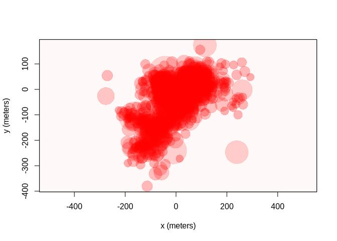
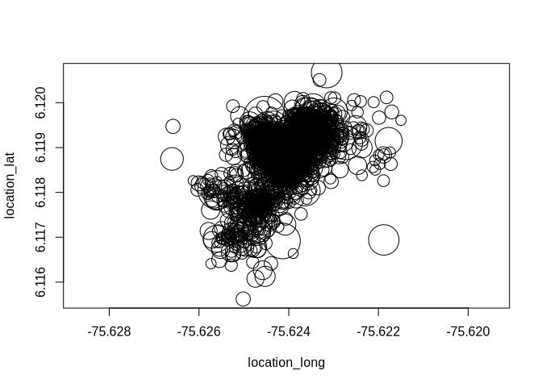

In depth analysis of errors in the movement data and deletion of
outliers
================
Marius Bottin
2023-04-27

- [Getting the general data from
  movebank](#getting-the-general-data-from-movebank)
- [Analyses of errors](#analyses-of-errors)
  - [Organizing data](#organizing-data)
  - [Calibration with `ctmm`](#calibration-with-ctmm)
  - [Differences between UERE errors and
    hdop](#differences-between-uere-errors-and-hdop)

# Getting the general data from movebank

Here we will apply the script to get all the data from movebank. If
needed, more details are presented in the document
[importingCleaningFormatting.Rmd](./importingCleaningFormatting.md)

``` r
source("importingMovebankData.R")
source("movebankFromDirectApi.R")
```

    ## No encoding supplied: defaulting to UTF-8.

``` r
source("itis_taxo.R")
```

# Analyses of errors

In the document
[importingCleaningFormatting.Rmd](./importingCleaningFormatting.md), you
may see how to use the function from `ctmm` and `move` for managing
movement data. However, there are some decisions to take, animal by
animal, in order to delete erroneous data from the individual datasets.

The criteria for pointing outliers may be extracted from:

- HDOP data associated with each relocation
- distance from the previous and the following point
- average speed calculated on every trajectory between 2 relocation
  points
- it is important to take into account the fact that some of the
  relocation might be missing and therefore the comparation of distances
  and speeds may be irrelevant
- `ctmm` uses calibration datasets in its own criteria to search for
  outliers
- `ctmm` also allows to create semi-variogram that apparently may be of
  use for searching for outliers

With all these criteria, it is possible to point out which are the
points which may be erroneous. However, it seems that there are no real
procedure to automatically suppress outliers based on them. Each outlier
should be evaluated visually, because it might be a real change in the
movement behavior of the animals.

## Organizing data

In order to be able to apply criteria in a homogenized way, I find it
easier to download directly the data from each animal separately:

``` r
aniNames <- animals$local_identifier[animals$number_of_events > 20]
# The calibration files do not have exactly the same names as the
# animals
caliNames <- gsub("\\.csv", "", dir("../../../uwt_repo_data/calibration/"))

tabNames <- data.frame(aniNames = aniNames, partLetter = gsub("GarzaAve",
    "Garza", gsub("-", "", gsub("^([-A-Za-z]+)([0-9]+)$", "\\1", aniNames))),
    partNumber = as.integer(gsub("^([-A-Za-z]+)([0-9]+)$", "\\2", aniNames)),
    calibName = NA)
matches <- sapply(caliNames, function(x, tab) {
    let <- gsub("^([A-Za-z]+)([0-9]+$)", "\\1", x)
    num <- gsub("^([A-Za-z]+)([0-9]+$)", "\\2", x)
    which(tab$partLetter == let & tab$partNumber == num)
}, tab = tabNames)
tabNames$calibName[matches] <- caliNames
# No sé porque pero el archivo de calibración de Guacharaca01,
# Guacharaca02, Pigua2, Garza1, GarzaAve4 contiene error: no se hará
# la calibración!
tabNames$calibName[tabNames$aniNames %in% c("Guacharaca01", "Guacharaca03",
    "Pigua2", "Garza1", "GarzaAve4")] <- NA

rawList <- list()
for (i in 1:nrow(tabNames)) {
    rawList[[tabNames$aniNames[i]]] <- list()
    rawList[[i]]$moveData = getMovebankData(study = study_id, login = lgin,
        animalName = tabNames$aniNames[i])
    rawList[[i]]$ctmmData = as.telemetry(rawList[[i]]$moveData)
    if (!is.na(tabNames$calibName[i])) {
        rawList[[i]]$calibData <- as.telemetry(paste("../../../uwt_repo_data/calibration/",
            tabNames$calibName[i], ".csv", sep = ""))
    }
}
save(rawList, file = "rawData.RData")
```

## Calibration with `ctmm`

Which individuals have calibration data:

``` r
(hasCalibData <- sapply(rawList, function(x) "calibData" %in% names(x)))
```

    ##          Zorro02          Zorro03          Zorro04          Zorro05 
    ##             TRUE             TRUE             TRUE             TRUE 
    ##          Zorro06          Zorro07     Guacharaca01     Guacharaca03 
    ##             TRUE             TRUE            FALSE            FALSE 
    ##       Phimosus01       Phimosus02           Pigua1       Zarigueya1 
    ##            FALSE             TRUE            FALSE             TRUE 
    ##       Zarigueya2       Zarigueya3       Zarigueya4       Phimosus04 
    ##             TRUE             TRUE             TRUE             TRUE 
    ##           Pigua2           Garza1        GarzaAve4       Zarigueya5 
    ##            FALSE            FALSE            FALSE            FALSE 
    ##           Pigua5     Guacharaca06         Ardilla1        GarzaAve2 
    ##            FALSE            FALSE            FALSE            FALSE 
    ##        GarzaAve3       Zarigueya6       Phimosus05       Phimosus07 
    ##            FALSE            FALSE            FALSE            FALSE 
    ##       Phimosus06       Zarigueya7     Guacharaca02      PavaGarza-4 
    ##            FALSE            FALSE            FALSE            FALSE 
    ##            Asio2       BuhoPigua6     Guacharaca04   PerezosoZorro1 
    ##            FALSE            FALSE            FALSE            FALSE 
    ##            Titi4       Phimosus03 GuacharacaAsio-4       GarzaTiti3 
    ##            FALSE            FALSE            FALSE            FALSE

Let’s add the calibration model to the list, when the animal have a
calibration dataset, and apply this model to the real `telemetry` object
from `ctmm`:

``` r
for (i in 1:length(rawList)) {
    if (hasCalibData[i]) {
        rawList[[i]]$UERE_calib <- uere.fit(rawList[[i]]$calibData)
        uere(rawList[[i]]$ctmmData) <- rawList[[i]]$ctmmData
    }
}
```

## Differences between UERE errors and hdop

``` r
require(rgeos)
```

    ## Loading required package: rgeos

    ## rgeos version: 0.6-2, (SVN revision 693)
    ##  GEOS runtime version: 3.11.0-CAPI-1.17.0 
    ##  Please note that rgeos will be retired during 2023,
    ## plan transition to sf functions using GEOS at your earliest convenience.
    ##  GEOS using OverlayNG
    ##  Linking to sp version: 1.6-0 
    ##  Polygon checking: TRUE

``` r
plot(rawList[[8]]$ctmmData, error = 2)
```

<!-- -->

``` r
plot(rawList[[8]]$moveData, cex = rawList[[8]]$moveData$gps_hdop * 2)
```

<!-- -->

As you can see the two graphs are pretty similar. It is due to the fact
that in our case, the data on which the UERE model is calculated is
mostly extracted from HDOP, calibrated from the calibration dataset.

While this calibration is important to create a good movement model with
`ctmm`, finding outliers through the HDOP should be relevant.
