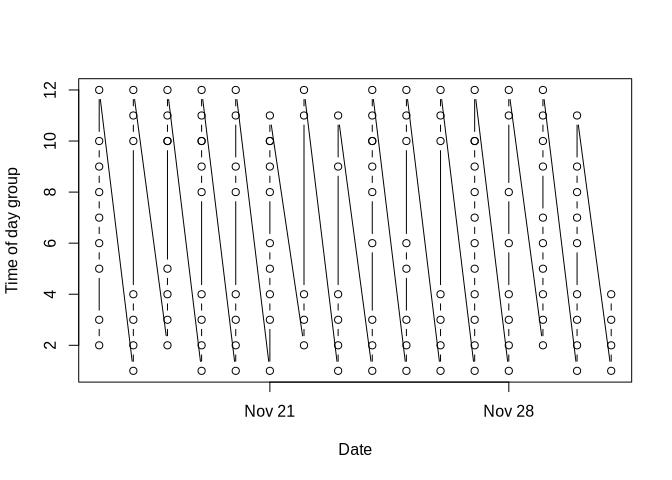
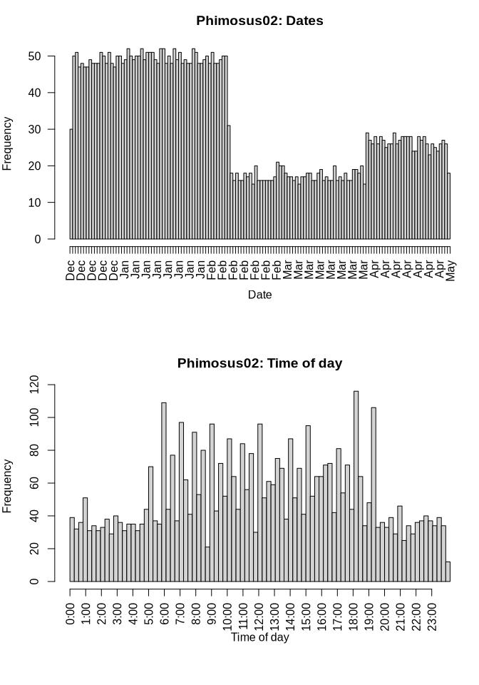
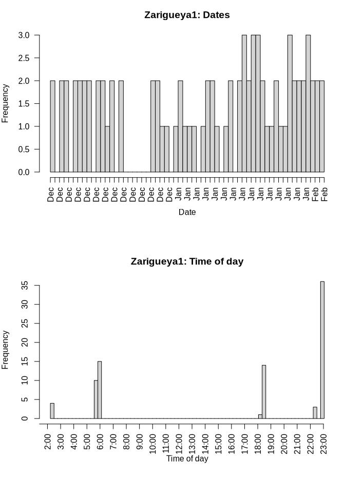

Managing temporal factors, frequencies of relocations and time lags
================
Marius Bottin
2023-05-02

- [Loading filtered data, by
  individual](#loading-filtered-data-by-individual)
- [Timestamps as a link between relocation data from `move` and
  `ctmm`](#timestamps-as-a-link-between-relocation-data-from-move-and-ctmm)
- [Checking frequencies and
  timelags](#checking-frequencies-and-timelags)
  - [Extracting dates and time of
    relocations](#extracting-dates-and-time-of-relocations)
  - [Individual by individual](#individual-by-individual)
- [Saving the objects created here](#saving-the-objects-created-here)

# Loading filtered data, by individual

Before doing that, make sure that you ran the code contained in file
[SpatialErrorCalibration.Rmd](SpatialErrorCalibration.md). Various
processes needed to be done, in particular the relationship between
names of the animals in the movebank data and the calibration local
datasets.

We will load the filtered data list created in
[outliers.Rmd](./outliers.md)

``` r
load("./filteredList.RData")
```

# Timestamps as a link between relocation data from `move` and `ctmm`

As you may see in the following code, timestamps can be an efficient way
to see the correspondences between relocation data in the `move` and
`ctmm` format:

``` r
match(filteredList$Zorro02$moveData$timestamp, filteredList$Zorro02$ctmmData$timestamp)
```

    ##   [1]   1   2   3   4   5   6   7   8   9  10  11  12  13  14  15  16  17  18
    ##  [19]  19  20  21  22  23  24  25  26  27  28  29  30  31  32  33  34  35  36
    ##  [37]  37  38  39  40  41  42  43  44  45  46  47  48  49  50  51  52  53  54
    ##  [55]  55  56  57  58  59  60  61  62  63  64  65  66  67  68  69  70  71  72
    ##  [73]  73  74  75  76  77  78  79  80  81  82  83  84  85  86  87  88  89  90
    ##  [91]  91  92  93  94  95  96  97  98  99 100 101 102 103 104 105 106 107 108
    ## [109] 109 110 111 112 113 114 115 116 117 118 119 120 121 122 123 124 125 126
    ## [127] 127 128 129 130 131

# Checking frequencies and timelags

## Extracting dates and time of relocations

We first extract information for dates and times for every individual:

``` r
list_dateTime <- lapply(filteredList, function(x) data.frame(timestamp = timestamps(x$moveData),
    date = date(timestamps(x$moveData)), time = format(timestamps(x$moveData),
        "%H:%M:%S"), time_s = as.numeric(timestamps(x$moveData)) - as.numeric(as.POSIXct(paste0(date(timestamps(x$moveData)),
        " 00:00:00"))), timeLag_s = c(NA, timeLag(x$moveData, "secs"))))
```

Concretely, for each individual, we obtain this table (example: Zorro02,
20 first lines):

``` r
list_dateTime$Zorro02 %>%
    head(n = 20) %>%
    kable()
```

<table>
<thead>
<tr>
<th style="text-align:left;">
timestamp
</th>
<th style="text-align:left;">
date
</th>
<th style="text-align:left;">
time
</th>
<th style="text-align:right;">
time_s
</th>
<th style="text-align:right;">
timeLag_s
</th>
</tr>
</thead>
<tbody>
<tr>
<td style="text-align:left;">
2022-11-16 02:03:51
</td>
<td style="text-align:left;">
2022-11-16
</td>
<td style="text-align:left;">
02:03:51
</td>
<td style="text-align:right;">
7431
</td>
<td style="text-align:right;">
—
</td>
</tr>
<tr>
<td style="text-align:left;">
2022-11-16 04:03:45
</td>
<td style="text-align:left;">
2022-11-16
</td>
<td style="text-align:left;">
04:03:45
</td>
<td style="text-align:right;">
14625
</td>
<td style="text-align:right;">
7194
</td>
</tr>
<tr>
<td style="text-align:left;">
2022-11-16 07:32:31
</td>
<td style="text-align:left;">
2022-11-16
</td>
<td style="text-align:left;">
07:32:31
</td>
<td style="text-align:right;">
27151
</td>
<td style="text-align:right;">
12526
</td>
</tr>
<tr>
<td style="text-align:left;">
2022-11-16 09:32:35
</td>
<td style="text-align:left;">
2022-11-16
</td>
<td style="text-align:left;">
09:32:35
</td>
<td style="text-align:right;">
34355
</td>
<td style="text-align:right;">
7204
</td>
</tr>
<tr>
<td style="text-align:left;">
2022-11-16 11:31:58
</td>
<td style="text-align:left;">
2022-11-16
</td>
<td style="text-align:left;">
11:31:58
</td>
<td style="text-align:right;">
41518
</td>
<td style="text-align:right;">
7163
</td>
</tr>
<tr>
<td style="text-align:left;">
2022-11-16 13:32:34
</td>
<td style="text-align:left;">
2022-11-16
</td>
<td style="text-align:left;">
13:32:34
</td>
<td style="text-align:right;">
48754
</td>
<td style="text-align:right;">
7236
</td>
</tr>
<tr>
<td style="text-align:left;">
2022-11-16 15:33:46
</td>
<td style="text-align:left;">
2022-11-16
</td>
<td style="text-align:left;">
15:33:46
</td>
<td style="text-align:right;">
56026
</td>
<td style="text-align:right;">
7272
</td>
</tr>
<tr>
<td style="text-align:left;">
2022-11-16 17:33:48
</td>
<td style="text-align:left;">
2022-11-16
</td>
<td style="text-align:left;">
17:33:48
</td>
<td style="text-align:right;">
63228
</td>
<td style="text-align:right;">
7202
</td>
</tr>
<tr>
<td style="text-align:left;">
2022-11-16 22:03:13
</td>
<td style="text-align:left;">
2022-11-16
</td>
<td style="text-align:left;">
22:03:13
</td>
<td style="text-align:right;">
79393
</td>
<td style="text-align:right;">
16165
</td>
</tr>
<tr>
<td style="text-align:left;">
2022-11-17 00:03:35
</td>
<td style="text-align:left;">
2022-11-17
</td>
<td style="text-align:left;">
00:03:35
</td>
<td style="text-align:right;">
215
</td>
<td style="text-align:right;">
7222
</td>
</tr>
<tr>
<td style="text-align:left;">
2022-11-17 02:04:16
</td>
<td style="text-align:left;">
2022-11-17
</td>
<td style="text-align:left;">
02:04:16
</td>
<td style="text-align:right;">
7456
</td>
<td style="text-align:right;">
7241
</td>
</tr>
<tr>
<td style="text-align:left;">
2022-11-17 04:04:29
</td>
<td style="text-align:left;">
2022-11-17
</td>
<td style="text-align:left;">
04:04:29
</td>
<td style="text-align:right;">
14669
</td>
<td style="text-align:right;">
7213
</td>
</tr>
<tr>
<td style="text-align:left;">
2022-11-17 05:33:05
</td>
<td style="text-align:left;">
2022-11-17
</td>
<td style="text-align:left;">
05:33:05
</td>
<td style="text-align:right;">
19985
</td>
<td style="text-align:right;">
5316
</td>
</tr>
<tr>
<td style="text-align:left;">
2022-11-17 18:03:12
</td>
<td style="text-align:left;">
2022-11-17
</td>
<td style="text-align:left;">
18:03:12
</td>
<td style="text-align:right;">
64992
</td>
<td style="text-align:right;">
45007
</td>
</tr>
<tr>
<td style="text-align:left;">
2022-11-17 20:02:55
</td>
<td style="text-align:left;">
2022-11-17
</td>
<td style="text-align:left;">
20:02:55
</td>
<td style="text-align:right;">
72175
</td>
<td style="text-align:right;">
7183
</td>
</tr>
<tr>
<td style="text-align:left;">
2022-11-17 22:02:38
</td>
<td style="text-align:left;">
2022-11-17
</td>
<td style="text-align:left;">
22:02:38
</td>
<td style="text-align:right;">
79358
</td>
<td style="text-align:right;">
7183
</td>
</tr>
<tr>
<td style="text-align:left;">
2022-11-18 02:04:13
</td>
<td style="text-align:left;">
2022-11-18
</td>
<td style="text-align:left;">
02:04:13
</td>
<td style="text-align:right;">
7453
</td>
<td style="text-align:right;">
14495
</td>
</tr>
<tr>
<td style="text-align:left;">
2022-11-18 04:03:14
</td>
<td style="text-align:left;">
2022-11-18
</td>
<td style="text-align:left;">
04:03:14
</td>
<td style="text-align:right;">
14594
</td>
<td style="text-align:right;">
7141
</td>
</tr>
<tr>
<td style="text-align:left;">
2022-11-18 05:32:52
</td>
<td style="text-align:left;">
2022-11-18
</td>
<td style="text-align:left;">
05:32:52
</td>
<td style="text-align:right;">
19972
</td>
<td style="text-align:right;">
5378
</td>
</tr>
<tr>
<td style="text-align:left;">
2022-11-18 07:32:59
</td>
<td style="text-align:left;">
2022-11-18
</td>
<td style="text-align:left;">
07:32:59
</td>
<td style="text-align:right;">
27179
</td>
<td style="text-align:right;">
7207
</td>
</tr>
</tbody>
</table>

## Individual by individual

### Functions

First we define a function which makes easily histograms out of the
timestamp information tables, by date and by time of day

``` r
hists_timestamps <- function(ts_tab, indName = NULL) {
    par(mar = c(7, 4, 3, 1))
    hist(ts_tab$timestamp, breaks = "days", freq = T, main = ifelse(!is.null(indName),
        paste(indName, ": Dates", sep = ""), "Dates"), xlab = "Date", las = 2)
    hist(ts_tab$time_s, xaxt = "n", nclass = 100, main = ifelse(!is.null(indName),
        paste(indName, ": Time of day", sep = ""), "Dates"), xlab = "Time of day")
    axis(1, at = seq(0, 23 * 60 * 60, 60 * 60), paste(0:23, ":00", sep = ""),
        las = 2)
}
```

Then we define a function to separate the times of day. It probably
could be done better, but I’ll use a “single” clustering method
calculated on the time in second. For now, the user will have to define
the number of relocation by day

``` r
find_clustTOD <- function(ts_tab, nb_reloc = 12) {
    gp <- cutree(hclust(dist(ts_tab$time_s), method = "single"), nb_reloc)
    meanTimeGp <- tapply(ts_tab$time_s, gp, mean)
    meanGp <- format(as.POSIXct(meanTimeGp, origin = today(tzone = "GMT"),
        tz = "GMT"), "%H:%M")[order(meanTimeGp)]
    return(data.frame(gp_TOD = match(as.character(gp), names(meanGp)),
        meanGp = meanGp[as.character(gp)]))
}
```

The idea of the find_clustTOD function is to classify the time of day
which correspond to each relocation data in a normalized form. Look at
the following table and plot, to understand what it does:

``` r
A <- cbind(list_dateTime$Zorro02, find_clustTOD(list_dateTime$Zorro02))
kable(head(A, 25))
```

<table>
<thead>
<tr>
<th style="text-align:left;">
timestamp
</th>
<th style="text-align:left;">
date
</th>
<th style="text-align:left;">
time
</th>
<th style="text-align:right;">
time_s
</th>
<th style="text-align:right;">
timeLag_s
</th>
<th style="text-align:right;">
gp_TOD
</th>
<th style="text-align:left;">
meanGp
</th>
</tr>
</thead>
<tbody>
<tr>
<td style="text-align:left;">
2022-11-16 02:03:51
</td>
<td style="text-align:left;">
2022-11-16
</td>
<td style="text-align:left;">
02:03:51
</td>
<td style="text-align:right;">
7431
</td>
<td style="text-align:right;">
—
</td>
<td style="text-align:right;">
2
</td>
<td style="text-align:left;">
02:05
</td>
</tr>
<tr>
<td style="text-align:left;">
2022-11-16 04:03:45
</td>
<td style="text-align:left;">
2022-11-16
</td>
<td style="text-align:left;">
04:03:45
</td>
<td style="text-align:right;">
14625
</td>
<td style="text-align:right;">
7194
</td>
<td style="text-align:right;">
3
</td>
<td style="text-align:left;">
04:05
</td>
</tr>
<tr>
<td style="text-align:left;">
2022-11-16 07:32:31
</td>
<td style="text-align:left;">
2022-11-16
</td>
<td style="text-align:left;">
07:32:31
</td>
<td style="text-align:right;">
27151
</td>
<td style="text-align:right;">
12526
</td>
<td style="text-align:right;">
5
</td>
<td style="text-align:left;">
07:34
</td>
</tr>
<tr>
<td style="text-align:left;">
2022-11-16 09:32:35
</td>
<td style="text-align:left;">
2022-11-16
</td>
<td style="text-align:left;">
09:32:35
</td>
<td style="text-align:right;">
34355
</td>
<td style="text-align:right;">
7204
</td>
<td style="text-align:right;">
6
</td>
<td style="text-align:left;">
09:35
</td>
</tr>
<tr>
<td style="text-align:left;">
2022-11-16 11:31:58
</td>
<td style="text-align:left;">
2022-11-16
</td>
<td style="text-align:left;">
11:31:58
</td>
<td style="text-align:right;">
41518
</td>
<td style="text-align:right;">
7163
</td>
<td style="text-align:right;">
7
</td>
<td style="text-align:left;">
11:36
</td>
</tr>
<tr>
<td style="text-align:left;">
2022-11-16 13:32:34
</td>
<td style="text-align:left;">
2022-11-16
</td>
<td style="text-align:left;">
13:32:34
</td>
<td style="text-align:right;">
48754
</td>
<td style="text-align:right;">
7236
</td>
<td style="text-align:right;">
8
</td>
<td style="text-align:left;">
13:35
</td>
</tr>
<tr>
<td style="text-align:left;">
2022-11-16 15:33:46
</td>
<td style="text-align:left;">
2022-11-16
</td>
<td style="text-align:left;">
15:33:46
</td>
<td style="text-align:right;">
56026
</td>
<td style="text-align:right;">
7272
</td>
<td style="text-align:right;">
9
</td>
<td style="text-align:left;">
15:36
</td>
</tr>
<tr>
<td style="text-align:left;">
2022-11-16 17:33:48
</td>
<td style="text-align:left;">
2022-11-16
</td>
<td style="text-align:left;">
17:33:48
</td>
<td style="text-align:right;">
63228
</td>
<td style="text-align:right;">
7202
</td>
<td style="text-align:right;">
10
</td>
<td style="text-align:left;">
17:52
</td>
</tr>
<tr>
<td style="text-align:left;">
2022-11-16 22:03:13
</td>
<td style="text-align:left;">
2022-11-16
</td>
<td style="text-align:left;">
22:03:13
</td>
<td style="text-align:right;">
79393
</td>
<td style="text-align:right;">
16165
</td>
<td style="text-align:right;">
12
</td>
<td style="text-align:left;">
22:04
</td>
</tr>
<tr>
<td style="text-align:left;">
2022-11-17 00:03:35
</td>
<td style="text-align:left;">
2022-11-17
</td>
<td style="text-align:left;">
00:03:35
</td>
<td style="text-align:right;">
215
</td>
<td style="text-align:right;">
7222
</td>
<td style="text-align:right;">
1
</td>
<td style="text-align:left;">
00:04
</td>
</tr>
<tr>
<td style="text-align:left;">
2022-11-17 02:04:16
</td>
<td style="text-align:left;">
2022-11-17
</td>
<td style="text-align:left;">
02:04:16
</td>
<td style="text-align:right;">
7456
</td>
<td style="text-align:right;">
7241
</td>
<td style="text-align:right;">
2
</td>
<td style="text-align:left;">
02:05
</td>
</tr>
<tr>
<td style="text-align:left;">
2022-11-17 04:04:29
</td>
<td style="text-align:left;">
2022-11-17
</td>
<td style="text-align:left;">
04:04:29
</td>
<td style="text-align:right;">
14669
</td>
<td style="text-align:right;">
7213
</td>
<td style="text-align:right;">
3
</td>
<td style="text-align:left;">
04:05
</td>
</tr>
<tr>
<td style="text-align:left;">
2022-11-17 05:33:05
</td>
<td style="text-align:left;">
2022-11-17
</td>
<td style="text-align:left;">
05:33:05
</td>
<td style="text-align:right;">
19985
</td>
<td style="text-align:right;">
5316
</td>
<td style="text-align:right;">
4
</td>
<td style="text-align:left;">
05:35
</td>
</tr>
<tr>
<td style="text-align:left;">
2022-11-17 18:03:12
</td>
<td style="text-align:left;">
2022-11-17
</td>
<td style="text-align:left;">
18:03:12
</td>
<td style="text-align:right;">
64992
</td>
<td style="text-align:right;">
45007
</td>
<td style="text-align:right;">
10
</td>
<td style="text-align:left;">
17:52
</td>
</tr>
<tr>
<td style="text-align:left;">
2022-11-17 20:02:55
</td>
<td style="text-align:left;">
2022-11-17
</td>
<td style="text-align:left;">
20:02:55
</td>
<td style="text-align:right;">
72175
</td>
<td style="text-align:right;">
7183
</td>
<td style="text-align:right;">
11
</td>
<td style="text-align:left;">
20:04
</td>
</tr>
<tr>
<td style="text-align:left;">
2022-11-17 22:02:38
</td>
<td style="text-align:left;">
2022-11-17
</td>
<td style="text-align:left;">
22:02:38
</td>
<td style="text-align:right;">
79358
</td>
<td style="text-align:right;">
7183
</td>
<td style="text-align:right;">
12
</td>
<td style="text-align:left;">
22:04
</td>
</tr>
<tr>
<td style="text-align:left;">
2022-11-18 02:04:13
</td>
<td style="text-align:left;">
2022-11-18
</td>
<td style="text-align:left;">
02:04:13
</td>
<td style="text-align:right;">
7453
</td>
<td style="text-align:right;">
14495
</td>
<td style="text-align:right;">
2
</td>
<td style="text-align:left;">
02:05
</td>
</tr>
<tr>
<td style="text-align:left;">
2022-11-18 04:03:14
</td>
<td style="text-align:left;">
2022-11-18
</td>
<td style="text-align:left;">
04:03:14
</td>
<td style="text-align:right;">
14594
</td>
<td style="text-align:right;">
7141
</td>
<td style="text-align:right;">
3
</td>
<td style="text-align:left;">
04:05
</td>
</tr>
<tr>
<td style="text-align:left;">
2022-11-18 05:32:52
</td>
<td style="text-align:left;">
2022-11-18
</td>
<td style="text-align:left;">
05:32:52
</td>
<td style="text-align:right;">
19972
</td>
<td style="text-align:right;">
5378
</td>
<td style="text-align:right;">
4
</td>
<td style="text-align:left;">
05:35
</td>
</tr>
<tr>
<td style="text-align:left;">
2022-11-18 07:32:59
</td>
<td style="text-align:left;">
2022-11-18
</td>
<td style="text-align:left;">
07:32:59
</td>
<td style="text-align:right;">
27179
</td>
<td style="text-align:right;">
7207
</td>
<td style="text-align:right;">
5
</td>
<td style="text-align:left;">
07:34
</td>
</tr>
<tr>
<td style="text-align:left;">
2022-11-18 17:33:10
</td>
<td style="text-align:left;">
2022-11-18
</td>
<td style="text-align:left;">
17:33:10
</td>
<td style="text-align:right;">
63190
</td>
<td style="text-align:right;">
36011
</td>
<td style="text-align:right;">
10
</td>
<td style="text-align:left;">
17:52
</td>
</tr>
<tr>
<td style="text-align:left;">
2022-11-18 18:02:40
</td>
<td style="text-align:left;">
2022-11-18
</td>
<td style="text-align:left;">
18:02:40
</td>
<td style="text-align:right;">
64960
</td>
<td style="text-align:right;">
1770
</td>
<td style="text-align:right;">
10
</td>
<td style="text-align:left;">
17:52
</td>
</tr>
<tr>
<td style="text-align:left;">
2022-11-18 20:03:11
</td>
<td style="text-align:left;">
2022-11-18
</td>
<td style="text-align:left;">
20:03:11
</td>
<td style="text-align:right;">
72191
</td>
<td style="text-align:right;">
7231
</td>
<td style="text-align:right;">
11
</td>
<td style="text-align:left;">
20:04
</td>
</tr>
<tr>
<td style="text-align:left;">
2022-11-18 22:03:59
</td>
<td style="text-align:left;">
2022-11-18
</td>
<td style="text-align:left;">
22:03:59
</td>
<td style="text-align:right;">
79439
</td>
<td style="text-align:right;">
7248
</td>
<td style="text-align:right;">
12
</td>
<td style="text-align:left;">
22:04
</td>
</tr>
<tr>
<td style="text-align:left;">
2022-11-19 00:04:00
</td>
<td style="text-align:left;">
2022-11-19
</td>
<td style="text-align:left;">
00:04:00
</td>
<td style="text-align:right;">
240
</td>
<td style="text-align:right;">
7201
</td>
<td style="text-align:right;">
1
</td>
<td style="text-align:left;">
00:04
</td>
</tr>
</tbody>
</table>

``` r
plot(A$date, A$gp_TOD, type = "b", xlab = "Date", ylab = "Time of day group")
```

<!-- -->

Then it is easy to create a function which calculate which TOD groups
are missing and which are duplicated every day between start and end.

``` r
mis_dup_TOD <- function(ts_tab_TOD) {
    nbClusTOD <- max(ts_tab_TOD$gp_TOD)
    dupliTOD <- duplicated(ts_tab_TOD[c("date", "gp_TOD")])
    minDate <- min(ts_tab_TOD$date)
    maxDate <- max(ts_tab_TOD$date)
    minDateTOD <- min(ts_tab_TOD$gp_TOD[ts_tab_TOD$date == minDate])
    maxDateTOD <- max(ts_tab_TOD$gp_TOD[ts_tab_TOD$date == maxDate])
    completeDateTOD <- rbind(data.frame(date = as.Date(minDate), gp_TOD = minDateTOD:nbClusTOD),
        data.frame(date = as.Date(rep((minDate + 1):(maxDate - 1), each = nbClusTOD),
            origin = "1970-01-01"), gp_TOD = rep(1:nbClusTOD, length(rep((minDate +
            1):(maxDate - 1))))), data.frame(date = maxDate, gp_TOD = 1:maxDateTOD),
        deparse.level = 0)
    completeDateTOD$nb <- integer(nrow(completeDateTOD))
    for (i in 1:nrow(completeDateTOD)) {
        completeDateTOD$nb[i] <- length(which(ts_tab_TOD$date == completeDateTOD$date[i] &
            ts_tab_TOD$gp_TOD == completeDateTOD$gp_TOD[i]))
    }
    return(completeDateTOD)
}
```

### Zorro02

``` r
par(mfrow = c(2, 1))
hists_timestamps(list_dateTime$Zorro02, "Zorro02")
```

<!-- -->

There seem to be 12 different time of days in the data:

``` r
list_dateTime$Zorro02 <- cbind(list_dateTime$Zorro02, find_clustTOD(list_dateTime$Zorro02,
    12))
```

The average time of the clustered TOD are:

``` r
A <- unique(list_dateTime$Zorro02[c("gp_TOD", "meanGp")])
A[order(A$gp_TOD), ] %>%
    kable(row.names = F)
```

<table>
<thead>
<tr>
<th style="text-align:right;">
gp_TOD
</th>
<th style="text-align:left;">
meanGp
</th>
</tr>
</thead>
<tbody>
<tr>
<td style="text-align:right;">
1
</td>
<td style="text-align:left;">
00:04
</td>
</tr>
<tr>
<td style="text-align:right;">
2
</td>
<td style="text-align:left;">
02:05
</td>
</tr>
<tr>
<td style="text-align:right;">
3
</td>
<td style="text-align:left;">
04:05
</td>
</tr>
<tr>
<td style="text-align:right;">
4
</td>
<td style="text-align:left;">
05:35
</td>
</tr>
<tr>
<td style="text-align:right;">
5
</td>
<td style="text-align:left;">
07:34
</td>
</tr>
<tr>
<td style="text-align:right;">
6
</td>
<td style="text-align:left;">
09:35
</td>
</tr>
<tr>
<td style="text-align:right;">
7
</td>
<td style="text-align:left;">
11:36
</td>
</tr>
<tr>
<td style="text-align:right;">
8
</td>
<td style="text-align:left;">
13:35
</td>
</tr>
<tr>
<td style="text-align:right;">
9
</td>
<td style="text-align:left;">
15:36
</td>
</tr>
<tr>
<td style="text-align:right;">
10
</td>
<td style="text-align:left;">
17:52
</td>
</tr>
<tr>
<td style="text-align:right;">
11
</td>
<td style="text-align:left;">
20:04
</td>
</tr>
<tr>
<td style="text-align:right;">
12
</td>
<td style="text-align:left;">
22:04
</td>
</tr>
</tbody>
</table>

Concerning repeated and missing times of day:

``` r
misRepTOD <- list()
misRepTOD$Zorro02 <- mis_dup_TOD(list_dateTime$Zorro02)
```

The missing time of day are:

``` r
table(misRepTOD$Zorro02$gp_TOD[misRepTOD$Zorro02$nb == 0])
```

    ## 
    ##  1  2  4  5  6  7  8  9 10 11 12 
    ##  3  1  3  9  7 11  7  6  5  2  3

The repeated time of day are:

``` r
table(misRepTOD$Zorro02$nb[misRepTOD$Zorro02$nb > 1], factor(misRepTOD$Zorro02$gp_TOD)[misRepTOD$Zorro02$nb >
    1])
```

    ##    
    ##     1 2 3 4 5 6 7 8 9 10 11 12
    ##   2 0 0 0 0 0 0 0 0 0  5  0  0

### Zorro03

``` r
par(mfrow = c(2, 1))
hists_timestamps(list_dateTime$Zorro03, "Zorro03")
```

<!-- -->

There seem to be 12 different time of days in the data:

``` r
list_dateTime$Zorro03 <- cbind(list_dateTime$Zorro03, find_clustTOD(list_dateTime$Zorro03,
    12))
```

The average time of the clustered TOD are:

``` r
A <- unique(list_dateTime$Zorro03[c("gp_TOD", "meanGp")])
A[order(A$gp_TOD), ] %>%
    kable(row.names = F)
```

<table>
<thead>
<tr>
<th style="text-align:right;">
gp_TOD
</th>
<th style="text-align:left;">
meanGp
</th>
</tr>
</thead>
<tbody>
<tr>
<td style="text-align:right;">
1
</td>
<td style="text-align:left;">
00:06
</td>
</tr>
<tr>
<td style="text-align:right;">
2
</td>
<td style="text-align:left;">
02:10
</td>
</tr>
<tr>
<td style="text-align:right;">
3
</td>
<td style="text-align:left;">
04:05
</td>
</tr>
<tr>
<td style="text-align:right;">
4
</td>
<td style="text-align:left;">
05:40
</td>
</tr>
<tr>
<td style="text-align:right;">
5
</td>
<td style="text-align:left;">
07:35
</td>
</tr>
<tr>
<td style="text-align:right;">
6
</td>
<td style="text-align:left;">
08:30
</td>
</tr>
<tr>
<td style="text-align:right;">
7
</td>
<td style="text-align:left;">
09:40
</td>
</tr>
<tr>
<td style="text-align:right;">
8
</td>
<td style="text-align:left;">
12:45
</td>
</tr>
<tr>
<td style="text-align:right;">
9
</td>
<td style="text-align:left;">
15:34
</td>
</tr>
<tr>
<td style="text-align:right;">
10
</td>
<td style="text-align:left;">
18:35
</td>
</tr>
<tr>
<td style="text-align:right;">
11
</td>
<td style="text-align:left;">
22:07
</td>
</tr>
<tr>
<td style="text-align:right;">
12
</td>
<td style="text-align:left;">
23:19
</td>
</tr>
</tbody>
</table>

Concerning repeated and missing times of day:

``` r
misRepTOD$Zorro03 <- mis_dup_TOD(list_dateTime$Zorro03)
```

The missing time of day are:

``` r
table(misRepTOD$Zorro03$gp_TOD[misRepTOD$Zorro03$nb == 0])
```

    ## 
    ##   1   2   3   4   5   6   7   8   9  10  11  12 
    ## 147 143 146 121 165 180 138 128 164 115 133 179

The repeated time of day are:

``` r
table(misRepTOD$Zorro03$nb[misRepTOD$Zorro03$nb > 1], factor(misRepTOD$Zorro03$gp_TOD)[misRepTOD$Zorro03$nb >
    1])
```

    ##    
    ##      1  2  3  4  5  6  7  8  9 10 11 12
    ##   2  0  0  0  1  0  0  0 23  0 25  0  0
    ##   3  0  0  0  0  0  0  0  0  0 17  0  0

### Zorro04

``` r
par(mfrow = c(2, 1))
hists_timestamps(list_dateTime$Zorro04, "Zorro04")
```

<!-- -->

There seem to be 12 different time of days in the data:

``` r
list_dateTime$Zorro04 <- cbind(list_dateTime$Zorro04, find_clustTOD(list_dateTime$Zorro04,
    12))
```

The average time of the clustered TOD are:

``` r
A <- unique(list_dateTime$Zorro04[c("gp_TOD", "meanGp")])
A[order(A$gp_TOD), ] %>%
    kable(row.names = F)
```

<table>
<thead>
<tr>
<th style="text-align:right;">
gp_TOD
</th>
<th style="text-align:left;">
meanGp
</th>
</tr>
</thead>
<tbody>
<tr>
<td style="text-align:right;">
1
</td>
<td style="text-align:left;">
00:06
</td>
</tr>
<tr>
<td style="text-align:right;">
2
</td>
<td style="text-align:left;">
02:07
</td>
</tr>
<tr>
<td style="text-align:right;">
3
</td>
<td style="text-align:left;">
04:05
</td>
</tr>
<tr>
<td style="text-align:right;">
4
</td>
<td style="text-align:left;">
05:39
</td>
</tr>
<tr>
<td style="text-align:right;">
5
</td>
<td style="text-align:left;">
07:34
</td>
</tr>
<tr>
<td style="text-align:right;">
6
</td>
<td style="text-align:left;">
09:39
</td>
</tr>
<tr>
<td style="text-align:right;">
7
</td>
<td style="text-align:left;">
11:35
</td>
</tr>
<tr>
<td style="text-align:right;">
8
</td>
<td style="text-align:left;">
13:38
</td>
</tr>
<tr>
<td style="text-align:right;">
9
</td>
<td style="text-align:left;">
15:37
</td>
</tr>
<tr>
<td style="text-align:right;">
10
</td>
<td style="text-align:left;">
17:54
</td>
</tr>
<tr>
<td style="text-align:right;">
11
</td>
<td style="text-align:left;">
20:05
</td>
</tr>
<tr>
<td style="text-align:right;">
12
</td>
<td style="text-align:left;">
22:08
</td>
</tr>
</tbody>
</table>

Concerning repeated and missing times of day:

``` r
misRepTOD$Zorro04 <- mis_dup_TOD(list_dateTime$Zorro04)
```

The missing time of day are:

``` r
table(misRepTOD$Zorro04$gp_TOD[misRepTOD$Zorro04$nb == 0])
```

    ## 
    ##   1   2   3   4   5   6   7   8   9  10  11  12 
    ## 138 126 136 121 139 134 136 126 132 123 133 134

The repeated time of day are:

``` r
table(misRepTOD$Zorro04$nb[misRepTOD$Zorro04$nb > 1], factor(misRepTOD$Zorro04$gp_TOD)[misRepTOD$Zorro04$nb >
    1])
```

    ##    
    ##      1  2  3  4  5  6  7  8  9 10 11 12
    ##   2  0  0  0  0  0  0  0  0  0 15  0  0

### Zorro05

``` r
par(mfrow = c(2, 1))
hists_timestamps(list_dateTime$Zorro05, "Zorro05")
```

<!-- -->

There seem to be 12 different time of days in the data:

``` r
list_dateTime$Zorro05 <- cbind(list_dateTime$Zorro05, find_clustTOD(list_dateTime$Zorro05,
    12))
```

The average time of the clustered TOD are:

``` r
A <- unique(list_dateTime$Zorro05[c("gp_TOD", "meanGp")])
A[order(A$gp_TOD), ] %>%
    kable(row.names = F)
```

<table>
<thead>
<tr>
<th style="text-align:right;">
gp_TOD
</th>
<th style="text-align:left;">
meanGp
</th>
</tr>
</thead>
<tbody>
<tr>
<td style="text-align:right;">
1
</td>
<td style="text-align:left;">
00:06
</td>
</tr>
<tr>
<td style="text-align:right;">
2
</td>
<td style="text-align:left;">
02:11
</td>
</tr>
<tr>
<td style="text-align:right;">
3
</td>
<td style="text-align:left;">
04:04
</td>
</tr>
<tr>
<td style="text-align:right;">
4
</td>
<td style="text-align:left;">
05:40
</td>
</tr>
<tr>
<td style="text-align:right;">
5
</td>
<td style="text-align:left;">
07:31
</td>
</tr>
<tr>
<td style="text-align:right;">
6
</td>
<td style="text-align:left;">
09:41
</td>
</tr>
<tr>
<td style="text-align:right;">
7
</td>
<td style="text-align:left;">
11:37
</td>
</tr>
<tr>
<td style="text-align:right;">
8
</td>
<td style="text-align:left;">
13:38
</td>
</tr>
<tr>
<td style="text-align:right;">
9
</td>
<td style="text-align:left;">
15:32
</td>
</tr>
<tr>
<td style="text-align:right;">
10
</td>
<td style="text-align:left;">
18:02
</td>
</tr>
<tr>
<td style="text-align:right;">
11
</td>
<td style="text-align:left;">
20:04
</td>
</tr>
<tr>
<td style="text-align:right;">
12
</td>
<td style="text-align:left;">
22:11
</td>
</tr>
</tbody>
</table>

Concerning repeated and missing times of day:

``` r
misRepTOD$Zorro05 <- mis_dup_TOD(list_dateTime$Zorro05)
```

The missing time of day are:

``` r
table(misRepTOD$Zorro05$gp_TOD[misRepTOD$Zorro05$nb == 0])
```

    ## 
    ##   1   2   3   4   5   6   7   8   9  10  11  12 
    ## 160 144 154 114 171 147 163 144 163 116 160 154

The repeated time of day are:

``` r
table(misRepTOD$Zorro05$nb[misRepTOD$Zorro05$nb > 1], factor(misRepTOD$Zorro05$gp_TOD)[misRepTOD$Zorro05$nb >
    1])
```

    ##    
    ##      1  2  3  4  5  6  7  8  9 10 11 12
    ##   2  0  0  0  0  0  0  0  0  0 32  0  0

### Zorro06

``` r
par(mfrow = c(2, 1))
hists_timestamps(list_dateTime$Zorro06, "Zorro06")
```

<!-- -->

There seem to be 12 different time of days in the data:

``` r
list_dateTime$Zorro06 <- cbind(list_dateTime$Zorro06, find_clustTOD(list_dateTime$Zorro06,
    12))
```

The average time of the clustered TOD are:

``` r
A <- unique(list_dateTime$Zorro06[c("gp_TOD", "meanGp")])
A[order(A$gp_TOD), ] %>%
    kable(row.names = F)
```

<table>
<thead>
<tr>
<th style="text-align:right;">
gp_TOD
</th>
<th style="text-align:left;">
meanGp
</th>
</tr>
</thead>
<tbody>
<tr>
<td style="text-align:right;">
1
</td>
<td style="text-align:left;">
00:17
</td>
</tr>
<tr>
<td style="text-align:right;">
2
</td>
<td style="text-align:left;">
02:09
</td>
</tr>
<tr>
<td style="text-align:right;">
3
</td>
<td style="text-align:left;">
04:05
</td>
</tr>
<tr>
<td style="text-align:right;">
4
</td>
<td style="text-align:left;">
05:47
</td>
</tr>
<tr>
<td style="text-align:right;">
5
</td>
<td style="text-align:left;">
07:33
</td>
</tr>
<tr>
<td style="text-align:right;">
6
</td>
<td style="text-align:left;">
09:37
</td>
</tr>
<tr>
<td style="text-align:right;">
7
</td>
<td style="text-align:left;">
11:41
</td>
</tr>
<tr>
<td style="text-align:right;">
8
</td>
<td style="text-align:left;">
13:37
</td>
</tr>
<tr>
<td style="text-align:right;">
9
</td>
<td style="text-align:left;">
15:33
</td>
</tr>
<tr>
<td style="text-align:right;">
10
</td>
<td style="text-align:left;">
18:03
</td>
</tr>
<tr>
<td style="text-align:right;">
11
</td>
<td style="text-align:left;">
20:05
</td>
</tr>
<tr>
<td style="text-align:right;">
12
</td>
<td style="text-align:left;">
22:09
</td>
</tr>
</tbody>
</table>

Concerning repeated and missing times of day:

``` r
misRepTOD$Zorro06 <- mis_dup_TOD(list_dateTime$Zorro06)
```

The missing time of day are:

``` r
table(misRepTOD$Zorro06$gp_TOD[misRepTOD$Zorro06$nb == 0])
```

    ## 
    ##   1   2   3   4   5   6   7   8   9  10  11  12 
    ## 136 131 152  83 162 137 127 130 144  52 158 150

The repeated time of day are:

``` r
table(misRepTOD$Zorro06$nb[misRepTOD$Zorro06$nb > 1], factor(misRepTOD$Zorro06$gp_TOD)[misRepTOD$Zorro06$nb >
    1])
```

    ##    
    ##      1  2  3  4  5  6  7  8  9 10 11 12
    ##   2  0  0  0  0  0  0  0  0  0 88  0  0

### Zorro07

``` r
par(mfrow = c(2, 1))
hists_timestamps(list_dateTime$Zorro07, "Zorro07")
```

<!-- -->

There seem to be 12 different time of days in the data:

``` r
list_dateTime$Zorro07 <- cbind(list_dateTime$Zorro07, find_clustTOD(list_dateTime$Zorro07,
    12))
```

The average time of the clustered TOD are:

``` r
A <- unique(list_dateTime$Zorro07[c("gp_TOD", "meanGp")])
A[order(A$gp_TOD), ] %>%
    kable(row.names = F)
```

<table>
<thead>
<tr>
<th style="text-align:right;">
gp_TOD
</th>
<th style="text-align:left;">
meanGp
</th>
</tr>
</thead>
<tbody>
<tr>
<td style="text-align:right;">
1
</td>
<td style="text-align:left;">
00:07
</td>
</tr>
<tr>
<td style="text-align:right;">
2
</td>
<td style="text-align:left;">
02:12
</td>
</tr>
<tr>
<td style="text-align:right;">
3
</td>
<td style="text-align:left;">
04:07
</td>
</tr>
<tr>
<td style="text-align:right;">
4
</td>
<td style="text-align:left;">
05:40
</td>
</tr>
<tr>
<td style="text-align:right;">
5
</td>
<td style="text-align:left;">
07:28
</td>
</tr>
<tr>
<td style="text-align:right;">
6
</td>
<td style="text-align:left;">
09:39
</td>
</tr>
<tr>
<td style="text-align:right;">
7
</td>
<td style="text-align:left;">
11:29
</td>
</tr>
<tr>
<td style="text-align:right;">
8
</td>
<td style="text-align:left;">
13:40
</td>
</tr>
<tr>
<td style="text-align:right;">
9
</td>
<td style="text-align:left;">
15:29
</td>
</tr>
<tr>
<td style="text-align:right;">
10
</td>
<td style="text-align:left;">
18:00
</td>
</tr>
<tr>
<td style="text-align:right;">
11
</td>
<td style="text-align:left;">
20:05
</td>
</tr>
<tr>
<td style="text-align:right;">
12
</td>
<td style="text-align:left;">
22:11
</td>
</tr>
</tbody>
</table>

Concerning repeated and missing times of day:

``` r
misRepTOD$Zorro07 <- mis_dup_TOD(list_dateTime$Zorro07)
```

The missing time of day are:

``` r
table(misRepTOD$Zorro07$gp_TOD[misRepTOD$Zorro07$nb == 0])
```

    ## 
    ##   1   2   3   4   5   6   7   8   9  10  11  12 
    ## 166 141 157 142 171 155 174 154 171 138 156 146

The repeated time of day are:

``` r
table(misRepTOD$Zorro07$nb[misRepTOD$Zorro07$nb > 1], factor(misRepTOD$Zorro07$gp_TOD)[misRepTOD$Zorro07$nb >
    1])
```

    ##    
    ##      1  2  3  4  5  6  7  8  9 10 11 12
    ##   2  0  0  0  0  0  0  0  0  0 33  0  0

### Guacharaca01

``` r
par(mfrow = c(2, 1))
hists_timestamps(list_dateTime$Guacharaca01, "Guacharaca01")
```

<!-- -->

There seem to be 25 different time of days in the data:

``` r
list_dateTime$Guacharaca01 <- cbind(list_dateTime$Guacharaca01, find_clustTOD(list_dateTime$Guacharaca01,
    25))
```

The average time of the clustered TOD are:

``` r
A <- unique(list_dateTime$Guacharaca01[c("gp_TOD", "meanGp")])
A[order(A$gp_TOD), ] %>%
    kable(row.names = F)
```

<table>
<thead>
<tr>
<th style="text-align:right;">
gp_TOD
</th>
<th style="text-align:left;">
meanGp
</th>
</tr>
</thead>
<tbody>
<tr>
<td style="text-align:right;">
1
</td>
<td style="text-align:left;">
00:14
</td>
</tr>
<tr>
<td style="text-align:right;">
2
</td>
<td style="text-align:left;">
00:34
</td>
</tr>
<tr>
<td style="text-align:right;">
3
</td>
<td style="text-align:left;">
01:01
</td>
</tr>
<tr>
<td style="text-align:right;">
4
</td>
<td style="text-align:left;">
01:26
</td>
</tr>
<tr>
<td style="text-align:right;">
5
</td>
<td style="text-align:left;">
02:26
</td>
</tr>
<tr>
<td style="text-align:right;">
6
</td>
<td style="text-align:left;">
03:27
</td>
</tr>
<tr>
<td style="text-align:right;">
7
</td>
<td style="text-align:left;">
04:27
</td>
</tr>
<tr>
<td style="text-align:right;">
8
</td>
<td style="text-align:left;">
05:41
</td>
</tr>
<tr>
<td style="text-align:right;">
9
</td>
<td style="text-align:left;">
06:48
</td>
</tr>
<tr>
<td style="text-align:right;">
10
</td>
<td style="text-align:left;">
07:49
</td>
</tr>
<tr>
<td style="text-align:right;">
11
</td>
<td style="text-align:left;">
08:49
</td>
</tr>
<tr>
<td style="text-align:right;">
12
</td>
<td style="text-align:left;">
09:49
</td>
</tr>
<tr>
<td style="text-align:right;">
13
</td>
<td style="text-align:left;">
10:50
</td>
</tr>
<tr>
<td style="text-align:right;">
14
</td>
<td style="text-align:left;">
11:50
</td>
</tr>
<tr>
<td style="text-align:right;">
15
</td>
<td style="text-align:left;">
12:51
</td>
</tr>
<tr>
<td style="text-align:right;">
16
</td>
<td style="text-align:left;">
13:51
</td>
</tr>
<tr>
<td style="text-align:right;">
17
</td>
<td style="text-align:left;">
14:51
</td>
</tr>
<tr>
<td style="text-align:right;">
18
</td>
<td style="text-align:left;">
15:52
</td>
</tr>
<tr>
<td style="text-align:right;">
19
</td>
<td style="text-align:left;">
16:52
</td>
</tr>
<tr>
<td style="text-align:right;">
20
</td>
<td style="text-align:left;">
18:05
</td>
</tr>
<tr>
<td style="text-align:right;">
21
</td>
<td style="text-align:left;">
19:24
</td>
</tr>
<tr>
<td style="text-align:right;">
22
</td>
<td style="text-align:left;">
20:25
</td>
</tr>
<tr>
<td style="text-align:right;">
23
</td>
<td style="text-align:left;">
21:25
</td>
</tr>
<tr>
<td style="text-align:right;">
24
</td>
<td style="text-align:left;">
22:25
</td>
</tr>
<tr>
<td style="text-align:right;">
25
</td>
<td style="text-align:left;">
23:25
</td>
</tr>
</tbody>
</table>

Concerning repeated and missing times of day:

``` r
misRepTOD$Guacharaca01 <- mis_dup_TOD(list_dateTime$Guacharaca01)
```

The missing time of day are:

``` r
table(misRepTOD$Guacharaca01$gp_TOD[misRepTOD$Guacharaca01$nb == 0])
```

    ## 
    ##   1   2   3   4   5   6   7  11  12  13  14  15  17  18  21  22  23  24  25 
    ## 105  87 131  34  33  31  31   1   1   2   2   1   1   3  32  32  31  31  31

The repeated time of day are:

``` r
table(misRepTOD$Guacharaca01$nb[misRepTOD$Guacharaca01$nb > 1], factor(misRepTOD$Guacharaca01$gp_TOD)[misRepTOD$Guacharaca01$nb >
    1])
```

    ##    
    ##       1   2   3   4   5   6   7   8   9  10  11  12  13  14  15  16  17  18  19
    ##   2   0   0   0   0   0   0   0 129  30  29  30  31  31  31  31  31  31  31  31
    ##   3   0   0   0   0   0   0   0   0   0   0   1   0   0   0   0   0   0   0   0
    ##    
    ##      20  21  22  23  24  25
    ##   2 137   0   0   0   0   0
    ##   3  22   0   0   0   0   0

### Guacharaca03

``` r
par(mfrow = c(2, 1))
hists_timestamps(list_dateTime$Guacharaca03, "Guacharaca03")
```

<!-- -->

There seem to be 25 different time of days in the data:

``` r
list_dateTime$Guacharaca03 <- cbind(list_dateTime$Guacharaca03, find_clustTOD(list_dateTime$Guacharaca03,
    25))
```

The average time of the clustered TOD are:

``` r
A <- unique(list_dateTime$Guacharaca03[c("gp_TOD", "meanGp")])
A[order(A$gp_TOD), ] %>%
    kable(row.names = F)
```

<table>
<thead>
<tr>
<th style="text-align:right;">
gp_TOD
</th>
<th style="text-align:left;">
meanGp
</th>
</tr>
</thead>
<tbody>
<tr>
<td style="text-align:right;">
1
</td>
<td style="text-align:left;">
00:22
</td>
</tr>
<tr>
<td style="text-align:right;">
2
</td>
<td style="text-align:left;">
01:22
</td>
</tr>
<tr>
<td style="text-align:right;">
3
</td>
<td style="text-align:left;">
02:23
</td>
</tr>
<tr>
<td style="text-align:right;">
4
</td>
<td style="text-align:left;">
03:23
</td>
</tr>
<tr>
<td style="text-align:right;">
5
</td>
<td style="text-align:left;">
04:24
</td>
</tr>
<tr>
<td style="text-align:right;">
6
</td>
<td style="text-align:left;">
05:36
</td>
</tr>
<tr>
<td style="text-align:right;">
7
</td>
<td style="text-align:left;">
06:48
</td>
</tr>
<tr>
<td style="text-align:right;">
8
</td>
<td style="text-align:left;">
07:48
</td>
</tr>
<tr>
<td style="text-align:right;">
9
</td>
<td style="text-align:left;">
08:49
</td>
</tr>
<tr>
<td style="text-align:right;">
10
</td>
<td style="text-align:left;">
09:49
</td>
</tr>
<tr>
<td style="text-align:right;">
11
</td>
<td style="text-align:left;">
10:12
</td>
</tr>
<tr>
<td style="text-align:right;">
12
</td>
<td style="text-align:left;">
10:49
</td>
</tr>
<tr>
<td style="text-align:right;">
13
</td>
<td style="text-align:left;">
11:50
</td>
</tr>
<tr>
<td style="text-align:right;">
14
</td>
<td style="text-align:left;">
12:50
</td>
</tr>
<tr>
<td style="text-align:right;">
15
</td>
<td style="text-align:left;">
13:13
</td>
</tr>
<tr>
<td style="text-align:right;">
16
</td>
<td style="text-align:left;">
13:50
</td>
</tr>
<tr>
<td style="text-align:right;">
17
</td>
<td style="text-align:left;">
14:50
</td>
</tr>
<tr>
<td style="text-align:right;">
18
</td>
<td style="text-align:left;">
15:51
</td>
</tr>
<tr>
<td style="text-align:right;">
19
</td>
<td style="text-align:left;">
16:51
</td>
</tr>
<tr>
<td style="text-align:right;">
20
</td>
<td style="text-align:left;">
18:06
</td>
</tr>
<tr>
<td style="text-align:right;">
21
</td>
<td style="text-align:left;">
19:21
</td>
</tr>
<tr>
<td style="text-align:right;">
22
</td>
<td style="text-align:left;">
20:21
</td>
</tr>
<tr>
<td style="text-align:right;">
23
</td>
<td style="text-align:left;">
21:21
</td>
</tr>
<tr>
<td style="text-align:right;">
24
</td>
<td style="text-align:left;">
22:21
</td>
</tr>
<tr>
<td style="text-align:right;">
25
</td>
<td style="text-align:left;">
23:22
</td>
</tr>
</tbody>
</table>

Concerning repeated and missing times of day:

``` r
misRepTOD$Guacharaca03 <- mis_dup_TOD(list_dateTime$Guacharaca03)
```

The missing time of day are:

``` r
table(misRepTOD$Guacharaca03$gp_TOD[misRepTOD$Guacharaca03$nb == 0])
```

    ## 
    ##   1   3   6   7   8   9  10  11  12  13  14  15  16  17  18  19  21  22  23  24 
    ##   1   1   1   1   1   2   3 134   3   1   5 134   1   2   3   1   1   1   1   1 
    ##  25 
    ##   2

The repeated time of day are:

``` r
table(misRepTOD$Guacharaca03$nb[misRepTOD$Guacharaca03$nb > 1], factor(misRepTOD$Guacharaca03$gp_TOD)[misRepTOD$Guacharaca03$nb >
    1])
```

    ##    
    ##       1   2   3   4   5   6   7   8   9  10  11  12  13  14  15  16  17  18  19
    ##   2   0   0   0   0   0 134   0   0   0   0   0   0   0   0   0   0   0   0   0
    ##   3   0   0   0   0   0   0   0   0   1   0   0   0   0   0   0   0   0   0   0
    ##    
    ##      20  21  22  23  24  25
    ##   2 134   0   0   0   0   0
    ##   3   0   0   0   0   0   0

### Phimosus01

``` r
par(mfrow = c(2, 1))
hists_timestamps(list_dateTime$Phimosus01, "Phimosus01")
```

<!-- -->

There seem to be 48 different time of days in the data:

``` r
list_dateTime$Phimosus01 <- cbind(list_dateTime$Phimosus01, find_clustTOD(list_dateTime$Phimosus01,
    48))
```

The average time of the clustered TOD are:

``` r
A <- unique(list_dateTime$Phimosus01[c("gp_TOD", "meanGp")])
A[order(A$gp_TOD), ] %>%
    kable(row.names = F)
```

<table>
<thead>
<tr>
<th style="text-align:right;">
gp_TOD
</th>
<th style="text-align:left;">
meanGp
</th>
</tr>
</thead>
<tbody>
<tr>
<td style="text-align:right;">
1
</td>
<td style="text-align:left;">
01:09
</td>
</tr>
<tr>
<td style="text-align:right;">
2
</td>
<td style="text-align:left;">
03:08
</td>
</tr>
<tr>
<td style="text-align:right;">
3
</td>
<td style="text-align:left;">
04:08
</td>
</tr>
<tr>
<td style="text-align:right;">
4
</td>
<td style="text-align:left;">
04:38
</td>
</tr>
<tr>
<td style="text-align:right;">
5
</td>
<td style="text-align:left;">
05:08
</td>
</tr>
<tr>
<td style="text-align:right;">
6
</td>
<td style="text-align:left;">
05:47
</td>
</tr>
<tr>
<td style="text-align:right;">
7
</td>
<td style="text-align:left;">
06:15
</td>
</tr>
<tr>
<td style="text-align:right;">
8
</td>
<td style="text-align:left;">
06:27
</td>
</tr>
<tr>
<td style="text-align:right;">
9
</td>
<td style="text-align:left;">
06:45
</td>
</tr>
<tr>
<td style="text-align:right;">
10
</td>
<td style="text-align:left;">
06:58
</td>
</tr>
<tr>
<td style="text-align:right;">
11
</td>
<td style="text-align:left;">
07:16
</td>
</tr>
<tr>
<td style="text-align:right;">
12
</td>
<td style="text-align:left;">
07:28
</td>
</tr>
<tr>
<td style="text-align:right;">
13
</td>
<td style="text-align:left;">
07:46
</td>
</tr>
<tr>
<td style="text-align:right;">
14
</td>
<td style="text-align:left;">
07:58
</td>
</tr>
<tr>
<td style="text-align:right;">
15
</td>
<td style="text-align:left;">
08:16
</td>
</tr>
<tr>
<td style="text-align:right;">
16
</td>
<td style="text-align:left;">
08:28
</td>
</tr>
<tr>
<td style="text-align:right;">
17
</td>
<td style="text-align:left;">
08:45
</td>
</tr>
<tr>
<td style="text-align:right;">
18
</td>
<td style="text-align:left;">
08:59
</td>
</tr>
<tr>
<td style="text-align:right;">
19
</td>
<td style="text-align:left;">
09:16
</td>
</tr>
<tr>
<td style="text-align:right;">
20
</td>
<td style="text-align:left;">
09:29
</td>
</tr>
<tr>
<td style="text-align:right;">
21
</td>
<td style="text-align:left;">
09:46
</td>
</tr>
<tr>
<td style="text-align:right;">
22
</td>
<td style="text-align:left;">
09:59
</td>
</tr>
<tr>
<td style="text-align:right;">
23
</td>
<td style="text-align:left;">
10:16
</td>
</tr>
<tr>
<td style="text-align:right;">
24
</td>
<td style="text-align:left;">
10:29
</td>
</tr>
<tr>
<td style="text-align:right;">
25
</td>
<td style="text-align:left;">
10:47
</td>
</tr>
<tr>
<td style="text-align:right;">
26
</td>
<td style="text-align:left;">
10:54
</td>
</tr>
<tr>
<td style="text-align:right;">
27
</td>
<td style="text-align:left;">
11:00
</td>
</tr>
<tr>
<td style="text-align:right;">
28
</td>
<td style="text-align:left;">
11:17
</td>
</tr>
<tr>
<td style="text-align:right;">
29
</td>
<td style="text-align:left;">
11:30
</td>
</tr>
<tr>
<td style="text-align:right;">
30
</td>
<td style="text-align:left;">
11:57
</td>
</tr>
<tr>
<td style="text-align:right;">
31
</td>
<td style="text-align:left;">
12:18
</td>
</tr>
<tr>
<td style="text-align:right;">
32
</td>
<td style="text-align:left;">
12:30
</td>
</tr>
<tr>
<td style="text-align:right;">
33
</td>
<td style="text-align:left;">
12:58
</td>
</tr>
<tr>
<td style="text-align:right;">
34
</td>
<td style="text-align:left;">
13:28
</td>
</tr>
<tr>
<td style="text-align:right;">
35
</td>
<td style="text-align:left;">
13:58
</td>
</tr>
<tr>
<td style="text-align:right;">
36
</td>
<td style="text-align:left;">
14:14
</td>
</tr>
<tr>
<td style="text-align:right;">
37
</td>
<td style="text-align:left;">
14:28
</td>
</tr>
<tr>
<td style="text-align:right;">
38
</td>
<td style="text-align:left;">
14:43
</td>
</tr>
<tr>
<td style="text-align:right;">
39
</td>
<td style="text-align:left;">
14:58
</td>
</tr>
<tr>
<td style="text-align:right;">
40
</td>
<td style="text-align:left;">
15:27
</td>
</tr>
<tr>
<td style="text-align:right;">
41
</td>
<td style="text-align:left;">
15:58
</td>
</tr>
<tr>
<td style="text-align:right;">
42
</td>
<td style="text-align:left;">
16:28
</td>
</tr>
<tr>
<td style="text-align:right;">
43
</td>
<td style="text-align:left;">
16:58
</td>
</tr>
<tr>
<td style="text-align:right;">
44
</td>
<td style="text-align:left;">
17:15
</td>
</tr>
<tr>
<td style="text-align:right;">
45
</td>
<td style="text-align:left;">
17:29
</td>
</tr>
<tr>
<td style="text-align:right;">
46
</td>
<td style="text-align:left;">
20:25
</td>
</tr>
<tr>
<td style="text-align:right;">
47
</td>
<td style="text-align:left;">
23:19
</td>
</tr>
<tr>
<td style="text-align:right;">
48
</td>
<td style="text-align:left;">
23:43
</td>
</tr>
</tbody>
</table>

Concerning repeated and missing times of day:

``` r
misRepTOD$Phimosus01 <- mis_dup_TOD(list_dateTime$Phimosus01)
```

The missing time of day are:

``` r
table(misRepTOD$Phimosus01$gp_TOD[misRepTOD$Phimosus01$nb == 0])
```

    ## 
    ##  1  2  3  4  5  6  7  8  9 10 11 12 13 14 15 16 17 18 19 20 21 22 23 24 25 26 
    ## 16 21 25 26 27 25 72 42 72 40 71 47 72 45 73 45 74 58 74 58 74 62 74 60 74 79 
    ## 27 28 29 30 31 32 33 34 35 36 37 38 39 40 41 42 43 44 45 46 47 48 
    ## 68 75 62 52 73 52 36 33 38 81 30 81 31 35 27 22 33 81 32 15 54 17

The repeated time of day are:

``` r
table(misRepTOD$Phimosus01$nb[misRepTOD$Phimosus01$nb > 1], factor(misRepTOD$Phimosus01$gp_TOD)[misRepTOD$Phimosus01$nb >
    1])
```

    ##     
    ##       1  2  3  4  5  6  7  8  9 10 11 12 13 14 15 16 17 18 19 20 21 22 23 24 25
    ##   2   3 12  0  0  0 43  0  0  0  0  0  0  0  0  0  0  0  0  0  0  0  0  0  0  0
    ##   3   4 47  0  0  0  1  0  0  0  0  0  0  0  0  0  0  0  0  0  0  0  0  0  0  0
    ##   4  20  0  0  0  0  0  0  0  0  0  0  0  0  0  0  0  0  0  0  0  0  0  0  0  0
    ##   5  38  0  0  0  0  0  0  0  0  0  0  0  0  0  0  0  0  0  0  0  0  0  0  0  0
    ##   6   0  0  0  0  0  0  0  0  0  0  0  0  0  0  0  0  0  0  0  0  0  0  0  0  0
    ##   7   0  0  0  0  0  0  0  0  0  0  0  0  0  0  0  0  0  0  0  0  0  0  0  0  0
    ##   8   0  0  0  0  0  0  0  0  0  0  0  0  0  0  0  0  0  0  0  0  0  0  0  0  0
    ##   9   0  0  0  0  0  0  0  0  0  0  0  0  0  0  0  0  0  0  0  0  0  0  0  0  0
    ##   10  0  0  0  0  0  0  0  0  0  0  0  0  0  0  0  0  0  0  0  0  0  0  0  0  0
    ##   11  0  0  0  0  0  0  0  0  0  0  0  0  0  0  0  0  0  0  0  0  0  0  0  0  0
    ##   12  0  0  0  0  0  0  0  0  0  0  0  0  0  0  0  0  0  0  0  0  0  0  0  0  0
    ##     
    ##      26 27 28 29 30 31 32 33 34 35 36 37 38 39 40 41 42 43 44 45 46 47 48
    ##   2   0  0  0  0  0  0  0  0  0  0  0  0  0  0  0  0  0  0  0  0  0  0  0
    ##   3   0  0  0  0  0  0  0  0  0  0  0  0  0  0  0  0  0  0  0  0  0  0  0
    ##   4   0  0  0  0  0  0  0  0  0  0  0  0  0  0  0  0  0  0  0  0  0  0  0
    ##   5   0  0  0  0  0  0  0  0  0  0  0  0  0  0  0  0  0  0  0  0  0  0  0
    ##   6   0  0  0  0  0  0  0  0  0  0  0  0  0  0  0  0  0  0  0  0  1  0  0
    ##   7   0  0  0  0  0  0  0  0  0  0  0  0  0  0  0  0  0  0  0  0  2  0  0
    ##   8   0  0  0  0  0  0  0  0  0  0  0  0  0  0  0  0  0  0  0  0  6  0  0
    ##   9   0  0  0  0  0  0  0  0  0  0  0  0  0  0  0  0  0  0  0  0  7  0  0
    ##   10  0  0  0  0  0  0  0  0  0  0  0  0  0  0  0  0  0  0  0  0 14  0  0
    ##   11  0  0  0  0  0  0  0  0  0  0  0  0  0  0  0  0  0  0  0  0 32  0  0
    ##   12  0  0  0  0  0  0  0  0  0  0  0  0  0  0  0  0  0  0  0  0  5  0  0

### Phimosus02

``` r
par(mfrow = c(2, 1))
hists_timestamps(list_dateTime$Phimosus02, "Phimosus02")
```

<!-- -->

There seem to be 12 different time of days in the data:

``` r
list_dateTime$Phimosus02 <- cbind(list_dateTime$Phimosus02, find_clustTOD(list_dateTime$Phimosus02,
    48))
```

The average time of the clustered TOD are:

``` r
A <- unique(list_dateTime$Phimosus02[c("gp_TOD", "meanGp")])
A[order(A$gp_TOD), ] %>%
    kable(row.names = F)
```

<table>
<thead>
<tr>
<th style="text-align:right;">
gp_TOD
</th>
<th style="text-align:left;">
meanGp
</th>
</tr>
</thead>
<tbody>
<tr>
<td style="text-align:right;">
1
</td>
<td style="text-align:left;">
00:04
</td>
</tr>
<tr>
<td style="text-align:right;">
2
</td>
<td style="text-align:left;">
00:10
</td>
</tr>
<tr>
<td style="text-align:right;">
3
</td>
<td style="text-align:left;">
00:26
</td>
</tr>
<tr>
<td style="text-align:right;">
4
</td>
<td style="text-align:left;">
00:40
</td>
</tr>
<tr>
<td style="text-align:right;">
5
</td>
<td style="text-align:left;">
00:58
</td>
</tr>
<tr>
<td style="text-align:right;">
6
</td>
<td style="text-align:left;">
01:11
</td>
</tr>
<tr>
<td style="text-align:right;">
7
</td>
<td style="text-align:left;">
01:26
</td>
</tr>
<tr>
<td style="text-align:right;">
8
</td>
<td style="text-align:left;">
01:41
</td>
</tr>
<tr>
<td style="text-align:right;">
9
</td>
<td style="text-align:left;">
01:57
</td>
</tr>
<tr>
<td style="text-align:right;">
10
</td>
<td style="text-align:left;">
02:12
</td>
</tr>
<tr>
<td style="text-align:right;">
11
</td>
<td style="text-align:left;">
02:27
</td>
</tr>
<tr>
<td style="text-align:right;">
12
</td>
<td style="text-align:left;">
02:42
</td>
</tr>
<tr>
<td style="text-align:right;">
13
</td>
<td style="text-align:left;">
02:58
</td>
</tr>
<tr>
<td style="text-align:right;">
14
</td>
<td style="text-align:left;">
03:13
</td>
</tr>
<tr>
<td style="text-align:right;">
15
</td>
<td style="text-align:left;">
03:28
</td>
</tr>
<tr>
<td style="text-align:right;">
16
</td>
<td style="text-align:left;">
03:43
</td>
</tr>
<tr>
<td style="text-align:right;">
17
</td>
<td style="text-align:left;">
03:58
</td>
</tr>
<tr>
<td style="text-align:right;">
18
</td>
<td style="text-align:left;">
04:13
</td>
</tr>
<tr>
<td style="text-align:right;">
19
</td>
<td style="text-align:left;">
04:29
</td>
</tr>
<tr>
<td style="text-align:right;">
20
</td>
<td style="text-align:left;">
04:44
</td>
</tr>
<tr>
<td style="text-align:right;">
21
</td>
<td style="text-align:left;">
05:01
</td>
</tr>
<tr>
<td style="text-align:right;">
22
</td>
<td style="text-align:left;">
05:29
</td>
</tr>
<tr>
<td style="text-align:right;">
23
</td>
<td style="text-align:left;">
06:10
</td>
</tr>
<tr>
<td style="text-align:right;">
24
</td>
<td style="text-align:left;">
07:00
</td>
</tr>
<tr>
<td style="text-align:right;">
25
</td>
<td style="text-align:left;">
07:27
</td>
</tr>
<tr>
<td style="text-align:right;">
26
</td>
<td style="text-align:left;">
08:01
</td>
</tr>
<tr>
<td style="text-align:right;">
27
</td>
<td style="text-align:left;">
08:28
</td>
</tr>
<tr>
<td style="text-align:right;">
28
</td>
<td style="text-align:left;">
08:43
</td>
</tr>
<tr>
<td style="text-align:right;">
29
</td>
<td style="text-align:left;">
09:13
</td>
</tr>
<tr>
<td style="text-align:right;">
30
</td>
<td style="text-align:left;">
09:44
</td>
</tr>
<tr>
<td style="text-align:right;">
31
</td>
<td style="text-align:left;">
10:14
</td>
</tr>
<tr>
<td style="text-align:right;">
32
</td>
<td style="text-align:left;">
11:02
</td>
</tr>
<tr>
<td style="text-align:right;">
33
</td>
<td style="text-align:left;">
11:30
</td>
</tr>
<tr>
<td style="text-align:right;">
34
</td>
<td style="text-align:left;">
12:44
</td>
</tr>
<tr>
<td style="text-align:right;">
35
</td>
<td style="text-align:left;">
14:16
</td>
</tr>
<tr>
<td style="text-align:right;">
36
</td>
<td style="text-align:left;">
15:16
</td>
</tr>
<tr>
<td style="text-align:right;">
37
</td>
<td style="text-align:left;">
16:20
</td>
</tr>
<tr>
<td style="text-align:right;">
38
</td>
<td style="text-align:left;">
18:15
</td>
</tr>
<tr>
<td style="text-align:right;">
39
</td>
<td style="text-align:left;">
19:54
</td>
</tr>
<tr>
<td style="text-align:right;">
40
</td>
<td style="text-align:left;">
20:24
</td>
</tr>
<tr>
<td style="text-align:right;">
41
</td>
<td style="text-align:left;">
20:55
</td>
</tr>
<tr>
<td style="text-align:right;">
42
</td>
<td style="text-align:left;">
21:24
</td>
</tr>
<tr>
<td style="text-align:right;">
43
</td>
<td style="text-align:left;">
21:56
</td>
</tr>
<tr>
<td style="text-align:right;">
44
</td>
<td style="text-align:left;">
22:25
</td>
</tr>
<tr>
<td style="text-align:right;">
45
</td>
<td style="text-align:left;">
22:54
</td>
</tr>
<tr>
<td style="text-align:right;">
46
</td>
<td style="text-align:left;">
23:09
</td>
</tr>
<tr>
<td style="text-align:right;">
47
</td>
<td style="text-align:left;">
23:26
</td>
</tr>
<tr>
<td style="text-align:right;">
48
</td>
<td style="text-align:left;">
23:50
</td>
</tr>
</tbody>
</table>

Concerning repeated and missing times of day:

``` r
misRepTOD$Phimosus02 <- mis_dup_TOD(list_dateTime$Phimosus02)
```

The missing time of day are:

``` r
table(misRepTOD$Phimosus02$gp_TOD[misRepTOD$Phimosus02$nb == 0])
```

    ## 
    ##   1   2   3   4   5   6   7   8   9  10  11  12  13  14  15  16  17  18  19  20 
    ## 116 137  80 138  66 138  81 138  80 138  79 138  78 138  82 138  81 138  79 138 
    ##  21  22  24  25  26  27  28  29  30  31  32  33  35  37  39  40  41  42  43  44 
    ##  30  80   5  46  10  47 138   2 138   1  10  48   1   3  80  80  78  81  79  80 
    ##  45  46  47  48 
    ##  78 138  78 101

The repeated time of day are:

``` r
table(misRepTOD$Phimosus02$nb[misRepTOD$Phimosus02$nb > 1], factor(misRepTOD$Phimosus02$gp_TOD)[misRepTOD$Phimosus02$nb >
    1])
```

    ##    
    ##      1  2  3  4  5  6  7  8  9 10 11 12 13 14 15 16 17 18 19 20 21 22 23 24 25
    ##   2  2  1  1  0  2  0  0  0  3  0  4  0  3  0  0  0  1  0  2  0  2  0 80  1  3
    ##   3  0  0  0  0  0  0  0  0  0  0  0  0  0  0  0  0  0  0  0  0  1  0  9  1  2
    ##   4  0  0  0  0  0  0  0  0  0  0  0  0  0  0  0  0  0  0  0  0  0  0  2  0  0
    ##   5  0  0  0  0  0  0  0  0  0  0  0  0  0  0  0  0  0  0  0  0  0  0  0  0  0
    ##   6  0  0  0  0  0  0  0  0  0  0  0  0  0  0  0  0  0  0  0  0  0  0  0  0  0
    ##   7  0  0  0  0  0  0  0  0  0  0  0  0  0  0  0  0  0  0  0  0  0  0  0  0  0
    ##    
    ##     26 27 28 29 30 31 32 33 34 35 36 37 38 39 40 41 42 43 44 45 46 47 48
    ##   2  0  1  0 76  1 80  2  2 49 80 79 69  3  1  1  4  1  3  3  4  0  2  2
    ##   3  4  0  0  4  0  4  0  1 12  4  7 20 30  1  0  1  0  0  1  0  0  1  0
    ##   4  0  0  0  1  0  1  0  1 71  1  2  3 44  0  0  0  0  0  0  0  0  0  0
    ##   5  0  0  0  0  0  1  0  0  6  0  0  0 13  0  0  0  0  0  0  0  0  0  0
    ##   6  0  0  0  0  0  0  0  0  2  0  0  0 42  0  0  0  0  0  0  0  0  0  0
    ##   7  0  0  0  0  0  0  0  0  0  0  0  0  8  0  0  0  0  0  0  0  0  0  0

### Pigua1

``` r
par(mfrow = c(2, 1))
hists_timestamps(list_dateTime$Pigua1, "Pigua1")
```

<!-- -->

There seem to be 25 different time of days in the data:

``` r
list_dateTime$Pigua1 <- cbind(list_dateTime$Pigua1, find_clustTOD(list_dateTime$Pigua1,
    25))
```

The average time of the clustered TOD are:

``` r
A <- unique(list_dateTime$Pigua1[c("gp_TOD", "meanGp")])
A[order(A$gp_TOD), ] %>%
    kable(row.names = F)
```

<table>
<thead>
<tr>
<th style="text-align:right;">
gp_TOD
</th>
<th style="text-align:left;">
meanGp
</th>
</tr>
</thead>
<tbody>
<tr>
<td style="text-align:right;">
1
</td>
<td style="text-align:left;">
00:08
</td>
</tr>
<tr>
<td style="text-align:right;">
2
</td>
<td style="text-align:left;">
01:09
</td>
</tr>
<tr>
<td style="text-align:right;">
3
</td>
<td style="text-align:left;">
02:09
</td>
</tr>
<tr>
<td style="text-align:right;">
4
</td>
<td style="text-align:left;">
03:09
</td>
</tr>
<tr>
<td style="text-align:right;">
5
</td>
<td style="text-align:left;">
04:09
</td>
</tr>
<tr>
<td style="text-align:right;">
6
</td>
<td style="text-align:left;">
05:10
</td>
</tr>
<tr>
<td style="text-align:right;">
7
</td>
<td style="text-align:left;">
05:40
</td>
</tr>
<tr>
<td style="text-align:right;">
8
</td>
<td style="text-align:left;">
06:40
</td>
</tr>
<tr>
<td style="text-align:right;">
9
</td>
<td style="text-align:left;">
07:41
</td>
</tr>
<tr>
<td style="text-align:right;">
10
</td>
<td style="text-align:left;">
08:41
</td>
</tr>
<tr>
<td style="text-align:right;">
11
</td>
<td style="text-align:left;">
09:41
</td>
</tr>
<tr>
<td style="text-align:right;">
12
</td>
<td style="text-align:left;">
10:41
</td>
</tr>
<tr>
<td style="text-align:right;">
13
</td>
<td style="text-align:left;">
11:42
</td>
</tr>
<tr>
<td style="text-align:right;">
14
</td>
<td style="text-align:left;">
12:42
</td>
</tr>
<tr>
<td style="text-align:right;">
15
</td>
<td style="text-align:left;">
13:42
</td>
</tr>
<tr>
<td style="text-align:right;">
16
</td>
<td style="text-align:left;">
14:43
</td>
</tr>
<tr>
<td style="text-align:right;">
17
</td>
<td style="text-align:left;">
15:43
</td>
</tr>
<tr>
<td style="text-align:right;">
18
</td>
<td style="text-align:left;">
16:10
</td>
</tr>
<tr>
<td style="text-align:right;">
19
</td>
<td style="text-align:left;">
16:43
</td>
</tr>
<tr>
<td style="text-align:right;">
20
</td>
<td style="text-align:left;">
17:55
</td>
</tr>
<tr>
<td style="text-align:right;">
21
</td>
<td style="text-align:left;">
19:07
</td>
</tr>
<tr>
<td style="text-align:right;">
22
</td>
<td style="text-align:left;">
20:07
</td>
</tr>
<tr>
<td style="text-align:right;">
23
</td>
<td style="text-align:left;">
21:08
</td>
</tr>
<tr>
<td style="text-align:right;">
24
</td>
<td style="text-align:left;">
22:08
</td>
</tr>
<tr>
<td style="text-align:right;">
25
</td>
<td style="text-align:left;">
23:08
</td>
</tr>
</tbody>
</table>

Concerning repeated and missing times of day:

``` r
misRepTOD$Pigua1 <- mis_dup_TOD(list_dateTime$Pigua1)
```

The missing time of day are:

``` r
table(misRepTOD$Pigua1$gp_TOD[misRepTOD$Pigua1$nb == 0])
```

    ## 
    ## 10 13 14 15 17 18 19 20 21 24 
    ##  2  1  2  1  1 23  1  1  1  1

The repeated time of day are:

``` r
table(misRepTOD$Pigua1$nb[misRepTOD$Pigua1$nb > 1], factor(misRepTOD$Pigua1$gp_TOD)[misRepTOD$Pigua1$nb >
    1])
```

    ##    
    ##      1  2  3  4  5  6  7  8  9 10 11 12 13 14 15 16 17 18 19 20 21 22 23 24 25
    ##   2  0  0  0  0  0  0  0  0  0  0  0  0  0  0  0  0  0  0  0 23  0  0  1  0  0

### Zarigueya1

``` r
par(mfrow = c(2, 1))
hists_timestamps(list_dateTime$Zarigueya1, "Zarigueya1")
```

<!-- -->

There seem to be 3 different time of days in the data:

``` r
list_dateTime$Zarigueya1 <- cbind(list_dateTime$Zarigueya1, find_clustTOD(list_dateTime$Zarigueya1,
    3))
```

The average time of the clustered TOD are:

``` r
A <- unique(list_dateTime$Zarigueya1[c("gp_TOD", "meanGp")])
A[order(A$gp_TOD), ] %>%
    kable(row.names = F)
```

<table>
<thead>
<tr>
<th style="text-align:right;">
gp_TOD
</th>
<th style="text-align:left;">
meanGp
</th>
</tr>
</thead>
<tbody>
<tr>
<td style="text-align:right;">
1
</td>
<td style="text-align:left;">
05:22
</td>
</tr>
<tr>
<td style="text-align:right;">
2
</td>
<td style="text-align:left;">
18:29
</td>
</tr>
<tr>
<td style="text-align:right;">
3
</td>
<td style="text-align:left;">
22:57
</td>
</tr>
</tbody>
</table>

Concerning repeated and missing times of day:

``` r
misRepTOD$Zarigueya1 <- mis_dup_TOD(list_dateTime$Zarigueya1)
```

The missing time of day are:

``` r
table(misRepTOD$Zarigueya1$gp_TOD[misRepTOD$Zarigueya1$nb == 0])
```

    ## 
    ##  1  2  3 
    ## 30 45 21

The repeated time of day are:

``` r
table(misRepTOD$Zarigueya1$nb[misRepTOD$Zarigueya1$nb > 1], factor(misRepTOD$Zarigueya1$gp_TOD)[misRepTOD$Zarigueya1$nb >
    1])
```

    ## < table of extent 0 x 3 >

### Zarigueya3

``` r
par(mfrow = c(2, 1))
hists_timestamps(list_dateTime$Zarigueya3, "Zarigueya3")
```

<!-- -->

There seem to be 5 different time of days in the data:

``` r
list_dateTime$Zarigueya3 <- cbind(list_dateTime$Zarigueya3, find_clustTOD(list_dateTime$Zarigueya3,
    5))
```

The average time of the clustered TOD are:

``` r
A <- unique(list_dateTime$Zarigueya3[c("gp_TOD", "meanGp")])
A[order(A$gp_TOD), ] %>%
    kable(row.names = F)
```

<table>
<thead>
<tr>
<th style="text-align:right;">
gp_TOD
</th>
<th style="text-align:left;">
meanGp
</th>
</tr>
</thead>
<tbody>
<tr>
<td style="text-align:right;">
1
</td>
<td style="text-align:left;">
03:00
</td>
</tr>
<tr>
<td style="text-align:right;">
2
</td>
<td style="text-align:left;">
10:03
</td>
</tr>
<tr>
<td style="text-align:right;">
3
</td>
<td style="text-align:left;">
14:06
</td>
</tr>
<tr>
<td style="text-align:right;">
4
</td>
<td style="text-align:left;">
18:20
</td>
</tr>
<tr>
<td style="text-align:right;">
5
</td>
<td style="text-align:left;">
22:06
</td>
</tr>
</tbody>
</table>

Concerning repeated and missing times of day:

``` r
misRepTOD$Zarigueya3 <- mis_dup_TOD(list_dateTime$Zarigueya3)
```

The missing time of day are:

``` r
table(misRepTOD$Zarigueya3$gp_TOD[misRepTOD$Zarigueya3$nb == 0])
```

    ## 
    ##   1   2   3   4   5 
    ##  33 131 132 108  34

The repeated time of day are:

``` r
table(misRepTOD$Zarigueya3$nb[misRepTOD$Zarigueya3$nb > 1], factor(misRepTOD$Zarigueya3$gp_TOD)[misRepTOD$Zarigueya3$nb >
    1])
```

    ##    
    ##      1  2  3  4  5
    ##   2 21  0  0  0 25
    ##   3 18  0  0  0  0

### Zarigueya4

``` r
par(mfrow = c(2, 1))
hists_timestamps(list_dateTime$Zarigueya4, "Zarigueya4")
```

<!-- -->

There seem to be 5 different time of days in the data:

``` r
list_dateTime$Zarigueya4 <- cbind(list_dateTime$Zarigueya4, find_clustTOD(list_dateTime$Zarigueya4,
    5))
```

The average time of the clustered TOD are:

``` r
A <- unique(list_dateTime$Zarigueya4[c("gp_TOD", "meanGp")])
A[order(A$gp_TOD), ] %>%
    kable(row.names = F)
```

<table>
<thead>
<tr>
<th style="text-align:right;">
gp_TOD
</th>
<th style="text-align:left;">
meanGp
</th>
</tr>
</thead>
<tbody>
<tr>
<td style="text-align:right;">
1
</td>
<td style="text-align:left;">
02:53
</td>
</tr>
<tr>
<td style="text-align:right;">
2
</td>
<td style="text-align:left;">
09:49
</td>
</tr>
<tr>
<td style="text-align:right;">
3
</td>
<td style="text-align:left;">
13:13
</td>
</tr>
<tr>
<td style="text-align:right;">
4
</td>
<td style="text-align:left;">
16:15
</td>
</tr>
<tr>
<td style="text-align:right;">
5
</td>
<td style="text-align:left;">
21:37
</td>
</tr>
</tbody>
</table>

Concerning repeated and missing times of day:

``` r
misRepTOD$Zarigueya4 <- mis_dup_TOD(list_dateTime$Zarigueya4)
```

The missing time of day are:

``` r
table(misRepTOD$Zarigueya4$gp_TOD[misRepTOD$Zarigueya4$nb == 0])
```

    ## 
    ##   1   2   3   4   5 
    ##  30 134 134 135  13

The repeated time of day are:

``` r
table(misRepTOD$Zarigueya4$nb[misRepTOD$Zarigueya4$nb > 1], factor(misRepTOD$Zarigueya4$gp_TOD)[misRepTOD$Zarigueya4$nb >
    1])
```

    ##    
    ##      1  2  3  4  5
    ##   2 29  0  0  0 54
    ##   3 30  1  0  0  0
    ##   4  1  0  0  0  0
    ##   5  1  0  0  0  0
    ##   8  0  0  0  0  1

### Phimosus04

``` r
par(mfrow = c(2, 1))
hists_timestamps(list_dateTime$Phimosus04, "Phimosus04")
```

<!-- -->

There seem to be 48 different time of days in the data:

``` r
list_dateTime$Phimosus04 <- cbind(list_dateTime$Phimosus04, find_clustTOD(list_dateTime$Phimosus04,
    48))
```

The average time of the clustered TOD are:

``` r
A <- unique(list_dateTime$Phimosus04[c("gp_TOD", "meanGp")])
A[order(A$gp_TOD), ] %>%
    kable(row.names = F)
```

<table>
<thead>
<tr>
<th style="text-align:right;">
gp_TOD
</th>
<th style="text-align:left;">
meanGp
</th>
</tr>
</thead>
<tbody>
<tr>
<td style="text-align:right;">
1
</td>
<td style="text-align:left;">
00:04
</td>
</tr>
<tr>
<td style="text-align:right;">
2
</td>
<td style="text-align:left;">
00:28
</td>
</tr>
<tr>
<td style="text-align:right;">
3
</td>
<td style="text-align:left;">
00:59
</td>
</tr>
<tr>
<td style="text-align:right;">
4
</td>
<td style="text-align:left;">
01:29
</td>
</tr>
<tr>
<td style="text-align:right;">
5
</td>
<td style="text-align:left;">
01:59
</td>
</tr>
<tr>
<td style="text-align:right;">
6
</td>
<td style="text-align:left;">
02:30
</td>
</tr>
<tr>
<td style="text-align:right;">
7
</td>
<td style="text-align:left;">
03:00
</td>
</tr>
<tr>
<td style="text-align:right;">
8
</td>
<td style="text-align:left;">
03:30
</td>
</tr>
<tr>
<td style="text-align:right;">
9
</td>
<td style="text-align:left;">
04:01
</td>
</tr>
<tr>
<td style="text-align:right;">
10
</td>
<td style="text-align:left;">
04:31
</td>
</tr>
<tr>
<td style="text-align:right;">
11
</td>
<td style="text-align:left;">
05:02
</td>
</tr>
<tr>
<td style="text-align:right;">
12
</td>
<td style="text-align:left;">
05:31
</td>
</tr>
<tr>
<td style="text-align:right;">
13
</td>
<td style="text-align:left;">
05:43
</td>
</tr>
<tr>
<td style="text-align:right;">
14
</td>
<td style="text-align:left;">
05:59
</td>
</tr>
<tr>
<td style="text-align:right;">
15
</td>
<td style="text-align:left;">
06:26
</td>
</tr>
<tr>
<td style="text-align:right;">
16
</td>
<td style="text-align:left;">
06:59
</td>
</tr>
<tr>
<td style="text-align:right;">
17
</td>
<td style="text-align:left;">
07:27
</td>
</tr>
<tr>
<td style="text-align:right;">
18
</td>
<td style="text-align:left;">
08:00
</td>
</tr>
<tr>
<td style="text-align:right;">
19
</td>
<td style="text-align:left;">
08:28
</td>
</tr>
<tr>
<td style="text-align:right;">
20
</td>
<td style="text-align:left;">
09:00
</td>
</tr>
<tr>
<td style="text-align:right;">
21
</td>
<td style="text-align:left;">
09:28
</td>
</tr>
<tr>
<td style="text-align:right;">
22
</td>
<td style="text-align:left;">
10:01
</td>
</tr>
<tr>
<td style="text-align:right;">
23
</td>
<td style="text-align:left;">
10:29
</td>
</tr>
<tr>
<td style="text-align:right;">
24
</td>
<td style="text-align:left;">
11:01
</td>
</tr>
<tr>
<td style="text-align:right;">
25
</td>
<td style="text-align:left;">
11:30
</td>
</tr>
<tr>
<td style="text-align:right;">
26
</td>
<td style="text-align:left;">
12:02
</td>
</tr>
<tr>
<td style="text-align:right;">
27
</td>
<td style="text-align:left;">
12:30
</td>
</tr>
<tr>
<td style="text-align:right;">
28
</td>
<td style="text-align:left;">
13:02
</td>
</tr>
<tr>
<td style="text-align:right;">
29
</td>
<td style="text-align:left;">
13:31
</td>
</tr>
<tr>
<td style="text-align:right;">
30
</td>
<td style="text-align:left;">
14:03
</td>
</tr>
<tr>
<td style="text-align:right;">
31
</td>
<td style="text-align:left;">
14:31
</td>
</tr>
<tr>
<td style="text-align:right;">
32
</td>
<td style="text-align:left;">
15:03
</td>
</tr>
<tr>
<td style="text-align:right;">
33
</td>
<td style="text-align:left;">
15:32
</td>
</tr>
<tr>
<td style="text-align:right;">
34
</td>
<td style="text-align:left;">
16:04
</td>
</tr>
<tr>
<td style="text-align:right;">
35
</td>
<td style="text-align:left;">
16:33
</td>
</tr>
<tr>
<td style="text-align:right;">
36
</td>
<td style="text-align:left;">
17:04
</td>
</tr>
<tr>
<td style="text-align:right;">
37
</td>
<td style="text-align:left;">
17:33
</td>
</tr>
<tr>
<td style="text-align:right;">
38
</td>
<td style="text-align:left;">
18:10
</td>
</tr>
<tr>
<td style="text-align:right;">
39
</td>
<td style="text-align:left;">
19:12
</td>
</tr>
<tr>
<td style="text-align:right;">
40
</td>
<td style="text-align:left;">
19:55
</td>
</tr>
<tr>
<td style="text-align:right;">
41
</td>
<td style="text-align:left;">
20:26
</td>
</tr>
<tr>
<td style="text-align:right;">
42
</td>
<td style="text-align:left;">
20:56
</td>
</tr>
<tr>
<td style="text-align:right;">
43
</td>
<td style="text-align:left;">
21:26
</td>
</tr>
<tr>
<td style="text-align:right;">
44
</td>
<td style="text-align:left;">
21:57
</td>
</tr>
<tr>
<td style="text-align:right;">
45
</td>
<td style="text-align:left;">
22:27
</td>
</tr>
<tr>
<td style="text-align:right;">
46
</td>
<td style="text-align:left;">
22:57
</td>
</tr>
<tr>
<td style="text-align:right;">
47
</td>
<td style="text-align:left;">
23:28
</td>
</tr>
<tr>
<td style="text-align:right;">
48
</td>
<td style="text-align:left;">
23:52
</td>
</tr>
</tbody>
</table>

Concerning repeated and missing times of day:

``` r
misRepTOD$Phimosus04 <- mis_dup_TOD(list_dateTime$Phimosus04)
```

The missing time of day are:

``` r
table(misRepTOD$Phimosus04$gp_TOD[misRepTOD$Phimosus04$nb == 0])
```

    ## 
    ##   1   2   3   4   5   6   7   8   9  10  11  12  13  15  17  19  21  23  25  26 
    ## 108  81  51  81  81  81  81  81  81  81  30  83 132  50  50  50  51  51  52   1 
    ##  27  29  31  33  35  37  38  39  40  41  42  43  44  45  46  47  48 
    ##  51  51  51  51  51  51   1  30  81  81  81  81  81  81  81  81 106

The repeated time of day are:

``` r
table(misRepTOD$Phimosus04$nb[misRepTOD$Phimosus04$nb > 1], factor(misRepTOD$Phimosus04$gp_TOD)[misRepTOD$Phimosus04$nb >
    1])
```

    ##    
    ##       1   2   3   4   5   6   7   8   9  10  11  12  13  14  15  16  17  18  19
    ##   2   0   0   0   0   0   0   0   0   0   0   1   0   0   0   0   0   0   0   0
    ##    
    ##      20  21  22  23  24  25  26  27  28  29  30  31  32  33  34  35  36  37  38
    ##   2   0   0   0   0   0   0   0   0   0   0   0   0   0   0   0   0   0   0  69
    ##    
    ##      39  40  41  42  43  44  45  46  47  48
    ##   2 102   0   0   0   0   0   0   0   0   0

### Pigua2

``` r
par(mfrow = c(2, 1))
hists_timestamps(list_dateTime$Pigua2, "Pigua2")
```

<!-- -->

There seem to be 25 different time of days in the data:

``` r
list_dateTime$Pigua2 <- cbind(list_dateTime$Pigua2, find_clustTOD(list_dateTime$Pigua2,
    25))
```

The average time of the clustered TOD are:

``` r
A <- unique(list_dateTime$Pigua2[c("gp_TOD", "meanGp")])
A[order(A$gp_TOD), ] %>%
    kable(row.names = F)
```

<table>
<thead>
<tr>
<th style="text-align:right;">
gp_TOD
</th>
<th style="text-align:left;">
meanGp
</th>
</tr>
</thead>
<tbody>
<tr>
<td style="text-align:right;">
1
</td>
<td style="text-align:left;">
00:25
</td>
</tr>
<tr>
<td style="text-align:right;">
2
</td>
<td style="text-align:left;">
01:01
</td>
</tr>
<tr>
<td style="text-align:right;">
3
</td>
<td style="text-align:left;">
01:25
</td>
</tr>
<tr>
<td style="text-align:right;">
4
</td>
<td style="text-align:left;">
02:26
</td>
</tr>
<tr>
<td style="text-align:right;">
5
</td>
<td style="text-align:left;">
03:26
</td>
</tr>
<tr>
<td style="text-align:right;">
6
</td>
<td style="text-align:left;">
04:26
</td>
</tr>
<tr>
<td style="text-align:right;">
7
</td>
<td style="text-align:left;">
05:39
</td>
</tr>
<tr>
<td style="text-align:right;">
8
</td>
<td style="text-align:left;">
06:30
</td>
</tr>
<tr>
<td style="text-align:right;">
9
</td>
<td style="text-align:left;">
06:59
</td>
</tr>
<tr>
<td style="text-align:right;">
10
</td>
<td style="text-align:left;">
07:30
</td>
</tr>
<tr>
<td style="text-align:right;">
11
</td>
<td style="text-align:left;">
08:30
</td>
</tr>
<tr>
<td style="text-align:right;">
12
</td>
<td style="text-align:left;">
09:55
</td>
</tr>
<tr>
<td style="text-align:right;">
13
</td>
<td style="text-align:left;">
10:55
</td>
</tr>
<tr>
<td style="text-align:right;">
14
</td>
<td style="text-align:left;">
11:56
</td>
</tr>
<tr>
<td style="text-align:right;">
15
</td>
<td style="text-align:left;">
12:56
</td>
</tr>
<tr>
<td style="text-align:right;">
16
</td>
<td style="text-align:left;">
13:56
</td>
</tr>
<tr>
<td style="text-align:right;">
17
</td>
<td style="text-align:left;">
14:57
</td>
</tr>
<tr>
<td style="text-align:right;">
18
</td>
<td style="text-align:left;">
15:57
</td>
</tr>
<tr>
<td style="text-align:right;">
19
</td>
<td style="text-align:left;">
16:58
</td>
</tr>
<tr>
<td style="text-align:right;">
20
</td>
<td style="text-align:left;">
18:05
</td>
</tr>
<tr>
<td style="text-align:right;">
21
</td>
<td style="text-align:left;">
19:18
</td>
</tr>
<tr>
<td style="text-align:right;">
22
</td>
<td style="text-align:left;">
20:24
</td>
</tr>
<tr>
<td style="text-align:right;">
23
</td>
<td style="text-align:left;">
21:24
</td>
</tr>
<tr>
<td style="text-align:right;">
24
</td>
<td style="text-align:left;">
22:25
</td>
</tr>
<tr>
<td style="text-align:right;">
25
</td>
<td style="text-align:left;">
23:25
</td>
</tr>
</tbody>
</table>

Concerning repeated and missing times of day:

``` r
misRepTOD$Pigua2 <- mis_dup_TOD(list_dateTime$Pigua2)
```

The missing time of day are:

``` r
table(misRepTOD$Pigua2$gp_TOD[misRepTOD$Pigua2$nb == 0])
```

    ## 
    ##   1   2   3   4   5   6   7   8   9  10  11  12  13  14  15  16  17  18  19  20 
    ##  83 114  81  81  81  81   8 113   8 112   6   7   4   3   4   2   2   3   3   5 
    ##  21  22  23  24  25 
    ##  31  81  82  81  81

The repeated time of day are:

``` r
table(misRepTOD$Pigua2$nb[misRepTOD$Pigua2$nb > 1], factor(misRepTOD$Pigua2$gp_TOD)[misRepTOD$Pigua2$nb >
    1])
```

    ##    
    ##       1   2   3   4   5   6   7   8   9  10  11  12  13  14  15  16  17  18  19
    ##   2   0   0   0   0   0   0 104   0   0   0 104  25  26  26  28  27  25  27  26
    ##   3   0   0   0   0   0   0   1   0   0   0  24   0   0   0   0   0   0   0   0
    ##    
    ##      20  21  22  23  24  25
    ##   2  69  51   0   0   0   0
    ##   3  11   0   0   0   0   0

### Garza1

``` r
par(mfrow = c(2, 1))
hists_timestamps(list_dateTime$Garza1, "Garza1")
```

<!-- -->

There seem to be 72 different time of days in the data:

``` r
list_dateTime$Garza1 <- cbind(list_dateTime$Garza1, find_clustTOD(list_dateTime$Garza1,
    72))
```

The average time of the clustered TOD are:

``` r
A <- unique(list_dateTime$Garza1[c("gp_TOD", "meanGp")])
A[order(A$gp_TOD), ] %>%
    kable(row.names = F)
```

<table>
<thead>
<tr>
<th style="text-align:right;">
gp_TOD
</th>
<th style="text-align:left;">
meanGp
</th>
</tr>
</thead>
<tbody>
<tr>
<td style="text-align:right;">
1
</td>
<td style="text-align:left;">
00:05
</td>
</tr>
<tr>
<td style="text-align:right;">
2
</td>
<td style="text-align:left;">
00:07
</td>
</tr>
<tr>
<td style="text-align:right;">
3
</td>
<td style="text-align:left;">
00:11
</td>
</tr>
<tr>
<td style="text-align:right;">
4
</td>
<td style="text-align:left;">
00:20
</td>
</tr>
<tr>
<td style="text-align:right;">
5
</td>
<td style="text-align:left;">
00:47
</td>
</tr>
<tr>
<td style="text-align:right;">
6
</td>
<td style="text-align:left;">
00:48
</td>
</tr>
<tr>
<td style="text-align:right;">
7
</td>
<td style="text-align:left;">
01:01
</td>
</tr>
<tr>
<td style="text-align:right;">
8
</td>
<td style="text-align:left;">
01:05
</td>
</tr>
<tr>
<td style="text-align:right;">
9
</td>
<td style="text-align:left;">
01:07
</td>
</tr>
<tr>
<td style="text-align:right;">
10
</td>
<td style="text-align:left;">
01:11
</td>
</tr>
<tr>
<td style="text-align:right;">
11
</td>
<td style="text-align:left;">
01:20
</td>
</tr>
<tr>
<td style="text-align:right;">
12
</td>
<td style="text-align:left;">
01:48
</td>
</tr>
<tr>
<td style="text-align:right;">
13
</td>
<td style="text-align:left;">
02:05
</td>
</tr>
<tr>
<td style="text-align:right;">
14
</td>
<td style="text-align:left;">
02:07
</td>
</tr>
<tr>
<td style="text-align:right;">
15
</td>
<td style="text-align:left;">
02:19
</td>
</tr>
<tr>
<td style="text-align:right;">
16
</td>
<td style="text-align:left;">
02:48
</td>
</tr>
<tr>
<td style="text-align:right;">
17
</td>
<td style="text-align:left;">
03:06
</td>
</tr>
<tr>
<td style="text-align:right;">
18
</td>
<td style="text-align:left;">
03:19
</td>
</tr>
<tr>
<td style="text-align:right;">
19
</td>
<td style="text-align:left;">
03:49
</td>
</tr>
<tr>
<td style="text-align:right;">
20
</td>
<td style="text-align:left;">
04:06
</td>
</tr>
<tr>
<td style="text-align:right;">
21
</td>
<td style="text-align:left;">
04:19
</td>
</tr>
<tr>
<td style="text-align:right;">
22
</td>
<td style="text-align:left;">
04:49
</td>
</tr>
<tr>
<td style="text-align:right;">
23
</td>
<td style="text-align:left;">
04:52
</td>
</tr>
<tr>
<td style="text-align:right;">
24
</td>
<td style="text-align:left;">
04:54
</td>
</tr>
<tr>
<td style="text-align:right;">
25
</td>
<td style="text-align:left;">
06:10
</td>
</tr>
<tr>
<td style="text-align:right;">
26
</td>
<td style="text-align:left;">
07:25
</td>
</tr>
<tr>
<td style="text-align:right;">
27
</td>
<td style="text-align:left;">
07:40
</td>
</tr>
<tr>
<td style="text-align:right;">
28
</td>
<td style="text-align:left;">
08:02
</td>
</tr>
<tr>
<td style="text-align:right;">
29
</td>
<td style="text-align:left;">
08:33
</td>
</tr>
<tr>
<td style="text-align:right;">
30
</td>
<td style="text-align:left;">
09:04
</td>
</tr>
<tr>
<td style="text-align:right;">
31
</td>
<td style="text-align:left;">
09:35
</td>
</tr>
<tr>
<td style="text-align:right;">
32
</td>
<td style="text-align:left;">
10:00
</td>
</tr>
<tr>
<td style="text-align:right;">
33
</td>
<td style="text-align:left;">
10:15
</td>
</tr>
<tr>
<td style="text-align:right;">
34
</td>
<td style="text-align:left;">
10:35
</td>
</tr>
<tr>
<td style="text-align:right;">
35
</td>
<td style="text-align:left;">
11:14
</td>
</tr>
<tr>
<td style="text-align:right;">
36
</td>
<td style="text-align:left;">
12:16
</td>
</tr>
<tr>
<td style="text-align:right;">
37
</td>
<td style="text-align:left;">
13:09
</td>
</tr>
<tr>
<td style="text-align:right;">
38
</td>
<td style="text-align:left;">
14:10
</td>
</tr>
<tr>
<td style="text-align:right;">
39
</td>
<td style="text-align:left;">
15:11
</td>
</tr>
<tr>
<td style="text-align:right;">
40
</td>
<td style="text-align:left;">
15:42
</td>
</tr>
<tr>
<td style="text-align:right;">
41
</td>
<td style="text-align:left;">
16:28
</td>
</tr>
<tr>
<td style="text-align:right;">
42
</td>
<td style="text-align:left;">
17:07
</td>
</tr>
<tr>
<td style="text-align:right;">
43
</td>
<td style="text-align:left;">
17:23
</td>
</tr>
<tr>
<td style="text-align:right;">
44
</td>
<td style="text-align:left;">
17:37
</td>
</tr>
<tr>
<td style="text-align:right;">
45
</td>
<td style="text-align:left;">
17:53
</td>
</tr>
<tr>
<td style="text-align:right;">
46
</td>
<td style="text-align:left;">
18:14
</td>
</tr>
<tr>
<td style="text-align:right;">
47
</td>
<td style="text-align:left;">
18:47
</td>
</tr>
<tr>
<td style="text-align:right;">
48
</td>
<td style="text-align:left;">
19:14
</td>
</tr>
<tr>
<td style="text-align:right;">
49
</td>
<td style="text-align:left;">
19:44
</td>
</tr>
<tr>
<td style="text-align:right;">
50
</td>
<td style="text-align:left;">
20:04
</td>
</tr>
<tr>
<td style="text-align:right;">
51
</td>
<td style="text-align:left;">
20:06
</td>
</tr>
<tr>
<td style="text-align:right;">
52
</td>
<td style="text-align:left;">
20:13
</td>
</tr>
<tr>
<td style="text-align:right;">
53
</td>
<td style="text-align:left;">
20:21
</td>
</tr>
<tr>
<td style="text-align:right;">
54
</td>
<td style="text-align:left;">
20:43
</td>
</tr>
<tr>
<td style="text-align:right;">
55
</td>
<td style="text-align:left;">
20:45
</td>
</tr>
<tr>
<td style="text-align:right;">
56
</td>
<td style="text-align:left;">
21:04
</td>
</tr>
<tr>
<td style="text-align:right;">
57
</td>
<td style="text-align:left;">
21:06
</td>
</tr>
<tr>
<td style="text-align:right;">
58
</td>
<td style="text-align:left;">
21:19
</td>
</tr>
<tr>
<td style="text-align:right;">
59
</td>
<td style="text-align:left;">
21:44
</td>
</tr>
<tr>
<td style="text-align:right;">
60
</td>
<td style="text-align:left;">
21:45
</td>
</tr>
<tr>
<td style="text-align:right;">
61
</td>
<td style="text-align:left;">
21:47
</td>
</tr>
<tr>
<td style="text-align:right;">
62
</td>
<td style="text-align:left;">
22:04
</td>
</tr>
<tr>
<td style="text-align:right;">
63
</td>
<td style="text-align:left;">
22:06
</td>
</tr>
<tr>
<td style="text-align:right;">
64
</td>
<td style="text-align:left;">
22:11
</td>
</tr>
<tr>
<td style="text-align:right;">
65
</td>
<td style="text-align:left;">
22:20
</td>
</tr>
<tr>
<td style="text-align:right;">
66
</td>
<td style="text-align:left;">
22:46
</td>
</tr>
<tr>
<td style="text-align:right;">
67
</td>
<td style="text-align:left;">
23:04
</td>
</tr>
<tr>
<td style="text-align:right;">
68
</td>
<td style="text-align:left;">
23:06
</td>
</tr>
<tr>
<td style="text-align:right;">
69
</td>
<td style="text-align:left;">
23:11
</td>
</tr>
<tr>
<td style="text-align:right;">
70
</td>
<td style="text-align:left;">
23:20
</td>
</tr>
<tr>
<td style="text-align:right;">
71
</td>
<td style="text-align:left;">
23:45
</td>
</tr>
<tr>
<td style="text-align:right;">
72
</td>
<td style="text-align:left;">
23:47
</td>
</tr>
</tbody>
</table>

Concerning repeated and missing times of day:

``` r
misRepTOD$Garza1 <- mis_dup_TOD(list_dateTime$Garza1)
```

The missing time of day are:

``` r
table(misRepTOD$Garza1$gp_TOD[misRepTOD$Garza1$nb == 0])
```

    ## 
    ##   1   2   3   4   5   6   7   8   9  10  11  12  13  14  15  16  17  18  19  20 
    ## 128 130 120  53 128 131 101 128 130 120  53 126 128 130  40 126 125  40 126 125 
    ##  21  22  23  24  26  27  31  32  33  42  43  44  45  47  48  49  50  51  52  53 
    ##  40 126 132 127  10  29   4   1  59   6  32   6  32  33  33 127 128 130 103  70 
    ##  54  55  56  57  58  59  60  61  62  63  64  65  66  67  68  69  70  71  72 
    ## 132 127 130 128  40 132 128 132 130 128 120  53 126 130 128 120  53 132 127

The repeated time of day are:

``` r
table(misRepTOD$Garza1$nb[misRepTOD$Garza1$nb > 1], factor(misRepTOD$Garza1$gp_TOD)[misRepTOD$Garza1$nb >
    1])
```

    ##     
    ##        1   2   3   4   5   6   7   8   9  10  11  12  13  14  15  16  17  18
    ##   2    0   0   0   0   0   0   0   0   0   0   0   0   0   0   0   0   0   0
    ##   3    0   0   0   0   0   0   0   0   0   0   0   0   0   0   0   0   0   0
    ##   4    0   0   0   0   0   0   0   0   0   0   0   0   0   0   0   0   0   0
    ##   5    0   0   0   0   0   0   0   0   0   0   0   0   0   0   0   0   0   0
    ##   6    0   0   0   0   0   0   0   0   0   0   0   0   0   0   0   0   0   0
    ##   9    0   0   0   0   0   0   0   0   0   0   0   0   0   0   0   0   0   0
    ##   10   0   0   0   0   0   0   0   0   0   0   0   0   0   0   0   0   0   0
    ##     
    ##       19  20  21  22  23  24  25  26  27  28  29  30  31  32  33  34  35  36
    ##   2    0   0   0   0   0   0   1   0   0  93  93  93  88  22   0  93  31  27
    ##   3    0   0   0   0   0   0  30   0   0   0   0   6   0   0   0   0  94  11
    ##   4    0   0   0   0   0   0   7   0   0   0   0   0   0   0   0   0   0   0
    ##   5    0   0   0   0   0   0   0   0   0   0   0   0   0   0   0   0   0  94
    ##   6    0   0   0   0   0   0   0   0   0   0   0   0   0   0   0   0   0   0
    ##   9    0   0   0   0   0   0  90   0   0   0   0   0   0   0   0   0   0   0
    ##   10   0   0   0   0   0   0   4   0   0   0   0   0   0   0   0   0   0   0
    ##     
    ##       37  38  39  40  41  42  43  44  45  46  47  48  49  50  51  52  53  54
    ##   2   94   0  94  94  38   0   0   0   0 114  94  72   0   0   0   0   0   0
    ##   3    0  37   0   0   0   0   0   0   0   0   0  15   0   0   0   0   0   0
    ##   4    0   1   0   0  94   0   0   0   0   0   0   0   0   0   0   0   0   0
    ##   5    0   0   0   0   0   0   0   0   0   0   0   0   0   0   0   0   0   0
    ##   6    0  94   0   0   0   0   0   0   0   0   0   0   0   0   0   0   0   0
    ##   9    0   0   0   0   0   0   0   0   0   0   0   0   0   0   0   0   0   0
    ##   10   0   0   0   0   0   0   0   0   0   0   0   0   0   0   0   0   0   0
    ##     
    ##       55  56  57  58  59  60  61  62  63  64  65  66  67  68  69  70  71  72
    ##   2    0   0   0   0   0   0   0   0   0   0   0   0   0   0   0   0   0   0
    ##   3    0   0   0   0   0   0   0   0   0   0   0   0   0   0   0   0   0   0
    ##   4    0   0   0   0   0   0   0   0   0   0   0   0   0   0   0   0   0   0
    ##   5    0   0   0   0   0   0   0   0   0   0   0   0   0   0   0   0   0   0
    ##   6    0   0   0   0   0   0   0   0   0   0   0   0   0   0   0   0   0   0
    ##   9    0   0   0   0   0   0   0   0   0   0   0   0   0   0   0   0   0   0
    ##   10   0   0   0   0   0   0   0   0   0   0   0   0   0   0   0   0   0   0

### GarzaAve4

``` r
par(mfrow = c(2, 1))
hists_timestamps(list_dateTime$GarzaAve4, "GarzaAve4")
```

<!-- -->

There seem to be 25 different time of days in the data:

``` r
list_dateTime$GarzaAve4 <- cbind(list_dateTime$GarzaAve4, find_clustTOD(list_dateTime$GarzaAve4,
    25))
```

The average time of the clustered TOD are:

``` r
A <- unique(list_dateTime$GarzaAve4[c("gp_TOD", "meanGp")])
A[order(A$gp_TOD), ] %>%
    kable(row.names = F)
```

<table>
<thead>
<tr>
<th style="text-align:right;">
gp_TOD
</th>
<th style="text-align:left;">
meanGp
</th>
</tr>
</thead>
<tbody>
<tr>
<td style="text-align:right;">
1
</td>
<td style="text-align:left;">
00:33
</td>
</tr>
<tr>
<td style="text-align:right;">
2
</td>
<td style="text-align:left;">
01:01
</td>
</tr>
<tr>
<td style="text-align:right;">
3
</td>
<td style="text-align:left;">
01:33
</td>
</tr>
<tr>
<td style="text-align:right;">
4
</td>
<td style="text-align:left;">
02:02
</td>
</tr>
<tr>
<td style="text-align:right;">
5
</td>
<td style="text-align:left;">
02:10
</td>
</tr>
<tr>
<td style="text-align:right;">
6
</td>
<td style="text-align:left;">
02:34
</td>
</tr>
<tr>
<td style="text-align:right;">
7
</td>
<td style="text-align:left;">
03:34
</td>
</tr>
<tr>
<td style="text-align:right;">
8
</td>
<td style="text-align:left;">
04:09
</td>
</tr>
<tr>
<td style="text-align:right;">
9
</td>
<td style="text-align:left;">
04:35
</td>
</tr>
<tr>
<td style="text-align:right;">
10
</td>
<td style="text-align:left;">
06:14
</td>
</tr>
<tr>
<td style="text-align:right;">
11
</td>
<td style="text-align:left;">
07:50
</td>
</tr>
<tr>
<td style="text-align:right;">
12
</td>
<td style="text-align:left;">
08:51
</td>
</tr>
<tr>
<td style="text-align:right;">
13
</td>
<td style="text-align:left;">
09:51
</td>
</tr>
<tr>
<td style="text-align:right;">
14
</td>
<td style="text-align:left;">
10:51
</td>
</tr>
<tr>
<td style="text-align:right;">
15
</td>
<td style="text-align:left;">
11:52
</td>
</tr>
<tr>
<td style="text-align:right;">
16
</td>
<td style="text-align:left;">
12:53
</td>
</tr>
<tr>
<td style="text-align:right;">
17
</td>
<td style="text-align:left;">
14:54
</td>
</tr>
<tr>
<td style="text-align:right;">
18
</td>
<td style="text-align:left;">
17:40
</td>
</tr>
<tr>
<td style="text-align:right;">
19
</td>
<td style="text-align:left;">
19:31
</td>
</tr>
<tr>
<td style="text-align:right;">
20
</td>
<td style="text-align:left;">
20:32
</td>
</tr>
<tr>
<td style="text-align:right;">
21
</td>
<td style="text-align:left;">
20:51
</td>
</tr>
<tr>
<td style="text-align:right;">
22
</td>
<td style="text-align:left;">
21:31
</td>
</tr>
<tr>
<td style="text-align:right;">
23
</td>
<td style="text-align:left;">
22:32
</td>
</tr>
<tr>
<td style="text-align:right;">
24
</td>
<td style="text-align:left;">
23:33
</td>
</tr>
<tr>
<td style="text-align:right;">
25
</td>
<td style="text-align:left;">
23:53
</td>
</tr>
</tbody>
</table>

Concerning repeated and missing times of day:

``` r
misRepTOD$GarzaAve4 <- mis_dup_TOD(list_dateTime$GarzaAve4)
```

The missing time of day are:

``` r
table(misRepTOD$GarzaAve4$gp_TOD[misRepTOD$GarzaAve4$nb == 0])
```

    ## 
    ##   1   2   3   4   5   6   7   8   9  10  11  12  13  14  15  16  17  18  19  20 
    ##  43 101  43 132 132  43  42 131  43   6   7  10   7   6   5   7   2   3  42  43 
    ##  21  22  23  24  25 
    ## 132  42  42  43 132

The repeated time of day are:

``` r
table(misRepTOD$GarzaAve4$nb[misRepTOD$GarzaAve4$nb > 1], factor(misRepTOD$GarzaAve4$gp_TOD)[misRepTOD$GarzaAve4$nb >
    1])
```

    ##     
    ##        1   2   3   4   5   6   7   8   9  10  11  12  13  14  15  16  17  18
    ##   2    0   0   0   0   0   0   0   0   0   1  31  30  34  34  35  31   0   1
    ##   3    0   0   0   0   0   0   0   0   0 121   1   0   0   0   0   2  91  90
    ##   4    0   0   0   0   0   0   0   0   0   0   0   0   0   0   0   0   3  15
    ##   5    0   0   0   0   0   0   0   0   0   0   0   0   0   0   0   0   2  17
    ##   6    0   0   0   0   0   0   0   0   0   1   0   0   0   0   0   0  31   0
    ##   7    0   0   0   0   0   0   0   0   0   0   0   1   0   0   0   0   1   0
    ##   8    0   0   0   0   0   0   0   0   0   0   0   0   0   0   0   0   0   1
    ##   9    0   0   0   0   0   0   0   0   0   0   0   0   0   0   0   0   1   0
    ##   10   0   0   0   0   0   0   0   0   0   0   1   0   0   0   0   0   1   2
    ##   11   0   0   0   0   0   0   0   0   0   0   0   0   0   0   0   0   0   1
    ##   13   0   0   0   0   0   0   0   0   0   1   0   0   0   0   0   0   0   0
    ##   15   0   0   0   0   0   0   0   0   0   1   0   0   0   0   0   0   0   0
    ##     
    ##       19  20  21  22  23  24  25
    ##   2    0   0   0   1   0   0   0
    ##   3    0   0   0   0   0   0   0
    ##   4    0   0   0   0   0   0   0
    ##   5    0   0   0   0   0   0   0
    ##   6    0   0   0   0   0   0   0
    ##   7    0   0   0   0   0   0   0
    ##   8    0   0   0   0   0   0   0
    ##   9    0   0   0   0   0   0   0
    ##   10   0   0   0   0   0   0   0
    ##   11   0   0   0   0   0   0   0
    ##   13   0   0   0   0   0   0   0
    ##   15   0   0   0   0   0   0   0

### Zarigueya5

``` r
par(mfrow = c(2, 1))
hists_timestamps(list_dateTime$Zarigueya5, "Zarigueya5")
```

<!-- -->

There seem to be 6 different time of days in the data:

``` r
list_dateTime$Zarigueya5 <- cbind(list_dateTime$Zarigueya5, find_clustTOD(list_dateTime$Zarigueya5,
    6))
```

The average time of the clustered TOD are:

``` r
A <- unique(list_dateTime$Zarigueya5[c("gp_TOD", "meanGp")])
A[order(A$gp_TOD), ] %>%
    kable(row.names = F)
```

<table>
<thead>
<tr>
<th style="text-align:right;">
gp_TOD
</th>
<th style="text-align:left;">
meanGp
</th>
</tr>
</thead>
<tbody>
<tr>
<td style="text-align:right;">
1
</td>
<td style="text-align:left;">
00:36
</td>
</tr>
<tr>
<td style="text-align:right;">
2
</td>
<td style="text-align:left;">
02:34
</td>
</tr>
<tr>
<td style="text-align:right;">
3
</td>
<td style="text-align:left;">
04:54
</td>
</tr>
<tr>
<td style="text-align:right;">
4
</td>
<td style="text-align:left;">
18:23
</td>
</tr>
<tr>
<td style="text-align:right;">
5
</td>
<td style="text-align:left;">
20:35
</td>
</tr>
<tr>
<td style="text-align:right;">
6
</td>
<td style="text-align:left;">
22:46
</td>
</tr>
</tbody>
</table>

Concerning repeated and missing times of day:

``` r
misRepTOD$Zarigueya5 <- mis_dup_TOD(list_dateTime$Zarigueya5)
```

The missing time of day are:

``` r
table(misRepTOD$Zarigueya5$gp_TOD[misRepTOD$Zarigueya5$nb == 0])
```

    ## 
    ##  1  2  3  4  5  6 
    ## 79 78 74 89 62 38

The repeated time of day are:

``` r
table(misRepTOD$Zarigueya5$nb[misRepTOD$Zarigueya5$nb > 1], factor(misRepTOD$Zarigueya5$gp_TOD)[misRepTOD$Zarigueya5$nb >
    1])
```

    ## < table of extent 0 x 6 >

### Pigua5

``` r
par(mfrow = c(2, 1))
hists_timestamps(list_dateTime$Pigua5, "Pigua5")
```

<!-- -->

There seem to be 27 different time of days in the data:

``` r
list_dateTime$Pigua5 <- cbind(list_dateTime$Pigua5, find_clustTOD(list_dateTime$Pigua5,
    27))
```

The average time of the clustered TOD are:

``` r
A <- unique(list_dateTime$Pigua5[c("gp_TOD", "meanGp")])
A[order(A$gp_TOD), ] %>%
    kable(row.names = F)
```

<table>
<thead>
<tr>
<th style="text-align:right;">
gp_TOD
</th>
<th style="text-align:left;">
meanGp
</th>
</tr>
</thead>
<tbody>
<tr>
<td style="text-align:right;">
1
</td>
<td style="text-align:left;">
01:01
</td>
</tr>
<tr>
<td style="text-align:right;">
2
</td>
<td style="text-align:left;">
05:01
</td>
</tr>
<tr>
<td style="text-align:right;">
3
</td>
<td style="text-align:left;">
06:01
</td>
</tr>
<tr>
<td style="text-align:right;">
4
</td>
<td style="text-align:left;">
06:31
</td>
</tr>
<tr>
<td style="text-align:right;">
5
</td>
<td style="text-align:left;">
07:02
</td>
</tr>
<tr>
<td style="text-align:right;">
6
</td>
<td style="text-align:left;">
07:32
</td>
</tr>
<tr>
<td style="text-align:right;">
7
</td>
<td style="text-align:left;">
08:02
</td>
</tr>
<tr>
<td style="text-align:right;">
8
</td>
<td style="text-align:left;">
08:32
</td>
</tr>
<tr>
<td style="text-align:right;">
9
</td>
<td style="text-align:left;">
09:03
</td>
</tr>
<tr>
<td style="text-align:right;">
10
</td>
<td style="text-align:left;">
09:33
</td>
</tr>
<tr>
<td style="text-align:right;">
11
</td>
<td style="text-align:left;">
10:09
</td>
</tr>
<tr>
<td style="text-align:right;">
12
</td>
<td style="text-align:left;">
11:02
</td>
</tr>
<tr>
<td style="text-align:right;">
13
</td>
<td style="text-align:left;">
11:31
</td>
</tr>
<tr>
<td style="text-align:right;">
14
</td>
<td style="text-align:left;">
12:03
</td>
</tr>
<tr>
<td style="text-align:right;">
15
</td>
<td style="text-align:left;">
12:32
</td>
</tr>
<tr>
<td style="text-align:right;">
16
</td>
<td style="text-align:left;">
13:03
</td>
</tr>
<tr>
<td style="text-align:right;">
17
</td>
<td style="text-align:left;">
13:33
</td>
</tr>
<tr>
<td style="text-align:right;">
18
</td>
<td style="text-align:left;">
14:04
</td>
</tr>
<tr>
<td style="text-align:right;">
19
</td>
<td style="text-align:left;">
14:34
</td>
</tr>
<tr>
<td style="text-align:right;">
20
</td>
<td style="text-align:left;">
15:04
</td>
</tr>
<tr>
<td style="text-align:right;">
21
</td>
<td style="text-align:left;">
15:33
</td>
</tr>
<tr>
<td style="text-align:right;">
22
</td>
<td style="text-align:left;">
16:04
</td>
</tr>
<tr>
<td style="text-align:right;">
23
</td>
<td style="text-align:left;">
16:34
</td>
</tr>
<tr>
<td style="text-align:right;">
24
</td>
<td style="text-align:left;">
17:05
</td>
</tr>
<tr>
<td style="text-align:right;">
25
</td>
<td style="text-align:left;">
17:35
</td>
</tr>
<tr>
<td style="text-align:right;">
26
</td>
<td style="text-align:left;">
18:05
</td>
</tr>
<tr>
<td style="text-align:right;">
27
</td>
<td style="text-align:left;">
19:13
</td>
</tr>
</tbody>
</table>

Concerning repeated and missing times of day:

``` r
misRepTOD$Pigua5 <- mis_dup_TOD(list_dateTime$Pigua5)
```

The missing time of day are:

``` r
table(misRepTOD$Pigua5$gp_TOD[misRepTOD$Pigua5$nb == 0])
```

    ## 
    ##  1  2  3  4  5  6  7  8  9 10 11 12 13 14 15 16 17 18 19 20 21 22 23 24 25 26 
    ## 59 29 16 59 18 60 18 59 17 58 12 11 53 13 52  9 54 10 54  9 50  7 49  8 53 12 
    ## 27 
    ## 29

The repeated time of day are:

``` r
table(misRepTOD$Pigua5$nb[misRepTOD$Pigua5$nb > 1], factor(misRepTOD$Pigua5$gp_TOD)[misRepTOD$Pigua5$nb >
    1])
```

    ##    
    ##      1  2  3  4  5  6  7  8  9 10 11 12 13 14 15 16 17 18 19 20 21 22 23 24 25
    ##   2  0  1  0  0  0  0  0  0  0  0 15  0  0  0  0  0  0  0  0  0  0  0  0  0  0
    ##    
    ##     26 27
    ##   2  5 43

### Guacharaca06

``` r
par(mfrow = c(2, 1))
hists_timestamps(list_dateTime$Guacharaca06, "Guacharaca06")
```

<!-- -->

There seem to be 27 different time of days in the data:

``` r
list_dateTime$Guacharaca06 <- cbind(list_dateTime$Guacharaca06, find_clustTOD(list_dateTime$Guacharaca06,
    27))
```

The average time of the clustered TOD are:

``` r
A <- unique(list_dateTime$Guacharaca06[c("gp_TOD", "meanGp")])
A[order(A$gp_TOD), ] %>%
    kable(row.names = F)
```

<table>
<thead>
<tr>
<th style="text-align:right;">
gp_TOD
</th>
<th style="text-align:left;">
meanGp
</th>
</tr>
</thead>
<tbody>
<tr>
<td style="text-align:right;">
1
</td>
<td style="text-align:left;">
01:01
</td>
</tr>
<tr>
<td style="text-align:right;">
2
</td>
<td style="text-align:left;">
02:02
</td>
</tr>
<tr>
<td style="text-align:right;">
3
</td>
<td style="text-align:left;">
04:57
</td>
</tr>
<tr>
<td style="text-align:right;">
4
</td>
<td style="text-align:left;">
06:09
</td>
</tr>
<tr>
<td style="text-align:right;">
5
</td>
<td style="text-align:left;">
07:11
</td>
</tr>
<tr>
<td style="text-align:right;">
6
</td>
<td style="text-align:left;">
08:00
</td>
</tr>
<tr>
<td style="text-align:right;">
7
</td>
<td style="text-align:left;">
08:52
</td>
</tr>
<tr>
<td style="text-align:right;">
8
</td>
<td style="text-align:left;">
09:52
</td>
</tr>
<tr>
<td style="text-align:right;">
9
</td>
<td style="text-align:left;">
10:31
</td>
</tr>
<tr>
<td style="text-align:right;">
10
</td>
<td style="text-align:left;">
10:59
</td>
</tr>
<tr>
<td style="text-align:right;">
11
</td>
<td style="text-align:left;">
11:29
</td>
</tr>
<tr>
<td style="text-align:right;">
12
</td>
<td style="text-align:left;">
12:00
</td>
</tr>
<tr>
<td style="text-align:right;">
13
</td>
<td style="text-align:left;">
12:31
</td>
</tr>
<tr>
<td style="text-align:right;">
14
</td>
<td style="text-align:left;">
13:00
</td>
</tr>
<tr>
<td style="text-align:right;">
15
</td>
<td style="text-align:left;">
13:31
</td>
</tr>
<tr>
<td style="text-align:right;">
16
</td>
<td style="text-align:left;">
14:01
</td>
</tr>
<tr>
<td style="text-align:right;">
17
</td>
<td style="text-align:left;">
14:33
</td>
</tr>
<tr>
<td style="text-align:right;">
18
</td>
<td style="text-align:left;">
15:01
</td>
</tr>
<tr>
<td style="text-align:right;">
19
</td>
<td style="text-align:left;">
15:33
</td>
</tr>
<tr>
<td style="text-align:right;">
20
</td>
<td style="text-align:left;">
16:02
</td>
</tr>
<tr>
<td style="text-align:right;">
21
</td>
<td style="text-align:left;">
16:34
</td>
</tr>
<tr>
<td style="text-align:right;">
22
</td>
<td style="text-align:left;">
17:03
</td>
</tr>
<tr>
<td style="text-align:right;">
23
</td>
<td style="text-align:left;">
17:37
</td>
</tr>
<tr>
<td style="text-align:right;">
24
</td>
<td style="text-align:left;">
18:04
</td>
</tr>
<tr>
<td style="text-align:right;">
25
</td>
<td style="text-align:left;">
18:29
</td>
</tr>
<tr>
<td style="text-align:right;">
26
</td>
<td style="text-align:left;">
19:01
</td>
</tr>
<tr>
<td style="text-align:right;">
27
</td>
<td style="text-align:left;">
19:21
</td>
</tr>
</tbody>
</table>

Concerning repeated and missing times of day:

``` r
misRepTOD$Guacharaca06 <- mis_dup_TOD(list_dateTime$Guacharaca06)
```

The missing time of day are:

``` r
table(misRepTOD$Guacharaca06$gp_TOD[misRepTOD$Guacharaca06$nb == 0])
```

    ## 
    ##  1  2  3  4  5  6  7  8  9 10 11 12 13 14 15 16 17 18 19 20 21 22 23 24 25 26 
    ## 59 64 49 37 39 41 43 41 61 42 56 37 54 36 51 34 53 37 54 34 51 36 51 36 62 47 
    ## 27 
    ## 47

The repeated time of day are:

``` r
table(misRepTOD$Guacharaca06$nb[misRepTOD$Guacharaca06$nb > 1], factor(misRepTOD$Guacharaca06$gp_TOD)[misRepTOD$Guacharaca06$nb >
    1])
```

    ##    
    ##     1 2 3 4 5 6 7 8 9 10 11 12 13 14 15 16 17 18 19 20 21 22 23 24 25 26 27
    ##   2 0 0 0 8 6 0 4 3 0  0  0  0  0  0  0  0  0  0  0  0  0  0  0  5  0  0  0
    ##   3 0 0 0 1 0 0 1 1 0  0  0  0  0  0  0  0  0  0  0  0  0  0  0  0  0  0  0
    ##   4 0 0 0 0 1 1 1 0 0  0  0  0  0  0  0  0  0  0  0  0  0  0  0  0  1  0  0
    ##   5 0 0 0 2 0 0 0 0 0  0  0  0  0  0  0  0  0  0  0  0  0  0  0  0  0  0  0
    ##   6 0 0 0 0 1 0 0 0 0  0  0  0  0  0  0  0  0  0  0  0  0  0  0  0  0  0  0

### Ardilla1

``` r
par(mfrow = c(2, 1))
hists_timestamps(list_dateTime$Ardilla1, "Ardilla1")
```

<!-- -->

There seem to be 9 different time of days in the data:

``` r
list_dateTime$Ardilla1 <- cbind(list_dateTime$Ardilla1, find_clustTOD(list_dateTime$Ardilla1,
    9))
```

The average time of the clustered TOD are:

``` r
A <- unique(list_dateTime$Ardilla1[c("gp_TOD", "meanGp")])
A[order(A$gp_TOD), ] %>%
    kable(row.names = F)
```

<table>
<thead>
<tr>
<th style="text-align:right;">
gp_TOD
</th>
<th style="text-align:left;">
meanGp
</th>
</tr>
</thead>
<tbody>
<tr>
<td style="text-align:right;">
1
</td>
<td style="text-align:left;">
00:27
</td>
</tr>
<tr>
<td style="text-align:right;">
2
</td>
<td style="text-align:left;">
03:24
</td>
</tr>
<tr>
<td style="text-align:right;">
3
</td>
<td style="text-align:left;">
05:46
</td>
</tr>
<tr>
<td style="text-align:right;">
4
</td>
<td style="text-align:left;">
06:47
</td>
</tr>
<tr>
<td style="text-align:right;">
5
</td>
<td style="text-align:left;">
08:42
</td>
</tr>
<tr>
<td style="text-align:right;">
6
</td>
<td style="text-align:left;">
13:22
</td>
</tr>
<tr>
<td style="text-align:right;">
7
</td>
<td style="text-align:left;">
17:34
</td>
</tr>
<tr>
<td style="text-align:right;">
8
</td>
<td style="text-align:left;">
18:33
</td>
</tr>
<tr>
<td style="text-align:right;">
9
</td>
<td style="text-align:left;">
21:31
</td>
</tr>
</tbody>
</table>

Concerning repeated and missing times of day:

``` r
misRepTOD$Ardilla1 <- mis_dup_TOD(list_dateTime$Ardilla1)
```

The missing time of day are:

``` r
table(misRepTOD$Ardilla1$gp_TOD[misRepTOD$Ardilla1$nb == 0])
```

    ## 
    ##  1  2  3  4  5  6  7  8  9 
    ## 22 23 21 29 21 13 21 19 21

The repeated time of day are:

``` r
table(misRepTOD$Ardilla1$nb[misRepTOD$Ardilla1$nb > 1], factor(misRepTOD$Ardilla1$gp_TOD)[misRepTOD$Ardilla1$nb >
    1])
```

    ##    
    ##     1 2 3 4 5 6 7 8 9
    ##   2 0 0 0 0 0 9 0 1 0
    ##   6 0 0 0 0 0 1 0 0 0

### GarzaAve2

``` r
par(mfrow = c(2, 1))
hists_timestamps(list_dateTime$GarzaAve2, "GarzaAve2")
```

<!-- -->

There seem to be 48 different time of days in the data:

``` r
list_dateTime$GarzaAve2 <- cbind(list_dateTime$GarzaAve2, find_clustTOD(list_dateTime$GarzaAve2,
    48))
```

The average time of the clustered TOD are:

``` r
A <- unique(list_dateTime$GarzaAve2[c("gp_TOD", "meanGp")])
A[order(A$gp_TOD), ] %>%
    kable(row.names = F)
```

<table>
<thead>
<tr>
<th style="text-align:right;">
gp_TOD
</th>
<th style="text-align:left;">
meanGp
</th>
</tr>
</thead>
<tbody>
<tr>
<td style="text-align:right;">
1
</td>
<td style="text-align:left;">
00:07
</td>
</tr>
<tr>
<td style="text-align:right;">
2
</td>
<td style="text-align:left;">
00:37
</td>
</tr>
<tr>
<td style="text-align:right;">
3
</td>
<td style="text-align:left;">
01:01
</td>
</tr>
<tr>
<td style="text-align:right;">
4
</td>
<td style="text-align:left;">
01:08
</td>
</tr>
<tr>
<td style="text-align:right;">
5
</td>
<td style="text-align:left;">
01:38
</td>
</tr>
<tr>
<td style="text-align:right;">
6
</td>
<td style="text-align:left;">
02:08
</td>
</tr>
<tr>
<td style="text-align:right;">
7
</td>
<td style="text-align:left;">
02:39
</td>
</tr>
<tr>
<td style="text-align:right;">
8
</td>
<td style="text-align:left;">
03:09
</td>
</tr>
<tr>
<td style="text-align:right;">
9
</td>
<td style="text-align:left;">
03:39
</td>
</tr>
<tr>
<td style="text-align:right;">
10
</td>
<td style="text-align:left;">
04:10
</td>
</tr>
<tr>
<td style="text-align:right;">
11
</td>
<td style="text-align:left;">
04:40
</td>
</tr>
<tr>
<td style="text-align:right;">
12
</td>
<td style="text-align:left;">
05:10
</td>
</tr>
<tr>
<td style="text-align:right;">
13
</td>
<td style="text-align:left;">
05:48
</td>
</tr>
<tr>
<td style="text-align:right;">
14
</td>
<td style="text-align:left;">
06:23
</td>
</tr>
<tr>
<td style="text-align:right;">
15
</td>
<td style="text-align:left;">
06:53
</td>
</tr>
<tr>
<td style="text-align:right;">
16
</td>
<td style="text-align:left;">
07:23
</td>
</tr>
<tr>
<td style="text-align:right;">
17
</td>
<td style="text-align:left;">
07:54
</td>
</tr>
<tr>
<td style="text-align:right;">
18
</td>
<td style="text-align:left;">
08:24
</td>
</tr>
<tr>
<td style="text-align:right;">
19
</td>
<td style="text-align:left;">
08:55
</td>
</tr>
<tr>
<td style="text-align:right;">
20
</td>
<td style="text-align:left;">
09:25
</td>
</tr>
<tr>
<td style="text-align:right;">
21
</td>
<td style="text-align:left;">
09:55
</td>
</tr>
<tr>
<td style="text-align:right;">
22
</td>
<td style="text-align:left;">
10:25
</td>
</tr>
<tr>
<td style="text-align:right;">
23
</td>
<td style="text-align:left;">
10:56
</td>
</tr>
<tr>
<td style="text-align:right;">
24
</td>
<td style="text-align:left;">
11:26
</td>
</tr>
<tr>
<td style="text-align:right;">
25
</td>
<td style="text-align:left;">
11:56
</td>
</tr>
<tr>
<td style="text-align:right;">
26
</td>
<td style="text-align:left;">
12:27
</td>
</tr>
<tr>
<td style="text-align:right;">
27
</td>
<td style="text-align:left;">
12:57
</td>
</tr>
<tr>
<td style="text-align:right;">
28
</td>
<td style="text-align:left;">
13:27
</td>
</tr>
<tr>
<td style="text-align:right;">
29
</td>
<td style="text-align:left;">
13:58
</td>
</tr>
<tr>
<td style="text-align:right;">
30
</td>
<td style="text-align:left;">
14:28
</td>
</tr>
<tr>
<td style="text-align:right;">
31
</td>
<td style="text-align:left;">
14:58
</td>
</tr>
<tr>
<td style="text-align:right;">
32
</td>
<td style="text-align:left;">
15:29
</td>
</tr>
<tr>
<td style="text-align:right;">
33
</td>
<td style="text-align:left;">
15:59
</td>
</tr>
<tr>
<td style="text-align:right;">
34
</td>
<td style="text-align:left;">
16:29
</td>
</tr>
<tr>
<td style="text-align:right;">
35
</td>
<td style="text-align:left;">
17:00
</td>
</tr>
<tr>
<td style="text-align:right;">
36
</td>
<td style="text-align:left;">
17:30
</td>
</tr>
<tr>
<td style="text-align:right;">
37
</td>
<td style="text-align:left;">
18:01
</td>
</tr>
<tr>
<td style="text-align:right;">
38
</td>
<td style="text-align:left;">
18:29
</td>
</tr>
<tr>
<td style="text-align:right;">
39
</td>
<td style="text-align:left;">
19:04
</td>
</tr>
<tr>
<td style="text-align:right;">
40
</td>
<td style="text-align:left;">
19:34
</td>
</tr>
<tr>
<td style="text-align:right;">
41
</td>
<td style="text-align:left;">
20:05
</td>
</tr>
<tr>
<td style="text-align:right;">
42
</td>
<td style="text-align:left;">
20:35
</td>
</tr>
<tr>
<td style="text-align:right;">
43
</td>
<td style="text-align:left;">
21:05
</td>
</tr>
<tr>
<td style="text-align:right;">
44
</td>
<td style="text-align:left;">
21:36
</td>
</tr>
<tr>
<td style="text-align:right;">
45
</td>
<td style="text-align:left;">
22:06
</td>
</tr>
<tr>
<td style="text-align:right;">
46
</td>
<td style="text-align:left;">
22:36
</td>
</tr>
<tr>
<td style="text-align:right;">
47
</td>
<td style="text-align:left;">
23:07
</td>
</tr>
<tr>
<td style="text-align:right;">
48
</td>
<td style="text-align:left;">
23:37
</td>
</tr>
</tbody>
</table>

Concerning repeated and missing times of day:

``` r
misRepTOD$GarzaAve2 <- mis_dup_TOD(list_dateTime$GarzaAve2)
```

The missing time of day are:

``` r
table(misRepTOD$GarzaAve2$gp_TOD[misRepTOD$GarzaAve2$nb == 0])
```

    ## 
    ##  1  2  3  4  5  6  7  8  9 10 11 12 16 19 20 23 24 25 26 27 28 31 33 36 38 39 
    ## 30 31 31 30 30 30 30 30 30 30 30 30  1  1  1  1  1  1  2  2  1  1  1  1 30 30 
    ## 40 41 42 43 44 45 46 47 48 
    ## 30 30 30 30 30 30 30 30 30

The repeated time of day are:

``` r
table(misRepTOD$GarzaAve2$nb[misRepTOD$GarzaAve2$nb > 1], factor(misRepTOD$GarzaAve2$gp_TOD)[misRepTOD$GarzaAve2$nb >
    1])
```

    ##    
    ##      1  2  3  4  5  6  7  8  9 10 11 12 13 14 15 16 17 18 19 20 21 22 23 24 25
    ##   2  0  0  0  0  0  0  0  0  0  0  0  0 30  0  0  0  0  0  0  0  0  0  0  0  0
    ##   4  0  0  0  0  0  0  0  0  0  0  0  0  1  0  0  0  0  0  0  0  0  0  0  0  0
    ##    
    ##     26 27 28 29 30 31 32 33 34 35 36 37 38 39 40 41 42 43 44 45 46 47 48
    ##   2  0  0  0  0  0  0  0  0  0  0  0 15 30  0  0  0  0  0  0  0  0  0  0
    ##   4  0  0  0  0  0  0  0  0  0  0  0  0  0  0  0  0  0  0  0  0  0  0  0

### GarzaAve3

``` r
par(mfrow = c(2, 1))
hists_timestamps(list_dateTime$GarzaAve3, "GarzaAve3")
```

<!-- -->

There seem to be 48 different time of days in the data:

``` r
list_dateTime$GarzaAve3 <- cbind(list_dateTime$GarzaAve3, find_clustTOD(list_dateTime$GarzaAve3,
    48))
```

The average time of the clustered TOD are:

``` r
A <- unique(list_dateTime$GarzaAve3[c("gp_TOD", "meanGp")])
A[order(A$gp_TOD), ] %>%
    kable(row.names = F)
```

<table>
<thead>
<tr>
<th style="text-align:right;">
gp_TOD
</th>
<th style="text-align:left;">
meanGp
</th>
</tr>
</thead>
<tbody>
<tr>
<td style="text-align:right;">
1
</td>
<td style="text-align:left;">
01:01
</td>
</tr>
<tr>
<td style="text-align:right;">
2
</td>
<td style="text-align:left;">
01:20
</td>
</tr>
<tr>
<td style="text-align:right;">
3
</td>
<td style="text-align:left;">
02:51
</td>
</tr>
<tr>
<td style="text-align:right;">
4
</td>
<td style="text-align:left;">
03:30
</td>
</tr>
<tr>
<td style="text-align:right;">
5
</td>
<td style="text-align:left;">
03:54
</td>
</tr>
<tr>
<td style="text-align:right;">
6
</td>
<td style="text-align:left;">
04:19
</td>
</tr>
<tr>
<td style="text-align:right;">
7
</td>
<td style="text-align:left;">
04:23
</td>
</tr>
<tr>
<td style="text-align:right;">
8
</td>
<td style="text-align:left;">
05:44
</td>
</tr>
<tr>
<td style="text-align:right;">
9
</td>
<td style="text-align:left;">
05:58
</td>
</tr>
<tr>
<td style="text-align:right;">
10
</td>
<td style="text-align:left;">
06:09
</td>
</tr>
<tr>
<td style="text-align:right;">
11
</td>
<td style="text-align:left;">
06:19
</td>
</tr>
<tr>
<td style="text-align:right;">
12
</td>
<td style="text-align:left;">
06:29
</td>
</tr>
<tr>
<td style="text-align:right;">
13
</td>
<td style="text-align:left;">
06:59
</td>
</tr>
<tr>
<td style="text-align:right;">
14
</td>
<td style="text-align:left;">
07:20
</td>
</tr>
<tr>
<td style="text-align:right;">
15
</td>
<td style="text-align:left;">
07:29
</td>
</tr>
<tr>
<td style="text-align:right;">
16
</td>
<td style="text-align:left;">
08:00
</td>
</tr>
<tr>
<td style="text-align:right;">
17
</td>
<td style="text-align:left;">
08:30
</td>
</tr>
<tr>
<td style="text-align:right;">
18
</td>
<td style="text-align:left;">
09:01
</td>
</tr>
<tr>
<td style="text-align:right;">
19
</td>
<td style="text-align:left;">
09:14
</td>
</tr>
<tr>
<td style="text-align:right;">
20
</td>
<td style="text-align:left;">
09:31
</td>
</tr>
<tr>
<td style="text-align:right;">
21
</td>
<td style="text-align:left;">
09:49
</td>
</tr>
<tr>
<td style="text-align:right;">
22
</td>
<td style="text-align:left;">
10:02
</td>
</tr>
<tr>
<td style="text-align:right;">
23
</td>
<td style="text-align:left;">
10:17
</td>
</tr>
<tr>
<td style="text-align:right;">
24
</td>
<td style="text-align:left;">
10:46
</td>
</tr>
<tr>
<td style="text-align:right;">
25
</td>
<td style="text-align:left;">
11:14
</td>
</tr>
<tr>
<td style="text-align:right;">
26
</td>
<td style="text-align:left;">
11:31
</td>
</tr>
<tr>
<td style="text-align:right;">
27
</td>
<td style="text-align:left;">
11:43
</td>
</tr>
<tr>
<td style="text-align:right;">
28
</td>
<td style="text-align:left;">
12:01
</td>
</tr>
<tr>
<td style="text-align:right;">
29
</td>
<td style="text-align:left;">
12:32
</td>
</tr>
<tr>
<td style="text-align:right;">
30
</td>
<td style="text-align:left;">
13:48
</td>
</tr>
<tr>
<td style="text-align:right;">
31
</td>
<td style="text-align:left;">
15:06
</td>
</tr>
<tr>
<td style="text-align:right;">
32
</td>
<td style="text-align:left;">
15:35
</td>
</tr>
<tr>
<td style="text-align:right;">
33
</td>
<td style="text-align:left;">
16:07
</td>
</tr>
<tr>
<td style="text-align:right;">
34
</td>
<td style="text-align:left;">
16:35
</td>
</tr>
<tr>
<td style="text-align:right;">
35
</td>
<td style="text-align:left;">
16:49
</td>
</tr>
<tr>
<td style="text-align:right;">
36
</td>
<td style="text-align:left;">
16:57
</td>
</tr>
<tr>
<td style="text-align:right;">
37
</td>
<td style="text-align:left;">
17:06
</td>
</tr>
<tr>
<td style="text-align:right;">
38
</td>
<td style="text-align:left;">
17:19
</td>
</tr>
<tr>
<td style="text-align:right;">
39
</td>
<td style="text-align:left;">
17:25
</td>
</tr>
<tr>
<td style="text-align:right;">
40
</td>
<td style="text-align:left;">
17:37
</td>
</tr>
<tr>
<td style="text-align:right;">
41
</td>
<td style="text-align:left;">
17:56
</td>
</tr>
<tr>
<td style="text-align:right;">
42
</td>
<td style="text-align:left;">
18:05
</td>
</tr>
<tr>
<td style="text-align:right;">
43
</td>
<td style="text-align:left;">
18:18
</td>
</tr>
<tr>
<td style="text-align:right;">
44
</td>
<td style="text-align:left;">
18:23
</td>
</tr>
<tr>
<td style="text-align:right;">
45
</td>
<td style="text-align:left;">
18:34
</td>
</tr>
<tr>
<td style="text-align:right;">
46
</td>
<td style="text-align:left;">
21:12
</td>
</tr>
<tr>
<td style="text-align:right;">
47
</td>
<td style="text-align:left;">
22:35
</td>
</tr>
<tr>
<td style="text-align:right;">
48
</td>
<td style="text-align:left;">
22:40
</td>
</tr>
</tbody>
</table>

Concerning repeated and missing times of day:

``` r
misRepTOD$GarzaAve3 <- mis_dup_TOD(list_dateTime$GarzaAve3)
```

The missing time of day are:

``` r
table(misRepTOD$GarzaAve3$gp_TOD[misRepTOD$GarzaAve3$nb == 0])
```

    ## 
    ##  1  2  3  4  5  6  7  8  9 10 11 12 13 14 15 16 17 18 19 20 21 22 23 24 25 26 
    ## 26 59 58 59 59 59 59 55 25 58 58 26 27 58 26 26 26 25 56 21 55 23 59 10 58 22 
    ## 27 28 29 30 31 32 33 34 35 36 37 38 39 40 41 42 43 44 45 46 47 48 
    ## 57 17 21  5 17 18 18 22 59 59 24 57 59 24 58 28 59 58 57 59 59 59

The repeated time of day are:

``` r
table(misRepTOD$GarzaAve3$nb[misRepTOD$GarzaAve3$nb > 1], factor(misRepTOD$GarzaAve3$gp_TOD)[misRepTOD$GarzaAve3$nb >
    1])
```

    ##     
    ##       1  2  3  4  5  6  7  8  9 10 11 12 13 14 15 16 17 18 19 20 21 22 23 24 25
    ##   2   0  0  0  0  0  0  0  0  1  1  0  0  0  0  0  0  0  0  0  3  1  0  0 34  0
    ##   3   0  0  0  0  0  0  0  0  0  0  0  0  0  0  1  1  0  0  0  0  0  0  0  8  0
    ##   4   0  0  0  0  0  0  0  0  0  0  0  0  0  0  0  0  0  0  1  0  0  1  0  3  0
    ##   5   0  0  0  0  0  0  0  0  0  0  0  0  0  0  0  0  0  0  0  1  0  0  0  2  0
    ##   6   0  0  0  0  0  0  0  0  0  0  0  1  0  0  0  0  0  0  0  0  0  0  0  0  0
    ##   7   0  0  0  0  0  0  0  0  0  0  0  0  0  0  0  0  0  0  0  0  0  0  0  0  0
    ##   9   0  0  0  0  0  0  0  0  0  0  0  0  0  0  0  0  0  0  0  0  0  0  0  0  0
    ##   10  0  0  0  0  0  0  0  0  0  0  0  0  0  0  0  0  0  0  0  0  0  0  0  0  0
    ##   11  0  0  0  0  0  0  0  0  0  0  0  0  0  0  0  0  0  0  0  0  0  0  0  0  0
    ##   12  0  0  0  0  0  0  0  0  0  0  0  0  0  0  0  0  0  0  0  0  0  0  0  0  0
    ##   13  0  0  0  0  0  0  0  0  0  0  0  0  0  0  0  0  0  0  0  0  0  0  0  0  0
    ##   14  0  0  0  0  0  0  0  0  0  0  0  0  0  0  0  0  0  0  0  0  0  0  0  0  0
    ##     
    ##      26 27 28 29 30 31 32 33 34 35 36 37 38 39 40 41 42 43 44 45 46 47 48
    ##   2   2  0  1  3  1  2  6  0  0  0  0  0  2  0  1  0 17  0  1  0  0  0  0
    ##   3   1  0  4  1  6  2  1  5  0  0  0  0  0  0  0  0  0  0  0  0  0  0  0
    ##   4   0  0  3  0 32  0  0  1  1  0  0  0  0  0  1  0  0  0  0  0  0  0  0
    ##   5   0  0  0  0  3  2  0  1  0  0  0  0  0  0  0  0  0  0  0  0  0  0  0
    ##   6   0  0  0  0  1  0  0  0  0  0  0  0  0  0  1  0  0  0  0  0  0  0  0
    ##   7   0  0  0  0  3  0  0  0  0  0  0  0  0  0  0  0  0  0  0  0  0  0  0
    ##   9   0  0  0  0  1  0  0  0  0  0  0  0  0  0  0  0  0  0  0  0  0  0  0
    ##   10  0  0  0  0  1  0  0  0  0  0  0  0  0  0  0  0  0  0  0  0  0  0  0
    ##   11  0  0  0  0  2  0  0  0  0  0  0  0  0  0  0  0  0  0  0  0  0  0  0
    ##   12  0  0  0  0  2  0  0  0  0  0  0  0  0  0  0  0  0  0  0  0  0  0  0
    ##   13  0  0  0  0  1  0  0  0  0  0  0  0  0  0  0  0  0  0  0  0  0  0  0
    ##   14  0  0  0  0  1  0  0  0  0  0  0  0  0  0  0  0  0  0  0  0  0  0  0

### Zarigueya6

``` r
par(mfrow = c(2, 1))
hists_timestamps(list_dateTime$Zarigueya6, "Zarigueya6")
```

<!-- -->

There seem to be 5 different time of days in the data:

``` r
list_dateTime$Zarigueya6 <- cbind(list_dateTime$Zarigueya6, find_clustTOD(list_dateTime$Zarigueya6,
    5))
```

The average time of the clustered TOD are:

``` r
A <- unique(list_dateTime$Zarigueya6[c("gp_TOD", "meanGp")])
A[order(A$gp_TOD), ] %>%
    kable(row.names = F)
```

<table>
<thead>
<tr>
<th style="text-align:right;">
gp_TOD
</th>
<th style="text-align:left;">
meanGp
</th>
</tr>
</thead>
<tbody>
<tr>
<td style="text-align:right;">
1
</td>
<td style="text-align:left;">
00:35
</td>
</tr>
<tr>
<td style="text-align:right;">
2
</td>
<td style="text-align:left;">
02:35
</td>
</tr>
<tr>
<td style="text-align:right;">
3
</td>
<td style="text-align:left;">
04:36
</td>
</tr>
<tr>
<td style="text-align:right;">
4
</td>
<td style="text-align:left;">
20:34
</td>
</tr>
<tr>
<td style="text-align:right;">
5
</td>
<td style="text-align:left;">
22:34
</td>
</tr>
</tbody>
</table>

Concerning repeated and missing times of day:

``` r
misRepTOD$Zarigueya6 <- mis_dup_TOD(list_dateTime$Zarigueya6)
```

The missing time of day are:

``` r
table(misRepTOD$Zarigueya6$gp_TOD[misRepTOD$Zarigueya6$nb == 0])
```

    ## 
    ##  1  2  3  4  5 
    ## 10  5  3  1  3

The repeated time of day are:

``` r
table(misRepTOD$Zarigueya6$nb[misRepTOD$Zarigueya6$nb > 1], factor(misRepTOD$Zarigueya6$gp_TOD)[misRepTOD$Zarigueya6$nb >
    1])
```

    ## < table of extent 0 x 5 >

### Phimosus05

``` r
par(mfrow = c(2, 1))
hists_timestamps(list_dateTime$Phimosus05, "Phimosus05")
```

<!-- -->

There seem to be 27 different time of days in the data:

``` r
list_dateTime$Phimosus05 <- cbind(list_dateTime$Phimosus05, find_clustTOD(list_dateTime$Phimosus05,
    27))
```

The average time of the clustered TOD are:

``` r
A <- unique(list_dateTime$Phimosus05[c("gp_TOD", "meanGp")])
A[order(A$gp_TOD), ] %>%
    kable(row.names = F)
```

<table>
<thead>
<tr>
<th style="text-align:right;">
gp_TOD
</th>
<th style="text-align:left;">
meanGp
</th>
</tr>
</thead>
<tbody>
<tr>
<td style="text-align:right;">
1
</td>
<td style="text-align:left;">
01:01
</td>
</tr>
<tr>
<td style="text-align:right;">
2
</td>
<td style="text-align:left;">
04:58
</td>
</tr>
<tr>
<td style="text-align:right;">
3
</td>
<td style="text-align:left;">
05:58
</td>
</tr>
<tr>
<td style="text-align:right;">
4
</td>
<td style="text-align:left;">
06:28
</td>
</tr>
<tr>
<td style="text-align:right;">
5
</td>
<td style="text-align:left;">
06:58
</td>
</tr>
<tr>
<td style="text-align:right;">
6
</td>
<td style="text-align:left;">
07:29
</td>
</tr>
<tr>
<td style="text-align:right;">
7
</td>
<td style="text-align:left;">
07:59
</td>
</tr>
<tr>
<td style="text-align:right;">
8
</td>
<td style="text-align:left;">
08:29
</td>
</tr>
<tr>
<td style="text-align:right;">
9
</td>
<td style="text-align:left;">
09:00
</td>
</tr>
<tr>
<td style="text-align:right;">
10
</td>
<td style="text-align:left;">
09:31
</td>
</tr>
<tr>
<td style="text-align:right;">
11
</td>
<td style="text-align:left;">
09:59
</td>
</tr>
<tr>
<td style="text-align:right;">
12
</td>
<td style="text-align:left;">
10:31
</td>
</tr>
<tr>
<td style="text-align:right;">
13
</td>
<td style="text-align:left;">
11:00
</td>
</tr>
<tr>
<td style="text-align:right;">
14
</td>
<td style="text-align:left;">
11:31
</td>
</tr>
<tr>
<td style="text-align:right;">
15
</td>
<td style="text-align:left;">
12:00
</td>
</tr>
<tr>
<td style="text-align:right;">
16
</td>
<td style="text-align:left;">
12:32
</td>
</tr>
<tr>
<td style="text-align:right;">
17
</td>
<td style="text-align:left;">
13:01
</td>
</tr>
<tr>
<td style="text-align:right;">
18
</td>
<td style="text-align:left;">
13:32
</td>
</tr>
<tr>
<td style="text-align:right;">
19
</td>
<td style="text-align:left;">
14:01
</td>
</tr>
<tr>
<td style="text-align:right;">
20
</td>
<td style="text-align:left;">
14:32
</td>
</tr>
<tr>
<td style="text-align:right;">
21
</td>
<td style="text-align:left;">
15:01
</td>
</tr>
<tr>
<td style="text-align:right;">
22
</td>
<td style="text-align:left;">
15:33
</td>
</tr>
<tr>
<td style="text-align:right;">
23
</td>
<td style="text-align:left;">
16:02
</td>
</tr>
<tr>
<td style="text-align:right;">
24
</td>
<td style="text-align:left;">
16:33
</td>
</tr>
<tr>
<td style="text-align:right;">
25
</td>
<td style="text-align:left;">
17:02
</td>
</tr>
<tr>
<td style="text-align:right;">
26
</td>
<td style="text-align:left;">
17:55
</td>
</tr>
<tr>
<td style="text-align:right;">
27
</td>
<td style="text-align:left;">
19:11
</td>
</tr>
</tbody>
</table>

Concerning repeated and missing times of day:

``` r
misRepTOD$Phimosus05 <- mis_dup_TOD(list_dateTime$Phimosus05)
```

The missing time of day are:

``` r
table(misRepTOD$Phimosus05$gp_TOD[misRepTOD$Phimosus05$nb == 0])
```

    ## 
    ##  1  2  3  4  6  8  9 10 12 13 14 15 16 17 18 19 20 21 22 23 24 25 27 
    ## 31 30  7 24 24 24  5 27 26  4 26  1 27  5 28  3 24  9 30  3 25  1 30

The repeated time of day are:

``` r
table(misRepTOD$Phimosus05$nb[misRepTOD$Phimosus05$nb > 1], factor(misRepTOD$Phimosus05$gp_TOD)[misRepTOD$Phimosus05$nb >
    1])
```

    ##    
    ##      1  2  3  4  5  6  7  8  9 10 11 12 13 14 15 16 17 18 19 20 21 22 23 24 25
    ##   2  0  1  0  0  0  0  0  0  0  0  0  0  0  0  0  0  0  0  0  0  0  0  0  0  0
    ##   3  0  0  0  0  0  0  0  0  0  0  0  0  0  0  0  0  0  0  0  0  0  0  0  0  0
    ##    
    ##     26 27
    ##   2  5 25
    ##   3 25  0

### Phimosus07

``` r
par(mfrow = c(2, 1))
hists_timestamps(list_dateTime$Phimosus07, "Phimosus07")
```

<!-- -->

There seem to be 27 different time of days in the data:

``` r
list_dateTime$Phimosus07 <- cbind(list_dateTime$Phimosus07, find_clustTOD(list_dateTime$Phimosus07,
    27))
```

The average time of the clustered TOD are:

``` r
A <- unique(list_dateTime$Phimosus07[c("gp_TOD", "meanGp")])
A[order(A$gp_TOD), ] %>%
    kable(row.names = F)
```

<table>
<thead>
<tr>
<th style="text-align:right;">
gp_TOD
</th>
<th style="text-align:left;">
meanGp
</th>
</tr>
</thead>
<tbody>
<tr>
<td style="text-align:right;">
1
</td>
<td style="text-align:left;">
01:01
</td>
</tr>
<tr>
<td style="text-align:right;">
2
</td>
<td style="text-align:left;">
04:57
</td>
</tr>
<tr>
<td style="text-align:right;">
3
</td>
<td style="text-align:left;">
05:58
</td>
</tr>
<tr>
<td style="text-align:right;">
4
</td>
<td style="text-align:left;">
06:28
</td>
</tr>
<tr>
<td style="text-align:right;">
5
</td>
<td style="text-align:left;">
06:58
</td>
</tr>
<tr>
<td style="text-align:right;">
6
</td>
<td style="text-align:left;">
07:29
</td>
</tr>
<tr>
<td style="text-align:right;">
7
</td>
<td style="text-align:left;">
07:59
</td>
</tr>
<tr>
<td style="text-align:right;">
8
</td>
<td style="text-align:left;">
08:29
</td>
</tr>
<tr>
<td style="text-align:right;">
9
</td>
<td style="text-align:left;">
08:59
</td>
</tr>
<tr>
<td style="text-align:right;">
10
</td>
<td style="text-align:left;">
09:30
</td>
</tr>
<tr>
<td style="text-align:right;">
11
</td>
<td style="text-align:left;">
10:00
</td>
</tr>
<tr>
<td style="text-align:right;">
12
</td>
<td style="text-align:left;">
10:30
</td>
</tr>
<tr>
<td style="text-align:right;">
13
</td>
<td style="text-align:left;">
11:00
</td>
</tr>
<tr>
<td style="text-align:right;">
14
</td>
<td style="text-align:left;">
11:31
</td>
</tr>
<tr>
<td style="text-align:right;">
15
</td>
<td style="text-align:left;">
12:00
</td>
</tr>
<tr>
<td style="text-align:right;">
16
</td>
<td style="text-align:left;">
12:32
</td>
</tr>
<tr>
<td style="text-align:right;">
17
</td>
<td style="text-align:left;">
13:01
</td>
</tr>
<tr>
<td style="text-align:right;">
18
</td>
<td style="text-align:left;">
13:32
</td>
</tr>
<tr>
<td style="text-align:right;">
19
</td>
<td style="text-align:left;">
14:01
</td>
</tr>
<tr>
<td style="text-align:right;">
20
</td>
<td style="text-align:left;">
14:33
</td>
</tr>
<tr>
<td style="text-align:right;">
21
</td>
<td style="text-align:left;">
15:02
</td>
</tr>
<tr>
<td style="text-align:right;">
22
</td>
<td style="text-align:left;">
15:33
</td>
</tr>
<tr>
<td style="text-align:right;">
23
</td>
<td style="text-align:left;">
16:02
</td>
</tr>
<tr>
<td style="text-align:right;">
24
</td>
<td style="text-align:left;">
16:34
</td>
</tr>
<tr>
<td style="text-align:right;">
25
</td>
<td style="text-align:left;">
17:03
</td>
</tr>
<tr>
<td style="text-align:right;">
26
</td>
<td style="text-align:left;">
17:56
</td>
</tr>
<tr>
<td style="text-align:right;">
27
</td>
<td style="text-align:left;">
19:12
</td>
</tr>
</tbody>
</table>

Concerning repeated and missing times of day:

``` r
misRepTOD$Phimosus07 <- mis_dup_TOD(list_dateTime$Phimosus07)
```

The missing time of day are:

``` r
table(misRepTOD$Phimosus07$gp_TOD[misRepTOD$Phimosus07$nb == 0])
```

    ## 
    ##  1  2  3  4  5  6  7  8  9 10 11 12 13 14 15 16 17 18 20 21 22 23 24 25 27 
    ## 26 30  9 23  2 23  1 24  5 27  2 24  3 27  1 26  2 24 24  1 24  1 25  2 30

The repeated time of day are:

``` r
table(misRepTOD$Phimosus07$nb[misRepTOD$Phimosus07$nb > 1], factor(misRepTOD$Phimosus07$gp_TOD)[misRepTOD$Phimosus07$nb >
    1])
```

    ##    
    ##      1  2  3  4  5  6  7  8  9 10 11 12 13 14 15 16 17 18 19 20 21 22 23 24 25
    ##   2  0  1  0  0  0  0  0  0  0  0  0  0  0  0  0  0  0  0  0  0  0  0  0  0  0
    ##   3  0  0  0  0  0  0  0  0  0  0  0  0  0  0  0  0  0  0  0  0  0  0  0  0  0
    ##    
    ##     26 27
    ##   2  7 23
    ##   3 23  0

### Phimosus06

``` r
par(mfrow = c(2, 1))
hists_timestamps(list_dateTime$Phimosus06, "Phimosus06")
```

<!-- -->

There seem to be 27 different time of days in the data:

``` r
list_dateTime$Phimosus06 <- cbind(list_dateTime$Phimosus06, find_clustTOD(list_dateTime$Phimosus06,
    27))
```

The average time of the clustered TOD are:

``` r
A <- unique(list_dateTime$Phimosus06[c("gp_TOD", "meanGp")])
A[order(A$gp_TOD), ] %>%
    kable(row.names = F)
```

<table>
<thead>
<tr>
<th style="text-align:right;">
gp_TOD
</th>
<th style="text-align:left;">
meanGp
</th>
</tr>
</thead>
<tbody>
<tr>
<td style="text-align:right;">
1
</td>
<td style="text-align:left;">
01:01
</td>
</tr>
<tr>
<td style="text-align:right;">
2
</td>
<td style="text-align:left;">
04:56
</td>
</tr>
<tr>
<td style="text-align:right;">
3
</td>
<td style="text-align:left;">
05:58
</td>
</tr>
<tr>
<td style="text-align:right;">
4
</td>
<td style="text-align:left;">
06:29
</td>
</tr>
<tr>
<td style="text-align:right;">
5
</td>
<td style="text-align:left;">
06:59
</td>
</tr>
<tr>
<td style="text-align:right;">
6
</td>
<td style="text-align:left;">
07:30
</td>
</tr>
<tr>
<td style="text-align:right;">
7
</td>
<td style="text-align:left;">
07:59
</td>
</tr>
<tr>
<td style="text-align:right;">
8
</td>
<td style="text-align:left;">
08:31
</td>
</tr>
<tr>
<td style="text-align:right;">
9
</td>
<td style="text-align:left;">
09:00
</td>
</tr>
<tr>
<td style="text-align:right;">
10
</td>
<td style="text-align:left;">
09:31
</td>
</tr>
<tr>
<td style="text-align:right;">
11
</td>
<td style="text-align:left;">
10:00
</td>
</tr>
<tr>
<td style="text-align:right;">
12
</td>
<td style="text-align:left;">
10:32
</td>
</tr>
<tr>
<td style="text-align:right;">
13
</td>
<td style="text-align:left;">
11:01
</td>
</tr>
<tr>
<td style="text-align:right;">
14
</td>
<td style="text-align:left;">
11:33
</td>
</tr>
<tr>
<td style="text-align:right;">
15
</td>
<td style="text-align:left;">
12:01
</td>
</tr>
<tr>
<td style="text-align:right;">
16
</td>
<td style="text-align:left;">
12:33
</td>
</tr>
<tr>
<td style="text-align:right;">
17
</td>
<td style="text-align:left;">
13:02
</td>
</tr>
<tr>
<td style="text-align:right;">
18
</td>
<td style="text-align:left;">
13:34
</td>
</tr>
<tr>
<td style="text-align:right;">
19
</td>
<td style="text-align:left;">
14:02
</td>
</tr>
<tr>
<td style="text-align:right;">
20
</td>
<td style="text-align:left;">
14:35
</td>
</tr>
<tr>
<td style="text-align:right;">
21
</td>
<td style="text-align:left;">
15:03
</td>
</tr>
<tr>
<td style="text-align:right;">
22
</td>
<td style="text-align:left;">
15:53
</td>
</tr>
<tr>
<td style="text-align:right;">
23
</td>
<td style="text-align:left;">
16:36
</td>
</tr>
<tr>
<td style="text-align:right;">
24
</td>
<td style="text-align:left;">
17:04
</td>
</tr>
<tr>
<td style="text-align:right;">
25
</td>
<td style="text-align:left;">
17:56
</td>
</tr>
<tr>
<td style="text-align:right;">
26
</td>
<td style="text-align:left;">
19:01
</td>
</tr>
<tr>
<td style="text-align:right;">
27
</td>
<td style="text-align:left;">
19:21
</td>
</tr>
</tbody>
</table>

Concerning repeated and missing times of day:

``` r
misRepTOD$Phimosus06 <- mis_dup_TOD(list_dateTime$Phimosus06)
```

The missing time of day are:

``` r
table(misRepTOD$Phimosus06$gp_TOD[misRepTOD$Phimosus06$nb == 0])
```

    ## 
    ##  1  2  4  6  8 10 12 13 14 16 18 20 23 24 25 26 27 
    ## 18 30 17 17 17 17 17  1 17 18 18 18 18  1  2 30 30

The repeated time of day are:

``` r
table(misRepTOD$Phimosus06$nb[misRepTOD$Phimosus06$nb > 1], factor(misRepTOD$Phimosus06$gp_TOD)[misRepTOD$Phimosus06$nb >
    1])
```

    ##    
    ##      1  2  3  4  5  6  7  8  9 10 11 12 13 14 15 16 17 18 19 20 21 22 23 24 25
    ##   2  0  1  0  0  0  0  0  0  0  0  0  0  0  0  0  0  0  0  0  0  0 30  0  0 13
    ##   3  0  0  0  0  0  0  0  0  0  0  0  0  0  0  0  0  0  0  0  0  0  0  0  0 17
    ##    
    ##     26 27
    ##   2  0  0
    ##   3  0  0

### Zarigueya7

``` r
par(mfrow = c(2, 1))
hists_timestamps(list_dateTime$Zarigueya7, "Zarigueya7")
```

<!-- -->

There seem to be 6 different time of days in the data:

``` r
list_dateTime$Zarigueya7 <- cbind(list_dateTime$Zarigueya7, find_clustTOD(list_dateTime$Zarigueya7,
    6))
```

The average time of the clustered TOD are:

``` r
A <- unique(list_dateTime$Zarigueya7[c("gp_TOD", "meanGp")])
A[order(A$gp_TOD), ] %>%
    kable(row.names = F)
```

<table>
<thead>
<tr>
<th style="text-align:right;">
gp_TOD
</th>
<th style="text-align:left;">
meanGp
</th>
</tr>
</thead>
<tbody>
<tr>
<td style="text-align:right;">
1
</td>
<td style="text-align:left;">
00:33
</td>
</tr>
<tr>
<td style="text-align:right;">
2
</td>
<td style="text-align:left;">
03:04
</td>
</tr>
<tr>
<td style="text-align:right;">
3
</td>
<td style="text-align:left;">
04:35
</td>
</tr>
<tr>
<td style="text-align:right;">
4
</td>
<td style="text-align:left;">
20:33
</td>
</tr>
<tr>
<td style="text-align:right;">
5
</td>
<td style="text-align:left;">
21:31
</td>
</tr>
<tr>
<td style="text-align:right;">
6
</td>
<td style="text-align:left;">
22:34
</td>
</tr>
</tbody>
</table>

Concerning repeated and missing times of day:

``` r
misRepTOD$Zarigueya7 <- mis_dup_TOD(list_dateTime$Zarigueya7)
```

The missing time of day are:

``` r
table(misRepTOD$Zarigueya7$gp_TOD[misRepTOD$Zarigueya7$nb == 0])
```

    ## 
    ##  1  2  3  4  5  6 
    ## 13 10 32 49 33 36

The repeated time of day are:

``` r
table(misRepTOD$Zarigueya7$nb[misRepTOD$Zarigueya7$nb > 1], factor(misRepTOD$Zarigueya7$gp_TOD)[misRepTOD$Zarigueya7$nb >
    1])
```

    ## < table of extent 0 x 6 >

### Guacharaca02

``` r
par(mfrow = c(2, 1))
hists_timestamps(list_dateTime$Guacharaca02, "Guacharaca02")
```

<!-- -->

There seem to be 27 different time of days in the data:

``` r
list_dateTime$Guacharaca02 <- cbind(list_dateTime$Guacharaca02, find_clustTOD(list_dateTime$Guacharaca02,
    27))
```

The average time of the clustered TOD are:

``` r
A <- unique(list_dateTime$Guacharaca02[c("gp_TOD", "meanGp")])
A[order(A$gp_TOD), ] %>%
    kable(row.names = F)
```

<table>
<thead>
<tr>
<th style="text-align:right;">
gp_TOD
</th>
<th style="text-align:left;">
meanGp
</th>
</tr>
</thead>
<tbody>
<tr>
<td style="text-align:right;">
1
</td>
<td style="text-align:left;">
00:33
</td>
</tr>
<tr>
<td style="text-align:right;">
2
</td>
<td style="text-align:left;">
01:01
</td>
</tr>
<tr>
<td style="text-align:right;">
3
</td>
<td style="text-align:left;">
01:33
</td>
</tr>
<tr>
<td style="text-align:right;">
4
</td>
<td style="text-align:left;">
02:33
</td>
</tr>
<tr>
<td style="text-align:right;">
5
</td>
<td style="text-align:left;">
03:33
</td>
</tr>
<tr>
<td style="text-align:right;">
6
</td>
<td style="text-align:left;">
04:34
</td>
</tr>
<tr>
<td style="text-align:right;">
7
</td>
<td style="text-align:left;">
05:56
</td>
</tr>
<tr>
<td style="text-align:right;">
8
</td>
<td style="text-align:left;">
06:43
</td>
</tr>
<tr>
<td style="text-align:right;">
9
</td>
<td style="text-align:left;">
07:44
</td>
</tr>
<tr>
<td style="text-align:right;">
10
</td>
<td style="text-align:left;">
08:44
</td>
</tr>
<tr>
<td style="text-align:right;">
11
</td>
<td style="text-align:left;">
09:45
</td>
</tr>
<tr>
<td style="text-align:right;">
12
</td>
<td style="text-align:left;">
10:45
</td>
</tr>
<tr>
<td style="text-align:right;">
13
</td>
<td style="text-align:left;">
11:46
</td>
</tr>
<tr>
<td style="text-align:right;">
14
</td>
<td style="text-align:left;">
12:47
</td>
</tr>
<tr>
<td style="text-align:right;">
15
</td>
<td style="text-align:left;">
13:47
</td>
</tr>
<tr>
<td style="text-align:right;">
16
</td>
<td style="text-align:left;">
14:34
</td>
</tr>
<tr>
<td style="text-align:right;">
17
</td>
<td style="text-align:left;">
15:03
</td>
</tr>
<tr>
<td style="text-align:right;">
18
</td>
<td style="text-align:left;">
15:49
</td>
</tr>
<tr>
<td style="text-align:right;">
19
</td>
<td style="text-align:left;">
16:49
</td>
</tr>
<tr>
<td style="text-align:right;">
20
</td>
<td style="text-align:left;">
17:35
</td>
</tr>
<tr>
<td style="text-align:right;">
21
</td>
<td style="text-align:left;">
18:05
</td>
</tr>
<tr>
<td style="text-align:right;">
22
</td>
<td style="text-align:left;">
18:32
</td>
</tr>
<tr>
<td style="text-align:right;">
23
</td>
<td style="text-align:left;">
19:32
</td>
</tr>
<tr>
<td style="text-align:right;">
24
</td>
<td style="text-align:left;">
20:32
</td>
</tr>
<tr>
<td style="text-align:right;">
25
</td>
<td style="text-align:left;">
21:32
</td>
</tr>
<tr>
<td style="text-align:right;">
26
</td>
<td style="text-align:left;">
22:32
</td>
</tr>
<tr>
<td style="text-align:right;">
27
</td>
<td style="text-align:left;">
23:33
</td>
</tr>
</tbody>
</table>

Concerning repeated and missing times of day:

``` r
misRepTOD$Guacharaca02 <- mis_dup_TOD(list_dateTime$Guacharaca02)
```

The missing time of day are:

``` r
table(misRepTOD$Guacharaca02$gp_TOD[misRepTOD$Guacharaca02$nb == 0])
```

    ## 
    ##  1  2  3  4  5  6  7 17 21 22 23 24 25 26 27 
    ## 31  2 31 31 31 31  5  2  2 31 31 31 31 31 31

The repeated time of day are:

``` r
table(misRepTOD$Guacharaca02$nb[misRepTOD$Guacharaca02$nb > 1], factor(misRepTOD$Guacharaca02$gp_TOD)[misRepTOD$Guacharaca02$nb >
    1])
```

    ##    
    ##      1  2  3  4  5  6  7  8  9 10 11 12 13 14 15 16 17 18 19 20 21 22 23 24 25
    ##   2  0  0  0  0  0  0  2 30 30 30 31 30 31 31 31  0  0 31 31  0 22  0  0  0  0
    ##    
    ##     26 27
    ##   2  0  0

### PavaGarza-4

``` r
par(mfrow = c(2, 1))
hists_timestamps(list_dateTime$`PavaGarza-4`, "`PavaGarza-4`")
```

<!-- -->

There seem to be 38 different time of days in the data:

``` r
list_dateTime$`PavaGarza-4` <- cbind(list_dateTime$`PavaGarza-4`, find_clustTOD(list_dateTime$`PavaGarza-4`,
    38))
```

The average time of the clustered TOD are:

``` r
A <- unique(list_dateTime$`PavaGarza-4`[c("gp_TOD", "meanGp")])
A[order(A$gp_TOD), ] %>%
    kable(row.names = F)
```

<table>
<thead>
<tr>
<th style="text-align:right;">
gp_TOD
</th>
<th style="text-align:left;">
meanGp
</th>
</tr>
</thead>
<tbody>
<tr>
<td style="text-align:right;">
1
</td>
<td style="text-align:left;">
00:20
</td>
</tr>
<tr>
<td style="text-align:right;">
2
</td>
<td style="text-align:left;">
01:00
</td>
</tr>
<tr>
<td style="text-align:right;">
3
</td>
<td style="text-align:left;">
01:21
</td>
</tr>
<tr>
<td style="text-align:right;">
4
</td>
<td style="text-align:left;">
02:21
</td>
</tr>
<tr>
<td style="text-align:right;">
5
</td>
<td style="text-align:left;">
03:21
</td>
</tr>
<tr>
<td style="text-align:right;">
6
</td>
<td style="text-align:left;">
04:21
</td>
</tr>
<tr>
<td style="text-align:right;">
7
</td>
<td style="text-align:left;">
04:53
</td>
</tr>
<tr>
<td style="text-align:right;">
8
</td>
<td style="text-align:left;">
05:08
</td>
</tr>
<tr>
<td style="text-align:right;">
9
</td>
<td style="text-align:left;">
05:24
</td>
</tr>
<tr>
<td style="text-align:right;">
10
</td>
<td style="text-align:left;">
05:39
</td>
</tr>
<tr>
<td style="text-align:right;">
11
</td>
<td style="text-align:left;">
06:03
</td>
</tr>
<tr>
<td style="text-align:right;">
12
</td>
<td style="text-align:left;">
06:33
</td>
</tr>
<tr>
<td style="text-align:right;">
13
</td>
<td style="text-align:left;">
07:04
</td>
</tr>
<tr>
<td style="text-align:right;">
14
</td>
<td style="text-align:left;">
07:31
</td>
</tr>
<tr>
<td style="text-align:right;">
15
</td>
<td style="text-align:left;">
08:01
</td>
</tr>
<tr>
<td style="text-align:right;">
16
</td>
<td style="text-align:left;">
08:31
</td>
</tr>
<tr>
<td style="text-align:right;">
17
</td>
<td style="text-align:left;">
09:01
</td>
</tr>
<tr>
<td style="text-align:right;">
18
</td>
<td style="text-align:left;">
09:32
</td>
</tr>
<tr>
<td style="text-align:right;">
19
</td>
<td style="text-align:left;">
10:02
</td>
</tr>
<tr>
<td style="text-align:right;">
20
</td>
<td style="text-align:left;">
10:32
</td>
</tr>
<tr>
<td style="text-align:right;">
21
</td>
<td style="text-align:left;">
11:06
</td>
</tr>
<tr>
<td style="text-align:right;">
22
</td>
<td style="text-align:left;">
11:36
</td>
</tr>
<tr>
<td style="text-align:right;">
23
</td>
<td style="text-align:left;">
13:19
</td>
</tr>
<tr>
<td style="text-align:right;">
24
</td>
<td style="text-align:left;">
15:02
</td>
</tr>
<tr>
<td style="text-align:right;">
25
</td>
<td style="text-align:left;">
15:33
</td>
</tr>
<tr>
<td style="text-align:right;">
26
</td>
<td style="text-align:left;">
16:04
</td>
</tr>
<tr>
<td style="text-align:right;">
27
</td>
<td style="text-align:left;">
16:34
</td>
</tr>
<tr>
<td style="text-align:right;">
28
</td>
<td style="text-align:left;">
17:04
</td>
</tr>
<tr>
<td style="text-align:right;">
29
</td>
<td style="text-align:left;">
17:35
</td>
</tr>
<tr>
<td style="text-align:right;">
30
</td>
<td style="text-align:left;">
18:05
</td>
</tr>
<tr>
<td style="text-align:right;">
31
</td>
<td style="text-align:left;">
18:27
</td>
</tr>
<tr>
<td style="text-align:right;">
32
</td>
<td style="text-align:left;">
18:42
</td>
</tr>
<tr>
<td style="text-align:right;">
33
</td>
<td style="text-align:left;">
18:57
</td>
</tr>
<tr>
<td style="text-align:right;">
34
</td>
<td style="text-align:left;">
19:16
</td>
</tr>
<tr>
<td style="text-align:right;">
35
</td>
<td style="text-align:left;">
20:20
</td>
</tr>
<tr>
<td style="text-align:right;">
36
</td>
<td style="text-align:left;">
21:20
</td>
</tr>
<tr>
<td style="text-align:right;">
37
</td>
<td style="text-align:left;">
22:20
</td>
</tr>
<tr>
<td style="text-align:right;">
38
</td>
<td style="text-align:left;">
23:20
</td>
</tr>
</tbody>
</table>

Concerning repeated and missing times of day:

``` r
misRepTOD$`PavaGarza-4` <- mis_dup_TOD(list_dateTime$`PavaGarza-4`)
```

The missing time of day are:

``` r
table(misRepTOD$`PavaGarza-4`$gp_TOD[misRepTOD$`PavaGarza-4`$nb == 0])
```

    ## 
    ##  1  2  3  4  5  6  7  8  9 10 31 32 33 34 35 36 37 38 
    ##  2  1  2  2  2  2  2  2  2  2  2  2  2  2  2  2  2  2

The repeated time of day are:

``` r
table(misRepTOD$`PavaGarza-4`$nb[misRepTOD$`PavaGarza-4`$nb > 1], factor(misRepTOD$`PavaGarza-4`$gp_TOD)[misRepTOD$`PavaGarza-4`$nb >
    1])
```

    ##     
    ##      1 2 3 4 5 6 7 8 9 10 11 12 13 14 15 16 17 18 19 20 21 22 23 24 25 26 27 28
    ##   2  0 0 0 0 0 0 0 0 0  0  1  1  1  0  0  0  0  0  0  0  1  1  0  1  1  1  1  1
    ##   6  0 0 0 0 0 0 0 0 0  0  0  0  0  0  0  0  0  0  0  0  0  0  2  0  0  0  0  0
    ##   11 0 0 0 0 0 0 0 0 0  0  0  0  0  0  0  0  0  0  0  0  0  0  1  0  0  0  0  0
    ##     
    ##      29 30 31 32 33 34 35 36 37 38
    ##   2   1  2  0  0  0  1  0  0  0  0
    ##   6   0  0  0  0  0  0  0  0  0  0
    ##   11  0  0  0  0  0  0  0  0  0  0

### Asio2

``` r
par(mfrow = c(2, 1))
hists_timestamps(list_dateTime$Asio2, "Asio2")
```

<!-- -->

There seem to be 9 different time of days in the data:

``` r
list_dateTime$Asio2 <- cbind(list_dateTime$Asio2, find_clustTOD(list_dateTime$Asio2,
    9))
```

The average time of the clustered TOD are:

``` r
A <- unique(list_dateTime$Asio2[c("gp_TOD", "meanGp")])
A[order(A$gp_TOD), ] %>%
    kable(row.names = F)
```

<table>
<thead>
<tr>
<th style="text-align:right;">
gp_TOD
</th>
<th style="text-align:left;">
meanGp
</th>
</tr>
</thead>
<tbody>
<tr>
<td style="text-align:right;">
1
</td>
<td style="text-align:left;">
00:08
</td>
</tr>
<tr>
<td style="text-align:right;">
2
</td>
<td style="text-align:left;">
02:49
</td>
</tr>
<tr>
<td style="text-align:right;">
3
</td>
<td style="text-align:left;">
04:11
</td>
</tr>
<tr>
<td style="text-align:right;">
4
</td>
<td style="text-align:left;">
06:01
</td>
</tr>
<tr>
<td style="text-align:right;">
5
</td>
<td style="text-align:left;">
12:08
</td>
</tr>
<tr>
<td style="text-align:right;">
6
</td>
<td style="text-align:left;">
18:04
</td>
</tr>
<tr>
<td style="text-align:right;">
7
</td>
<td style="text-align:left;">
20:09
</td>
</tr>
<tr>
<td style="text-align:right;">
8
</td>
<td style="text-align:left;">
21:07
</td>
</tr>
<tr>
<td style="text-align:right;">
9
</td>
<td style="text-align:left;">
22:10
</td>
</tr>
</tbody>
</table>

Concerning repeated and missing times of day:

``` r
misRepTOD$Asio2 <- mis_dup_TOD(list_dateTime$Asio2)
```

The missing time of day are:

``` r
table(misRepTOD$Asio2$gp_TOD[misRepTOD$Asio2$nb == 0])
```

    ## 
    ##  1  2  3  5  7  8  9 
    ##  1  2 30 29 30 17 30

The repeated time of day are:

``` r
table(misRepTOD$Asio2$nb[misRepTOD$Asio2$nb > 1], factor(misRepTOD$Asio2$gp_TOD)[misRepTOD$Asio2$nb >
    1])
```

    ##    
    ##      1  2  3  4  5  6  7  8  9
    ##   2  0  0  0  0  0 36  0  0  0

### BuhoPigua6

``` r
par(mfrow = c(2, 1))
hists_timestamps(list_dateTime$BuhoPigua6, "BuhoPigua6")
```

<!-- -->

There seem to be 16 different time of days in the data:

``` r
list_dateTime$BuhoPigua6 <- cbind(list_dateTime$BuhoPigua6, find_clustTOD(list_dateTime$BuhoPigua6,
    16))
```

The average time of the clustered TOD are:

``` r
A <- unique(list_dateTime$BuhoPigua6[c("gp_TOD", "meanGp")])
A[order(A$gp_TOD), ] %>%
    kable(row.names = F)
```

<table>
<thead>
<tr>
<th style="text-align:right;">
gp_TOD
</th>
<th style="text-align:left;">
meanGp
</th>
</tr>
</thead>
<tbody>
<tr>
<td style="text-align:right;">
1
</td>
<td style="text-align:left;">
04:55
</td>
</tr>
<tr>
<td style="text-align:right;">
2
</td>
<td style="text-align:left;">
05:56
</td>
</tr>
<tr>
<td style="text-align:right;">
3
</td>
<td style="text-align:left;">
06:56
</td>
</tr>
<tr>
<td style="text-align:right;">
4
</td>
<td style="text-align:left;">
07:56
</td>
</tr>
<tr>
<td style="text-align:right;">
5
</td>
<td style="text-align:left;">
08:56
</td>
</tr>
<tr>
<td style="text-align:right;">
6
</td>
<td style="text-align:left;">
09:56
</td>
</tr>
<tr>
<td style="text-align:right;">
7
</td>
<td style="text-align:left;">
10:57
</td>
</tr>
<tr>
<td style="text-align:right;">
8
</td>
<td style="text-align:left;">
11:57
</td>
</tr>
<tr>
<td style="text-align:right;">
9
</td>
<td style="text-align:left;">
12:57
</td>
</tr>
<tr>
<td style="text-align:right;">
10
</td>
<td style="text-align:left;">
13:57
</td>
</tr>
<tr>
<td style="text-align:right;">
11
</td>
<td style="text-align:left;">
14:58
</td>
</tr>
<tr>
<td style="text-align:right;">
12
</td>
<td style="text-align:left;">
15:58
</td>
</tr>
<tr>
<td style="text-align:right;">
13
</td>
<td style="text-align:left;">
16:58
</td>
</tr>
<tr>
<td style="text-align:right;">
14
</td>
<td style="text-align:left;">
17:58
</td>
</tr>
<tr>
<td style="text-align:right;">
15
</td>
<td style="text-align:left;">
18:58
</td>
</tr>
<tr>
<td style="text-align:right;">
16
</td>
<td style="text-align:left;">
19:21
</td>
</tr>
</tbody>
</table>

Concerning repeated and missing times of day:

``` r
misRepTOD$BuhoPigua6 <- mis_dup_TOD(list_dateTime$BuhoPigua6)
```

The missing time of day are:

``` r
table(misRepTOD$BuhoPigua6$gp_TOD[misRepTOD$BuhoPigua6$nb == 0])
```

    ## 
    ##  1  2  3  4 16 
    ##  2  1  1  1  2

The repeated time of day are:

``` r
table(misRepTOD$BuhoPigua6$nb[misRepTOD$BuhoPigua6$nb > 1], factor(misRepTOD$BuhoPigua6$gp_TOD)[misRepTOD$BuhoPigua6$nb >
    1])
```

    ## < table of extent 0 x 16 >

### Guacharaca04

``` r
par(mfrow = c(2, 1))
hists_timestamps(list_dateTime$Guacharaca04, "Guacharaca04")
```

<!-- -->

There seem to be 3 different time of days in the data:

``` r
list_dateTime$Guacharaca04 <- cbind(list_dateTime$Guacharaca04, find_clustTOD(list_dateTime$Guacharaca04,
    3))
```

The average time of the clustered TOD are:

``` r
A <- unique(list_dateTime$Guacharaca04[c("gp_TOD", "meanGp")])
A[order(A$gp_TOD), ] %>%
    kable(row.names = F)
```

<table>
<thead>
<tr>
<th style="text-align:right;">
gp_TOD
</th>
<th style="text-align:left;">
meanGp
</th>
</tr>
</thead>
<tbody>
<tr>
<td style="text-align:right;">
1
</td>
<td style="text-align:left;">
05:46
</td>
</tr>
<tr>
<td style="text-align:right;">
2
</td>
<td style="text-align:left;">
11:31
</td>
</tr>
<tr>
<td style="text-align:right;">
3
</td>
<td style="text-align:left;">
18:04
</td>
</tr>
</tbody>
</table>

Concerning repeated and missing times of day:

``` r
misRepTOD$Guacharaca04 <- mis_dup_TOD(list_dateTime$Guacharaca04)
```

The missing time of day are:

``` r
table(misRepTOD$Guacharaca04$gp_TOD[misRepTOD$Guacharaca04$nb == 0])
```

    ## 
    ##  1  2  3 
    ##  4 32  5

The repeated time of day are:

``` r
table(misRepTOD$Guacharaca04$nb[misRepTOD$Guacharaca04$nb > 1], factor(misRepTOD$Guacharaca04$gp_TOD)[misRepTOD$Guacharaca04$nb >
    1])
```

    ##    
    ##      1  2  3
    ##   2  0  0 26
    ##   3  1  0  0

### PerezosoZorro1

``` r
par(mfrow = c(2, 1))
hists_timestamps(list_dateTime$PerezosoZorro1, "PerezosoZorro1")
```

<!-- -->

There seem to be 3 different time of days in the data:

``` r
list_dateTime$PerezosoZorro1 <- cbind(list_dateTime$PerezosoZorro1, find_clustTOD(list_dateTime$PerezosoZorro1,
    3))
```

The average time of the clustered TOD are:

``` r
A <- unique(list_dateTime$PerezosoZorro1[c("gp_TOD", "meanGp")])
A[order(A$gp_TOD), ] %>%
    kable(row.names = F)
```

<table>
<thead>
<tr>
<th style="text-align:right;">
gp_TOD
</th>
<th style="text-align:left;">
meanGp
</th>
</tr>
</thead>
<tbody>
<tr>
<td style="text-align:right;">
1
</td>
<td style="text-align:left;">
00:07
</td>
</tr>
<tr>
<td style="text-align:right;">
2
</td>
<td style="text-align:left;">
05:58
</td>
</tr>
<tr>
<td style="text-align:right;">
3
</td>
<td style="text-align:left;">
18:07
</td>
</tr>
</tbody>
</table>

Concerning repeated and missing times of day:

``` r
misRepTOD$PerezosoZorro1 <- mis_dup_TOD(list_dateTime$PerezosoZorro1)
```

The missing time of day are:

``` r
table(misRepTOD$PerezosoZorro1$gp_TOD[misRepTOD$PerezosoZorro1$nb == 0])
```

    ## 
    ##  1  2  3 
    ## 23  9  3

The repeated time of day are:

``` r
table(misRepTOD$PerezosoZorro1$nb[misRepTOD$PerezosoZorro1$nb > 1], factor(misRepTOD$PerezosoZorro1$gp_TOD)[misRepTOD$PerezosoZorro1$nb >
    1])
```

    ## < table of extent 0 x 3 >

### Titi4

``` r
par(mfrow = c(2, 1))
hists_timestamps(list_dateTime$Titi4, "Titi4")
```

<!-- -->

There seem to be 16 different time of days in the data:

``` r
list_dateTime$Titi4 <- cbind(list_dateTime$Titi4, find_clustTOD(list_dateTime$Titi4,
    16))
```

The average time of the clustered TOD are:

``` r
A <- unique(list_dateTime$Titi4[c("gp_TOD", "meanGp")])
A[order(A$gp_TOD), ] %>%
    kable(row.names = F)
```

<table>
<thead>
<tr>
<th style="text-align:right;">
gp_TOD
</th>
<th style="text-align:left;">
meanGp
</th>
</tr>
</thead>
<tbody>
<tr>
<td style="text-align:right;">
1
</td>
<td style="text-align:left;">
03:01
</td>
</tr>
<tr>
<td style="text-align:right;">
2
</td>
<td style="text-align:left;">
05:55
</td>
</tr>
<tr>
<td style="text-align:right;">
3
</td>
<td style="text-align:left;">
06:55
</td>
</tr>
<tr>
<td style="text-align:right;">
4
</td>
<td style="text-align:left;">
07:55
</td>
</tr>
<tr>
<td style="text-align:right;">
5
</td>
<td style="text-align:left;">
08:56
</td>
</tr>
<tr>
<td style="text-align:right;">
6
</td>
<td style="text-align:left;">
09:56
</td>
</tr>
<tr>
<td style="text-align:right;">
7
</td>
<td style="text-align:left;">
10:56
</td>
</tr>
<tr>
<td style="text-align:right;">
8
</td>
<td style="text-align:left;">
11:56
</td>
</tr>
<tr>
<td style="text-align:right;">
9
</td>
<td style="text-align:left;">
12:56
</td>
</tr>
<tr>
<td style="text-align:right;">
10
</td>
<td style="text-align:left;">
13:57
</td>
</tr>
<tr>
<td style="text-align:right;">
11
</td>
<td style="text-align:left;">
14:57
</td>
</tr>
<tr>
<td style="text-align:right;">
12
</td>
<td style="text-align:left;">
15:57
</td>
</tr>
<tr>
<td style="text-align:right;">
13
</td>
<td style="text-align:left;">
16:57
</td>
</tr>
<tr>
<td style="text-align:right;">
14
</td>
<td style="text-align:left;">
17:57
</td>
</tr>
<tr>
<td style="text-align:right;">
15
</td>
<td style="text-align:left;">
18:06
</td>
</tr>
<tr>
<td style="text-align:right;">
16
</td>
<td style="text-align:left;">
23:00
</td>
</tr>
</tbody>
</table>

Concerning repeated and missing times of day:

``` r
misRepTOD$Titi4 <- mis_dup_TOD(list_dateTime$Titi4)
```

The missing time of day are:

``` r
table(misRepTOD$Titi4$gp_TOD[misRepTOD$Titi4$nb == 0])
```

    ## 
    ##  1 10 12 14 15 
    ##  1  1  1  1  1

The repeated time of day are:

``` r
table(misRepTOD$Titi4$nb[misRepTOD$Titi4$nb > 1], factor(misRepTOD$Titi4$gp_TOD)[misRepTOD$Titi4$nb >
    1])
```

    ## < table of extent 0 x 16 >

### Phimosus03

``` r
par(mfrow = c(2, 1))
hists_timestamps(list_dateTime$Phimosus03, "Phimosus03")
```

<!-- -->

There seem to be 16 different time of days in the data:

``` r
list_dateTime$Phimosus03 <- cbind(list_dateTime$Phimosus03, find_clustTOD(list_dateTime$Phimosus03,
    16))
```

The average time of the clustered TOD are:

``` r
A <- unique(list_dateTime$Phimosus03[c("gp_TOD", "meanGp")])
A[order(A$gp_TOD), ] %>%
    kable(row.names = F)
```

<table>
<thead>
<tr>
<th style="text-align:right;">
gp_TOD
</th>
<th style="text-align:left;">
meanGp
</th>
</tr>
</thead>
<tbody>
<tr>
<td style="text-align:right;">
1
</td>
<td style="text-align:left;">
04:42
</td>
</tr>
<tr>
<td style="text-align:right;">
2
</td>
<td style="text-align:left;">
05:42
</td>
</tr>
<tr>
<td style="text-align:right;">
3
</td>
<td style="text-align:left;">
06:42
</td>
</tr>
<tr>
<td style="text-align:right;">
4
</td>
<td style="text-align:left;">
07:42
</td>
</tr>
<tr>
<td style="text-align:right;">
5
</td>
<td style="text-align:left;">
08:43
</td>
</tr>
<tr>
<td style="text-align:right;">
6
</td>
<td style="text-align:left;">
09:43
</td>
</tr>
<tr>
<td style="text-align:right;">
7
</td>
<td style="text-align:left;">
10:43
</td>
</tr>
<tr>
<td style="text-align:right;">
8
</td>
<td style="text-align:left;">
11:44
</td>
</tr>
<tr>
<td style="text-align:right;">
9
</td>
<td style="text-align:left;">
12:44
</td>
</tr>
<tr>
<td style="text-align:right;">
10
</td>
<td style="text-align:left;">
13:44
</td>
</tr>
<tr>
<td style="text-align:right;">
11
</td>
<td style="text-align:left;">
14:44
</td>
</tr>
<tr>
<td style="text-align:right;">
12
</td>
<td style="text-align:left;">
15:45
</td>
</tr>
<tr>
<td style="text-align:right;">
13
</td>
<td style="text-align:left;">
16:45
</td>
</tr>
<tr>
<td style="text-align:right;">
14
</td>
<td style="text-align:left;">
17:45
</td>
</tr>
<tr>
<td style="text-align:right;">
15
</td>
<td style="text-align:left;">
18:45
</td>
</tr>
<tr>
<td style="text-align:right;">
16
</td>
<td style="text-align:left;">
19:18
</td>
</tr>
</tbody>
</table>

Concerning repeated and missing times of day:

``` r
misRepTOD$Phimosus03 <- mis_dup_TOD(list_dateTime$Phimosus03)
```

The missing time of day are:

``` r
table(misRepTOD$Phimosus03$gp_TOD[misRepTOD$Phimosus03$nb == 0])
```

    ## 
    ##  1  4 16 
    ##  1  1  1

The repeated time of day are:

``` r
table(misRepTOD$Phimosus03$nb[misRepTOD$Phimosus03$nb > 1], factor(misRepTOD$Phimosus03$gp_TOD)[misRepTOD$Phimosus03$nb >
    1])
```

    ## < table of extent 0 x 16 >

### GuacharacaAsio-4

``` r
par(mfrow = c(2, 1))
hists_timestamps(list_dateTime$`GuacharacaAsio-4`, "GuacharacaAsio-4")
```

<!-- -->

There seem to be 9 different time of days in the data:

``` r
list_dateTime$`GuacharacaAsio-4` <- cbind(list_dateTime$`GuacharacaAsio-4`,
    find_clustTOD(list_dateTime$`GuacharacaAsio-4`, 9))
```

The average time of the clustered TOD are:

``` r
A <- unique(list_dateTime$`GuacharacaAsio-4`[c("gp_TOD", "meanGp")])
A[order(A$gp_TOD), ] %>%
    kable(row.names = F)
```

<table>
<thead>
<tr>
<th style="text-align:right;">
gp_TOD
</th>
<th style="text-align:left;">
meanGp
</th>
</tr>
</thead>
<tbody>
<tr>
<td style="text-align:right;">
1
</td>
<td style="text-align:left;">
00:07
</td>
</tr>
<tr>
<td style="text-align:right;">
2
</td>
<td style="text-align:left;">
02:07
</td>
</tr>
<tr>
<td style="text-align:right;">
3
</td>
<td style="text-align:left;">
04:07
</td>
</tr>
<tr>
<td style="text-align:right;">
4
</td>
<td style="text-align:left;">
05:54
</td>
</tr>
<tr>
<td style="text-align:right;">
5
</td>
<td style="text-align:left;">
11:55
</td>
</tr>
<tr>
<td style="text-align:right;">
6
</td>
<td style="text-align:left;">
17:55
</td>
</tr>
<tr>
<td style="text-align:right;">
7
</td>
<td style="text-align:left;">
18:06
</td>
</tr>
<tr>
<td style="text-align:right;">
8
</td>
<td style="text-align:left;">
20:06
</td>
</tr>
<tr>
<td style="text-align:right;">
9
</td>
<td style="text-align:left;">
22:06
</td>
</tr>
</tbody>
</table>

Concerning repeated and missing times of day:

``` r
misRepTOD$`GuacharacaAsio-4` <- mis_dup_TOD(list_dateTime$`GuacharacaAsio-4`)
```

The missing time of day are:

``` r
table(misRepTOD$`GuacharacaAsio-4`$gp_TOD[misRepTOD$`GuacharacaAsio-4`$nb ==
    0])
```

    ## 
    ## 2 3 5 8 9 
    ## 1 1 1 1 1

The repeated time of day are:

``` r
table(misRepTOD$`GuacharacaAsio-4`$nb[misRepTOD$`GuacharacaAsio-4`$nb >
    1], factor(misRepTOD$`GuacharacaAsio-4`$gp_TOD)[misRepTOD$`GuacharacaAsio-4`$nb >
    1])
```

    ## < table of extent 0 x 9 >

### GarzaTiti3

``` r
par(mfrow = c(2, 1))
hists_timestamps(list_dateTime$GarzaTiti3, "GarzaTiti3")
```

<!-- -->

There seem to be 15 different time of days in the data:

``` r
list_dateTime$GarzaTiti3 <- cbind(list_dateTime$GarzaTiti3, find_clustTOD(list_dateTime$GarzaTiti3,
    15))
```

The average time of the clustered TOD are:

``` r
A <- unique(list_dateTime$GarzaTiti3[c("gp_TOD", "meanGp")])
A[order(A$gp_TOD), ] %>%
    kable(row.names = F)
```

<table>
<thead>
<tr>
<th style="text-align:right;">
gp_TOD
</th>
<th style="text-align:left;">
meanGp
</th>
</tr>
</thead>
<tbody>
<tr>
<td style="text-align:right;">
1
</td>
<td style="text-align:left;">
03:00
</td>
</tr>
<tr>
<td style="text-align:right;">
2
</td>
<td style="text-align:left;">
05:54
</td>
</tr>
<tr>
<td style="text-align:right;">
3
</td>
<td style="text-align:left;">
06:54
</td>
</tr>
<tr>
<td style="text-align:right;">
4
</td>
<td style="text-align:left;">
07:54
</td>
</tr>
<tr>
<td style="text-align:right;">
5
</td>
<td style="text-align:left;">
08:54
</td>
</tr>
<tr>
<td style="text-align:right;">
6
</td>
<td style="text-align:left;">
09:54
</td>
</tr>
<tr>
<td style="text-align:right;">
7
</td>
<td style="text-align:left;">
10:55
</td>
</tr>
<tr>
<td style="text-align:right;">
8
</td>
<td style="text-align:left;">
11:55
</td>
</tr>
<tr>
<td style="text-align:right;">
9
</td>
<td style="text-align:left;">
12:56
</td>
</tr>
<tr>
<td style="text-align:right;">
10
</td>
<td style="text-align:left;">
13:56
</td>
</tr>
<tr>
<td style="text-align:right;">
11
</td>
<td style="text-align:left;">
14:56
</td>
</tr>
<tr>
<td style="text-align:right;">
12
</td>
<td style="text-align:left;">
15:56
</td>
</tr>
<tr>
<td style="text-align:right;">
13
</td>
<td style="text-align:left;">
16:56
</td>
</tr>
<tr>
<td style="text-align:right;">
14
</td>
<td style="text-align:left;">
18:01
</td>
</tr>
<tr>
<td style="text-align:right;">
15
</td>
<td style="text-align:left;">
23:00
</td>
</tr>
</tbody>
</table>

Concerning repeated and missing times of day:

``` r
misRepTOD$GarzaTiti3 <- mis_dup_TOD(list_dateTime$GarzaTiti3)
```

The missing time of day are:

``` r
table(misRepTOD$GarzaTiti3$gp_TOD[misRepTOD$GarzaTiti3$nb == 0])
```

    ## < table of extent 0 >

The repeated time of day are:

``` r
table(misRepTOD$GarzaTiti3$nb[misRepTOD$GarzaTiti3$nb > 1], factor(misRepTOD$GarzaTiti3$gp_TOD)[misRepTOD$GarzaTiti3$nb >
    1])
```

    ##    
    ##      1  2  3  4  5  6  7  8  9 10 11 12 13 14 15
    ##   2  0  0  0  0  0  0  0  0  0  0  0  0  0 14  0

# Saving the objects created here

``` r
save(list = c("list_dateTime", "misRepTOD"), file = "list_dateTime.RData")
```
