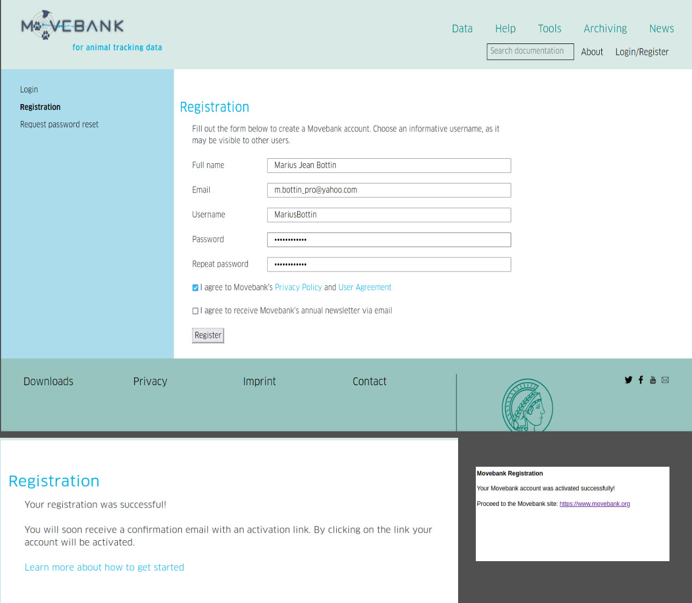
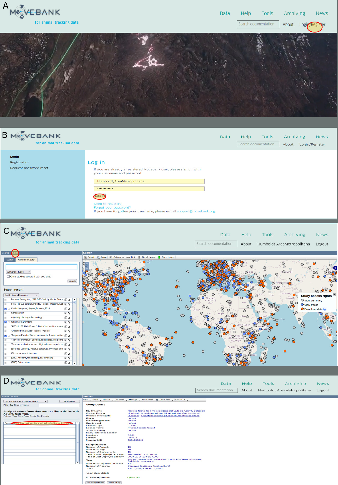
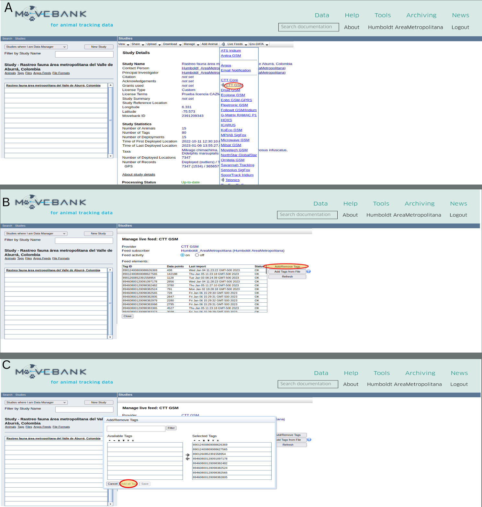

```{r setup, echo=F,message=F,warning=FALSE,results='hide'}
stopifnot(require(move) & require(kableExtra))
knitr::opts_chunk$set(cache=T,tidy.opts = list(width.cutoff = 70), tidy = TRUE, fig.path="Fig/manejoDatos_",echo=T)
def.chunk.hook  <- knitr::knit_hooks$get("chunk")
knitr::knit_hooks$set(chunk = function(x, options) {
  x <- def.chunk.hook(x, options)
  paste0("\n \\", "footnotesize","\n\n", x, "\n\n \\normalsize\n\n")
})
options(knitr.kable.NA = "---")
set.seed(9835)
```

*******************

En este documento, describiremos las etapas necesarias al manejo de datos del proyecto "\textsc{Amva}: Rastreo fauna área metropolitana del Valle de Aburrá, Colombia", gracias a la plataforma [movebank.org](https://www.movebank.org/cms/movebank-main) y al paquete R [move](https://cran.r-project.org/web/packages/move/index.html).

*******************

# Manejar los datos en la plataforma movebank.org
## Conceptos importantes en movebank

El manejo de los datos en movebank utiliza tres conceptos importantes:

* **Animal**: un animal es un individuo de una especie animal, con sus informaciones biológicas.
* **Etiqueta** ("tag"): una etiqueta es el identificador de un dispositivo (GPS), con las informaciones técnicas asociadas 
* **Despliegue** ("deployment"): el despliegue es la asociación entre el animal y la etiqueta, con fechas de inicio y final que permite asociar los movimientos asociados al dispositivo a los movimientos del animal.

## Etapas importantes del manejo de datos en movebank

Las etapas siguientes deben estar realizadas para poder manejar los datos en movebank.

1. inscribirse como usuario de movebank.org
1. crear un estudio
1. enviar los datos de los GPS a la plataforma
1. crear un "livefeed" para registrar los equipos GPS
1. crear los archivos de datos de referencia y importarlos en movebank (definir los animales, etiquetas y despliegues)
1. utilizar los filtros de movebank. **Por ahora no vamos a utilizar estos filtros en movebank, porque los filtros que definir dependen de lo que vamos a encontrar como errores en los datos**.


### Primeras etapas: usuario y estudio en el sistema de movebank

No fui yo quien realizó estas primeras etapas,  así que no estoy seguro de todos los detalles, pero la documentación del sitio web de movebank (<https://www.movebank.org/cms/movebank-search-request>) está muy precisa.
Pueden seguir las instrucciones de las paginas siguientes:

* <https://www.movebank.org/cms/movebank-content/manage-accounts>
* <https://www.movebank.org/cms/movebank-content/create-a-study>


{width=100%}


Desde ahora todas las operaciones en movebank se deben hacer con el usuario registrado (vamos a utilizar el usuario "Humboldt AreaMetropolitana") y dentro del estudio registrado ("Rastreo fauna área metropolitana del Valle de Aburrá, Colombia") 
Para conectarse con el usuario y entrar en el estudio seguir las instrucciones contenidas en la figura \ref{loginStudy}.

{width=100%}

\clearpage

### Enviar los datos de GPS a la plataforma

La conexión y el registro de los dispositivos GPS en la plataforma de movebank debe estar hecha por los proveedores de los equipos (en nuestro caso la empresa *Celular Tracking Technologies*, o *CTT*).
Para permitir el reenvio de todos los datos desde la plataforma de CTT hacía movebank, uno debe llenar el formulario siguiente: <https://celltracktech.com/pages/csd-movebank-data-forwarding-request>.


### Crear un "livefeed"

Cuando el proveedor de los equipos haga el proceso de reenvio de los datos, los podemos integrar a nuestro estudio, siguiendo las instrucciones de la figura \ref{liveFeed}.
Un "liveFeed" corresponde a que todos los datos se integran en el estudio a medida de que lleguen en la plataforma del proveedor.

{width=100%}


\clearpage

### Crear los archivos de datos de referencia


Los archivos de datos de referencia contienen todas las informaciones sobre los animales, etiquetas y despliegues del estudio (ver <https://www.movebank.org/cms/movebank-content/import-reference-data>).
La plataforma movebank permite también manejar cada animal, tag y despliegue de forma individual, pero utilizar un archivo facilita el proceso.

En nuestro caso, utilizaremos un archivo completo, siguiendo el modelo que se puede descargar en la plataforma (<https://www.movebank.org/cms/downloads/MovebankReferenceDataTemplate.xls>).
Adriana Restrepo montó un archivo que contiene todas las informaciones de los colares GPS y los animales en Google Drive: (<https://docs.google.com/spreadsheets/d/1gkZGYem9fU4dMlMGv5dfrBbdZL7PqX_-waOzOjtU468/edit?usp=sharing>).
Desde esta información (ver tabla \ref{refData}) se llena un archivo csv.

Para integrar esos datos en el "estudio" (*study*) movebank, utilizamos las etapas descritas en las figuras \ref{refDataMB_import} y \ref{refDataMB_format}, siguiendo las normas y informaciones contenidas en <https://www.movebank.org/cms/movebank-content/import-reference-data>.

```{r, echo=F}
A<-read.csv("../../../uwt_repo_data/refData.csv",colClasses = c("character"),header = F)
colGiven <- !apply(A,2,function(x)all(x[2:length(x)]==""))
B<-A [2:nrow(A), colGiven]
kable(B, booktabs=T, col.names = A [1, colGiven],row.names = F, caption = "\\label{refData}Información de referencia enviada a la plataforma movebank. Anotar que las columnas faltantes no se llenan en el archivo csv.",) %>%
  kable_styling(font_size = 6.5,latex_options = "striped")%>%
  landscape()
```

{width=100%}

{width=100%}


\clearpage

# Utilización del paquete move


## Importación de los datos

Por razones de seguridad, la contraseña está guardada en un archivo local *password.csv* que no se compartirá en el repositorio GitHub de presentación del proyecto.
El paquete *move* permite manejar todos los datos contenidos en la plataforma movebank desde R, gracias a los comandos presentados en este documento.


```{r}
require(move)
passWord <- read.csv("password.csv",h=F)[1,1]
lgin <- movebankLogin(username="Humboldt_AreaMetropolitana",password=passWord)
study_id<- getMovebankID("Rastreo fauna área metropolitana del Valle de Aburrá, Colombia",login=lgin)
refData <- getMovebankReferenceTable(study_id,lgin,allAttributes = T)
animals<-getMovebankAnimals(study_id,lgin)
mvData<-getMovebankData(study_id,animalName = animals$animalName ,login=lgin,includeOutliers=T)
mvData_clean <- getMovebankData(study_id,animalName = animals$animalName ,login=lgin,includeOutliers=F)
```

### Animales


Los animales con información descargable en movebank están descritos en la tabla \ref{tabAnimalMB}.

```{r}
tab <- animals[,!apply(animals,2,function(x)all(is.na(x)|x==""|x==x[1]))]
kable(tab, booktabs=T, col.names = gsub("_"," ",colnames(tab)), caption = "\\label{tabAnimalMB}Tabla de animales descargada desde movebank")%>%
  column_spec(1:ncol(tab),width = "1.3cm")%>%
  kable_styling(font_size=5,latex_options = "striped")%>%
  landscape()
```

<!--
### Datos de referencia

Los datos de referencia con información descargable en movebank están descritos en la tabla \ref{tabDatRefMB}.

```{r}
tab <- refData[,!apply(refData,2,function(x)all(is.na(x)|x==""|x==x[1]))]
kable(tab, booktabs=T, col.names = gsub("_"," ",colnames(tab)), caption = "\\label{tabDatRefMB}Tabla de datos de referencia descargada desde movebank",longtable=T)%>%
  column_spec(1:ncol(tab),width = "1.3cm")%>%
  kable_styling(font_size=5,latex_options = "striped")%>%
  landscape()
```

-->

### Outliers

```{r}
table(mvData@data$manually_marked_outlier)
table(mvData@data$algorithm_marked_outlier)
```

