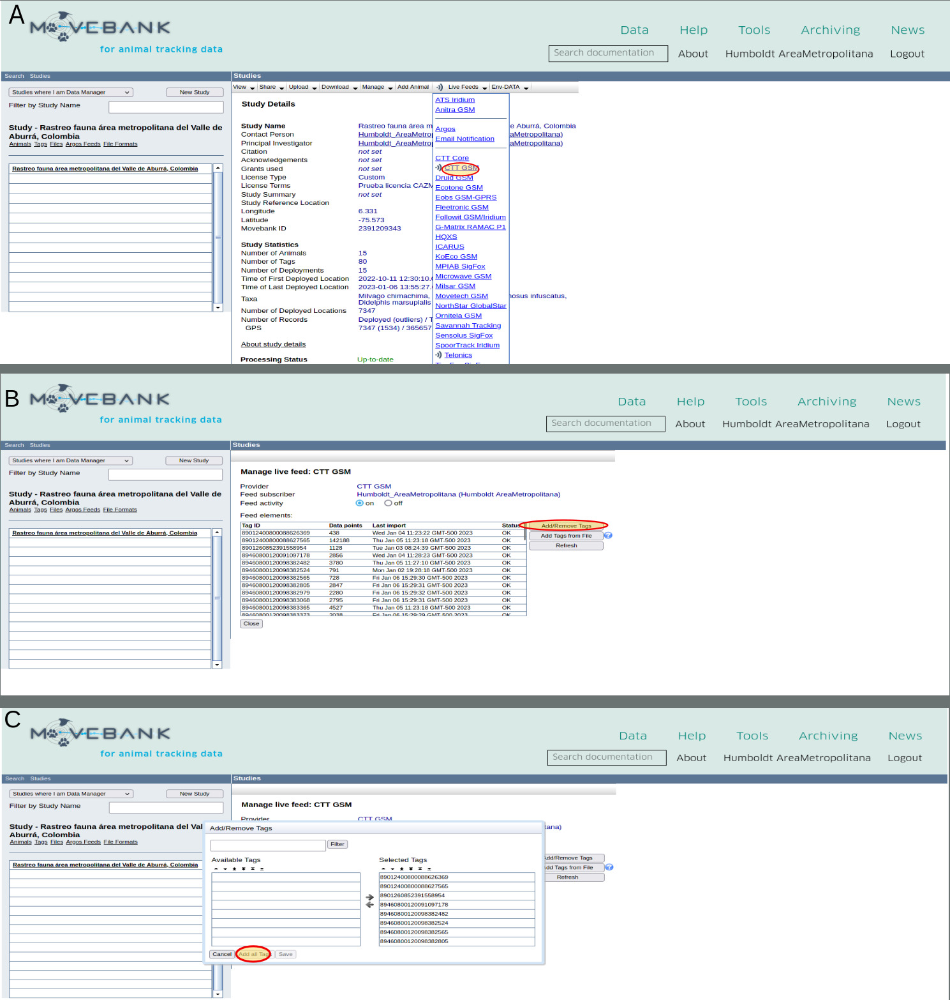

Manejo de los datos espaciales del seguimiento de movimiento de animales
================
Marius Bottin
2023-04-10

- [1 Manejar los datos en la plataforma
  movebank.org](#1-manejar-los-datos-en-la-plataforma-movebankorg)
  - [1.1 Conceptos importantes en
    movebank](#11-conceptos-importantes-en-movebank)
  - [1.2 Etapas importantes del manejo de datos en
    movebank](#12-etapas-importantes-del-manejo-de-datos-en-movebank)
    - [1.2.1 Primeras etapas: usuario y estudio en el sistema de
      movebank](#121-primeras-etapas-usuario-y-estudio-en-el-sistema-de-movebank)
    - [1.2.2 Enviar los datos de GPS a la
      plataforma](#122-enviar-los-datos-de-gps-a-la-plataforma)
    - [1.2.3 Crear un “livefeed”](#123-crear-un-livefeed)
    - [1.2.4 Crear los archivos de datos de
      referencia](#124-crear-los-archivos-de-datos-de-referencia)
- [2 Utilización del paquete move](#2-utilización-del-paquete-move)
  - [2.1 Importación de los datos](#21-importación-de-los-datos)
    - [2.1.1 Animales](#211-animales)

------------------------------------------------------------------------

En este documento, describiremos las etapas necesarias al manejo de
datos del proyecto “: Rastreo fauna área metropolitana del Valle de
Aburrá, Colombia”, gracias a la plataforma
[movebank.org](https://www.movebank.org/cms/movebank-main) y al paquete
R [move](https://cran.r-project.org/web/packages/move/index.html).

------------------------------------------------------------------------

# 1 Manejar los datos en la plataforma movebank.org

## 1.1 Conceptos importantes en movebank

El manejo de los datos en movebank utiliza tres conceptos importantes:

- **Animal**: un animal es un individuo de una especie animal, con sus
  informaciones biológicas.
- **Etiqueta** (“tag”): una etiqueta es el identificador de un
  dispositivo (GPS), con las informaciones técnicas asociadas
- **Despliegue** (“deployment”): el despliegue es la asociación entre el
  animal y la etiqueta, con fechas de inicio y final que permite asociar
  los movimientos asociados al dispositivo a los movimientos del animal.

## 1.2 Etapas importantes del manejo de datos en movebank

Las etapas siguientes deben estar realizadas para poder manejar los
datos en movebank.

1.  inscribirse como usuario de movebank.org
2.  crear un estudio
3.  enviar los datos de los GPS a la plataforma
4.  crear un “livefeed” para registrar los equipos GPS
5.  crear los archivos de datos de referencia y importarlos en movebank
    (definir los animales, etiquetas y despliegues)
6.  utilizar los filtros de movebank. **Por ahora no vamos a utilizar
    estos filtros en movebank, porque los filtros que definir dependen
    de lo que vamos a encontrar como errores en los datos**.

### 1.2.1 Primeras etapas: usuario y estudio en el sistema de movebank

No fui yo quien realizó estas primeras etapas, así que no estoy seguro
de todos los detalles, pero la documentación del sitio web de movebank
(<https://www.movebank.org/cms/movebank-search-request>) está muy
precisa. Pueden seguir las instrucciones de las paginas siguientes:

- <https://www.movebank.org/cms/movebank-content/manage-accounts>
- <https://www.movebank.org/cms/movebank-content/create-a-study>

<figure>

<figcaption aria-hidden="true">Creación de un usuario en movebank. La
creación del usuario se hace de manera clásica, con un formulario de
registro y una confirmación vía correo electronico.</figcaption>
</figure>

Desde ahora todas las operaciones en movebank se deben hacer con el
usuario registrado (vamos a utilizar el usuario “Humboldt
AreaMetropolitana”) y dentro del estudio registrado (“Rastreo fauna área
metropolitana del Valle de Aburrá, Colombia”) Para conectarse con el
usuario y entrar en el estudio seguir las instrucciones contenidas en la
figura .

<figure>

<figcaption aria-hidden="true">Etapas para iniciar sesión y entrar en el
estudio. Hacer click en los lugares amarillos rodeados de rojo. A:
pagina de inicio. B: iniciar sesión. C: Entrar en la pagina de estudios.
D: Seleción del estudio </figcaption>
</figure>

### 1.2.2 Enviar los datos de GPS a la plataforma

La conexión y el registro de los dispositivos GPS en la plataforma de
movebank debe estar hecha por los proveedores de los equipos (en nuestro
caso la empresa *Celular Tracking Technologies*, o *CTT*). Para permitir
el reenvio de todos los datos desde la plataforma de CTT hacía movebank,
uno debe llenar el formulario siguiente:
<https://celltracktech.com/pages/csd-movebank-data-forwarding-request>.

### 1.2.3 Crear un “livefeed”

Cuando el proveedor de los equipos haga el proceso de reenvio de los
datos, los podemos integrar a nuestro estudio, siguiendo las
instrucciones de la figura . Un “liveFeed” corresponde a que todos los
datos se integran en el estudio a medida de que lleguen en la plataforma
del proveedor.

<figure>

<figcaption aria-hidden="true">Crear un “liveFeed”. Hacer click en los
lugares amarillos rodeados de rojo. A: Seleccionar el tipo de GPS en la
lista que aparece en liveFeed. B: Hacer click sobre “Add/Remove Tags”.
C: Añadir todas las etiquetas disponibles </figcaption>
</figure>

### 1.2.4 Crear los archivos de datos de referencia

Los archivos de datos de referencia contienen todas las informaciones
sobre los animales, etiquetas y despliegues del estudio (ver
<https://www.movebank.org/cms/movebank-content/import-reference-data>).
La plataforma movebank permite también manejar cada animal, tag y
despliegue de forma individual, pero utilizar un archivo facilita el
proceso.

En nuestro caso, utilizaremos un archivo completo, siguiendo el modelo
que se puede descargar en la plataforma
(<https://www.movebank.org/cms/downloads/MovebankReferenceDataTemplate.xls>).
Adriana Restrepo montó un archivo que contiene todas las informaciones
de los colares GPS y los animales en Google Drive:
(<https://docs.google.com/spreadsheets/d/1gkZGYem9fU4dMlMGv5dfrBbdZL7PqX_-waOzOjtU468/edit?usp=sharing>).
Desde esta información (ver tabla ) se llena un archivo csv.

Para integrar esos datos en el “estudio” (*study*) movebank, utilizamos
las etapas descritas en las figuras y , siguiendo las normas y
informaciones contenidas en
<https://www.movebank.org/cms/movebank-content/import-reference-data>.

<table class="table" style="font-size: 6.5px; margin-left: auto; margin-right: auto;">
<caption style="font-size: initial !important;">

Información de referencia enviada a la plataforma movebank. Anotar que
las columnas faltantes no se llenan en el archivo csv.

</caption>
<thead>
<tr>
<th style="text-align:left;">

tag-id

</th>
<th style="text-align:left;">

animal-id

</th>
<th style="text-align:left;">

animal-taxon

</th>
<th style="text-align:left;">

deployment-id

</th>
<th style="text-align:left;">

deploy-on-date

</th>
<th style="text-align:left;">

animal-sex

</th>
<th style="text-align:left;">

animal-life-stage

</th>
<th style="text-align:left;">

animal-mass

</th>
<th style="text-align:left;">

attachment-type

</th>
<th style="text-align:left;">

manipulation-type

</th>
<th style="text-align:left;">

tag-serial-no

</th>
</tr>
</thead>
<tbody>
<tr>
<td style="text-align:left;">

89460800120108610807

</td>
<td style="text-align:left;">

Zorro02

</td>
<td style="text-align:left;">

Cerdocyon thous

</td>
<td style="text-align:left;">

zor2_deplNov

</td>
<td style="text-align:left;">

15/11/2022

</td>
<td style="text-align:left;">

f

</td>
<td style="text-align:left;">

adult

</td>
<td style="text-align:left;">

5900

</td>
<td style="text-align:left;">

collar

</td>
<td style="text-align:left;">

none

</td>
<td style="text-align:left;">

10807

</td>
</tr>
<tr>
<td style="text-align:left;">

89460800120108611474

</td>
<td style="text-align:left;">

Zorro03

</td>
<td style="text-align:left;">

Cerdocyon thous

</td>
<td style="text-align:left;">

zor3_deplOct

</td>
<td style="text-align:left;">

31/10/2022

</td>
<td style="text-align:left;">

m

</td>
<td style="text-align:left;">

juvenil

</td>
<td style="text-align:left;">

5000

</td>
<td style="text-align:left;">

collar

</td>
<td style="text-align:left;">

none

</td>
<td style="text-align:left;">

11474

</td>
</tr>
<tr>
<td style="text-align:left;">

89460800120108610815

</td>
<td style="text-align:left;">

Zorro04

</td>
<td style="text-align:left;">

Cerdocyon thous

</td>
<td style="text-align:left;">

zor4_deplNov

</td>
<td style="text-align:left;">

9/11/2022

</td>
<td style="text-align:left;">

m

</td>
<td style="text-align:left;">

juvenil

</td>
<td style="text-align:left;">

4900

</td>
<td style="text-align:left;">

collar

</td>
<td style="text-align:left;">

none

</td>
<td style="text-align:left;">

10815

</td>
</tr>
<tr>
<td style="text-align:left;">

89460800120108610138

</td>
<td style="text-align:left;">

Zorro05

</td>
<td style="text-align:left;">

Cerdocyon thous

</td>
<td style="text-align:left;">

zor5_deplOct

</td>
<td style="text-align:left;">

18/10/2022

</td>
<td style="text-align:left;">

m

</td>
<td style="text-align:left;">

adult

</td>
<td style="text-align:left;">

7000

</td>
<td style="text-align:left;">

collar

</td>
<td style="text-align:left;">

none

</td>
<td style="text-align:left;">

10138

</td>
</tr>
<tr>
<td style="text-align:left;">

89460800120108610609

</td>
<td style="text-align:left;">

Zorro06

</td>
<td style="text-align:left;">

Cerdocyon thous

</td>
<td style="text-align:left;">

zor6_deplOct

</td>
<td style="text-align:left;">

13/10/2022

</td>
<td style="text-align:left;">

m

</td>
<td style="text-align:left;">

juvenil

</td>
<td style="text-align:left;">

5420

</td>
<td style="text-align:left;">

collar

</td>
<td style="text-align:left;">

none

</td>
<td style="text-align:left;">

10609

</td>
</tr>
<tr>
<td style="text-align:left;">

89460800120108611037

</td>
<td style="text-align:left;">

Zorro07

</td>
<td style="text-align:left;">

Cerdocyon thous

</td>
<td style="text-align:left;">

zor7_deplOct

</td>
<td style="text-align:left;">

11/10/2022

</td>
<td style="text-align:left;">

f

</td>
<td style="text-align:left;">

adult

</td>
<td style="text-align:left;">

5035

</td>
<td style="text-align:left;">

collar

</td>
<td style="text-align:left;">

none

</td>
<td style="text-align:left;">

11037

</td>
</tr>
<tr>
<td style="text-align:left;">

89460800120108610104

</td>
<td style="text-align:left;">

Guacharaca01

</td>
<td style="text-align:left;">

Ortalis columbiana

</td>
<td style="text-align:left;">

gua1_deplNov

</td>
<td style="text-align:left;">

21/11/2022

</td>
<td style="text-align:left;">

u

</td>
<td style="text-align:left;">
</td>
<td style="text-align:left;">

520

</td>
<td style="text-align:left;">

backpack-harness

</td>
<td style="text-align:left;">

none

</td>
<td style="text-align:left;">

10104

</td>
</tr>
<tr>
<td style="text-align:left;">

89460800120108611300

</td>
<td style="text-align:left;">

Guacharaca03

</td>
<td style="text-align:left;">

Ortalis columbiana

</td>
<td style="text-align:left;">

gua3_deplNov

</td>
<td style="text-align:left;">

1/11/2022

</td>
<td style="text-align:left;">

u

</td>
<td style="text-align:left;">

adult

</td>
<td style="text-align:left;">

740

</td>
<td style="text-align:left;">

backpack-harness

</td>
<td style="text-align:left;">

none

</td>
<td style="text-align:left;">

11300

</td>
</tr>
<tr>
<td style="text-align:left;">

89460800120141491124

</td>
<td style="text-align:left;">

Phimosus01

</td>
<td style="text-align:left;">

Phimosus infuscatus

</td>
<td style="text-align:left;">

phi1_deplDec

</td>
<td style="text-align:left;">

9/12/2022

</td>
<td style="text-align:left;">

u

</td>
<td style="text-align:left;">

adult

</td>
<td style="text-align:left;">

415

</td>
<td style="text-align:left;">

backpack-harness

</td>
<td style="text-align:left;">

none

</td>
<td style="text-align:left;">

91124

</td>
</tr>
<tr>
<td style="text-align:left;">

89460800120141491314

</td>
<td style="text-align:left;">

Phimosus02

</td>
<td style="text-align:left;">

Phimosus infuscatus

</td>
<td style="text-align:left;">

phi2_deplDec

</td>
<td style="text-align:left;">

13/12/2022

</td>
<td style="text-align:left;">

u

</td>
<td style="text-align:left;">

adult

</td>
<td style="text-align:left;">

475

</td>
<td style="text-align:left;">

backpack-harness

</td>
<td style="text-align:left;">

none

</td>
<td style="text-align:left;">

91314

</td>
</tr>
<tr>
<td style="text-align:left;">

89460800120106243304

</td>
<td style="text-align:left;">

Pigua1

</td>
<td style="text-align:left;">

Milvago chimachima

</td>
<td style="text-align:left;">

pig1_deplNov

</td>
<td style="text-align:left;">

25/11/2022

</td>
<td style="text-align:left;">

u

</td>
<td style="text-align:left;">
</td>
<td style="text-align:left;">

325

</td>
<td style="text-align:left;">

backpack-harness

</td>
<td style="text-align:left;">

none

</td>
<td style="text-align:left;">

43304

</td>
</tr>
<tr>
<td style="text-align:left;">

89460800120106242298

</td>
<td style="text-align:left;">

Zarigueya1

</td>
<td style="text-align:left;">

Didelphis marsupialis

</td>
<td style="text-align:left;">

zar1_deplDec

</td>
<td style="text-align:left;">

6/12/2022

</td>
<td style="text-align:left;">

f

</td>
<td style="text-align:left;">

juvenil

</td>
<td style="text-align:left;">

1545

</td>
<td style="text-align:left;">

backpack-harness

</td>
<td style="text-align:left;">

none

</td>
<td style="text-align:left;">

42298

</td>
</tr>
<tr>
<td style="text-align:left;">

89460800120098383662

</td>
<td style="text-align:left;">

Zarigueya2

</td>
<td style="text-align:left;">

Didelphis marsupialis

</td>
<td style="text-align:left;">

zar2_deplDec

</td>
<td style="text-align:left;">

12/12/2022

</td>
<td style="text-align:left;">

u

</td>
<td style="text-align:left;">
</td>
<td style="text-align:left;">

1600

</td>
<td style="text-align:left;">

backpack-harness

</td>
<td style="text-align:left;">

none

</td>
<td style="text-align:left;">

83662

</td>
</tr>
<tr>
<td style="text-align:left;">

89460800120106242702

</td>
<td style="text-align:left;">

Zarigueya3

</td>
<td style="text-align:left;">

Didelphis marsupialis

</td>
<td style="text-align:left;">

zar3_deplDec

</td>
<td style="text-align:left;">

12/12/2022

</td>
<td style="text-align:left;">

u

</td>
<td style="text-align:left;">
</td>
<td style="text-align:left;">

1515

</td>
<td style="text-align:left;">

backpack-harness

</td>
<td style="text-align:left;">

none

</td>
<td style="text-align:left;">

42702

</td>
</tr>
<tr>
<td style="text-align:left;">

89460800120108610666

</td>
<td style="text-align:left;">

Zarigueya4

</td>
<td style="text-align:left;">

Didelphis marsupialis

</td>
<td style="text-align:left;">

zar4_deplDec

</td>
<td style="text-align:left;">

14/12/2022

</td>
<td style="text-align:left;">

u

</td>
<td style="text-align:left;">
</td>
<td style="text-align:left;">
</td>
<td style="text-align:left;">

backpack-harness

</td>
<td style="text-align:left;">

none

</td>
<td style="text-align:left;">

10666

</td>
</tr>
</tbody>
</table>

<figure>

<figcaption aria-hidden="true">Importar un archivo de referencia. A:
Hacer click sobre “Import Data”. B: Elegir la importación de datos de
referencia. C: Indicar que utilizamos el formato estándar. D: Cargar el
archivo local con las informaciones de animales, etiquetas y despliegues
</figcaption>
</figure>

<figure>

<figcaption aria-hidden="true">Ajustar el formato de los datos de
referencia. Anotar que las etapas descritas acá siguen las etapas de la
figura . E: Reemplazar los datos de referencia preexistentes (nota: solo
en caso de estudios que ya tienen archivos y datos de referencia). F:
Revisar los formatos de datos de referencia y adaptarlos según las
informaciones en <a
href="https://www.movebank.org/cms/movebank-content/import-reference-data"
class="uri">https://www.movebank.org/cms/movebank-content/import-reference-data</a>.
G: Aplicar los formatos de datos de referencia. </figcaption>
</figure>

# 2 Utilización del paquete move

## 2.1 Importación de los datos

Por razones de seguridad, la contraseña está guardada en un archivo
local *password.csv* que no se compartirá en el repositorio GitHub de
presentación del proyecto. El paquete *move* permite manejar todos los
datos contenidos en la plataforma movebank desde R, gracias a los
comandos presentados en este documento.

``` r
require(move)
passWord <- read.csv("password.csv", h = F)[1, 1]
lgin <- movebankLogin(username = "Humboldt_AreaMetropolitana", password = passWord)
study_id <- getMovebankID("Rastreo fauna área metropolitana del Valle de Aburrá, Colombia",
    login = lgin)
refData <- getMovebankReferenceTable(study_id, lgin, allAttributes = T)
animals <- getMovebankAnimals(study_id, lgin)
mvData <- getMovebankData(study_id, animalName = animals$animalName, login = lgin,
    includeOutliers = T)
mvData_clean <- getMovebankData(study_id, animalName = animals$animalName,
    login = lgin, includeOutliers = F)
```

    ## Warning in .local(study, animalName, login, ...): Omiting individual(s) (n=1)
    ## that have only unUsedRecords

### 2.1.1 Animales

Los animales con información descargable en movebank están descritos en
la tabla .

``` r
tab <- animals[, !apply(animals, 2, function(x) all(is.na(x) | x == "" |
    x == x[1]))]
kable(tab, booktabs = T, col.names = gsub("_", " ", colnames(tab)), caption = "\\label{tabAnimalMB}Tabla de animales descargada desde movebank") %>%
    column_spec(1:ncol(tab), width = "1.3cm") %>%
    kable_styling(font_size = 5, latex_options = "striped") %>%
    landscape()
```

<table class="table" style="font-size: 5px; margin-left: auto; margin-right: auto;">
<caption style="font-size: initial !important;">

Tabla de animales descargada desde movebank

</caption>
<thead>
<tr>
<th style="text-align:right;">

individual id

</th>
<th style="text-align:right;">

tag id

</th>
<th style="text-align:right;">

tag local identifier

</th>
<th style="text-align:right;">

deployment id

</th>
<th style="text-align:left;">

comments

</th>
<th style="text-align:left;">

local identifier

</th>
<th style="text-align:left;">

nick name

</th>
<th style="text-align:left;">

sex

</th>
<th style="text-align:left;">

taxon canonical name

</th>
<th style="text-align:left;">

timestamp start

</th>
<th style="text-align:left;">

timestamp end

</th>
<th style="text-align:right;">

number of events

</th>
<th style="text-align:left;">

animalName

</th>
</tr>
</thead>
<tbody>
<tr>
<td style="text-align:right;width: 1.3cm; ">

2514687213

</td>
<td style="text-align:right;width: 1.3cm; ">

2508165652

</td>
<td style="text-align:right;width: 1.3cm; ">

8.946080e+19

</td>
<td style="text-align:right;width: 1.3cm; ">

2514698630

</td>
<td style="text-align:left;width: 1.3cm; ">
</td>
<td style="text-align:left;width: 1.3cm; ">

Zorro02

</td>
<td style="text-align:left;width: 1.3cm; ">
</td>
<td style="text-align:left;width: 1.3cm; ">

f

</td>
<td style="text-align:left;width: 1.3cm; ">

Cerdocyon thous

</td>
<td style="text-align:left;width: 1.3cm; ">

2022-11-16 07:03:51.000

</td>
<td style="text-align:left;width: 1.3cm; ">

2022-12-01 10:38:25.000

</td>
<td style="text-align:right;width: 1.3cm; ">

131

</td>
<td style="text-align:left;width: 1.3cm; ">

Zorro02

</td>
</tr>
<tr>
<td style="text-align:right;width: 1.3cm; ">

2514687214

</td>
<td style="text-align:right;width: 1.3cm; ">

2508168151

</td>
<td style="text-align:right;width: 1.3cm; ">

8.946080e+19

</td>
<td style="text-align:right;width: 1.3cm; ">

2514698633

</td>
<td style="text-align:left;width: 1.3cm; ">
</td>
<td style="text-align:left;width: 1.3cm; ">

Zorro03

</td>
<td style="text-align:left;width: 1.3cm; ">
</td>
<td style="text-align:left;width: 1.3cm; ">

m

</td>
<td style="text-align:left;width: 1.3cm; ">

Cerdocyon thous

</td>
<td style="text-align:left;width: 1.3cm; ">

2022-11-01 07:05:28.000

</td>
<td style="text-align:left;width: 1.3cm; ">

2023-02-19 10:59:01.000

</td>
<td style="text-align:right;width: 1.3cm; ">

486

</td>
<td style="text-align:left;width: 1.3cm; ">

Zorro03

</td>
</tr>
<tr>
<td style="text-align:right;width: 1.3cm; ">

2514687215

</td>
<td style="text-align:right;width: 1.3cm; ">

2508179619

</td>
<td style="text-align:right;width: 1.3cm; ">

8.946080e+19

</td>
<td style="text-align:right;width: 1.3cm; ">

2514698631

</td>
<td style="text-align:left;width: 1.3cm; ">
</td>
<td style="text-align:left;width: 1.3cm; ">

Zorro04

</td>
<td style="text-align:left;width: 1.3cm; ">
</td>
<td style="text-align:left;width: 1.3cm; ">

m

</td>
<td style="text-align:left;width: 1.3cm; ">

Cerdocyon thous

</td>
<td style="text-align:left;width: 1.3cm; ">

2022-11-10 03:04:21.000

</td>
<td style="text-align:left;width: 1.3cm; ">

2023-03-17 11:12:31.000

</td>
<td style="text-align:right;width: 1.3cm; ">

285

</td>
<td style="text-align:left;width: 1.3cm; ">

Zorro04

</td>
</tr>
<tr>
<td style="text-align:right;width: 1.3cm; ">

2514687216

</td>
<td style="text-align:right;width: 1.3cm; ">

2508180665

</td>
<td style="text-align:right;width: 1.3cm; ">

8.946080e+19

</td>
<td style="text-align:right;width: 1.3cm; ">

2514698634

</td>
<td style="text-align:left;width: 1.3cm; ">
</td>
<td style="text-align:left;width: 1.3cm; ">

Zorro05

</td>
<td style="text-align:left;width: 1.3cm; ">
</td>
<td style="text-align:left;width: 1.3cm; ">

m

</td>
<td style="text-align:left;width: 1.3cm; ">

Cerdocyon thous

</td>
<td style="text-align:left;width: 1.3cm; ">

2022-10-19 07:09:13.000

</td>
<td style="text-align:left;width: 1.3cm; ">

2023-03-29 23:09:28.000

</td>
<td style="text-align:right;width: 1.3cm; ">

429

</td>
<td style="text-align:left;width: 1.3cm; ">

Zorro05

</td>
</tr>
<tr>
<td style="text-align:right;width: 1.3cm; ">

2514687217

</td>
<td style="text-align:right;width: 1.3cm; ">

2508168715

</td>
<td style="text-align:right;width: 1.3cm; ">

8.946080e+19

</td>
<td style="text-align:right;width: 1.3cm; ">

2514698626

</td>
<td style="text-align:left;width: 1.3cm; ">
</td>
<td style="text-align:left;width: 1.3cm; ">

Zorro06

</td>
<td style="text-align:left;width: 1.3cm; ">
</td>
<td style="text-align:left;width: 1.3cm; ">

m

</td>
<td style="text-align:left;width: 1.3cm; ">

Cerdocyon thous

</td>
<td style="text-align:left;width: 1.3cm; ">

2022-10-14 09:10:45.000

</td>
<td style="text-align:left;width: 1.3cm; ">

2023-04-01 07:09:00.000

</td>
<td style="text-align:right;width: 1.3cm; ">

874

</td>
<td style="text-align:left;width: 1.3cm; ">

Zorro06

</td>
</tr>
<tr>
<td style="text-align:right;width: 1.3cm; ">

2514687218

</td>
<td style="text-align:right;width: 1.3cm; ">

2508178293

</td>
<td style="text-align:right;width: 1.3cm; ">

8.946080e+19

</td>
<td style="text-align:right;width: 1.3cm; ">

2514698627

</td>
<td style="text-align:left;width: 1.3cm; ">
</td>
<td style="text-align:left;width: 1.3cm; ">

Zorro07

</td>
<td style="text-align:left;width: 1.3cm; ">
</td>
<td style="text-align:left;width: 1.3cm; ">

f

</td>
<td style="text-align:left;width: 1.3cm; ">

Cerdocyon thous

</td>
<td style="text-align:left;width: 1.3cm; ">

2022-10-12 05:10:08.000

</td>
<td style="text-align:left;width: 1.3cm; ">

2023-02-06 10:59:49.000

</td>
<td style="text-align:right;width: 1.3cm; ">

481

</td>
<td style="text-align:left;width: 1.3cm; ">

Zorro07

</td>
</tr>
<tr>
<td style="text-align:right;width: 1.3cm; ">

2515803589

</td>
<td style="text-align:right;width: 1.3cm; ">

2508169051

</td>
<td style="text-align:right;width: 1.3cm; ">

8.946080e+19

</td>
<td style="text-align:right;width: 1.3cm; ">

2515803637

</td>
<td style="text-align:left;width: 1.3cm; ">
</td>
<td style="text-align:left;width: 1.3cm; ">

Guacharaca01

</td>
<td style="text-align:left;width: 1.3cm; ">
</td>
<td style="text-align:left;width: 1.3cm; ">
</td>
<td style="text-align:left;width: 1.3cm; ">
</td>
<td style="text-align:left;width: 1.3cm; ">

2022-11-21 13:34:57.000

</td>
<td style="text-align:left;width: 1.3cm; ">

2023-04-01 11:04:44.000

</td>
<td style="text-align:right;width: 1.3cm; ">

3258

</td>
<td style="text-align:left;width: 1.3cm; ">

Guacharaca01

</td>
</tr>
<tr>
<td style="text-align:right;width: 1.3cm; ">

2515803590

</td>
<td style="text-align:right;width: 1.3cm; ">

2508160748

</td>
<td style="text-align:right;width: 1.3cm; ">

8.946080e+19

</td>
<td style="text-align:right;width: 1.3cm; ">

2515803640

</td>
<td style="text-align:left;width: 1.3cm; ">
</td>
<td style="text-align:left;width: 1.3cm; ">

Guacharaca03

</td>
<td style="text-align:left;width: 1.3cm; ">
</td>
<td style="text-align:left;width: 1.3cm; ">
</td>
<td style="text-align:left;width: 1.3cm; ">
</td>
<td style="text-align:left;width: 1.3cm; ">

2022-11-01 22:31:44.000

</td>
<td style="text-align:left;width: 1.3cm; ">

2023-03-17 13:49:01.000

</td>
<td style="text-align:right;width: 1.3cm; ">

3362

</td>
<td style="text-align:left;width: 1.3cm; ">

Guacharaca03

</td>
</tr>
<tr>
<td style="text-align:right;width: 1.3cm; ">

2515803591

</td>
<td style="text-align:right;width: 1.3cm; ">

2508182585

</td>
<td style="text-align:right;width: 1.3cm; ">

8.946080e+19

</td>
<td style="text-align:right;width: 1.3cm; ">

2515803625

</td>
<td style="text-align:left;width: 1.3cm; ">
</td>
<td style="text-align:left;width: 1.3cm; ">

Phimosus01

</td>
<td style="text-align:left;width: 1.3cm; ">
</td>
<td style="text-align:left;width: 1.3cm; ">
</td>
<td style="text-align:left;width: 1.3cm; ">

Phimosus infuscatus

</td>
<td style="text-align:left;width: 1.3cm; ">

2022-12-09 18:44:24.000

</td>
<td style="text-align:left;width: 1.3cm; ">

2023-03-01 11:02:39.000

</td>
<td style="text-align:right;width: 1.3cm; ">

2774

</td>
<td style="text-align:left;width: 1.3cm; ">

Phimosus01

</td>
</tr>
<tr>
<td style="text-align:right;width: 1.3cm; ">

2515803592

</td>
<td style="text-align:right;width: 1.3cm; ">

2508176396

</td>
<td style="text-align:right;width: 1.3cm; ">

8.946080e+19

</td>
<td style="text-align:right;width: 1.3cm; ">

2515803643

</td>
<td style="text-align:left;width: 1.3cm; ">
</td>
<td style="text-align:left;width: 1.3cm; ">

Phimosus02

</td>
<td style="text-align:left;width: 1.3cm; ">
</td>
<td style="text-align:left;width: 1.3cm; ">
</td>
<td style="text-align:left;width: 1.3cm; ">

Phimosus infuscatus

</td>
<td style="text-align:left;width: 1.3cm; ">

2022-12-13 14:18:31.000

</td>
<td style="text-align:left;width: 1.3cm; ">

2023-04-02 02:01:30.000

</td>
<td style="text-align:right;width: 1.3cm; ">

3763

</td>
<td style="text-align:left;width: 1.3cm; ">

Phimosus02

</td>
</tr>
<tr>
<td style="text-align:right;width: 1.3cm; ">

2515803593

</td>
<td style="text-align:right;width: 1.3cm; ">

2508162727

</td>
<td style="text-align:right;width: 1.3cm; ">

8.946080e+19

</td>
<td style="text-align:right;width: 1.3cm; ">

2524328143

</td>
<td style="text-align:left;width: 1.3cm; ">
</td>
<td style="text-align:left;width: 1.3cm; ">

Pigua1

</td>
<td style="text-align:left;width: 1.3cm; ">
</td>
<td style="text-align:left;width: 1.3cm; ">
</td>
<td style="text-align:left;width: 1.3cm; ">

Milvago chimachima

</td>
<td style="text-align:left;width: 1.3cm; ">

2022-11-25 21:10:01.000

</td>
<td style="text-align:left;width: 1.3cm; ">

2022-12-19 13:47:20.000

</td>
<td style="text-align:right;width: 1.3cm; ">

593

</td>
<td style="text-align:left;width: 1.3cm; ">

Pigua1

</td>
</tr>
<tr>
<td style="text-align:right;width: 1.3cm; ">

2515803594

</td>
<td style="text-align:right;width: 1.3cm; ">

2508171382

</td>
<td style="text-align:right;width: 1.3cm; ">

8.946080e+19

</td>
<td style="text-align:right;width: 1.3cm; ">

2515803633

</td>
<td style="text-align:left;width: 1.3cm; ">
</td>
<td style="text-align:left;width: 1.3cm; ">

Zarigueya1

</td>
<td style="text-align:left;width: 1.3cm; ">
</td>
<td style="text-align:left;width: 1.3cm; ">

f

</td>
<td style="text-align:left;width: 1.3cm; ">

Didelphis marsupialis

</td>
<td style="text-align:left;width: 1.3cm; ">

2022-12-05 23:07:03.000

</td>
<td style="text-align:left;width: 1.3cm; ">

2023-02-03 04:01:11.000

</td>
<td style="text-align:right;width: 1.3cm; ">

83

</td>
<td style="text-align:left;width: 1.3cm; ">

Zarigueya1

</td>
</tr>
<tr>
<td style="text-align:right;width: 1.3cm; ">

2515803595

</td>
<td style="text-align:right;width: 1.3cm; ">

2508177994

</td>
<td style="text-align:right;width: 1.3cm; ">

8.946080e+19

</td>
<td style="text-align:right;width: 1.3cm; ">

2515803627

</td>
<td style="text-align:left;width: 1.3cm; ">
</td>
<td style="text-align:left;width: 1.3cm; ">

Zarigueya2

</td>
<td style="text-align:left;width: 1.3cm; ">
</td>
<td style="text-align:left;width: 1.3cm; ">
</td>
<td style="text-align:left;width: 1.3cm; ">

Didelphis marsupialis

</td>
<td style="text-align:left;width: 1.3cm; ">

2022-12-12 23:10:36.000

</td>
<td style="text-align:left;width: 1.3cm; ">

2023-04-01 09:36:50.000

</td>
<td style="text-align:right;width: 1.3cm; ">

398

</td>
<td style="text-align:left;width: 1.3cm; ">

Zarigueya2

</td>
</tr>
<tr>
<td style="text-align:right;width: 1.3cm; ">

2515803596

</td>
<td style="text-align:right;width: 1.3cm; ">

2508175848

</td>
<td style="text-align:right;width: 1.3cm; ">

8.946080e+19

</td>
<td style="text-align:right;width: 1.3cm; ">

2515803628

</td>
<td style="text-align:left;width: 1.3cm; ">
</td>
<td style="text-align:left;width: 1.3cm; ">

Zarigueya3

</td>
<td style="text-align:left;width: 1.3cm; ">
</td>
<td style="text-align:left;width: 1.3cm; ">
</td>
<td style="text-align:left;width: 1.3cm; ">

Didelphis marsupialis

</td>
<td style="text-align:left;width: 1.3cm; ">

2022-12-13 10:44:21.000

</td>
<td style="text-align:left;width: 1.3cm; ">

2023-04-01 09:35:45.000

</td>
<td style="text-align:right;width: 1.3cm; ">

281

</td>
<td style="text-align:left;width: 1.3cm; ">

Zarigueya3

</td>
</tr>
<tr>
<td style="text-align:right;width: 1.3cm; ">

2515803597

</td>
<td style="text-align:right;width: 1.3cm; ">

2508161074

</td>
<td style="text-align:right;width: 1.3cm; ">

8.946080e+19

</td>
<td style="text-align:right;width: 1.3cm; ">

2515803623

</td>
<td style="text-align:left;width: 1.3cm; ">
</td>
<td style="text-align:left;width: 1.3cm; ">

Zarigueya4

</td>
<td style="text-align:left;width: 1.3cm; ">
</td>
<td style="text-align:left;width: 1.3cm; ">
</td>
<td style="text-align:left;width: 1.3cm; ">

Didelphis marsupialis

</td>
<td style="text-align:left;width: 1.3cm; ">

2022-12-15 14:46:20.000

</td>
<td style="text-align:left;width: 1.3cm; ">

2023-04-01 09:36:03.000

</td>
<td style="text-align:right;width: 1.3cm; ">

303

</td>
<td style="text-align:left;width: 1.3cm; ">

Zarigueya4

</td>
</tr>
<tr>
<td style="text-align:right;width: 1.3cm; ">

2564655353

</td>
<td style="text-align:right;width: 1.3cm; ">

2508159070

</td>
<td style="text-align:right;width: 1.3cm; ">

8.946080e+19

</td>
<td style="text-align:right;width: 1.3cm; ">

2564657338

</td>
<td style="text-align:left;width: 1.3cm; ">
</td>
<td style="text-align:left;width: 1.3cm; ">

Phimosus04

</td>
<td style="text-align:left;width: 1.3cm; ">

Phimosus04

</td>
<td style="text-align:left;width: 1.3cm; ">

u

</td>
<td style="text-align:left;width: 1.3cm; ">

Phimosus infuscatus

</td>
<td style="text-align:left;width: 1.3cm; ">

2022-12-19 13:17:39.000

</td>
<td style="text-align:left;width: 1.3cm; ">

2023-04-01 11:04:19.000

</td>
<td style="text-align:right;width: 1.3cm; ">

3307

</td>
<td style="text-align:left;width: 1.3cm; ">

Phimosus04

</td>
</tr>
<tr>
<td style="text-align:right;width: 1.3cm; ">

2564665388

</td>
<td style="text-align:right;width: 1.3cm; ">

2508179050

</td>
<td style="text-align:right;width: 1.3cm; ">

8.946080e+19

</td>
<td style="text-align:right;width: 1.3cm; ">

2564666813

</td>
<td style="text-align:left;width: 1.3cm; ">
</td>
<td style="text-align:left;width: 1.3cm; ">

Pigua2

</td>
<td style="text-align:left;width: 1.3cm; ">
</td>
<td style="text-align:left;width: 1.3cm; ">

u

</td>
<td style="text-align:left;width: 1.3cm; ">

Milvago chimachima

</td>
<td style="text-align:left;width: 1.3cm; ">

2022-12-16 13:45:11.000

</td>
<td style="text-align:left;width: 1.3cm; ">

2023-04-01 11:04:34.000

</td>
<td style="text-align:right;width: 1.3cm; ">

2179

</td>
<td style="text-align:left;width: 1.3cm; ">

Pigua2

</td>
</tr>
<tr>
<td style="text-align:right;width: 1.3cm; ">

2564675537

</td>
<td style="text-align:right;width: 1.3cm; ">

2508172945

</td>
<td style="text-align:right;width: 1.3cm; ">

8.946080e+19

</td>
<td style="text-align:right;width: 1.3cm; ">

2564677632

</td>
<td style="text-align:left;width: 1.3cm; ">
</td>
<td style="text-align:left;width: 1.3cm; ">

Garza1

</td>
<td style="text-align:left;width: 1.3cm; ">
</td>
<td style="text-align:left;width: 1.3cm; ">

u

</td>
<td style="text-align:left;width: 1.3cm; ">

Bubulcus ibis

</td>
<td style="text-align:left;width: 1.3cm; ">

2022-12-19 23:12:30.000

</td>
<td style="text-align:left;width: 1.3cm; ">

2023-04-01 11:04:31.000

</td>
<td style="text-align:right;width: 1.3cm; ">

6581

</td>
<td style="text-align:left;width: 1.3cm; ">

Garza1

</td>
</tr>
<tr>
<td style="text-align:right;width: 1.3cm; ">

2564679663

</td>
<td style="text-align:right;width: 1.3cm; ">

2508173934

</td>
<td style="text-align:right;width: 1.3cm; ">

8.946080e+19

</td>
<td style="text-align:right;width: 1.3cm; ">

2564680811

</td>
<td style="text-align:left;width: 1.3cm; ">
</td>
<td style="text-align:left;width: 1.3cm; ">

GarzaAve4

</td>
<td style="text-align:left;width: 1.3cm; ">
</td>
<td style="text-align:left;width: 1.3cm; ">

u

</td>
<td style="text-align:left;width: 1.3cm; ">

Bubulcus ibis

</td>
<td style="text-align:left;width: 1.3cm; ">

2022-12-19 23:13:08.000

</td>
<td style="text-align:left;width: 1.3cm; ">

2023-04-01 11:04:27.000

</td>
<td style="text-align:right;width: 1.3cm; ">

2483

</td>
<td style="text-align:left;width: 1.3cm; ">

GarzaAve4

</td>
</tr>
<tr>
<td style="text-align:right;width: 1.3cm; ">

2568713000

</td>
<td style="text-align:right;width: 1.3cm; ">

2508169858

</td>
<td style="text-align:right;width: 1.3cm; ">

8.946080e+19

</td>
<td style="text-align:right;width: 1.3cm; ">

2568714233

</td>
<td style="text-align:left;width: 1.3cm; ">

Tenia crias

</td>
<td style="text-align:left;width: 1.3cm; ">

Zarigueya5

</td>
<td style="text-align:left;width: 1.3cm; ">

Zarigueya5

</td>
<td style="text-align:left;width: 1.3cm; ">

f

</td>
<td style="text-align:left;width: 1.3cm; ">

Didelphis marsupialis

</td>
<td style="text-align:left;width: 1.3cm; ">

2022-12-24 22:50:19.000

</td>
<td style="text-align:left;width: 1.3cm; ">

2023-04-01 07:35:58.000

</td>
<td style="text-align:right;width: 1.3cm; ">

170

</td>
<td style="text-align:left;width: 1.3cm; ">

Zarigueya5

</td>
</tr>
<tr>
<td style="text-align:right;width: 1.3cm; ">

2644495803

</td>
<td style="text-align:right;width: 1.3cm; ">

2508162281

</td>
<td style="text-align:right;width: 1.3cm; ">

8.946080e+19

</td>
<td style="text-align:right;width: 1.3cm; ">

2644500609

</td>
<td style="text-align:left;width: 1.3cm; ">
</td>
<td style="text-align:left;width: 1.3cm; ">

Pigua5

</td>
<td style="text-align:left;width: 1.3cm; ">
</td>
<td style="text-align:left;width: 1.3cm; ">

u

</td>
<td style="text-align:left;width: 1.3cm; ">

Milvago chimachima

</td>
<td style="text-align:left;width: 1.3cm; ">

2023-02-17 18:13:11.000

</td>
<td style="text-align:left;width: 1.3cm; ">

2023-04-01 11:05:04.000

</td>
<td style="text-align:right;width: 1.3cm; ">

680

</td>
<td style="text-align:left;width: 1.3cm; ">

Pigua5

</td>
</tr>
<tr>
<td style="text-align:right;width: 1.3cm; ">

2644503097

</td>
<td style="text-align:right;width: 1.3cm; ">

2508176562

</td>
<td style="text-align:right;width: 1.3cm; ">

8.946080e+19

</td>
<td style="text-align:right;width: 1.3cm; ">

2644504988

</td>
<td style="text-align:left;width: 1.3cm; ">
</td>
<td style="text-align:left;width: 1.3cm; ">

Guacharaca06

</td>
<td style="text-align:left;width: 1.3cm; ">
</td>
<td style="text-align:left;width: 1.3cm; ">

u

</td>
<td style="text-align:left;width: 1.3cm; ">

Ortalis

</td>
<td style="text-align:left;width: 1.3cm; ">

2023-02-24 10:57:06.000

</td>
<td style="text-align:left;width: 1.3cm; ">

2023-04-01 11:04:46.000

</td>
<td style="text-align:right;width: 1.3cm; ">

401

</td>
<td style="text-align:left;width: 1.3cm; ">

Guacharaca06

</td>
</tr>
<tr>
<td style="text-align:right;width: 1.3cm; ">

2649498630

</td>
<td style="text-align:right;width: 1.3cm; ">

2508172595

</td>
<td style="text-align:right;width: 1.3cm; ">

8.946080e+19

</td>
<td style="text-align:right;width: 1.3cm; ">

2649500372

</td>
<td style="text-align:left;width: 1.3cm; ">
</td>
<td style="text-align:left;width: 1.3cm; ">

Ardilla1

</td>
<td style="text-align:left;width: 1.3cm; ">
</td>
<td style="text-align:left;width: 1.3cm; ">
</td>
<td style="text-align:left;width: 1.3cm; ">

Sciurus granatensis

</td>
<td style="text-align:left;width: 1.3cm; ">

2023-03-01 19:00:21.000

</td>
<td style="text-align:left;width: 1.3cm; ">

2023-03-31 19:32:03.000

</td>
<td style="text-align:right;width: 1.3cm; ">

104

</td>
<td style="text-align:left;width: 1.3cm; ">

Ardilla1

</td>
</tr>
<tr>
<td style="text-align:right;width: 1.3cm; ">

2649501951

</td>
<td style="text-align:right;width: 1.3cm; ">

2508183795

</td>
<td style="text-align:right;width: 1.3cm; ">

8.946080e+19

</td>
<td style="text-align:right;width: 1.3cm; ">

2649504036

</td>
<td style="text-align:left;width: 1.3cm; ">
</td>
<td style="text-align:left;width: 1.3cm; ">

GarzaAve2

</td>
<td style="text-align:left;width: 1.3cm; ">
</td>
<td style="text-align:left;width: 1.3cm; ">

u

</td>
<td style="text-align:left;width: 1.3cm; ">

Bubulcus ibis

</td>
<td style="text-align:left;width: 1.3cm; ">

2023-03-02 03:07:48.000

</td>
<td style="text-align:left;width: 1.3cm; ">

2023-04-01 11:04:25.000

</td>
<td style="text-align:right;width: 1.3cm; ">

1488

</td>
<td style="text-align:left;width: 1.3cm; ">

GarzaAve2

</td>
</tr>
<tr>
<td style="text-align:right;width: 1.3cm; ">

2649504634

</td>
<td style="text-align:right;width: 1.3cm; ">

2508181067

</td>
<td style="text-align:right;width: 1.3cm; ">

8.946080e+19

</td>
<td style="text-align:right;width: 1.3cm; ">

2649505496

</td>
<td style="text-align:left;width: 1.3cm; ">
</td>
<td style="text-align:left;width: 1.3cm; ">

GarzaAve3

</td>
<td style="text-align:left;width: 1.3cm; ">
</td>
<td style="text-align:left;width: 1.3cm; ">

u

</td>
<td style="text-align:left;width: 1.3cm; ">

Bubulcus ibis

</td>
<td style="text-align:left;width: 1.3cm; ">

2023-03-02 10:53:47.000

</td>
<td style="text-align:left;width: 1.3cm; ">

2023-04-01 11:04:38.000

</td>
<td style="text-align:right;width: 1.3cm; ">

599

</td>
<td style="text-align:left;width: 1.3cm; ">

GarzaAve3

</td>
</tr>
<tr>
<td style="text-align:right;width: 1.3cm; ">

2658513151

</td>
<td style="text-align:right;width: 1.3cm; ">

2508177613

</td>
<td style="text-align:right;width: 1.3cm; ">

8.901261e+18

</td>
<td style="text-align:right;width: 1.3cm; ">

2658515900

</td>
<td style="text-align:left;width: 1.3cm; ">
</td>
<td style="text-align:left;width: 1.3cm; ">

Zarigueya6

</td>
<td style="text-align:left;width: 1.3cm; ">
</td>
<td style="text-align:left;width: 1.3cm; ">

m

</td>
<td style="text-align:left;width: 1.3cm; ">

Didelphis marsupialis

</td>
<td style="text-align:left;width: 1.3cm; ">

2023-03-07 09:37:55.000

</td>
<td style="text-align:left;width: 1.3cm; ">

2023-04-01 09:34:53.000

</td>
<td style="text-align:right;width: 1.3cm; ">

105

</td>
<td style="text-align:left;width: 1.3cm; ">

Zarigueya6

</td>
</tr>
<tr>
<td style="text-align:right;width: 1.3cm; ">

2658518488

</td>
<td style="text-align:right;width: 1.3cm; ">

2508160596

</td>
<td style="text-align:right;width: 1.3cm; ">

8.946080e+19

</td>
<td style="text-align:right;width: 1.3cm; ">

2658520315

</td>
<td style="text-align:left;width: 1.3cm; ">
</td>
<td style="text-align:left;width: 1.3cm; ">

Phimosus05

</td>
<td style="text-align:left;width: 1.3cm; ">
</td>
<td style="text-align:left;width: 1.3cm; ">

u

</td>
<td style="text-align:left;width: 1.3cm; ">

Phimosus infuscatus

</td>
<td style="text-align:left;width: 1.3cm; ">

2023-03-07 23:05:46.000

</td>
<td style="text-align:left;width: 1.3cm; ">

2023-04-01 11:04:54.000

</td>
<td style="text-align:right;width: 1.3cm; ">

390

</td>
<td style="text-align:left;width: 1.3cm; ">

Phimosus05

</td>
</tr>
<tr>
<td style="text-align:right;width: 1.3cm; ">

2660205317

</td>
<td style="text-align:right;width: 1.3cm; ">

2508170294

</td>
<td style="text-align:right;width: 1.3cm; ">

8.946080e+19

</td>
<td style="text-align:right;width: 1.3cm; ">

2660206717

</td>
<td style="text-align:left;width: 1.3cm; ">
</td>
<td style="text-align:left;width: 1.3cm; ">

Phimosus07

</td>
<td style="text-align:left;width: 1.3cm; ">
</td>
<td style="text-align:left;width: 1.3cm; ">

u

</td>
<td style="text-align:left;width: 1.3cm; ">

Phimosus infuscatus

</td>
<td style="text-align:left;width: 1.3cm; ">

2023-03-08 17:05:04.000

</td>
<td style="text-align:left;width: 1.3cm; ">

2023-04-01 11:04:39.000

</td>
<td style="text-align:right;width: 1.3cm; ">

376

</td>
<td style="text-align:left;width: 1.3cm; ">

Phimosus07

</td>
</tr>
<tr>
<td style="text-align:right;width: 1.3cm; ">

2692843497

</td>
<td style="text-align:right;width: 1.3cm; ">

2508164794

</td>
<td style="text-align:right;width: 1.3cm; ">

8.946080e+19

</td>
<td style="text-align:right;width: 1.3cm; ">

2692853013

</td>
<td style="text-align:left;width: 1.3cm; ">
</td>
<td style="text-align:left;width: 1.3cm; ">

Phimosus06

</td>
<td style="text-align:left;width: 1.3cm; ">
</td>
<td style="text-align:left;width: 1.3cm; ">

u

</td>
<td style="text-align:left;width: 1.3cm; ">

Phimosus infuscatus

</td>
<td style="text-align:left;width: 1.3cm; ">

2023-03-14 17:02:44.000

</td>
<td style="text-align:left;width: 1.3cm; ">

2023-04-01 11:05:36.000

</td>
<td style="text-align:right;width: 1.3cm; ">

283

</td>
<td style="text-align:left;width: 1.3cm; ">

Phimosus06

</td>
</tr>
<tr>
<td style="text-align:right;width: 1.3cm; ">

2693062455

</td>
<td style="text-align:right;width: 1.3cm; ">

2508177153

</td>
<td style="text-align:right;width: 1.3cm; ">

8.946080e+19

</td>
<td style="text-align:right;width: 1.3cm; ">

2693070951

</td>
<td style="text-align:left;width: 1.3cm; ">
</td>
<td style="text-align:left;width: 1.3cm; ">

Zarigueya7

</td>
<td style="text-align:left;width: 1.3cm; ">
</td>
<td style="text-align:left;width: 1.3cm; ">
</td>
<td style="text-align:left;width: 1.3cm; ">

Didelphis marsupialis

</td>
<td style="text-align:left;width: 1.3cm; ">

2023-03-10 01:35:19.000

</td>
<td style="text-align:left;width: 1.3cm; ">

2023-04-01 07:33:35.000

</td>
<td style="text-align:right;width: 1.3cm; ">

77

</td>
<td style="text-align:left;width: 1.3cm; ">

Zarigueya7

</td>
</tr>
<tr>
<td style="text-align:right;width: 1.3cm; ">

2693085297

</td>
<td style="text-align:right;width: 1.3cm; ">

2508163664

</td>
<td style="text-align:right;width: 1.3cm; ">

8.946080e+19

</td>
<td style="text-align:right;width: 1.3cm; ">

2693100945

</td>
<td style="text-align:left;width: 1.3cm; ">
</td>
<td style="text-align:left;width: 1.3cm; ">

Guacharaca02

</td>
<td style="text-align:left;width: 1.3cm; ">
</td>
<td style="text-align:left;width: 1.3cm; ">
</td>
<td style="text-align:left;width: 1.3cm; ">
</td>
<td style="text-align:left;width: 1.3cm; ">

2023-03-29 15:42:25.000

</td>
<td style="text-align:left;width: 1.3cm; ">

2023-04-01 11:04:33.000

</td>
<td style="text-align:right;width: 1.3cm; ">

70

</td>
<td style="text-align:left;width: 1.3cm; ">

Guacharaca02

</td>
</tr>
<tr>
<td style="text-align:right;width: 1.3cm; ">

2693114045

</td>
<td style="text-align:right;width: 1.3cm; ">

2508184000

</td>
<td style="text-align:right;width: 1.3cm; ">

8.946080e+19

</td>
<td style="text-align:right;width: 1.3cm; ">

2693116028

</td>
<td style="text-align:left;width: 1.3cm; ">
</td>
<td style="text-align:left;width: 1.3cm; ">

PavaGarza-4

</td>
<td style="text-align:left;width: 1.3cm; ">
</td>
<td style="text-align:left;width: 1.3cm; ">
</td>
<td style="text-align:left;width: 1.3cm; ">

Chamaepetes goudotii

</td>
<td style="text-align:left;width: 1.3cm; ">

2023-03-29 16:01:26.000

</td>
<td style="text-align:left;width: 1.3cm; ">

2023-04-01 11:04:36.000

</td>
<td style="text-align:right;width: 1.3cm; ">

104

</td>
<td style="text-align:left;width: 1.3cm; ">

PavaGarza-4

</td>
</tr>
<tr>
<td style="text-align:right;width: 1.3cm; ">

2693135824

</td>
<td style="text-align:right;width: 1.3cm; ">

2508163468

</td>
<td style="text-align:right;width: 1.3cm; ">

8.946080e+19

</td>
<td style="text-align:right;width: 1.3cm; ">

2693177353

</td>
<td style="text-align:left;width: 1.3cm; ">
</td>
<td style="text-align:left;width: 1.3cm; ">

Asio2

</td>
<td style="text-align:left;width: 1.3cm; ">
</td>
<td style="text-align:left;width: 1.3cm; ">
</td>
<td style="text-align:left;width: 1.3cm; ">

Asio

</td>
<td style="text-align:left;width: 1.3cm; ">

2023-03-17 23:10:55.000

</td>
<td style="text-align:left;width: 1.3cm; ">

2023-04-01 11:04:30.000

</td>
<td style="text-align:right;width: 1.3cm; ">

126

</td>
<td style="text-align:left;width: 1.3cm; ">

Asio2

</td>
</tr>
<tr>
<td style="text-align:right;width: 1.3cm; ">

2693181209

</td>
<td style="text-align:right;width: 1.3cm; ">

2508180151

</td>
<td style="text-align:right;width: 1.3cm; ">

8.946080e+19

</td>
<td style="text-align:right;width: 1.3cm; ">

2693181951

</td>
<td style="text-align:left;width: 1.3cm; ">
</td>
<td style="text-align:left;width: 1.3cm; ">

BuhoPigua6

</td>
<td style="text-align:left;width: 1.3cm; ">
</td>
<td style="text-align:left;width: 1.3cm; ">
</td>
<td style="text-align:left;width: 1.3cm; ">
</td>
<td style="text-align:left;width: 1.3cm; ">

2023-03-22 00:21:28.000

</td>
<td style="text-align:left;width: 1.3cm; ">

2023-03-28 23:59:02.000

</td>
<td style="text-align:right;width: 1.3cm; ">

106

</td>
<td style="text-align:left;width: 1.3cm; ">

BuhoPigua6

</td>
</tr>
<tr>
<td style="text-align:right;width: 1.3cm; ">

2703404747

</td>
<td style="text-align:right;width: 1.3cm; ">

2508175502

</td>
<td style="text-align:right;width: 1.3cm; ">

8.946080e+19

</td>
<td style="text-align:right;width: 1.3cm; ">

2703408008

</td>
<td style="text-align:left;width: 1.3cm; ">
</td>
<td style="text-align:left;width: 1.3cm; ">

Ardilla2

</td>
<td style="text-align:left;width: 1.3cm; ">
</td>
<td style="text-align:left;width: 1.3cm; ">

m

</td>
<td style="text-align:left;width: 1.3cm; ">

Sciurus granatensis

</td>
<td style="text-align:left;width: 1.3cm; ">

2023-03-31 22:10:39.000

</td>
<td style="text-align:left;width: 1.3cm; ">

2023-04-01 11:04:55.000

</td>
<td style="text-align:right;width: 1.3cm; ">

5

</td>
<td style="text-align:left;width: 1.3cm; ">

Ardilla2

</td>
</tr>
<tr>
<td style="text-align:right;width: 1.3cm; ">

2703410075

</td>
<td style="text-align:right;width: 1.3cm; ">

2508178630

</td>
<td style="text-align:right;width: 1.3cm; ">

8.946080e+19

</td>
<td style="text-align:right;width: 1.3cm; ">

2703414921

</td>
<td style="text-align:left;width: 1.3cm; ">
</td>
<td style="text-align:left;width: 1.3cm; ">

PavaGuacharaca5

</td>
<td style="text-align:left;width: 1.3cm; ">
</td>
<td style="text-align:left;width: 1.3cm; ">

u

</td>
<td style="text-align:left;width: 1.3cm; ">

Chamaepetes goudotii

</td>
<td style="text-align:left;width: 1.3cm; ">

2023-03-31 20:08:28.000

</td>
<td style="text-align:left;width: 1.3cm; ">

2023-04-01 11:04:51.000

</td>
<td style="text-align:right;width: 1.3cm; ">

9

</td>
<td style="text-align:left;width: 1.3cm; ">

PavaGuacharaca5

</td>
</tr>
<tr>
<td style="text-align:right;width: 1.3cm; ">

2703417553

</td>
<td style="text-align:right;width: 1.3cm; ">

2508177007

</td>
<td style="text-align:right;width: 1.3cm; ">

8.946080e+19

</td>
<td style="text-align:right;width: 1.3cm; ">

2703419451

</td>
<td style="text-align:left;width: 1.3cm; ">
</td>
<td style="text-align:left;width: 1.3cm; ">

Guacharaca04

</td>
<td style="text-align:left;width: 1.3cm; ">
</td>
<td style="text-align:left;width: 1.3cm; ">

u

</td>
<td style="text-align:left;width: 1.3cm; ">

Ortalis

</td>
<td style="text-align:left;width: 1.3cm; ">

2023-03-29 22:41:48.000

</td>
<td style="text-align:left;width: 1.3cm; ">

2023-04-10 10:37:24.000

</td>
<td style="text-align:right;width: 1.3cm; ">

33

</td>
<td style="text-align:left;width: 1.3cm; ">

Guacharaca04

</td>
</tr>
<tr>
<td style="text-align:right;width: 1.3cm; ">

2716864016

</td>
<td style="text-align:right;width: 1.3cm; ">

2508166895

</td>
<td style="text-align:right;width: 1.3cm; ">

8.946080e+19

</td>
<td style="text-align:right;width: 1.3cm; ">

2716867021

</td>
<td style="text-align:left;width: 1.3cm; ">
</td>
<td style="text-align:left;width: 1.3cm; ">

PerezosoZorro1

</td>
<td style="text-align:left;width: 1.3cm; ">
</td>
<td style="text-align:left;width: 1.3cm; ">

f

</td>
<td style="text-align:left;width: 1.3cm; ">

Choloepus hoffmanni

</td>
<td style="text-align:left;width: 1.3cm; ">
</td>
<td style="text-align:left;width: 1.3cm; ">
</td>
<td style="text-align:right;width: 1.3cm; ">

0

</td>
<td style="text-align:left;width: 1.3cm; ">

PerezosoZorro1

</td>
</tr>
</tbody>
</table>

<!--
### Datos de referencia
&#10;Los datos de referencia con información descargable en movebank están descritos en la tabla \ref{tabDatRefMB}.
&#10;
 \footnotesize
&#10;
```r
tab <- refData[, !apply(refData, 2, function(x) all(is.na(x) | x == "" |
    x == x[1]))]
kable(tab, booktabs = T, col.names = gsub("_", " ", colnames(tab)), caption = "\\label{tabDatRefMB}Tabla de datos de referencia descargada desde movebank",
    longtable = T) %>%
    column_spec(1:ncol(tab), width = "1.3cm") %>%
    kable_styling(font_size = 5, latex_options = "striped") %>%
    landscape()
<table class="table" style="font-size: 5px; margin-left: auto; margin-right: auto;">
<caption style="font-size: initial !important;">
Tabla de datos de referencia descargada desde movebank
</caption>
<thead>
<tr>
<th style="text-align:left;">
animal local identifier
</th>
<th style="text-align:right;">
tag local identifier
</th>
<th style="text-align:right;">
animal id
</th>
<th style="text-align:left;">
animal comments
</th>
<th style="text-align:left;">
animal nick name
</th>
<th style="text-align:left;">
animal sex
</th>
<th style="text-align:left;">
animal taxon canonical name
</th>
<th style="text-align:left;">
animal timestamp start
</th>
<th style="text-align:left;">
animal timestamp end
</th>
<th style="text-align:right;">
number of location events
</th>
<th style="text-align:right;">
tag id
</th>
<th style="text-align:right;">
tag serial no
</th>
<th style="text-align:left;">
tag timestamp start
</th>
<th style="text-align:left;">
tag timestamp end
</th>
<th style="text-align:right;">
tag number of events
</th>
<th style="text-align:right;">
deployment id
</th>
<th style="text-align:left;">
animal life stage
</th>
<th style="text-align:right;">
animal mass
</th>
<th style="text-align:left;">
attachment type
</th>
<th style="text-align:left;">
deploy on timestamp
</th>
<th style="text-align:left;">
deployment local identifier
</th>
<th style="text-align:left;">
timestamp start
</th>
<th style="text-align:left;">
timestamp end
</th>
<th style="text-align:right;">
number of events
</th>
</tr>
</thead>
<tbody>
<tr>
<td style="text-align:left;width: 1.3cm; ">
Zorro02
</td>
<td style="text-align:right;width: 1.3cm; ">
8.946080e+19
</td>
<td style="text-align:right;width: 1.3cm; ">
2514687213
</td>
<td style="text-align:left;width: 1.3cm; ">
</td>
<td style="text-align:left;width: 1.3cm; ">
</td>
<td style="text-align:left;width: 1.3cm; ">
f
</td>
<td style="text-align:left;width: 1.3cm; ">
Cerdocyon thous
</td>
<td style="text-align:left;width: 1.3cm; ">
2022-11-16 07:03:51.000
</td>
<td style="text-align:left;width: 1.3cm; ">
2022-12-01 10:38:25.000
</td>
<td style="text-align:right;width: 1.3cm; ">
131
</td>
<td style="text-align:right;width: 1.3cm; ">
2508165652
</td>
<td style="text-align:right;width: 1.3cm; ">
10807
</td>
<td style="text-align:left;width: 1.3cm; ">
2022-03-24 19:30:45.000
</td>
<td style="text-align:left;width: 1.3cm; ">
2022-12-01 10:38:25.000
</td>
<td style="text-align:right;width: 1.3cm; ">
4673
</td>
<td style="text-align:right;width: 1.3cm; ">
2514698630
</td>
<td style="text-align:left;width: 1.3cm; ">
adult
</td>
<td style="text-align:right;width: 1.3cm; ">
5900
</td>
<td style="text-align:left;width: 1.3cm; ">
collar
</td>
<td style="text-align:left;width: 1.3cm; ">
2022-11-16 05:45:00.000
</td>
<td style="text-align:left;width: 1.3cm; ">
zor2_deplNov
</td>
<td style="text-align:left;width: 1.3cm; ">
2022-11-16 07:03:51.000
</td>
<td style="text-align:left;width: 1.3cm; ">
2022-12-01 10:38:25.000
</td>
<td style="text-align:right;width: 1.3cm; ">
131
</td>
</tr>
<tr>
<td style="text-align:left;width: 1.3cm; ">
Zorro03
</td>
<td style="text-align:right;width: 1.3cm; ">
8.946080e+19
</td>
<td style="text-align:right;width: 1.3cm; ">
2514687214
</td>
<td style="text-align:left;width: 1.3cm; ">
</td>
<td style="text-align:left;width: 1.3cm; ">
</td>
<td style="text-align:left;width: 1.3cm; ">
m
</td>
<td style="text-align:left;width: 1.3cm; ">
Cerdocyon thous
</td>
<td style="text-align:left;width: 1.3cm; ">
2022-11-01 07:05:28.000
</td>
<td style="text-align:left;width: 1.3cm; ">
2023-02-19 10:59:01.000
</td>
<td style="text-align:right;width: 1.3cm; ">
486
</td>
<td style="text-align:right;width: 1.3cm; ">
2508168151
</td>
<td style="text-align:right;width: 1.3cm; ">
11474
</td>
<td style="text-align:left;width: 1.3cm; ">
2022-03-24 19:20:39.000
</td>
<td style="text-align:left;width: 1.3cm; ">
2023-02-19 10:59:01.000
</td>
<td style="text-align:right;width: 1.3cm; ">
4344
</td>
<td style="text-align:right;width: 1.3cm; ">
2514698633
</td>
<td style="text-align:left;width: 1.3cm; ">
juvenil
</td>
<td style="text-align:right;width: 1.3cm; ">
5000
</td>
<td style="text-align:left;width: 1.3cm; ">
collar
</td>
<td style="text-align:left;width: 1.3cm; ">
2022-11-01 02:10:00.000
</td>
<td style="text-align:left;width: 1.3cm; ">
zor3_deplOct
</td>
<td style="text-align:left;width: 1.3cm; ">
2022-11-01 07:05:28.000
</td>
<td style="text-align:left;width: 1.3cm; ">
2023-02-19 10:59:01.000
</td>
<td style="text-align:right;width: 1.3cm; ">
486
</td>
</tr>
<tr>
<td style="text-align:left;width: 1.3cm; ">
Zorro04
</td>
<td style="text-align:right;width: 1.3cm; ">
8.946080e+19
</td>
<td style="text-align:right;width: 1.3cm; ">
2514687215
</td>
<td style="text-align:left;width: 1.3cm; ">
</td>
<td style="text-align:left;width: 1.3cm; ">
</td>
<td style="text-align:left;width: 1.3cm; ">
m
</td>
<td style="text-align:left;width: 1.3cm; ">
Cerdocyon thous
</td>
<td style="text-align:left;width: 1.3cm; ">
2022-11-10 03:04:21.000
</td>
<td style="text-align:left;width: 1.3cm; ">
2023-03-17 11:12:31.000
</td>
<td style="text-align:right;width: 1.3cm; ">
285
</td>
<td style="text-align:right;width: 1.3cm; ">
2508179619
</td>
<td style="text-align:right;width: 1.3cm; ">
10815
</td>
<td style="text-align:left;width: 1.3cm; ">
2022-03-24 20:22:10.000
</td>
<td style="text-align:left;width: 1.3cm; ">
2023-03-17 11:12:31.000
</td>
<td style="text-align:right;width: 1.3cm; ">
2740
</td>
<td style="text-align:right;width: 1.3cm; ">
2514698631
</td>
<td style="text-align:left;width: 1.3cm; ">
juvenil
</td>
<td style="text-align:right;width: 1.3cm; ">
4900
</td>
<td style="text-align:left;width: 1.3cm; ">
collar
</td>
<td style="text-align:left;width: 1.3cm; ">
2022-11-10 02:30:00.000
</td>
<td style="text-align:left;width: 1.3cm; ">
zor4_deplNov
</td>
<td style="text-align:left;width: 1.3cm; ">
2022-11-10 03:04:21.000
</td>
<td style="text-align:left;width: 1.3cm; ">
2023-03-17 11:12:31.000
</td>
<td style="text-align:right;width: 1.3cm; ">
285
</td>
</tr>
<tr>
<td style="text-align:left;width: 1.3cm; ">
Zorro05
</td>
<td style="text-align:right;width: 1.3cm; ">
8.946080e+19
</td>
<td style="text-align:right;width: 1.3cm; ">
2514687216
</td>
<td style="text-align:left;width: 1.3cm; ">
</td>
<td style="text-align:left;width: 1.3cm; ">
</td>
<td style="text-align:left;width: 1.3cm; ">
m
</td>
<td style="text-align:left;width: 1.3cm; ">
Cerdocyon thous
</td>
<td style="text-align:left;width: 1.3cm; ">
2022-10-19 07:09:13.000
</td>
<td style="text-align:left;width: 1.3cm; ">
2023-03-29 23:09:28.000
</td>
<td style="text-align:right;width: 1.3cm; ">
429
</td>
<td style="text-align:right;width: 1.3cm; ">
2508180665
</td>
<td style="text-align:right;width: 1.3cm; ">
10138
</td>
<td style="text-align:left;width: 1.3cm; ">
2022-03-24 18:34:39.000
</td>
<td style="text-align:left;width: 1.3cm; ">
2023-03-29 23:09:28.000
</td>
<td style="text-align:right;width: 1.3cm; ">
3242
</td>
<td style="text-align:right;width: 1.3cm; ">
2514698634
</td>
<td style="text-align:left;width: 1.3cm; ">
adult
</td>
<td style="text-align:right;width: 1.3cm; ">
7000
</td>
<td style="text-align:left;width: 1.3cm; ">
collar
</td>
<td style="text-align:left;width: 1.3cm; ">
2022-10-19 05:25:00.000
</td>
<td style="text-align:left;width: 1.3cm; ">
zor5_deplOct
</td>
<td style="text-align:left;width: 1.3cm; ">
2022-10-19 07:09:13.000
</td>
<td style="text-align:left;width: 1.3cm; ">
2023-03-29 23:09:28.000
</td>
<td style="text-align:right;width: 1.3cm; ">
429
</td>
</tr>
<tr>
<td style="text-align:left;width: 1.3cm; ">
Zorro06
</td>
<td style="text-align:right;width: 1.3cm; ">
8.946080e+19
</td>
<td style="text-align:right;width: 1.3cm; ">
2514687217
</td>
<td style="text-align:left;width: 1.3cm; ">
</td>
<td style="text-align:left;width: 1.3cm; ">
</td>
<td style="text-align:left;width: 1.3cm; ">
m
</td>
<td style="text-align:left;width: 1.3cm; ">
Cerdocyon thous
</td>
<td style="text-align:left;width: 1.3cm; ">
2022-10-14 09:10:45.000
</td>
<td style="text-align:left;width: 1.3cm; ">
2023-04-01 07:09:00.000
</td>
<td style="text-align:right;width: 1.3cm; ">
874
</td>
<td style="text-align:right;width: 1.3cm; ">
2508168715
</td>
<td style="text-align:right;width: 1.3cm; ">
10609
</td>
<td style="text-align:left;width: 1.3cm; ">
2022-03-24 18:17:40.000
</td>
<td style="text-align:left;width: 1.3cm; ">
2023-04-01 07:09:00.000
</td>
<td style="text-align:right;width: 1.3cm; ">
5175
</td>
<td style="text-align:right;width: 1.3cm; ">
2514698626
</td>
<td style="text-align:left;width: 1.3cm; ">
juvenil
</td>
<td style="text-align:right;width: 1.3cm; ">
5420
</td>
<td style="text-align:left;width: 1.3cm; ">
collar
</td>
<td style="text-align:left;width: 1.3cm; ">
2022-10-14 04:30:00.000
</td>
<td style="text-align:left;width: 1.3cm; ">
zor6_deplOct
</td>
<td style="text-align:left;width: 1.3cm; ">
2022-10-14 09:10:45.000
</td>
<td style="text-align:left;width: 1.3cm; ">
2023-04-01 07:09:00.000
</td>
<td style="text-align:right;width: 1.3cm; ">
874
</td>
</tr>
<tr>
<td style="text-align:left;width: 1.3cm; ">
Zorro07
</td>
<td style="text-align:right;width: 1.3cm; ">
8.946080e+19
</td>
<td style="text-align:right;width: 1.3cm; ">
2514687218
</td>
<td style="text-align:left;width: 1.3cm; ">
</td>
<td style="text-align:left;width: 1.3cm; ">
</td>
<td style="text-align:left;width: 1.3cm; ">
f
</td>
<td style="text-align:left;width: 1.3cm; ">
Cerdocyon thous
</td>
<td style="text-align:left;width: 1.3cm; ">
2022-10-12 05:10:08.000
</td>
<td style="text-align:left;width: 1.3cm; ">
2023-02-06 10:59:49.000
</td>
<td style="text-align:right;width: 1.3cm; ">
481
</td>
<td style="text-align:right;width: 1.3cm; ">
2508178293
</td>
<td style="text-align:right;width: 1.3cm; ">
11037
</td>
<td style="text-align:left;width: 1.3cm; ">
2022-03-24 20:13:11.000
</td>
<td style="text-align:left;width: 1.3cm; ">
2023-02-06 10:59:49.000
</td>
<td style="text-align:right;width: 1.3cm; ">
4597
</td>
<td style="text-align:right;width: 1.3cm; ">
2514698627
</td>
<td style="text-align:left;width: 1.3cm; ">
adult
</td>
<td style="text-align:right;width: 1.3cm; ">
5035
</td>
<td style="text-align:left;width: 1.3cm; ">
collar
</td>
<td style="text-align:left;width: 1.3cm; ">
2022-10-12 04:30:00.000
</td>
<td style="text-align:left;width: 1.3cm; ">
zor7_deplOct
</td>
<td style="text-align:left;width: 1.3cm; ">
2022-10-12 05:10:08.000
</td>
<td style="text-align:left;width: 1.3cm; ">
2023-02-06 10:59:49.000
</td>
<td style="text-align:right;width: 1.3cm; ">
481
</td>
</tr>
<tr>
<td style="text-align:left;width: 1.3cm; ">
Guacharaca01
</td>
<td style="text-align:right;width: 1.3cm; ">
8.946080e+19
</td>
<td style="text-align:right;width: 1.3cm; ">
2515803589
</td>
<td style="text-align:left;width: 1.3cm; ">
</td>
<td style="text-align:left;width: 1.3cm; ">
</td>
<td style="text-align:left;width: 1.3cm; ">
</td>
<td style="text-align:left;width: 1.3cm; ">
</td>
<td style="text-align:left;width: 1.3cm; ">
2022-11-21 13:34:57.000
</td>
<td style="text-align:left;width: 1.3cm; ">
2023-04-01 11:04:44.000
</td>
<td style="text-align:right;width: 1.3cm; ">
3258
</td>
<td style="text-align:right;width: 1.3cm; ">
2508169051
</td>
<td style="text-align:right;width: 1.3cm; ">
10104
</td>
<td style="text-align:left;width: 1.3cm; ">
2022-03-24 17:57:10.000
</td>
<td style="text-align:left;width: 1.3cm; ">
2023-04-01 11:04:44.000
</td>
<td style="text-align:right;width: 1.3cm; ">
8565
</td>
<td style="text-align:right;width: 1.3cm; ">
2515803637
</td>
<td style="text-align:left;width: 1.3cm; ">
</td>
<td style="text-align:right;width: 1.3cm; ">
520
</td>
<td style="text-align:left;width: 1.3cm; ">
backpack-harness
</td>
<td style="text-align:left;width: 1.3cm; ">
2022-11-21 12:40:00.000
</td>
<td style="text-align:left;width: 1.3cm; ">
gua1_deplNov
</td>
<td style="text-align:left;width: 1.3cm; ">
2022-11-21 13:34:57.000
</td>
<td style="text-align:left;width: 1.3cm; ">
2023-04-01 11:04:44.000
</td>
<td style="text-align:right;width: 1.3cm; ">
3258
</td>
</tr>
<tr>
<td style="text-align:left;width: 1.3cm; ">
Guacharaca03
</td>
<td style="text-align:right;width: 1.3cm; ">
8.946080e+19
</td>
<td style="text-align:right;width: 1.3cm; ">
2515803590
</td>
<td style="text-align:left;width: 1.3cm; ">
</td>
<td style="text-align:left;width: 1.3cm; ">
</td>
<td style="text-align:left;width: 1.3cm; ">
</td>
<td style="text-align:left;width: 1.3cm; ">
</td>
<td style="text-align:left;width: 1.3cm; ">
2022-11-01 22:31:44.000
</td>
<td style="text-align:left;width: 1.3cm; ">
2023-03-17 13:49:01.000
</td>
<td style="text-align:right;width: 1.3cm; ">
3362
</td>
<td style="text-align:right;width: 1.3cm; ">
2508160748
</td>
<td style="text-align:right;width: 1.3cm; ">
11300
</td>
<td style="text-align:left;width: 1.3cm; ">
2022-03-24 18:26:01.000
</td>
<td style="text-align:left;width: 1.3cm; ">
2023-03-17 13:49:01.000
</td>
<td style="text-align:right;width: 1.3cm; ">
7730
</td>
<td style="text-align:right;width: 1.3cm; ">
2515803640
</td>
<td style="text-align:left;width: 1.3cm; ">
adult
</td>
<td style="text-align:right;width: 1.3cm; ">
740
</td>
<td style="text-align:left;width: 1.3cm; ">
backpack-harness
</td>
<td style="text-align:left;width: 1.3cm; ">
2022-11-01 21:49:00.000
</td>
<td style="text-align:left;width: 1.3cm; ">
gua3_deplNov
</td>
<td style="text-align:left;width: 1.3cm; ">
2022-11-01 22:31:44.000
</td>
<td style="text-align:left;width: 1.3cm; ">
2023-03-17 13:49:01.000
</td>
<td style="text-align:right;width: 1.3cm; ">
3362
</td>
</tr>
<tr>
<td style="text-align:left;width: 1.3cm; ">
Phimosus01
</td>
<td style="text-align:right;width: 1.3cm; ">
8.946080e+19
</td>
<td style="text-align:right;width: 1.3cm; ">
2515803591
</td>
<td style="text-align:left;width: 1.3cm; ">
</td>
<td style="text-align:left;width: 1.3cm; ">
</td>
<td style="text-align:left;width: 1.3cm; ">
</td>
<td style="text-align:left;width: 1.3cm; ">
Phimosus infuscatus
</td>
<td style="text-align:left;width: 1.3cm; ">
2022-12-09 18:44:24.000
</td>
<td style="text-align:left;width: 1.3cm; ">
2023-03-01 11:02:39.000
</td>
<td style="text-align:right;width: 1.3cm; ">
2774
</td>
<td style="text-align:right;width: 1.3cm; ">
2508182585
</td>
<td style="text-align:right;width: 1.3cm; ">
91124
</td>
<td style="text-align:left;width: 1.3cm; ">
2022-10-06 18:52:10.000
</td>
<td style="text-align:left;width: 1.3cm; ">
2023-03-01 11:02:39.000
</td>
<td style="text-align:right;width: 1.3cm; ">
3455
</td>
<td style="text-align:right;width: 1.3cm; ">
2515803625
</td>
<td style="text-align:left;width: 1.3cm; ">
adult
</td>
<td style="text-align:right;width: 1.3cm; ">
415
</td>
<td style="text-align:left;width: 1.3cm; ">
backpack-harness
</td>
<td style="text-align:left;width: 1.3cm; ">
2022-12-09 17:50:00.000
</td>
<td style="text-align:left;width: 1.3cm; ">
phi1_deplDec
</td>
<td style="text-align:left;width: 1.3cm; ">
2022-12-09 18:44:24.000
</td>
<td style="text-align:left;width: 1.3cm; ">
2023-03-01 11:02:39.000
</td>
<td style="text-align:right;width: 1.3cm; ">
2774
</td>
</tr>
<tr>
<td style="text-align:left;width: 1.3cm; ">
Phimosus02
</td>
<td style="text-align:right;width: 1.3cm; ">
8.946080e+19
</td>
<td style="text-align:right;width: 1.3cm; ">
2515803592
</td>
<td style="text-align:left;width: 1.3cm; ">
</td>
<td style="text-align:left;width: 1.3cm; ">
</td>
<td style="text-align:left;width: 1.3cm; ">
</td>
<td style="text-align:left;width: 1.3cm; ">
Phimosus infuscatus
</td>
<td style="text-align:left;width: 1.3cm; ">
2022-12-13 14:18:31.000
</td>
<td style="text-align:left;width: 1.3cm; ">
2023-04-02 02:01:30.000
</td>
<td style="text-align:right;width: 1.3cm; ">
3763
</td>
<td style="text-align:right;width: 1.3cm; ">
2508176396
</td>
<td style="text-align:right;width: 1.3cm; ">
91314
</td>
<td style="text-align:left;width: 1.3cm; ">
2022-10-05 14:47:43.000
</td>
<td style="text-align:left;width: 1.3cm; ">
2023-04-02 02:01:30.000
</td>
<td style="text-align:right;width: 1.3cm; ">
4879
</td>
<td style="text-align:right;width: 1.3cm; ">
2515803643
</td>
<td style="text-align:left;width: 1.3cm; ">
adult
</td>
<td style="text-align:right;width: 1.3cm; ">
475
</td>
<td style="text-align:left;width: 1.3cm; ">
backpack-harness
</td>
<td style="text-align:left;width: 1.3cm; ">
2022-12-13 13:55:00.000
</td>
<td style="text-align:left;width: 1.3cm; ">
phi2_deplDec
</td>
<td style="text-align:left;width: 1.3cm; ">
2022-12-13 14:18:31.000
</td>
<td style="text-align:left;width: 1.3cm; ">
2023-04-02 02:01:30.000
</td>
<td style="text-align:right;width: 1.3cm; ">
3763
</td>
</tr>
<tr>
<td style="text-align:left;width: 1.3cm; ">
Pigua1
</td>
<td style="text-align:right;width: 1.3cm; ">
8.946080e+19
</td>
<td style="text-align:right;width: 1.3cm; ">
2515803593
</td>
<td style="text-align:left;width: 1.3cm; ">
</td>
<td style="text-align:left;width: 1.3cm; ">
</td>
<td style="text-align:left;width: 1.3cm; ">
</td>
<td style="text-align:left;width: 1.3cm; ">
Milvago chimachima
</td>
<td style="text-align:left;width: 1.3cm; ">
2022-11-25 21:10:01.000
</td>
<td style="text-align:left;width: 1.3cm; ">
2022-12-19 13:47:20.000
</td>
<td style="text-align:right;width: 1.3cm; ">
593
</td>
<td style="text-align:right;width: 1.3cm; ">
2508162727
</td>
<td style="text-align:right;width: 1.3cm; ">
43304
</td>
<td style="text-align:left;width: 1.3cm; ">
2022-09-16 21:35:40.000
</td>
<td style="text-align:left;width: 1.3cm; ">
2022-12-19 13:47:20.000
</td>
<td style="text-align:right;width: 1.3cm; ">
1480
</td>
<td style="text-align:right;width: 1.3cm; ">
2524328143
</td>
<td style="text-align:left;width: 1.3cm; ">
</td>
<td style="text-align:right;width: 1.3cm; ">
325
</td>
<td style="text-align:left;width: 1.3cm; ">
backpack-harness
</td>
<td style="text-align:left;width: 1.3cm; ">
2022-11-25 19:45:00.000
</td>
<td style="text-align:left;width: 1.3cm; ">
pig1_deplNov
</td>
<td style="text-align:left;width: 1.3cm; ">
2022-11-25 21:10:01.000
</td>
<td style="text-align:left;width: 1.3cm; ">
2022-12-19 13:47:20.000
</td>
<td style="text-align:right;width: 1.3cm; ">
593
</td>
</tr>
<tr>
<td style="text-align:left;width: 1.3cm; ">
Zarigueya1
</td>
<td style="text-align:right;width: 1.3cm; ">
8.946080e+19
</td>
<td style="text-align:right;width: 1.3cm; ">
2515803594
</td>
<td style="text-align:left;width: 1.3cm; ">
</td>
<td style="text-align:left;width: 1.3cm; ">
</td>
<td style="text-align:left;width: 1.3cm; ">
f
</td>
<td style="text-align:left;width: 1.3cm; ">
Didelphis marsupialis
</td>
<td style="text-align:left;width: 1.3cm; ">
2022-12-05 23:07:03.000
</td>
<td style="text-align:left;width: 1.3cm; ">
2023-02-03 04:01:11.000
</td>
<td style="text-align:right;width: 1.3cm; ">
83
</td>
<td style="text-align:right;width: 1.3cm; ">
2508171382
</td>
<td style="text-align:right;width: 1.3cm; ">
42298
</td>
<td style="text-align:left;width: 1.3cm; ">
2020-08-17 19:22:37.000
</td>
<td style="text-align:left;width: 1.3cm; ">
2023-02-03 04:01:11.000
</td>
<td style="text-align:right;width: 1.3cm; ">
8649
</td>
<td style="text-align:right;width: 1.3cm; ">
2515803633
</td>
<td style="text-align:left;width: 1.3cm; ">
juvenil
</td>
<td style="text-align:right;width: 1.3cm; ">
1545
</td>
<td style="text-align:left;width: 1.3cm; ">
backpack-harness
</td>
<td style="text-align:left;width: 1.3cm; ">
2022-12-05 17:30:00.000
</td>
<td style="text-align:left;width: 1.3cm; ">
zar1_deplDec
</td>
<td style="text-align:left;width: 1.3cm; ">
2022-12-05 23:07:03.000
</td>
<td style="text-align:left;width: 1.3cm; ">
2023-02-03 04:01:11.000
</td>
<td style="text-align:right;width: 1.3cm; ">
83
</td>
</tr>
<tr>
<td style="text-align:left;width: 1.3cm; ">
Zarigueya2
</td>
<td style="text-align:right;width: 1.3cm; ">
8.946080e+19
</td>
<td style="text-align:right;width: 1.3cm; ">
2515803595
</td>
<td style="text-align:left;width: 1.3cm; ">
</td>
<td style="text-align:left;width: 1.3cm; ">
</td>
<td style="text-align:left;width: 1.3cm; ">
</td>
<td style="text-align:left;width: 1.3cm; ">
Didelphis marsupialis
</td>
<td style="text-align:left;width: 1.3cm; ">
2022-12-12 23:10:36.000
</td>
<td style="text-align:left;width: 1.3cm; ">
2023-04-01 09:36:50.000
</td>
<td style="text-align:right;width: 1.3cm; ">
398
</td>
<td style="text-align:right;width: 1.3cm; ">
2508177994
</td>
<td style="text-align:right;width: 1.3cm; ">
83662
</td>
<td style="text-align:left;width: 1.3cm; ">
2022-10-17 18:09:05.000
</td>
<td style="text-align:left;width: 1.3cm; ">
2023-04-01 09:36:50.000
</td>
<td style="text-align:right;width: 1.3cm; ">
780
</td>
<td style="text-align:right;width: 1.3cm; ">
2515803627
</td>
<td style="text-align:left;width: 1.3cm; ">
</td>
<td style="text-align:right;width: 1.3cm; ">
1600
</td>
<td style="text-align:left;width: 1.3cm; ">
backpack-harness
</td>
<td style="text-align:left;width: 1.3cm; ">
2022-12-12 14:12:00.000
</td>
<td style="text-align:left;width: 1.3cm; ">
zar2_deplDec
</td>
<td style="text-align:left;width: 1.3cm; ">
2022-12-12 23:10:36.000
</td>
<td style="text-align:left;width: 1.3cm; ">
2023-04-01 09:36:50.000
</td>
<td style="text-align:right;width: 1.3cm; ">
398
</td>
</tr>
<tr>
<td style="text-align:left;width: 1.3cm; ">
Zarigueya3
</td>
<td style="text-align:right;width: 1.3cm; ">
8.946080e+19
</td>
<td style="text-align:right;width: 1.3cm; ">
2515803596
</td>
<td style="text-align:left;width: 1.3cm; ">
</td>
<td style="text-align:left;width: 1.3cm; ">
</td>
<td style="text-align:left;width: 1.3cm; ">
</td>
<td style="text-align:left;width: 1.3cm; ">
Didelphis marsupialis
</td>
<td style="text-align:left;width: 1.3cm; ">
2022-12-13 10:44:21.000
</td>
<td style="text-align:left;width: 1.3cm; ">
2023-04-01 09:35:45.000
</td>
<td style="text-align:right;width: 1.3cm; ">
281
</td>
<td style="text-align:right;width: 1.3cm; ">
2508175848
</td>
<td style="text-align:right;width: 1.3cm; ">
42702
</td>
<td style="text-align:left;width: 1.3cm; ">
2020-08-17 19:22:11.000
</td>
<td style="text-align:left;width: 1.3cm; ">
2023-04-01 09:35:45.000
</td>
<td style="text-align:right;width: 1.3cm; ">
7298
</td>
<td style="text-align:right;width: 1.3cm; ">
2515803628
</td>
<td style="text-align:left;width: 1.3cm; ">
</td>
<td style="text-align:right;width: 1.3cm; ">
1515
</td>
<td style="text-align:left;width: 1.3cm; ">
backpack-harness
</td>
<td style="text-align:left;width: 1.3cm; ">
2022-12-12 16:02:00.000
</td>
<td style="text-align:left;width: 1.3cm; ">
zar3_deplDec
</td>
<td style="text-align:left;width: 1.3cm; ">
2022-12-13 10:44:21.000
</td>
<td style="text-align:left;width: 1.3cm; ">
2023-04-01 09:35:45.000
</td>
<td style="text-align:right;width: 1.3cm; ">
281
</td>
</tr>
<tr>
<td style="text-align:left;width: 1.3cm; ">
Zarigueya4
</td>
<td style="text-align:right;width: 1.3cm; ">
8.946080e+19
</td>
<td style="text-align:right;width: 1.3cm; ">
2515803597
</td>
<td style="text-align:left;width: 1.3cm; ">
</td>
<td style="text-align:left;width: 1.3cm; ">
</td>
<td style="text-align:left;width: 1.3cm; ">
</td>
<td style="text-align:left;width: 1.3cm; ">
Didelphis marsupialis
</td>
<td style="text-align:left;width: 1.3cm; ">
2022-12-15 14:46:20.000
</td>
<td style="text-align:left;width: 1.3cm; ">
2023-04-01 09:36:03.000
</td>
<td style="text-align:right;width: 1.3cm; ">
303
</td>
<td style="text-align:right;width: 1.3cm; ">
2508161074
</td>
<td style="text-align:right;width: 1.3cm; ">
10666
</td>
<td style="text-align:left;width: 1.3cm; ">
2020-08-19 20:30:00.000
</td>
<td style="text-align:left;width: 1.3cm; ">
2023-04-01 09:36:03.000
</td>
<td style="text-align:right;width: 1.3cm; ">
1523
</td>
<td style="text-align:right;width: 1.3cm; ">
2515803623
</td>
<td style="text-align:left;width: 1.3cm; ">
</td>
<td style="text-align:right;width: 1.3cm; ">
—
</td>
<td style="text-align:left;width: 1.3cm; ">
backpack-harness
</td>
<td style="text-align:left;width: 1.3cm; ">
2022-12-15 00:00:00.000
</td>
<td style="text-align:left;width: 1.3cm; ">
zar4_deplDec
</td>
<td style="text-align:left;width: 1.3cm; ">
2022-12-15 14:46:20.000
</td>
<td style="text-align:left;width: 1.3cm; ">
2023-04-01 09:36:03.000
</td>
<td style="text-align:right;width: 1.3cm; ">
303
</td>
</tr>
<tr>
<td style="text-align:left;width: 1.3cm; ">
Phimosus04
</td>
<td style="text-align:right;width: 1.3cm; ">
8.946080e+19
</td>
<td style="text-align:right;width: 1.3cm; ">
2564655353
</td>
<td style="text-align:left;width: 1.3cm; ">
</td>
<td style="text-align:left;width: 1.3cm; ">
Phimosus04
</td>
<td style="text-align:left;width: 1.3cm; ">
u
</td>
<td style="text-align:left;width: 1.3cm; ">
Phimosus infuscatus
</td>
<td style="text-align:left;width: 1.3cm; ">
2022-12-19 13:17:39.000
</td>
<td style="text-align:left;width: 1.3cm; ">
2023-04-01 11:04:19.000
</td>
<td style="text-align:right;width: 1.3cm; ">
3307
</td>
<td style="text-align:right;width: 1.3cm; ">
2508159070
</td>
<td style="text-align:right;width: 1.3cm; ">
—
</td>
<td style="text-align:left;width: 1.3cm; ">
2022-09-16 21:04:10.000
</td>
<td style="text-align:left;width: 1.3cm; ">
2023-04-01 11:04:19.000
</td>
<td style="text-align:right;width: 1.3cm; ">
4355
</td>
<td style="text-align:right;width: 1.3cm; ">
2564657338
</td>
<td style="text-align:left;width: 1.3cm; ">
</td>
<td style="text-align:right;width: 1.3cm; ">
—
</td>
<td style="text-align:left;width: 1.3cm; ">
</td>
<td style="text-align:left;width: 1.3cm; ">
2022-12-19 13:00:00.000
</td>
<td style="text-align:left;width: 1.3cm; ">
</td>
<td style="text-align:left;width: 1.3cm; ">
2022-12-19 13:17:39.000
</td>
<td style="text-align:left;width: 1.3cm; ">
2023-04-01 11:04:19.000
</td>
<td style="text-align:right;width: 1.3cm; ">
3307
</td>
</tr>
<tr>
<td style="text-align:left;width: 1.3cm; ">
Pigua2
</td>
<td style="text-align:right;width: 1.3cm; ">
8.946080e+19
</td>
<td style="text-align:right;width: 1.3cm; ">
2564665388
</td>
<td style="text-align:left;width: 1.3cm; ">
</td>
<td style="text-align:left;width: 1.3cm; ">
</td>
<td style="text-align:left;width: 1.3cm; ">
u
</td>
<td style="text-align:left;width: 1.3cm; ">
Milvago chimachima
</td>
<td style="text-align:left;width: 1.3cm; ">
2022-12-16 13:45:11.000
</td>
<td style="text-align:left;width: 1.3cm; ">
2023-04-01 11:04:34.000
</td>
<td style="text-align:right;width: 1.3cm; ">
2179
</td>
<td style="text-align:right;width: 1.3cm; ">
2508179050
</td>
<td style="text-align:right;width: 1.3cm; ">
—
</td>
<td style="text-align:left;width: 1.3cm; ">
2022-09-16 21:16:02.000
</td>
<td style="text-align:left;width: 1.3cm; ">
2023-04-01 11:04:34.000
</td>
<td style="text-align:right;width: 1.3cm; ">
3477
</td>
<td style="text-align:right;width: 1.3cm; ">
2564666813
</td>
<td style="text-align:left;width: 1.3cm; ">
</td>
<td style="text-align:right;width: 1.3cm; ">
—
</td>
<td style="text-align:left;width: 1.3cm; ">
</td>
<td style="text-align:left;width: 1.3cm; ">
2022-12-16 13:30:00.000
</td>
<td style="text-align:left;width: 1.3cm; ">
Pigua2
</td>
<td style="text-align:left;width: 1.3cm; ">
2022-12-16 13:45:11.000
</td>
<td style="text-align:left;width: 1.3cm; ">
2023-04-01 11:04:34.000
</td>
<td style="text-align:right;width: 1.3cm; ">
2179
</td>
</tr>
<tr>
<td style="text-align:left;width: 1.3cm; ">
Garza1
</td>
<td style="text-align:right;width: 1.3cm; ">
8.946080e+19
</td>
<td style="text-align:right;width: 1.3cm; ">
2564675537
</td>
<td style="text-align:left;width: 1.3cm; ">
</td>
<td style="text-align:left;width: 1.3cm; ">
</td>
<td style="text-align:left;width: 1.3cm; ">
u
</td>
<td style="text-align:left;width: 1.3cm; ">
Bubulcus ibis
</td>
<td style="text-align:left;width: 1.3cm; ">
2022-12-19 23:12:30.000
</td>
<td style="text-align:left;width: 1.3cm; ">
2023-04-01 11:04:31.000
</td>
<td style="text-align:right;width: 1.3cm; ">
6581
</td>
<td style="text-align:right;width: 1.3cm; ">
2508172945
</td>
<td style="text-align:right;width: 1.3cm; ">
—
</td>
<td style="text-align:left;width: 1.3cm; ">
2022-10-04 22:02:32.000
</td>
<td style="text-align:left;width: 1.3cm; ">
2023-04-01 11:04:31.000
</td>
<td style="text-align:right;width: 1.3cm; ">
7604
</td>
<td style="text-align:right;width: 1.3cm; ">
2564677632
</td>
<td style="text-align:left;width: 1.3cm; ">
</td>
<td style="text-align:right;width: 1.3cm; ">
—
</td>
<td style="text-align:left;width: 1.3cm; ">
</td>
<td style="text-align:left;width: 1.3cm; ">
2022-12-19 23:00:00.000
</td>
<td style="text-align:left;width: 1.3cm; ">
Garza1
</td>
<td style="text-align:left;width: 1.3cm; ">
2022-12-19 23:12:30.000
</td>
<td style="text-align:left;width: 1.3cm; ">
2023-04-01 11:04:31.000
</td>
<td style="text-align:right;width: 1.3cm; ">
6581
</td>
</tr>
<tr>
<td style="text-align:left;width: 1.3cm; ">
GarzaAve4
</td>
<td style="text-align:right;width: 1.3cm; ">
8.946080e+19
</td>
<td style="text-align:right;width: 1.3cm; ">
2564679663
</td>
<td style="text-align:left;width: 1.3cm; ">
</td>
<td style="text-align:left;width: 1.3cm; ">
</td>
<td style="text-align:left;width: 1.3cm; ">
u
</td>
<td style="text-align:left;width: 1.3cm; ">
Bubulcus ibis
</td>
<td style="text-align:left;width: 1.3cm; ">
2022-12-19 23:13:08.000
</td>
<td style="text-align:left;width: 1.3cm; ">
2023-04-01 11:04:27.000
</td>
<td style="text-align:right;width: 1.3cm; ">
2483
</td>
<td style="text-align:right;width: 1.3cm; ">
2508173934
</td>
<td style="text-align:right;width: 1.3cm; ">
—
</td>
<td style="text-align:left;width: 1.3cm; ">
2019-12-16 15:29:39.000
</td>
<td style="text-align:left;width: 1.3cm; ">
2023-04-01 11:04:27.000
</td>
<td style="text-align:right;width: 1.3cm; ">
5461
</td>
<td style="text-align:right;width: 1.3cm; ">
2564680811
</td>
<td style="text-align:left;width: 1.3cm; ">
</td>
<td style="text-align:right;width: 1.3cm; ">
—
</td>
<td style="text-align:left;width: 1.3cm; ">
</td>
<td style="text-align:left;width: 1.3cm; ">
2022-12-19 23:00:00.000
</td>
<td style="text-align:left;width: 1.3cm; ">
</td>
<td style="text-align:left;width: 1.3cm; ">
2022-12-19 23:13:08.000
</td>
<td style="text-align:left;width: 1.3cm; ">
2023-04-01 11:04:27.000
</td>
<td style="text-align:right;width: 1.3cm; ">
2483
</td>
</tr>
<tr>
<td style="text-align:left;width: 1.3cm; ">
Zarigueya5
</td>
<td style="text-align:right;width: 1.3cm; ">
8.946080e+19
</td>
<td style="text-align:right;width: 1.3cm; ">
2568713000
</td>
<td style="text-align:left;width: 1.3cm; ">
Tenia crias
</td>
<td style="text-align:left;width: 1.3cm; ">
Zarigueya5
</td>
<td style="text-align:left;width: 1.3cm; ">
f
</td>
<td style="text-align:left;width: 1.3cm; ">
Didelphis marsupialis
</td>
<td style="text-align:left;width: 1.3cm; ">
2022-12-24 22:50:19.000
</td>
<td style="text-align:left;width: 1.3cm; ">
2023-04-01 07:35:58.000
</td>
<td style="text-align:right;width: 1.3cm; ">
170
</td>
<td style="text-align:right;width: 1.3cm; ">
2508169858
</td>
<td style="text-align:right;width: 1.3cm; ">
—
</td>
<td style="text-align:left;width: 1.3cm; ">
2020-09-09 19:41:35.000
</td>
<td style="text-align:left;width: 1.3cm; ">
2023-04-01 07:35:58.000
</td>
<td style="text-align:right;width: 1.3cm; ">
3035
</td>
<td style="text-align:right;width: 1.3cm; ">
2568714233
</td>
<td style="text-align:left;width: 1.3cm; ">
</td>
<td style="text-align:right;width: 1.3cm; ">
—
</td>
<td style="text-align:left;width: 1.3cm; ">
</td>
<td style="text-align:left;width: 1.3cm; ">
2022-12-22 15:45:00.000
</td>
<td style="text-align:left;width: 1.3cm; ">
</td>
<td style="text-align:left;width: 1.3cm; ">
2022-12-24 22:50:19.000
</td>
<td style="text-align:left;width: 1.3cm; ">
2023-04-01 07:35:58.000
</td>
<td style="text-align:right;width: 1.3cm; ">
170
</td>
</tr>
<tr>
<td style="text-align:left;width: 1.3cm; ">
Pigua5
</td>
<td style="text-align:right;width: 1.3cm; ">
8.946080e+19
</td>
<td style="text-align:right;width: 1.3cm; ">
2644495803
</td>
<td style="text-align:left;width: 1.3cm; ">
</td>
<td style="text-align:left;width: 1.3cm; ">
</td>
<td style="text-align:left;width: 1.3cm; ">
u
</td>
<td style="text-align:left;width: 1.3cm; ">
Milvago chimachima
</td>
<td style="text-align:left;width: 1.3cm; ">
2023-02-17 18:13:11.000
</td>
<td style="text-align:left;width: 1.3cm; ">
2023-04-01 11:05:04.000
</td>
<td style="text-align:right;width: 1.3cm; ">
680
</td>
<td style="text-align:right;width: 1.3cm; ">
2508162281
</td>
<td style="text-align:right;width: 1.3cm; ">
—
</td>
<td style="text-align:left;width: 1.3cm; ">
2022-09-16 21:13:40.000
</td>
<td style="text-align:left;width: 1.3cm; ">
2023-04-01 11:05:04.000
</td>
<td style="text-align:right;width: 1.3cm; ">
2653
</td>
<td style="text-align:right;width: 1.3cm; ">
2644500609
</td>
<td style="text-align:left;width: 1.3cm; ">
</td>
<td style="text-align:right;width: 1.3cm; ">
—
</td>
<td style="text-align:left;width: 1.3cm; ">
</td>
<td style="text-align:left;width: 1.3cm; ">
2023-02-17 17:30:00.000
</td>
<td style="text-align:left;width: 1.3cm; ">
Pigua5_2023
</td>
<td style="text-align:left;width: 1.3cm; ">
2023-02-17 18:13:11.000
</td>
<td style="text-align:left;width: 1.3cm; ">
2023-04-01 11:05:04.000
</td>
<td style="text-align:right;width: 1.3cm; ">
680
</td>
</tr>
<tr>
<td style="text-align:left;width: 1.3cm; ">
Guacharaca06
</td>
<td style="text-align:right;width: 1.3cm; ">
8.946080e+19
</td>
<td style="text-align:right;width: 1.3cm; ">
2644503097
</td>
<td style="text-align:left;width: 1.3cm; ">
</td>
<td style="text-align:left;width: 1.3cm; ">
</td>
<td style="text-align:left;width: 1.3cm; ">
u
</td>
<td style="text-align:left;width: 1.3cm; ">
Ortalis
</td>
<td style="text-align:left;width: 1.3cm; ">
2023-02-24 10:57:06.000
</td>
<td style="text-align:left;width: 1.3cm; ">
2023-04-01 11:04:46.000
</td>
<td style="text-align:right;width: 1.3cm; ">
401
</td>
<td style="text-align:right;width: 1.3cm; ">
2508176562
</td>
<td style="text-align:right;width: 1.3cm; ">
—
</td>
<td style="text-align:left;width: 1.3cm; ">
2020-01-27 20:30:58.000
</td>
<td style="text-align:left;width: 1.3cm; ">
2023-04-01 11:04:46.000
</td>
<td style="text-align:right;width: 1.3cm; ">
2704
</td>
<td style="text-align:right;width: 1.3cm; ">
2644504988
</td>
<td style="text-align:left;width: 1.3cm; ">
</td>
<td style="text-align:right;width: 1.3cm; ">
—
</td>
<td style="text-align:left;width: 1.3cm; ">
</td>
<td style="text-align:left;width: 1.3cm; ">
2023-02-24 00:00:00.000
</td>
<td style="text-align:left;width: 1.3cm; ">
</td>
<td style="text-align:left;width: 1.3cm; ">
2023-02-24 10:57:06.000
</td>
<td style="text-align:left;width: 1.3cm; ">
2023-04-01 11:04:46.000
</td>
<td style="text-align:right;width: 1.3cm; ">
401
</td>
</tr>
<tr>
<td style="text-align:left;width: 1.3cm; ">
Ardilla1
</td>
<td style="text-align:right;width: 1.3cm; ">
8.946080e+19
</td>
<td style="text-align:right;width: 1.3cm; ">
2649498630
</td>
<td style="text-align:left;width: 1.3cm; ">
</td>
<td style="text-align:left;width: 1.3cm; ">
</td>
<td style="text-align:left;width: 1.3cm; ">
</td>
<td style="text-align:left;width: 1.3cm; ">
Sciurus granatensis
</td>
<td style="text-align:left;width: 1.3cm; ">
2023-03-01 19:00:21.000
</td>
<td style="text-align:left;width: 1.3cm; ">
2023-03-31 19:32:03.000
</td>
<td style="text-align:right;width: 1.3cm; ">
104
</td>
<td style="text-align:right;width: 1.3cm; ">
2508172595
</td>
<td style="text-align:right;width: 1.3cm; ">
—
</td>
<td style="text-align:left;width: 1.3cm; ">
2022-10-06 13:04:11.000
</td>
<td style="text-align:left;width: 1.3cm; ">
2023-03-31 19:32:03.000
</td>
<td style="text-align:right;width: 1.3cm; ">
663
</td>
<td style="text-align:right;width: 1.3cm; ">
2649500372
</td>
<td style="text-align:left;width: 1.3cm; ">
</td>
<td style="text-align:right;width: 1.3cm; ">
—
</td>
<td style="text-align:left;width: 1.3cm; ">
</td>
<td style="text-align:left;width: 1.3cm; ">
2023-03-01 17:00:00.000
</td>
<td style="text-align:left;width: 1.3cm; ">
Ardilla1
</td>
<td style="text-align:left;width: 1.3cm; ">
2023-03-01 19:00:21.000
</td>
<td style="text-align:left;width: 1.3cm; ">
2023-03-31 19:32:03.000
</td>
<td style="text-align:right;width: 1.3cm; ">
104
</td>
</tr>
<tr>
<td style="text-align:left;width: 1.3cm; ">
GarzaAve2
</td>
<td style="text-align:right;width: 1.3cm; ">
8.946080e+19
</td>
<td style="text-align:right;width: 1.3cm; ">
2649501951
</td>
<td style="text-align:left;width: 1.3cm; ">
</td>
<td style="text-align:left;width: 1.3cm; ">
</td>
<td style="text-align:left;width: 1.3cm; ">
u
</td>
<td style="text-align:left;width: 1.3cm; ">
Bubulcus ibis
</td>
<td style="text-align:left;width: 1.3cm; ">
2023-03-02 03:07:48.000
</td>
<td style="text-align:left;width: 1.3cm; ">
2023-04-01 11:04:25.000
</td>
<td style="text-align:right;width: 1.3cm; ">
1488
</td>
<td style="text-align:right;width: 1.3cm; ">
2508183795
</td>
<td style="text-align:right;width: 1.3cm; ">
—
</td>
<td style="text-align:left;width: 1.3cm; ">
2022-09-16 20:30:40.000
</td>
<td style="text-align:left;width: 1.3cm; ">
2023-04-01 11:04:25.000
</td>
<td style="text-align:right;width: 1.3cm; ">
5752
</td>
<td style="text-align:right;width: 1.3cm; ">
2649504036
</td>
<td style="text-align:left;width: 1.3cm; ">
</td>
<td style="text-align:right;width: 1.3cm; ">
—
</td>
<td style="text-align:left;width: 1.3cm; ">
</td>
<td style="text-align:left;width: 1.3cm; ">
2023-03-02 02:45:00.000
</td>
<td style="text-align:left;width: 1.3cm; ">
</td>
<td style="text-align:left;width: 1.3cm; ">
2023-03-02 03:07:48.000
</td>
<td style="text-align:left;width: 1.3cm; ">
2023-04-01 11:04:25.000
</td>
<td style="text-align:right;width: 1.3cm; ">
1488
</td>
</tr>
<tr>
<td style="text-align:left;width: 1.3cm; ">
GarzaAve3
</td>
<td style="text-align:right;width: 1.3cm; ">
8.946080e+19
</td>
<td style="text-align:right;width: 1.3cm; ">
2649504634
</td>
<td style="text-align:left;width: 1.3cm; ">
</td>
<td style="text-align:left;width: 1.3cm; ">
</td>
<td style="text-align:left;width: 1.3cm; ">
u
</td>
<td style="text-align:left;width: 1.3cm; ">
Bubulcus ibis
</td>
<td style="text-align:left;width: 1.3cm; ">
2023-03-02 10:53:47.000
</td>
<td style="text-align:left;width: 1.3cm; ">
2023-04-01 11:04:38.000
</td>
<td style="text-align:right;width: 1.3cm; ">
599
</td>
<td style="text-align:right;width: 1.3cm; ">
2508181067
</td>
<td style="text-align:right;width: 1.3cm; ">
—
</td>
<td style="text-align:left;width: 1.3cm; ">
2020-08-17 19:22:30.000
</td>
<td style="text-align:left;width: 1.3cm; ">
2023-04-01 11:04:38.000
</td>
<td style="text-align:right;width: 1.3cm; ">
9512
</td>
<td style="text-align:right;width: 1.3cm; ">
2649505496
</td>
<td style="text-align:left;width: 1.3cm; ">
</td>
<td style="text-align:right;width: 1.3cm; ">
—
</td>
<td style="text-align:left;width: 1.3cm; ">
</td>
<td style="text-align:left;width: 1.3cm; ">
2023-03-02 02:45:00.000
</td>
<td style="text-align:left;width: 1.3cm; ">
</td>
<td style="text-align:left;width: 1.3cm; ">
2023-03-02 10:53:47.000
</td>
<td style="text-align:left;width: 1.3cm; ">
2023-04-01 11:04:38.000
</td>
<td style="text-align:right;width: 1.3cm; ">
599
</td>
</tr>
<tr>
<td style="text-align:left;width: 1.3cm; ">
Zarigueya6
</td>
<td style="text-align:right;width: 1.3cm; ">
8.901261e+18
</td>
<td style="text-align:right;width: 1.3cm; ">
2658513151
</td>
<td style="text-align:left;width: 1.3cm; ">
</td>
<td style="text-align:left;width: 1.3cm; ">
</td>
<td style="text-align:left;width: 1.3cm; ">
m
</td>
<td style="text-align:left;width: 1.3cm; ">
Didelphis marsupialis
</td>
<td style="text-align:left;width: 1.3cm; ">
2023-03-07 09:37:55.000
</td>
<td style="text-align:left;width: 1.3cm; ">
2023-04-01 09:34:53.000
</td>
<td style="text-align:right;width: 1.3cm; ">
105
</td>
<td style="text-align:right;width: 1.3cm; ">
2508177613
</td>
<td style="text-align:right;width: 1.3cm; ">
—
</td>
<td style="text-align:left;width: 1.3cm; ">
2019-03-27 18:27:00.000
</td>
<td style="text-align:left;width: 1.3cm; ">
2023-04-01 09:34:53.000
</td>
<td style="text-align:right;width: 1.3cm; ">
1338
</td>
<td style="text-align:right;width: 1.3cm; ">
2658515900
</td>
<td style="text-align:left;width: 1.3cm; ">
</td>
<td style="text-align:right;width: 1.3cm; ">
—
</td>
<td style="text-align:left;width: 1.3cm; ">
</td>
<td style="text-align:left;width: 1.3cm; ">
2023-03-07 03:05:00.000
</td>
<td style="text-align:left;width: 1.3cm; ">
</td>
<td style="text-align:left;width: 1.3cm; ">
2023-03-07 09:37:55.000
</td>
<td style="text-align:left;width: 1.3cm; ">
2023-04-01 09:34:53.000
</td>
<td style="text-align:right;width: 1.3cm; ">
105
</td>
</tr>
<tr>
<td style="text-align:left;width: 1.3cm; ">
Phimosus05
</td>
<td style="text-align:right;width: 1.3cm; ">
8.946080e+19
</td>
<td style="text-align:right;width: 1.3cm; ">
2658518488
</td>
<td style="text-align:left;width: 1.3cm; ">
</td>
<td style="text-align:left;width: 1.3cm; ">
</td>
<td style="text-align:left;width: 1.3cm; ">
u
</td>
<td style="text-align:left;width: 1.3cm; ">
Phimosus infuscatus
</td>
<td style="text-align:left;width: 1.3cm; ">
2023-03-07 23:05:46.000
</td>
<td style="text-align:left;width: 1.3cm; ">
2023-04-01 11:04:54.000
</td>
<td style="text-align:right;width: 1.3cm; ">
390
</td>
<td style="text-align:right;width: 1.3cm; ">
2508160596
</td>
<td style="text-align:right;width: 1.3cm; ">
—
</td>
<td style="text-align:left;width: 1.3cm; ">
2022-09-29 18:12:10.000
</td>
<td style="text-align:left;width: 1.3cm; ">
2023-04-01 11:04:54.000
</td>
<td style="text-align:right;width: 1.3cm; ">
3727
</td>
<td style="text-align:right;width: 1.3cm; ">
2658520315
</td>
<td style="text-align:left;width: 1.3cm; ">
</td>
<td style="text-align:right;width: 1.3cm; ">
—
</td>
<td style="text-align:left;width: 1.3cm; ">
</td>
<td style="text-align:left;width: 1.3cm; ">
2023-03-07 22:15:00.000
</td>
<td style="text-align:left;width: 1.3cm; ">
</td>
<td style="text-align:left;width: 1.3cm; ">
2023-03-07 23:05:46.000
</td>
<td style="text-align:left;width: 1.3cm; ">
2023-04-01 11:04:54.000
</td>
<td style="text-align:right;width: 1.3cm; ">
390
</td>
</tr>
<tr>
<td style="text-align:left;width: 1.3cm; ">
Phimosus07
</td>
<td style="text-align:right;width: 1.3cm; ">
8.946080e+19
</td>
<td style="text-align:right;width: 1.3cm; ">
2660205317
</td>
<td style="text-align:left;width: 1.3cm; ">
</td>
<td style="text-align:left;width: 1.3cm; ">
</td>
<td style="text-align:left;width: 1.3cm; ">
u
</td>
<td style="text-align:left;width: 1.3cm; ">
Phimosus infuscatus
</td>
<td style="text-align:left;width: 1.3cm; ">
2023-03-08 17:05:04.000
</td>
<td style="text-align:left;width: 1.3cm; ">
2023-04-01 11:04:39.000
</td>
<td style="text-align:right;width: 1.3cm; ">
376
</td>
<td style="text-align:right;width: 1.3cm; ">
2508170294
</td>
<td style="text-align:right;width: 1.3cm; ">
—
</td>
<td style="text-align:left;width: 1.3cm; ">
2019-12-17 19:48:09.000
</td>
<td style="text-align:left;width: 1.3cm; ">
2023-04-01 11:04:39.000
</td>
<td style="text-align:right;width: 1.3cm; ">
5414
</td>
<td style="text-align:right;width: 1.3cm; ">
2660206717
</td>
<td style="text-align:left;width: 1.3cm; ">
</td>
<td style="text-align:right;width: 1.3cm; ">
—
</td>
<td style="text-align:left;width: 1.3cm; ">
</td>
<td style="text-align:left;width: 1.3cm; ">
2023-03-08 17:00:00.000
</td>
<td style="text-align:left;width: 1.3cm; ">
</td>
<td style="text-align:left;width: 1.3cm; ">
2023-03-08 17:05:04.000
</td>
<td style="text-align:left;width: 1.3cm; ">
2023-04-01 11:04:39.000
</td>
<td style="text-align:right;width: 1.3cm; ">
376
</td>
</tr>
<tr>
<td style="text-align:left;width: 1.3cm; ">
Phimosus06
</td>
<td style="text-align:right;width: 1.3cm; ">
8.946080e+19
</td>
<td style="text-align:right;width: 1.3cm; ">
2692843497
</td>
<td style="text-align:left;width: 1.3cm; ">
</td>
<td style="text-align:left;width: 1.3cm; ">
</td>
<td style="text-align:left;width: 1.3cm; ">
u
</td>
<td style="text-align:left;width: 1.3cm; ">
Phimosus infuscatus
</td>
<td style="text-align:left;width: 1.3cm; ">
2023-03-14 17:02:44.000
</td>
<td style="text-align:left;width: 1.3cm; ">
2023-04-01 11:05:36.000
</td>
<td style="text-align:right;width: 1.3cm; ">
283
</td>
<td style="text-align:right;width: 1.3cm; ">
2508164794
</td>
<td style="text-align:right;width: 1.3cm; ">
—
</td>
<td style="text-align:left;width: 1.3cm; ">
2022-09-16 21:23:28.000
</td>
<td style="text-align:left;width: 1.3cm; ">
2023-04-01 11:05:36.000
</td>
<td style="text-align:right;width: 1.3cm; ">
4056
</td>
<td style="text-align:right;width: 1.3cm; ">
2692853013
</td>
<td style="text-align:left;width: 1.3cm; ">
</td>
<td style="text-align:right;width: 1.3cm; ">
—
</td>
<td style="text-align:left;width: 1.3cm; ">
</td>
<td style="text-align:left;width: 1.3cm; ">
2023-03-14 16:30:00.000
</td>
<td style="text-align:left;width: 1.3cm; ">
</td>
<td style="text-align:left;width: 1.3cm; ">
2023-03-14 17:02:44.000
</td>
<td style="text-align:left;width: 1.3cm; ">
2023-04-01 11:05:36.000
</td>
<td style="text-align:right;width: 1.3cm; ">
283
</td>
</tr>
<tr>
<td style="text-align:left;width: 1.3cm; ">
Zarigueya7
</td>
<td style="text-align:right;width: 1.3cm; ">
8.946080e+19
</td>
<td style="text-align:right;width: 1.3cm; ">
2693062455
</td>
<td style="text-align:left;width: 1.3cm; ">
</td>
<td style="text-align:left;width: 1.3cm; ">
</td>
<td style="text-align:left;width: 1.3cm; ">
</td>
<td style="text-align:left;width: 1.3cm; ">
Didelphis marsupialis
</td>
<td style="text-align:left;width: 1.3cm; ">
2023-03-10 01:35:19.000
</td>
<td style="text-align:left;width: 1.3cm; ">
2023-04-01 07:33:35.000
</td>
<td style="text-align:right;width: 1.3cm; ">
77
</td>
<td style="text-align:right;width: 1.3cm; ">
2508177153
</td>
<td style="text-align:right;width: 1.3cm; ">
—
</td>
<td style="text-align:left;width: 1.3cm; ">
2020-08-17 18:58:28.000
</td>
<td style="text-align:left;width: 1.3cm; ">
2023-04-01 07:33:35.000
</td>
<td style="text-align:right;width: 1.3cm; ">
5597
</td>
<td style="text-align:right;width: 1.3cm; ">
2693070951
</td>
<td style="text-align:left;width: 1.3cm; ">
</td>
<td style="text-align:right;width: 1.3cm; ">
—
</td>
<td style="text-align:left;width: 1.3cm; ">
</td>
<td style="text-align:left;width: 1.3cm; ">
2023-03-10 01:00:00.000
</td>
<td style="text-align:left;width: 1.3cm; ">
</td>
<td style="text-align:left;width: 1.3cm; ">
2023-03-10 01:35:19.000
</td>
<td style="text-align:left;width: 1.3cm; ">
2023-04-01 07:33:35.000
</td>
<td style="text-align:right;width: 1.3cm; ">
77
</td>
</tr>
<tr>
<td style="text-align:left;width: 1.3cm; ">
Guacharaca02
</td>
<td style="text-align:right;width: 1.3cm; ">
8.946080e+19
</td>
<td style="text-align:right;width: 1.3cm; ">
2693085297
</td>
<td style="text-align:left;width: 1.3cm; ">
</td>
<td style="text-align:left;width: 1.3cm; ">
</td>
<td style="text-align:left;width: 1.3cm; ">
</td>
<td style="text-align:left;width: 1.3cm; ">
</td>
<td style="text-align:left;width: 1.3cm; ">
2023-03-29 15:42:25.000
</td>
<td style="text-align:left;width: 1.3cm; ">
2023-04-01 11:04:33.000
</td>
<td style="text-align:right;width: 1.3cm; ">
70
</td>
<td style="text-align:right;width: 1.3cm; ">
2508163664
</td>
<td style="text-align:right;width: 1.3cm; ">
—
</td>
<td style="text-align:left;width: 1.3cm; ">
2022-03-24 19:39:28.000
</td>
<td style="text-align:left;width: 1.3cm; ">
2023-04-01 11:04:33.000
</td>
<td style="text-align:right;width: 1.3cm; ">
7481
</td>
<td style="text-align:right;width: 1.3cm; ">
2693100945
</td>
<td style="text-align:left;width: 1.3cm; ">
</td>
<td style="text-align:right;width: 1.3cm; ">
—
</td>
<td style="text-align:left;width: 1.3cm; ">
</td>
<td style="text-align:left;width: 1.3cm; ">
2023-03-29 15:00:00.000
</td>
<td style="text-align:left;width: 1.3cm; ">
</td>
<td style="text-align:left;width: 1.3cm; ">
2023-03-29 15:42:25.000
</td>
<td style="text-align:left;width: 1.3cm; ">
2023-04-01 11:04:33.000
</td>
<td style="text-align:right;width: 1.3cm; ">
70
</td>
</tr>
<tr>
<td style="text-align:left;width: 1.3cm; ">
PavaGarza-4
</td>
<td style="text-align:right;width: 1.3cm; ">
8.946080e+19
</td>
<td style="text-align:right;width: 1.3cm; ">
2693114045
</td>
<td style="text-align:left;width: 1.3cm; ">
</td>
<td style="text-align:left;width: 1.3cm; ">
</td>
<td style="text-align:left;width: 1.3cm; ">
</td>
<td style="text-align:left;width: 1.3cm; ">
Chamaepetes goudotii
</td>
<td style="text-align:left;width: 1.3cm; ">
2023-03-29 16:01:26.000
</td>
<td style="text-align:left;width: 1.3cm; ">
2023-04-01 11:04:36.000
</td>
<td style="text-align:right;width: 1.3cm; ">
104
</td>
<td style="text-align:right;width: 1.3cm; ">
2508184000
</td>
<td style="text-align:right;width: 1.3cm; ">
—
</td>
<td style="text-align:left;width: 1.3cm; ">
2022-03-23 15:14:43.000
</td>
<td style="text-align:left;width: 1.3cm; ">
2023-04-01 11:04:36.000
</td>
<td style="text-align:right;width: 1.3cm; ">
20203
</td>
<td style="text-align:right;width: 1.3cm; ">
2693116028
</td>
<td style="text-align:left;width: 1.3cm; ">
</td>
<td style="text-align:right;width: 1.3cm; ">
—
</td>
<td style="text-align:left;width: 1.3cm; ">
</td>
<td style="text-align:left;width: 1.3cm; ">
2023-03-29 16:00:00.000
</td>
<td style="text-align:left;width: 1.3cm; ">
</td>
<td style="text-align:left;width: 1.3cm; ">
2023-03-29 16:01:26.000
</td>
<td style="text-align:left;width: 1.3cm; ">
2023-04-01 11:04:36.000
</td>
<td style="text-align:right;width: 1.3cm; ">
104
</td>
</tr>
<tr>
<td style="text-align:left;width: 1.3cm; ">
Asio2
</td>
<td style="text-align:right;width: 1.3cm; ">
8.946080e+19
</td>
<td style="text-align:right;width: 1.3cm; ">
2693135824
</td>
<td style="text-align:left;width: 1.3cm; ">
</td>
<td style="text-align:left;width: 1.3cm; ">
</td>
<td style="text-align:left;width: 1.3cm; ">
</td>
<td style="text-align:left;width: 1.3cm; ">
Asio
</td>
<td style="text-align:left;width: 1.3cm; ">
2023-03-17 23:10:55.000
</td>
<td style="text-align:left;width: 1.3cm; ">
2023-04-01 11:04:30.000
</td>
<td style="text-align:right;width: 1.3cm; ">
126
</td>
<td style="text-align:right;width: 1.3cm; ">
2508163468
</td>
<td style="text-align:right;width: 1.3cm; ">
—
</td>
<td style="text-align:left;width: 1.3cm; ">
2022-11-17 21:23:34.000
</td>
<td style="text-align:left;width: 1.3cm; ">
2023-04-01 11:04:30.000
</td>
<td style="text-align:right;width: 1.3cm; ">
557
</td>
<td style="text-align:right;width: 1.3cm; ">
2693177353
</td>
<td style="text-align:left;width: 1.3cm; ">
</td>
<td style="text-align:right;width: 1.3cm; ">
—
</td>
<td style="text-align:left;width: 1.3cm; ">
</td>
<td style="text-align:left;width: 1.3cm; ">
2023-03-17 22:00:00.000
</td>
<td style="text-align:left;width: 1.3cm; ">
</td>
<td style="text-align:left;width: 1.3cm; ">
2023-03-17 23:10:55.000
</td>
<td style="text-align:left;width: 1.3cm; ">
2023-04-01 11:04:30.000
</td>
<td style="text-align:right;width: 1.3cm; ">
126
</td>
</tr>
<tr>
<td style="text-align:left;width: 1.3cm; ">
BuhoPigua6
</td>
<td style="text-align:right;width: 1.3cm; ">
8.946080e+19
</td>
<td style="text-align:right;width: 1.3cm; ">
2693181209
</td>
<td style="text-align:left;width: 1.3cm; ">
</td>
<td style="text-align:left;width: 1.3cm; ">
</td>
<td style="text-align:left;width: 1.3cm; ">
</td>
<td style="text-align:left;width: 1.3cm; ">
</td>
<td style="text-align:left;width: 1.3cm; ">
2023-03-22 00:21:28.000
</td>
<td style="text-align:left;width: 1.3cm; ">
2023-03-28 23:59:02.000
</td>
<td style="text-align:right;width: 1.3cm; ">
106
</td>
<td style="text-align:right;width: 1.3cm; ">
2508180151
</td>
<td style="text-align:right;width: 1.3cm; ">
—
</td>
<td style="text-align:left;width: 1.3cm; ">
2022-09-16 18:11:59.000
</td>
<td style="text-align:left;width: 1.3cm; ">
2023-03-28 23:59:02.000
</td>
<td style="text-align:right;width: 1.3cm; ">
2373
</td>
<td style="text-align:right;width: 1.3cm; ">
2693181951
</td>
<td style="text-align:left;width: 1.3cm; ">
</td>
<td style="text-align:right;width: 1.3cm; ">
—
</td>
<td style="text-align:left;width: 1.3cm; ">
</td>
<td style="text-align:left;width: 1.3cm; ">
2023-03-22 00:20:00.000
</td>
<td style="text-align:left;width: 1.3cm; ">
</td>
<td style="text-align:left;width: 1.3cm; ">
2023-03-22 00:21:28.000
</td>
<td style="text-align:left;width: 1.3cm; ">
2023-03-28 23:59:02.000
</td>
<td style="text-align:right;width: 1.3cm; ">
106
</td>
</tr>
<tr>
<td style="text-align:left;width: 1.3cm; ">
Ardilla2
</td>
<td style="text-align:right;width: 1.3cm; ">
8.946080e+19
</td>
<td style="text-align:right;width: 1.3cm; ">
2703404747
</td>
<td style="text-align:left;width: 1.3cm; ">
</td>
<td style="text-align:left;width: 1.3cm; ">
</td>
<td style="text-align:left;width: 1.3cm; ">
m
</td>
<td style="text-align:left;width: 1.3cm; ">
Sciurus granatensis
</td>
<td style="text-align:left;width: 1.3cm; ">
2023-03-31 22:10:39.000
</td>
<td style="text-align:left;width: 1.3cm; ">
2023-04-01 11:04:55.000
</td>
<td style="text-align:right;width: 1.3cm; ">
5
</td>
<td style="text-align:right;width: 1.3cm; ">
2508175502
</td>
<td style="text-align:right;width: 1.3cm; ">
—
</td>
<td style="text-align:left;width: 1.3cm; ">
2020-12-15 18:21:10.000
</td>
<td style="text-align:left;width: 1.3cm; ">
2023-04-01 11:04:55.000
</td>
<td style="text-align:right;width: 1.3cm; ">
2043
</td>
<td style="text-align:right;width: 1.3cm; ">
2703408008
</td>
<td style="text-align:left;width: 1.3cm; ">
</td>
<td style="text-align:right;width: 1.3cm; ">
—
</td>
<td style="text-align:left;width: 1.3cm; ">
</td>
<td style="text-align:left;width: 1.3cm; ">
2023-03-31 21:45:00.000
</td>
<td style="text-align:left;width: 1.3cm; ">
</td>
<td style="text-align:left;width: 1.3cm; ">
2023-03-31 22:10:39.000
</td>
<td style="text-align:left;width: 1.3cm; ">
2023-04-01 11:04:55.000
</td>
<td style="text-align:right;width: 1.3cm; ">
5
</td>
</tr>
<tr>
<td style="text-align:left;width: 1.3cm; ">
PavaGuacharaca5
</td>
<td style="text-align:right;width: 1.3cm; ">
8.946080e+19
</td>
<td style="text-align:right;width: 1.3cm; ">
2703410075
</td>
<td style="text-align:left;width: 1.3cm; ">
</td>
<td style="text-align:left;width: 1.3cm; ">
</td>
<td style="text-align:left;width: 1.3cm; ">
u
</td>
<td style="text-align:left;width: 1.3cm; ">
Chamaepetes goudotii
</td>
<td style="text-align:left;width: 1.3cm; ">
2023-03-31 20:08:28.000
</td>
<td style="text-align:left;width: 1.3cm; ">
2023-04-01 11:04:51.000
</td>
<td style="text-align:right;width: 1.3cm; ">
9
</td>
<td style="text-align:right;width: 1.3cm; ">
2508178630
</td>
<td style="text-align:right;width: 1.3cm; ">
—
</td>
<td style="text-align:left;width: 1.3cm; ">
2022-09-30 13:31:50.000
</td>
<td style="text-align:left;width: 1.3cm; ">
2023-04-01 11:04:51.000
</td>
<td style="text-align:right;width: 1.3cm; ">
3187
</td>
<td style="text-align:right;width: 1.3cm; ">
2703414921
</td>
<td style="text-align:left;width: 1.3cm; ">
</td>
<td style="text-align:right;width: 1.3cm; ">
—
</td>
<td style="text-align:left;width: 1.3cm; ">
</td>
<td style="text-align:left;width: 1.3cm; ">
2023-03-31 20:00:00.000
</td>
<td style="text-align:left;width: 1.3cm; ">
</td>
<td style="text-align:left;width: 1.3cm; ">
2023-03-31 20:08:28.000
</td>
<td style="text-align:left;width: 1.3cm; ">
2023-04-01 11:04:51.000
</td>
<td style="text-align:right;width: 1.3cm; ">
9
</td>
</tr>
<tr>
<td style="text-align:left;width: 1.3cm; ">
Guacharaca04
</td>
<td style="text-align:right;width: 1.3cm; ">
8.946080e+19
</td>
<td style="text-align:right;width: 1.3cm; ">
2703417553
</td>
<td style="text-align:left;width: 1.3cm; ">
</td>
<td style="text-align:left;width: 1.3cm; ">
</td>
<td style="text-align:left;width: 1.3cm; ">
u
</td>
<td style="text-align:left;width: 1.3cm; ">
Ortalis
</td>
<td style="text-align:left;width: 1.3cm; ">
2023-03-29 22:41:48.000
</td>
<td style="text-align:left;width: 1.3cm; ">
2023-04-10 10:37:24.000
</td>
<td style="text-align:right;width: 1.3cm; ">
33
</td>
<td style="text-align:right;width: 1.3cm; ">
2508177007
</td>
<td style="text-align:right;width: 1.3cm; ">
—
</td>
<td style="text-align:left;width: 1.3cm; ">
2022-10-05 19:39:18.000
</td>
<td style="text-align:left;width: 1.3cm; ">
2023-04-10 10:37:24.000
</td>
<td style="text-align:right;width: 1.3cm; ">
721
</td>
<td style="text-align:right;width: 1.3cm; ">
2703419451
</td>
<td style="text-align:left;width: 1.3cm; ">
</td>
<td style="text-align:right;width: 1.3cm; ">
—
</td>
<td style="text-align:left;width: 1.3cm; ">
</td>
<td style="text-align:left;width: 1.3cm; ">
2023-03-29 17:26:00.000
</td>
<td style="text-align:left;width: 1.3cm; ">
</td>
<td style="text-align:left;width: 1.3cm; ">
2023-03-29 22:41:48.000
</td>
<td style="text-align:left;width: 1.3cm; ">
2023-04-10 10:37:24.000
</td>
<td style="text-align:right;width: 1.3cm; ">
33
</td>
</tr>
<tr>
<td style="text-align:left;width: 1.3cm; ">
PerezosoZorro1
</td>
<td style="text-align:right;width: 1.3cm; ">
8.946080e+19
</td>
<td style="text-align:right;width: 1.3cm; ">
2716864016
</td>
<td style="text-align:left;width: 1.3cm; ">
</td>
<td style="text-align:left;width: 1.3cm; ">
</td>
<td style="text-align:left;width: 1.3cm; ">
f
</td>
<td style="text-align:left;width: 1.3cm; ">
Choloepus hoffmanni
</td>
<td style="text-align:left;width: 1.3cm; ">
</td>
<td style="text-align:left;width: 1.3cm; ">
</td>
<td style="text-align:right;width: 1.3cm; ">
0
</td>
<td style="text-align:right;width: 1.3cm; ">
2508166895
</td>
<td style="text-align:right;width: 1.3cm; ">
—
</td>
<td style="text-align:left;width: 1.3cm; ">
2022-03-24 19:11:38.000
</td>
<td style="text-align:left;width: 1.3cm; ">
2023-04-03 23:08:01.000
</td>
<td style="text-align:right;width: 1.3cm; ">
4977
</td>
<td style="text-align:right;width: 1.3cm; ">
2716867021
</td>
<td style="text-align:left;width: 1.3cm; ">
</td>
<td style="text-align:right;width: 1.3cm; ">
—
</td>
<td style="text-align:left;width: 1.3cm; ">
</td>
<td style="text-align:left;width: 1.3cm; ">
2023-04-04 17:40:00.000
</td>
<td style="text-align:left;width: 1.3cm; ">
</td>
<td style="text-align:left;width: 1.3cm; ">
</td>
<td style="text-align:left;width: 1.3cm; ">
</td>
<td style="text-align:right;width: 1.3cm; ">
0
</td>
</tr>
<tr>
<td style="text-align:left;width: 1.3cm; ">
—
</td>
<td style="text-align:right;width: 1.3cm; ">
7.330310e+05
</td>
<td style="text-align:right;width: 1.3cm; ">
—
</td>
<td style="text-align:left;width: 1.3cm; ">
—
</td>
<td style="text-align:left;width: 1.3cm; ">
—
</td>
<td style="text-align:left;width: 1.3cm; ">
—
</td>
<td style="text-align:left;width: 1.3cm; ">
—
</td>
<td style="text-align:left;width: 1.3cm; ">
—
</td>
<td style="text-align:left;width: 1.3cm; ">
—
</td>
<td style="text-align:right;width: 1.3cm; ">
—
</td>
<td style="text-align:right;width: 1.3cm; ">
2437270528
</td>
<td style="text-align:right;width: 1.3cm; ">
—
</td>
<td style="text-align:left;width: 1.3cm; ">
2022-11-10 21:10:08.000
</td>
<td style="text-align:left;width: 1.3cm; ">
2023-04-04 01:00:50.000
</td>
<td style="text-align:right;width: 1.3cm; ">
267
</td>
<td style="text-align:right;width: 1.3cm; ">
—
</td>
<td style="text-align:left;width: 1.3cm; ">
—
</td>
<td style="text-align:right;width: 1.3cm; ">
—
</td>
<td style="text-align:left;width: 1.3cm; ">
—
</td>
<td style="text-align:left;width: 1.3cm; ">
—
</td>
<td style="text-align:left;width: 1.3cm; ">
—
</td>
<td style="text-align:left;width: 1.3cm; ">
—
</td>
<td style="text-align:left;width: 1.3cm; ">
—
</td>
<td style="text-align:right;width: 1.3cm; ">
—
</td>
</tr>
<tr>
<td style="text-align:left;width: 1.3cm; ">
—
</td>
<td style="text-align:right;width: 1.3cm; ">
8.901240e+19
</td>
<td style="text-align:right;width: 1.3cm; ">
—
</td>
<td style="text-align:left;width: 1.3cm; ">
—
</td>
<td style="text-align:left;width: 1.3cm; ">
—
</td>
<td style="text-align:left;width: 1.3cm; ">
—
</td>
<td style="text-align:left;width: 1.3cm; ">
—
</td>
<td style="text-align:left;width: 1.3cm; ">
—
</td>
<td style="text-align:left;width: 1.3cm; ">
—
</td>
<td style="text-align:right;width: 1.3cm; ">
—
</td>
<td style="text-align:right;width: 1.3cm; ">
2508162672
</td>
<td style="text-align:right;width: 1.3cm; ">
—
</td>
<td style="text-align:left;width: 1.3cm; ">
2022-11-17 21:22:54.000
</td>
<td style="text-align:left;width: 1.3cm; ">
2023-04-10 11:00:55.000
</td>
<td style="text-align:right;width: 1.3cm; ">
843
</td>
<td style="text-align:right;width: 1.3cm; ">
—
</td>
<td style="text-align:left;width: 1.3cm; ">
—
</td>
<td style="text-align:right;width: 1.3cm; ">
—
</td>
<td style="text-align:left;width: 1.3cm; ">
—
</td>
<td style="text-align:left;width: 1.3cm; ">
—
</td>
<td style="text-align:left;width: 1.3cm; ">
—
</td>
<td style="text-align:left;width: 1.3cm; ">
—
</td>
<td style="text-align:left;width: 1.3cm; ">
—
</td>
<td style="text-align:right;width: 1.3cm; ">
—
</td>
</tr>
<tr>
<td style="text-align:left;width: 1.3cm; ">
—
</td>
<td style="text-align:right;width: 1.3cm; ">
8.946080e+19
</td>
<td style="text-align:right;width: 1.3cm; ">
—
</td>
<td style="text-align:left;width: 1.3cm; ">
—
</td>
<td style="text-align:left;width: 1.3cm; ">
—
</td>
<td style="text-align:left;width: 1.3cm; ">
—
</td>
<td style="text-align:left;width: 1.3cm; ">
—
</td>
<td style="text-align:left;width: 1.3cm; ">
—
</td>
<td style="text-align:left;width: 1.3cm; ">
—
</td>
<td style="text-align:right;width: 1.3cm; ">
—
</td>
<td style="text-align:right;width: 1.3cm; ">
2508159332
</td>
<td style="text-align:right;width: 1.3cm; ">
—
</td>
<td style="text-align:left;width: 1.3cm; ">
2022-09-16 22:17:28.000
</td>
<td style="text-align:left;width: 1.3cm; ">
2023-04-01 11:06:05.000
</td>
<td style="text-align:right;width: 1.3cm; ">
7249
</td>
<td style="text-align:right;width: 1.3cm; ">
—
</td>
<td style="text-align:left;width: 1.3cm; ">
—
</td>
<td style="text-align:right;width: 1.3cm; ">
—
</td>
<td style="text-align:left;width: 1.3cm; ">
—
</td>
<td style="text-align:left;width: 1.3cm; ">
—
</td>
<td style="text-align:left;width: 1.3cm; ">
—
</td>
<td style="text-align:left;width: 1.3cm; ">
—
</td>
<td style="text-align:left;width: 1.3cm; ">
—
</td>
<td style="text-align:right;width: 1.3cm; ">
—
</td>
</tr>
<tr>
<td style="text-align:left;width: 1.3cm; ">
—
</td>
<td style="text-align:right;width: 1.3cm; ">
8.946080e+19
</td>
<td style="text-align:right;width: 1.3cm; ">
—
</td>
<td style="text-align:left;width: 1.3cm; ">
—
</td>
<td style="text-align:left;width: 1.3cm; ">
—
</td>
<td style="text-align:left;width: 1.3cm; ">
—
</td>
<td style="text-align:left;width: 1.3cm; ">
—
</td>
<td style="text-align:left;width: 1.3cm; ">
—
</td>
<td style="text-align:left;width: 1.3cm; ">
—
</td>
<td style="text-align:right;width: 1.3cm; ">
—
</td>
<td style="text-align:right;width: 1.3cm; ">
2508159679
</td>
<td style="text-align:right;width: 1.3cm; ">
—
</td>
<td style="text-align:left;width: 1.3cm; ">
2022-10-05 15:30:19.000
</td>
<td style="text-align:left;width: 1.3cm; ">
2023-03-05 10:54:08.000
</td>
<td style="text-align:right;width: 1.3cm; ">
999
</td>
<td style="text-align:right;width: 1.3cm; ">
—
</td>
<td style="text-align:left;width: 1.3cm; ">
—
</td>
<td style="text-align:right;width: 1.3cm; ">
—
</td>
<td style="text-align:left;width: 1.3cm; ">
—
</td>
<td style="text-align:left;width: 1.3cm; ">
—
</td>
<td style="text-align:left;width: 1.3cm; ">
—
</td>
<td style="text-align:left;width: 1.3cm; ">
—
</td>
<td style="text-align:left;width: 1.3cm; ">
—
</td>
<td style="text-align:right;width: 1.3cm; ">
—
</td>
</tr>
<tr>
<td style="text-align:left;width: 1.3cm; ">
—
</td>
<td style="text-align:right;width: 1.3cm; ">
8.946080e+19
</td>
<td style="text-align:right;width: 1.3cm; ">
—
</td>
<td style="text-align:left;width: 1.3cm; ">
—
</td>
<td style="text-align:left;width: 1.3cm; ">
—
</td>
<td style="text-align:left;width: 1.3cm; ">
—
</td>
<td style="text-align:left;width: 1.3cm; ">
—
</td>
<td style="text-align:left;width: 1.3cm; ">
—
</td>
<td style="text-align:left;width: 1.3cm; ">
—
</td>
<td style="text-align:right;width: 1.3cm; ">
—
</td>
<td style="text-align:right;width: 1.3cm; ">
2508159923
</td>
<td style="text-align:right;width: 1.3cm; ">
—
</td>
<td style="text-align:left;width: 1.3cm; ">
2020-07-15 23:06:40.000
</td>
<td style="text-align:left;width: 1.3cm; ">
2023-04-03 14:53:04.000
</td>
<td style="text-align:right;width: 1.3cm; ">
4864
</td>
<td style="text-align:right;width: 1.3cm; ">
—
</td>
<td style="text-align:left;width: 1.3cm; ">
—
</td>
<td style="text-align:right;width: 1.3cm; ">
—
</td>
<td style="text-align:left;width: 1.3cm; ">
—
</td>
<td style="text-align:left;width: 1.3cm; ">
—
</td>
<td style="text-align:left;width: 1.3cm; ">
—
</td>
<td style="text-align:left;width: 1.3cm; ">
—
</td>
<td style="text-align:left;width: 1.3cm; ">
—
</td>
<td style="text-align:right;width: 1.3cm; ">
—
</td>
</tr>
<tr>
<td style="text-align:left;width: 1.3cm; ">
—
</td>
<td style="text-align:right;width: 1.3cm; ">
8.946080e+19
</td>
<td style="text-align:right;width: 1.3cm; ">
—
</td>
<td style="text-align:left;width: 1.3cm; ">
—
</td>
<td style="text-align:left;width: 1.3cm; ">
—
</td>
<td style="text-align:left;width: 1.3cm; ">
—
</td>
<td style="text-align:left;width: 1.3cm; ">
—
</td>
<td style="text-align:left;width: 1.3cm; ">
—
</td>
<td style="text-align:left;width: 1.3cm; ">
—
</td>
<td style="text-align:right;width: 1.3cm; ">
—
</td>
<td style="text-align:right;width: 1.3cm; ">
2508160329
</td>
<td style="text-align:right;width: 1.3cm; ">
—
</td>
<td style="text-align:left;width: 1.3cm; ">
2019-12-16 17:24:00.000
</td>
<td style="text-align:left;width: 1.3cm; ">
2022-12-29 03:05:04.000
</td>
<td style="text-align:right;width: 1.3cm; ">
548
</td>
<td style="text-align:right;width: 1.3cm; ">
—
</td>
<td style="text-align:left;width: 1.3cm; ">
—
</td>
<td style="text-align:right;width: 1.3cm; ">
—
</td>
<td style="text-align:left;width: 1.3cm; ">
—
</td>
<td style="text-align:left;width: 1.3cm; ">
—
</td>
<td style="text-align:left;width: 1.3cm; ">
—
</td>
<td style="text-align:left;width: 1.3cm; ">
—
</td>
<td style="text-align:left;width: 1.3cm; ">
—
</td>
<td style="text-align:right;width: 1.3cm; ">
—
</td>
</tr>
<tr>
<td style="text-align:left;width: 1.3cm; ">
—
</td>
<td style="text-align:right;width: 1.3cm; ">
8.946080e+19
</td>
<td style="text-align:right;width: 1.3cm; ">
—
</td>
<td style="text-align:left;width: 1.3cm; ">
—
</td>
<td style="text-align:left;width: 1.3cm; ">
—
</td>
<td style="text-align:left;width: 1.3cm; ">
—
</td>
<td style="text-align:left;width: 1.3cm; ">
—
</td>
<td style="text-align:left;width: 1.3cm; ">
—
</td>
<td style="text-align:left;width: 1.3cm; ">
—
</td>
<td style="text-align:right;width: 1.3cm; ">
—
</td>
<td style="text-align:right;width: 1.3cm; ">
2508182087
</td>
<td style="text-align:right;width: 1.3cm; ">
—
</td>
<td style="text-align:left;width: 1.3cm; ">
2019-12-17 19:00:27.000
</td>
<td style="text-align:left;width: 1.3cm; ">
2023-04-10 13:00:45.000
</td>
<td style="text-align:right;width: 1.3cm; ">
3552
</td>
<td style="text-align:right;width: 1.3cm; ">
—
</td>
<td style="text-align:left;width: 1.3cm; ">
—
</td>
<td style="text-align:right;width: 1.3cm; ">
—
</td>
<td style="text-align:left;width: 1.3cm; ">
—
</td>
<td style="text-align:left;width: 1.3cm; ">
—
</td>
<td style="text-align:left;width: 1.3cm; ">
—
</td>
<td style="text-align:left;width: 1.3cm; ">
—
</td>
<td style="text-align:left;width: 1.3cm; ">
—
</td>
<td style="text-align:right;width: 1.3cm; ">
—
</td>
</tr>
<tr>
<td style="text-align:left;width: 1.3cm; ">
—
</td>
<td style="text-align:right;width: 1.3cm; ">
8.946080e+19
</td>
<td style="text-align:right;width: 1.3cm; ">
—
</td>
<td style="text-align:left;width: 1.3cm; ">
—
</td>
<td style="text-align:left;width: 1.3cm; ">
—
</td>
<td style="text-align:left;width: 1.3cm; ">
—
</td>
<td style="text-align:left;width: 1.3cm; ">
—
</td>
<td style="text-align:left;width: 1.3cm; ">
—
</td>
<td style="text-align:left;width: 1.3cm; ">
—
</td>
<td style="text-align:right;width: 1.3cm; ">
—
</td>
<td style="text-align:right;width: 1.3cm; ">
2508164094
</td>
<td style="text-align:right;width: 1.3cm; ">
—
</td>
<td style="text-align:left;width: 1.3cm; ">
2022-09-16 18:32:04.000
</td>
<td style="text-align:left;width: 1.3cm; ">
2023-04-10 10:37:05.000
</td>
<td style="text-align:right;width: 1.3cm; ">
1375
</td>
<td style="text-align:right;width: 1.3cm; ">
—
</td>
<td style="text-align:left;width: 1.3cm; ">
—
</td>
<td style="text-align:right;width: 1.3cm; ">
—
</td>
<td style="text-align:left;width: 1.3cm; ">
—
</td>
<td style="text-align:left;width: 1.3cm; ">
—
</td>
<td style="text-align:left;width: 1.3cm; ">
—
</td>
<td style="text-align:left;width: 1.3cm; ">
—
</td>
<td style="text-align:left;width: 1.3cm; ">
—
</td>
<td style="text-align:right;width: 1.3cm; ">
—
</td>
</tr>
<tr>
<td style="text-align:left;width: 1.3cm; ">
—
</td>
<td style="text-align:right;width: 1.3cm; ">
8.946080e+19
</td>
<td style="text-align:right;width: 1.3cm; ">
—
</td>
<td style="text-align:left;width: 1.3cm; ">
—
</td>
<td style="text-align:left;width: 1.3cm; ">
—
</td>
<td style="text-align:left;width: 1.3cm; ">
—
</td>
<td style="text-align:left;width: 1.3cm; ">
—
</td>
<td style="text-align:left;width: 1.3cm; ">
—
</td>
<td style="text-align:left;width: 1.3cm; ">
—
</td>
<td style="text-align:right;width: 1.3cm; ">
—
</td>
<td style="text-align:right;width: 1.3cm; ">
2508164436
</td>
<td style="text-align:right;width: 1.3cm; ">
—
</td>
<td style="text-align:left;width: 1.3cm; ">
2021-03-10 12:00:15.000
</td>
<td style="text-align:left;width: 1.3cm; ">
2023-04-10 13:01:40.000
</td>
<td style="text-align:right;width: 1.3cm; ">
4001
</td>
<td style="text-align:right;width: 1.3cm; ">
—
</td>
<td style="text-align:left;width: 1.3cm; ">
—
</td>
<td style="text-align:right;width: 1.3cm; ">
—
</td>
<td style="text-align:left;width: 1.3cm; ">
—
</td>
<td style="text-align:left;width: 1.3cm; ">
—
</td>
<td style="text-align:left;width: 1.3cm; ">
—
</td>
<td style="text-align:left;width: 1.3cm; ">
—
</td>
<td style="text-align:left;width: 1.3cm; ">
—
</td>
<td style="text-align:right;width: 1.3cm; ">
—
</td>
</tr>
<tr>
<td style="text-align:left;width: 1.3cm; ">
—
</td>
<td style="text-align:right;width: 1.3cm; ">
8.946080e+19
</td>
<td style="text-align:right;width: 1.3cm; ">
—
</td>
<td style="text-align:left;width: 1.3cm; ">
—
</td>
<td style="text-align:left;width: 1.3cm; ">
—
</td>
<td style="text-align:left;width: 1.3cm; ">
—
</td>
<td style="text-align:left;width: 1.3cm; ">
—
</td>
<td style="text-align:left;width: 1.3cm; ">
—
</td>
<td style="text-align:left;width: 1.3cm; ">
—
</td>
<td style="text-align:right;width: 1.3cm; ">
—
</td>
<td style="text-align:right;width: 1.3cm; ">
2508161406
</td>
<td style="text-align:right;width: 1.3cm; ">
—
</td>
<td style="text-align:left;width: 1.3cm; ">
2022-10-18 15:29:40.000
</td>
<td style="text-align:left;width: 1.3cm; ">
2023-04-10 10:36:49.000
</td>
<td style="text-align:right;width: 1.3cm; ">
487
</td>
<td style="text-align:right;width: 1.3cm; ">
—
</td>
<td style="text-align:left;width: 1.3cm; ">
—
</td>
<td style="text-align:right;width: 1.3cm; ">
—
</td>
<td style="text-align:left;width: 1.3cm; ">
—
</td>
<td style="text-align:left;width: 1.3cm; ">
—
</td>
<td style="text-align:left;width: 1.3cm; ">
—
</td>
<td style="text-align:left;width: 1.3cm; ">
—
</td>
<td style="text-align:left;width: 1.3cm; ">
—
</td>
<td style="text-align:right;width: 1.3cm; ">
—
</td>
</tr>
<tr>
<td style="text-align:left;width: 1.3cm; ">
—
</td>
<td style="text-align:right;width: 1.3cm; ">
8.946080e+19
</td>
<td style="text-align:right;width: 1.3cm; ">
—
</td>
<td style="text-align:left;width: 1.3cm; ">
—
</td>
<td style="text-align:left;width: 1.3cm; ">
—
</td>
<td style="text-align:left;width: 1.3cm; ">
—
</td>
<td style="text-align:left;width: 1.3cm; ">
—
</td>
<td style="text-align:left;width: 1.3cm; ">
—
</td>
<td style="text-align:left;width: 1.3cm; ">
—
</td>
<td style="text-align:right;width: 1.3cm; ">
—
</td>
<td style="text-align:right;width: 1.3cm; ">
2508161635
</td>
<td style="text-align:right;width: 1.3cm; ">
—
</td>
<td style="text-align:left;width: 1.3cm; ">
2022-09-30 14:52:38.000
</td>
<td style="text-align:left;width: 1.3cm; ">
2023-04-10 10:36:49.000
</td>
<td style="text-align:right;width: 1.3cm; ">
816
</td>
<td style="text-align:right;width: 1.3cm; ">
—
</td>
<td style="text-align:left;width: 1.3cm; ">
—
</td>
<td style="text-align:right;width: 1.3cm; ">
—
</td>
<td style="text-align:left;width: 1.3cm; ">
—
</td>
<td style="text-align:left;width: 1.3cm; ">
—
</td>
<td style="text-align:left;width: 1.3cm; ">
—
</td>
<td style="text-align:left;width: 1.3cm; ">
—
</td>
<td style="text-align:left;width: 1.3cm; ">
—
</td>
<td style="text-align:right;width: 1.3cm; ">
—
</td>
</tr>
<tr>
<td style="text-align:left;width: 1.3cm; ">
—
</td>
<td style="text-align:right;width: 1.3cm; ">
8.946080e+19
</td>
<td style="text-align:right;width: 1.3cm; ">
—
</td>
<td style="text-align:left;width: 1.3cm; ">
—
</td>
<td style="text-align:left;width: 1.3cm; ">
—
</td>
<td style="text-align:left;width: 1.3cm; ">
—
</td>
<td style="text-align:left;width: 1.3cm; ">
—
</td>
<td style="text-align:left;width: 1.3cm; ">
—
</td>
<td style="text-align:left;width: 1.3cm; ">
—
</td>
<td style="text-align:right;width: 1.3cm; ">
—
</td>
<td style="text-align:right;width: 1.3cm; ">
2508161800
</td>
<td style="text-align:right;width: 1.3cm; ">
—
</td>
<td style="text-align:left;width: 1.3cm; ">
2022-09-16 20:31:28.000
</td>
<td style="text-align:left;width: 1.3cm; ">
2023-03-16 13:49:49.000
</td>
<td style="text-align:right;width: 1.3cm; ">
4464
</td>
<td style="text-align:right;width: 1.3cm; ">
—
</td>
<td style="text-align:left;width: 1.3cm; ">
—
</td>
<td style="text-align:right;width: 1.3cm; ">
—
</td>
<td style="text-align:left;width: 1.3cm; ">
—
</td>
<td style="text-align:left;width: 1.3cm; ">
—
</td>
<td style="text-align:left;width: 1.3cm; ">
—
</td>
<td style="text-align:left;width: 1.3cm; ">
—
</td>
<td style="text-align:left;width: 1.3cm; ">
—
</td>
<td style="text-align:right;width: 1.3cm; ">
—
</td>
</tr>
<tr>
<td style="text-align:left;width: 1.3cm; ">
—
</td>
<td style="text-align:right;width: 1.3cm; ">
8.946080e+19
</td>
<td style="text-align:right;width: 1.3cm; ">
—
</td>
<td style="text-align:left;width: 1.3cm; ">
—
</td>
<td style="text-align:left;width: 1.3cm; ">
—
</td>
<td style="text-align:left;width: 1.3cm; ">
—
</td>
<td style="text-align:left;width: 1.3cm; ">
—
</td>
<td style="text-align:left;width: 1.3cm; ">
—
</td>
<td style="text-align:left;width: 1.3cm; ">
—
</td>
<td style="text-align:right;width: 1.3cm; ">
—
</td>
<td style="text-align:right;width: 1.3cm; ">
2508162044
</td>
<td style="text-align:right;width: 1.3cm; ">
—
</td>
<td style="text-align:left;width: 1.3cm; ">
2022-10-06 15:19:58.000
</td>
<td style="text-align:left;width: 1.3cm; ">
2023-04-01 11:04:39.000
</td>
<td style="text-align:right;width: 1.3cm; ">
671
</td>
<td style="text-align:right;width: 1.3cm; ">
—
</td>
<td style="text-align:left;width: 1.3cm; ">
—
</td>
<td style="text-align:right;width: 1.3cm; ">
—
</td>
<td style="text-align:left;width: 1.3cm; ">
—
</td>
<td style="text-align:left;width: 1.3cm; ">
—
</td>
<td style="text-align:left;width: 1.3cm; ">
—
</td>
<td style="text-align:left;width: 1.3cm; ">
—
</td>
<td style="text-align:left;width: 1.3cm; ">
—
</td>
<td style="text-align:right;width: 1.3cm; ">
—
</td>
</tr>
<tr>
<td style="text-align:left;width: 1.3cm; ">
—
</td>
<td style="text-align:right;width: 1.3cm; ">
8.946080e+19
</td>
<td style="text-align:right;width: 1.3cm; ">
—
</td>
<td style="text-align:left;width: 1.3cm; ">
—
</td>
<td style="text-align:left;width: 1.3cm; ">
—
</td>
<td style="text-align:left;width: 1.3cm; ">
—
</td>
<td style="text-align:left;width: 1.3cm; ">
—
</td>
<td style="text-align:left;width: 1.3cm; ">
—
</td>
<td style="text-align:left;width: 1.3cm; ">
—
</td>
<td style="text-align:right;width: 1.3cm; ">
—
</td>
<td style="text-align:right;width: 1.3cm; ">
2508166711
</td>
<td style="text-align:right;width: 1.3cm; ">
—
</td>
<td style="text-align:left;width: 1.3cm; ">
2022-10-05 13:18:28.000
</td>
<td style="text-align:left;width: 1.3cm; ">
2023-04-10 10:36:25.000
</td>
<td style="text-align:right;width: 1.3cm; ">
702
</td>
<td style="text-align:right;width: 1.3cm; ">
—
</td>
<td style="text-align:left;width: 1.3cm; ">
—
</td>
<td style="text-align:right;width: 1.3cm; ">
—
</td>
<td style="text-align:left;width: 1.3cm; ">
—
</td>
<td style="text-align:left;width: 1.3cm; ">
—
</td>
<td style="text-align:left;width: 1.3cm; ">
—
</td>
<td style="text-align:left;width: 1.3cm; ">
—
</td>
<td style="text-align:left;width: 1.3cm; ">
—
</td>
<td style="text-align:right;width: 1.3cm; ">
—
</td>
</tr>
<tr>
<td style="text-align:left;width: 1.3cm; ">
—
</td>
<td style="text-align:right;width: 1.3cm; ">
8.946080e+19
</td>
<td style="text-align:right;width: 1.3cm; ">
—
</td>
<td style="text-align:left;width: 1.3cm; ">
—
</td>
<td style="text-align:left;width: 1.3cm; ">
—
</td>
<td style="text-align:left;width: 1.3cm; ">
—
</td>
<td style="text-align:left;width: 1.3cm; ">
—
</td>
<td style="text-align:left;width: 1.3cm; ">
—
</td>
<td style="text-align:left;width: 1.3cm; ">
—
</td>
<td style="text-align:right;width: 1.3cm; ">
—
</td>
<td style="text-align:right;width: 1.3cm; ">
2508184756
</td>
<td style="text-align:right;width: 1.3cm; ">
—
</td>
<td style="text-align:left;width: 1.3cm; ">
2022-10-12 18:46:40.000
</td>
<td style="text-align:left;width: 1.3cm; ">
2022-12-21 18:56:52.000
</td>
<td style="text-align:right;width: 1.3cm; ">
569
</td>
<td style="text-align:right;width: 1.3cm; ">
—
</td>
<td style="text-align:left;width: 1.3cm; ">
—
</td>
<td style="text-align:right;width: 1.3cm; ">
—
</td>
<td style="text-align:left;width: 1.3cm; ">
—
</td>
<td style="text-align:left;width: 1.3cm; ">
—
</td>
<td style="text-align:left;width: 1.3cm; ">
—
</td>
<td style="text-align:left;width: 1.3cm; ">
—
</td>
<td style="text-align:left;width: 1.3cm; ">
—
</td>
<td style="text-align:right;width: 1.3cm; ">
—
</td>
</tr>
<tr>
<td style="text-align:left;width: 1.3cm; ">
—
</td>
<td style="text-align:right;width: 1.3cm; ">
8.946080e+19
</td>
<td style="text-align:right;width: 1.3cm; ">
—
</td>
<td style="text-align:left;width: 1.3cm; ">
—
</td>
<td style="text-align:left;width: 1.3cm; ">
—
</td>
<td style="text-align:left;width: 1.3cm; ">
—
</td>
<td style="text-align:left;width: 1.3cm; ">
—
</td>
<td style="text-align:left;width: 1.3cm; ">
—
</td>
<td style="text-align:left;width: 1.3cm; ">
—
</td>
<td style="text-align:right;width: 1.3cm; ">
—
</td>
<td style="text-align:right;width: 1.3cm; ">
2508167264
</td>
<td style="text-align:right;width: 1.3cm; ">
—
</td>
<td style="text-align:left;width: 1.3cm; ">
2020-08-19 22:42:09.000
</td>
<td style="text-align:left;width: 1.3cm; ">
2023-04-10 11:01:19.000
</td>
<td style="text-align:right;width: 1.3cm; ">
2260
</td>
<td style="text-align:right;width: 1.3cm; ">
—
</td>
<td style="text-align:left;width: 1.3cm; ">
—
</td>
<td style="text-align:right;width: 1.3cm; ">
—
</td>
<td style="text-align:left;width: 1.3cm; ">
—
</td>
<td style="text-align:left;width: 1.3cm; ">
—
</td>
<td style="text-align:left;width: 1.3cm; ">
—
</td>
<td style="text-align:left;width: 1.3cm; ">
—
</td>
<td style="text-align:left;width: 1.3cm; ">
—
</td>
<td style="text-align:right;width: 1.3cm; ">
—
</td>
</tr>
<tr>
<td style="text-align:left;width: 1.3cm; ">
—
</td>
<td style="text-align:right;width: 1.3cm; ">
8.946080e+19
</td>
<td style="text-align:right;width: 1.3cm; ">
—
</td>
<td style="text-align:left;width: 1.3cm; ">
—
</td>
<td style="text-align:left;width: 1.3cm; ">
—
</td>
<td style="text-align:left;width: 1.3cm; ">
—
</td>
<td style="text-align:left;width: 1.3cm; ">
—
</td>
<td style="text-align:left;width: 1.3cm; ">
—
</td>
<td style="text-align:left;width: 1.3cm; ">
—
</td>
<td style="text-align:right;width: 1.3cm; ">
—
</td>
<td style="text-align:right;width: 1.3cm; ">
2508162960
</td>
<td style="text-align:right;width: 1.3cm; ">
—
</td>
<td style="text-align:left;width: 1.3cm; ">
2020-08-31 17:24:06.000
</td>
<td style="text-align:left;width: 1.3cm; ">
2023-04-10 10:38:07.000
</td>
<td style="text-align:right;width: 1.3cm; ">
1839
</td>
<td style="text-align:right;width: 1.3cm; ">
—
</td>
<td style="text-align:left;width: 1.3cm; ">
—
</td>
<td style="text-align:right;width: 1.3cm; ">
—
</td>
<td style="text-align:left;width: 1.3cm; ">
—
</td>
<td style="text-align:left;width: 1.3cm; ">
—
</td>
<td style="text-align:left;width: 1.3cm; ">
—
</td>
<td style="text-align:left;width: 1.3cm; ">
—
</td>
<td style="text-align:left;width: 1.3cm; ">
—
</td>
<td style="text-align:right;width: 1.3cm; ">
—
</td>
</tr>
<tr>
<td style="text-align:left;width: 1.3cm; ">
—
</td>
<td style="text-align:right;width: 1.3cm; ">
8.946080e+19
</td>
<td style="text-align:right;width: 1.3cm; ">
—
</td>
<td style="text-align:left;width: 1.3cm; ">
—
</td>
<td style="text-align:left;width: 1.3cm; ">
—
</td>
<td style="text-align:left;width: 1.3cm; ">
—
</td>
<td style="text-align:left;width: 1.3cm; ">
—
</td>
<td style="text-align:left;width: 1.3cm; ">
—
</td>
<td style="text-align:left;width: 1.3cm; ">
—
</td>
<td style="text-align:right;width: 1.3cm; ">
—
</td>
<td style="text-align:right;width: 1.3cm; ">
2508168001
</td>
<td style="text-align:right;width: 1.3cm; ">
—
</td>
<td style="text-align:left;width: 1.3cm; ">
2022-10-07 12:41:09.000
</td>
<td style="text-align:left;width: 1.3cm; ">
2023-04-01 11:04:39.000
</td>
<td style="text-align:right;width: 1.3cm; ">
619
</td>
<td style="text-align:right;width: 1.3cm; ">
—
</td>
<td style="text-align:left;width: 1.3cm; ">
—
</td>
<td style="text-align:right;width: 1.3cm; ">
—
</td>
<td style="text-align:left;width: 1.3cm; ">
—
</td>
<td style="text-align:left;width: 1.3cm; ">
—
</td>
<td style="text-align:left;width: 1.3cm; ">
—
</td>
<td style="text-align:left;width: 1.3cm; ">
—
</td>
<td style="text-align:left;width: 1.3cm; ">
—
</td>
<td style="text-align:right;width: 1.3cm; ">
—
</td>
</tr>
<tr>
<td style="text-align:left;width: 1.3cm; ">
—
</td>
<td style="text-align:right;width: 1.3cm; ">
8.946080e+19
</td>
<td style="text-align:right;width: 1.3cm; ">
—
</td>
<td style="text-align:left;width: 1.3cm; ">
—
</td>
<td style="text-align:left;width: 1.3cm; ">
—
</td>
<td style="text-align:left;width: 1.3cm; ">
—
</td>
<td style="text-align:left;width: 1.3cm; ">
—
</td>
<td style="text-align:left;width: 1.3cm; ">
—
</td>
<td style="text-align:left;width: 1.3cm; ">
—
</td>
<td style="text-align:right;width: 1.3cm; ">
—
</td>
<td style="text-align:right;width: 1.3cm; ">
2508163526
</td>
<td style="text-align:right;width: 1.3cm; ">
—
</td>
<td style="text-align:left;width: 1.3cm; ">
2022-10-05 15:01:19.000
</td>
<td style="text-align:left;width: 1.3cm; ">
2023-04-01 11:04:53.000
</td>
<td style="text-align:right;width: 1.3cm; ">
2959
</td>
<td style="text-align:right;width: 1.3cm; ">
—
</td>
<td style="text-align:left;width: 1.3cm; ">
—
</td>
<td style="text-align:right;width: 1.3cm; ">
—
</td>
<td style="text-align:left;width: 1.3cm; ">
—
</td>
<td style="text-align:left;width: 1.3cm; ">
—
</td>
<td style="text-align:left;width: 1.3cm; ">
—
</td>
<td style="text-align:left;width: 1.3cm; ">
—
</td>
<td style="text-align:left;width: 1.3cm; ">
—
</td>
<td style="text-align:right;width: 1.3cm; ">
—
</td>
</tr>
<tr>
<td style="text-align:left;width: 1.3cm; ">
—
</td>
<td style="text-align:right;width: 1.3cm; ">
8.946080e+19
</td>
<td style="text-align:right;width: 1.3cm; ">
—
</td>
<td style="text-align:left;width: 1.3cm; ">
—
</td>
<td style="text-align:left;width: 1.3cm; ">
—
</td>
<td style="text-align:left;width: 1.3cm; ">
—
</td>
<td style="text-align:left;width: 1.3cm; ">
—
</td>
<td style="text-align:left;width: 1.3cm; ">
—
</td>
<td style="text-align:left;width: 1.3cm; ">
—
</td>
<td style="text-align:right;width: 1.3cm; ">
—
</td>
<td style="text-align:right;width: 1.3cm; ">
2508165226
</td>
<td style="text-align:right;width: 1.3cm; ">
—
</td>
<td style="text-align:left;width: 1.3cm; ">
2020-01-29 18:29:07.000
</td>
<td style="text-align:left;width: 1.3cm; ">
2023-04-02 23:08:24.000
</td>
<td style="text-align:right;width: 1.3cm; ">
6364
</td>
<td style="text-align:right;width: 1.3cm; ">
—
</td>
<td style="text-align:left;width: 1.3cm; ">
—
</td>
<td style="text-align:right;width: 1.3cm; ">
—
</td>
<td style="text-align:left;width: 1.3cm; ">
—
</td>
<td style="text-align:left;width: 1.3cm; ">
—
</td>
<td style="text-align:left;width: 1.3cm; ">
—
</td>
<td style="text-align:left;width: 1.3cm; ">
—
</td>
<td style="text-align:left;width: 1.3cm; ">
—
</td>
<td style="text-align:right;width: 1.3cm; ">
—
</td>
</tr>
<tr>
<td style="text-align:left;width: 1.3cm; ">
—
</td>
<td style="text-align:right;width: 1.3cm; ">
8.946080e+19
</td>
<td style="text-align:right;width: 1.3cm; ">
—
</td>
<td style="text-align:left;width: 1.3cm; ">
—
</td>
<td style="text-align:left;width: 1.3cm; ">
—
</td>
<td style="text-align:left;width: 1.3cm; ">
—
</td>
<td style="text-align:left;width: 1.3cm; ">
—
</td>
<td style="text-align:left;width: 1.3cm; ">
—
</td>
<td style="text-align:left;width: 1.3cm; ">
—
</td>
<td style="text-align:right;width: 1.3cm; ">
—
</td>
<td style="text-align:right;width: 1.3cm; ">
2508173105
</td>
<td style="text-align:right;width: 1.3cm; ">
—
</td>
<td style="text-align:left;width: 1.3cm; ">
2022-10-06 12:43:09.000
</td>
<td style="text-align:left;width: 1.3cm; ">
2023-04-10 11:00:54.000
</td>
<td style="text-align:right;width: 1.3cm; ">
1266
</td>
<td style="text-align:right;width: 1.3cm; ">
—
</td>
<td style="text-align:left;width: 1.3cm; ">
—
</td>
<td style="text-align:right;width: 1.3cm; ">
—
</td>
<td style="text-align:left;width: 1.3cm; ">
—
</td>
<td style="text-align:left;width: 1.3cm; ">
—
</td>
<td style="text-align:left;width: 1.3cm; ">
—
</td>
<td style="text-align:left;width: 1.3cm; ">
—
</td>
<td style="text-align:left;width: 1.3cm; ">
—
</td>
<td style="text-align:right;width: 1.3cm; ">
—
</td>
</tr>
<tr>
<td style="text-align:left;width: 1.3cm; ">
—
</td>
<td style="text-align:right;width: 1.3cm; ">
8.946080e+19
</td>
<td style="text-align:right;width: 1.3cm; ">
—
</td>
<td style="text-align:left;width: 1.3cm; ">
—
</td>
<td style="text-align:left;width: 1.3cm; ">
—
</td>
<td style="text-align:left;width: 1.3cm; ">
—
</td>
<td style="text-align:left;width: 1.3cm; ">
—
</td>
<td style="text-align:left;width: 1.3cm; ">
—
</td>
<td style="text-align:left;width: 1.3cm; ">
—
</td>
<td style="text-align:right;width: 1.3cm; ">
—
</td>
<td style="text-align:right;width: 1.3cm; ">
2508169623
</td>
<td style="text-align:right;width: 1.3cm; ">
—
</td>
<td style="text-align:left;width: 1.3cm; ">
2022-10-05 18:09:11.000
</td>
<td style="text-align:left;width: 1.3cm; ">
2023-04-01 11:04:29.000
</td>
<td style="text-align:right;width: 1.3cm; ">
623
</td>
<td style="text-align:right;width: 1.3cm; ">
—
</td>
<td style="text-align:left;width: 1.3cm; ">
—
</td>
<td style="text-align:right;width: 1.3cm; ">
—
</td>
<td style="text-align:left;width: 1.3cm; ">
—
</td>
<td style="text-align:left;width: 1.3cm; ">
—
</td>
<td style="text-align:left;width: 1.3cm; ">
—
</td>
<td style="text-align:left;width: 1.3cm; ">
—
</td>
<td style="text-align:left;width: 1.3cm; ">
—
</td>
<td style="text-align:right;width: 1.3cm; ">
—
</td>
</tr>
<tr>
<td style="text-align:left;width: 1.3cm; ">
—
</td>
<td style="text-align:right;width: 1.3cm; ">
8.946080e+19
</td>
<td style="text-align:right;width: 1.3cm; ">
—
</td>
<td style="text-align:left;width: 1.3cm; ">
—
</td>
<td style="text-align:left;width: 1.3cm; ">
—
</td>
<td style="text-align:left;width: 1.3cm; ">
—
</td>
<td style="text-align:left;width: 1.3cm; ">
—
</td>
<td style="text-align:left;width: 1.3cm; ">
—
</td>
<td style="text-align:left;width: 1.3cm; ">
—
</td>
<td style="text-align:right;width: 1.3cm; ">
—
</td>
<td style="text-align:right;width: 1.3cm; ">
2508169758
</td>
<td style="text-align:right;width: 1.3cm; ">
—
</td>
<td style="text-align:left;width: 1.3cm; ">
2022-10-06 16:54:28.000
</td>
<td style="text-align:left;width: 1.3cm; ">
2022-12-22 11:55:23.000
</td>
<td style="text-align:right;width: 1.3cm; ">
701
</td>
<td style="text-align:right;width: 1.3cm; ">
—
</td>
<td style="text-align:left;width: 1.3cm; ">
—
</td>
<td style="text-align:right;width: 1.3cm; ">
—
</td>
<td style="text-align:left;width: 1.3cm; ">
—
</td>
<td style="text-align:left;width: 1.3cm; ">
—
</td>
<td style="text-align:left;width: 1.3cm; ">
—
</td>
<td style="text-align:left;width: 1.3cm; ">
—
</td>
<td style="text-align:left;width: 1.3cm; ">
—
</td>
<td style="text-align:right;width: 1.3cm; ">
—
</td>
</tr>
<tr>
<td style="text-align:left;width: 1.3cm; ">
—
</td>
<td style="text-align:right;width: 1.3cm; ">
8.946080e+19
</td>
<td style="text-align:right;width: 1.3cm; ">
—
</td>
<td style="text-align:left;width: 1.3cm; ">
—
</td>
<td style="text-align:left;width: 1.3cm; ">
—
</td>
<td style="text-align:left;width: 1.3cm; ">
—
</td>
<td style="text-align:left;width: 1.3cm; ">
—
</td>
<td style="text-align:left;width: 1.3cm; ">
—
</td>
<td style="text-align:left;width: 1.3cm; ">
—
</td>
<td style="text-align:right;width: 1.3cm; ">
—
</td>
<td style="text-align:right;width: 1.3cm; ">
2508172724
</td>
<td style="text-align:right;width: 1.3cm; ">
—
</td>
<td style="text-align:left;width: 1.3cm; ">
2022-09-30 21:12:31.000
</td>
<td style="text-align:left;width: 1.3cm; ">
2023-04-10 11:01:15.000
</td>
<td style="text-align:right;width: 1.3cm; ">
1259
</td>
<td style="text-align:right;width: 1.3cm; ">
—
</td>
<td style="text-align:left;width: 1.3cm; ">
—
</td>
<td style="text-align:right;width: 1.3cm; ">
—
</td>
<td style="text-align:left;width: 1.3cm; ">
—
</td>
<td style="text-align:left;width: 1.3cm; ">
—
</td>
<td style="text-align:left;width: 1.3cm; ">
—
</td>
<td style="text-align:left;width: 1.3cm; ">
—
</td>
<td style="text-align:left;width: 1.3cm; ">
—
</td>
<td style="text-align:right;width: 1.3cm; ">
—
</td>
</tr>
<tr>
<td style="text-align:left;width: 1.3cm; ">
—
</td>
<td style="text-align:right;width: 1.3cm; ">
8.946080e+19
</td>
<td style="text-align:right;width: 1.3cm; ">
—
</td>
<td style="text-align:left;width: 1.3cm; ">
—
</td>
<td style="text-align:left;width: 1.3cm; ">
—
</td>
<td style="text-align:left;width: 1.3cm; ">
—
</td>
<td style="text-align:left;width: 1.3cm; ">
—
</td>
<td style="text-align:left;width: 1.3cm; ">
—
</td>
<td style="text-align:left;width: 1.3cm; ">
—
</td>
<td style="text-align:right;width: 1.3cm; ">
—
</td>
<td style="text-align:right;width: 1.3cm; ">
2508174766
</td>
<td style="text-align:right;width: 1.3cm; ">
—
</td>
<td style="text-align:left;width: 1.3cm; ">
2022-11-17 21:24:33.000
</td>
<td style="text-align:left;width: 1.3cm; ">
2023-04-10 11:02:04.000
</td>
<td style="text-align:right;width: 1.3cm; ">
903
</td>
<td style="text-align:right;width: 1.3cm; ">
—
</td>
<td style="text-align:left;width: 1.3cm; ">
—
</td>
<td style="text-align:right;width: 1.3cm; ">
—
</td>
<td style="text-align:left;width: 1.3cm; ">
—
</td>
<td style="text-align:left;width: 1.3cm; ">
—
</td>
<td style="text-align:left;width: 1.3cm; ">
—
</td>
<td style="text-align:left;width: 1.3cm; ">
—
</td>
<td style="text-align:left;width: 1.3cm; ">
—
</td>
<td style="text-align:right;width: 1.3cm; ">
—
</td>
</tr>
<tr>
<td style="text-align:left;width: 1.3cm; ">
—
</td>
<td style="text-align:right;width: 1.3cm; ">
8.946080e+19
</td>
<td style="text-align:right;width: 1.3cm; ">
—
</td>
<td style="text-align:left;width: 1.3cm; ">
—
</td>
<td style="text-align:left;width: 1.3cm; ">
—
</td>
<td style="text-align:left;width: 1.3cm; ">
—
</td>
<td style="text-align:left;width: 1.3cm; ">
—
</td>
<td style="text-align:left;width: 1.3cm; ">
—
</td>
<td style="text-align:left;width: 1.3cm; ">
—
</td>
<td style="text-align:right;width: 1.3cm; ">
—
</td>
<td style="text-align:right;width: 1.3cm; ">
2508166244
</td>
<td style="text-align:right;width: 1.3cm; ">
—
</td>
<td style="text-align:left;width: 1.3cm; ">
2020-01-28 20:13:35.000
</td>
<td style="text-align:left;width: 1.3cm; ">
2023-04-10 10:38:21.000
</td>
<td style="text-align:right;width: 1.3cm; ">
632
</td>
<td style="text-align:right;width: 1.3cm; ">
—
</td>
<td style="text-align:left;width: 1.3cm; ">
—
</td>
<td style="text-align:right;width: 1.3cm; ">
—
</td>
<td style="text-align:left;width: 1.3cm; ">
—
</td>
<td style="text-align:left;width: 1.3cm; ">
—
</td>
<td style="text-align:left;width: 1.3cm; ">
—
</td>
<td style="text-align:left;width: 1.3cm; ">
—
</td>
<td style="text-align:left;width: 1.3cm; ">
—
</td>
<td style="text-align:right;width: 1.3cm; ">
—
</td>
</tr>
<tr>
<td style="text-align:left;width: 1.3cm; ">
—
</td>
<td style="text-align:right;width: 1.3cm; ">
8.946080e+19
</td>
<td style="text-align:right;width: 1.3cm; ">
—
</td>
<td style="text-align:left;width: 1.3cm; ">
—
</td>
<td style="text-align:left;width: 1.3cm; ">
—
</td>
<td style="text-align:left;width: 1.3cm; ">
—
</td>
<td style="text-align:left;width: 1.3cm; ">
—
</td>
<td style="text-align:left;width: 1.3cm; ">
—
</td>
<td style="text-align:left;width: 1.3cm; ">
—
</td>
<td style="text-align:right;width: 1.3cm; ">
—
</td>
<td style="text-align:right;width: 1.3cm; ">
2508170848
</td>
<td style="text-align:right;width: 1.3cm; ">
—
</td>
<td style="text-align:left;width: 1.3cm; ">
2020-09-09 19:11:30.000
</td>
<td style="text-align:left;width: 1.3cm; ">
2023-04-10 14:51:06.000
</td>
<td style="text-align:right;width: 1.3cm; ">
5063
</td>
<td style="text-align:right;width: 1.3cm; ">
—
</td>
<td style="text-align:left;width: 1.3cm; ">
—
</td>
<td style="text-align:right;width: 1.3cm; ">
—
</td>
<td style="text-align:left;width: 1.3cm; ">
—
</td>
<td style="text-align:left;width: 1.3cm; ">
—
</td>
<td style="text-align:left;width: 1.3cm; ">
—
</td>
<td style="text-align:left;width: 1.3cm; ">
—
</td>
<td style="text-align:left;width: 1.3cm; ">
—
</td>
<td style="text-align:right;width: 1.3cm; ">
—
</td>
</tr>
<tr>
<td style="text-align:left;width: 1.3cm; ">
—
</td>
<td style="text-align:right;width: 1.3cm; ">
8.946080e+19
</td>
<td style="text-align:right;width: 1.3cm; ">
—
</td>
<td style="text-align:left;width: 1.3cm; ">
—
</td>
<td style="text-align:left;width: 1.3cm; ">
—
</td>
<td style="text-align:left;width: 1.3cm; ">
—
</td>
<td style="text-align:left;width: 1.3cm; ">
—
</td>
<td style="text-align:left;width: 1.3cm; ">
—
</td>
<td style="text-align:left;width: 1.3cm; ">
—
</td>
<td style="text-align:right;width: 1.3cm; ">
—
</td>
<td style="text-align:right;width: 1.3cm; ">
2508183255
</td>
<td style="text-align:right;width: 1.3cm; ">
—
</td>
<td style="text-align:left;width: 1.3cm; ">
2020-08-19 20:58:34.000
</td>
<td style="text-align:left;width: 1.3cm; ">
2023-04-01 11:04:30.000
</td>
<td style="text-align:right;width: 1.3cm; ">
7234
</td>
<td style="text-align:right;width: 1.3cm; ">
—
</td>
<td style="text-align:left;width: 1.3cm; ">
—
</td>
<td style="text-align:right;width: 1.3cm; ">
—
</td>
<td style="text-align:left;width: 1.3cm; ">
—
</td>
<td style="text-align:left;width: 1.3cm; ">
—
</td>
<td style="text-align:left;width: 1.3cm; ">
—
</td>
<td style="text-align:left;width: 1.3cm; ">
—
</td>
<td style="text-align:left;width: 1.3cm; ">
—
</td>
<td style="text-align:right;width: 1.3cm; ">
—
</td>
</tr>
<tr>
<td style="text-align:left;width: 1.3cm; ">
—
</td>
<td style="text-align:right;width: 1.3cm; ">
8.946080e+19
</td>
<td style="text-align:right;width: 1.3cm; ">
—
</td>
<td style="text-align:left;width: 1.3cm; ">
—
</td>
<td style="text-align:left;width: 1.3cm; ">
—
</td>
<td style="text-align:left;width: 1.3cm; ">
—
</td>
<td style="text-align:left;width: 1.3cm; ">
—
</td>
<td style="text-align:left;width: 1.3cm; ">
—
</td>
<td style="text-align:left;width: 1.3cm; ">
—
</td>
<td style="text-align:right;width: 1.3cm; ">
—
</td>
<td style="text-align:right;width: 1.3cm; ">
2508171716
</td>
<td style="text-align:right;width: 1.3cm; ">
—
</td>
<td style="text-align:left;width: 1.3cm; ">
2020-01-07 16:47:03.000
</td>
<td style="text-align:left;width: 1.3cm; ">
2023-04-10 11:02:13.000
</td>
<td style="text-align:right;width: 1.3cm; ">
3338
</td>
<td style="text-align:right;width: 1.3cm; ">
—
</td>
<td style="text-align:left;width: 1.3cm; ">
—
</td>
<td style="text-align:right;width: 1.3cm; ">
—
</td>
<td style="text-align:left;width: 1.3cm; ">
—
</td>
<td style="text-align:left;width: 1.3cm; ">
—
</td>
<td style="text-align:left;width: 1.3cm; ">
—
</td>
<td style="text-align:left;width: 1.3cm; ">
—
</td>
<td style="text-align:left;width: 1.3cm; ">
—
</td>
<td style="text-align:right;width: 1.3cm; ">
—
</td>
</tr>
<tr>
<td style="text-align:left;width: 1.3cm; ">
—
</td>
<td style="text-align:right;width: 1.3cm; ">
8.946080e+19
</td>
<td style="text-align:right;width: 1.3cm; ">
—
</td>
<td style="text-align:left;width: 1.3cm; ">
—
</td>
<td style="text-align:left;width: 1.3cm; ">
—
</td>
<td style="text-align:left;width: 1.3cm; ">
—
</td>
<td style="text-align:left;width: 1.3cm; ">
—
</td>
<td style="text-align:left;width: 1.3cm; ">
—
</td>
<td style="text-align:left;width: 1.3cm; ">
—
</td>
<td style="text-align:right;width: 1.3cm; ">
—
</td>
<td style="text-align:right;width: 1.3cm; ">
2508167781
</td>
<td style="text-align:right;width: 1.3cm; ">
—
</td>
<td style="text-align:left;width: 1.3cm; ">
2022-09-16 19:47:09.000
</td>
<td style="text-align:left;width: 1.3cm; ">
2023-04-03 14:53:49.000
</td>
<td style="text-align:right;width: 1.3cm; ">
2587
</td>
<td style="text-align:right;width: 1.3cm; ">
—
</td>
<td style="text-align:left;width: 1.3cm; ">
—
</td>
<td style="text-align:right;width: 1.3cm; ">
—
</td>
<td style="text-align:left;width: 1.3cm; ">
—
</td>
<td style="text-align:left;width: 1.3cm; ">
—
</td>
<td style="text-align:left;width: 1.3cm; ">
—
</td>
<td style="text-align:left;width: 1.3cm; ">
—
</td>
<td style="text-align:left;width: 1.3cm; ">
—
</td>
<td style="text-align:right;width: 1.3cm; ">
—
</td>
</tr>
<tr>
<td style="text-align:left;width: 1.3cm; ">
—
</td>
<td style="text-align:right;width: 1.3cm; ">
8.946080e+19
</td>
<td style="text-align:right;width: 1.3cm; ">
—
</td>
<td style="text-align:left;width: 1.3cm; ">
—
</td>
<td style="text-align:left;width: 1.3cm; ">
—
</td>
<td style="text-align:left;width: 1.3cm; ">
—
</td>
<td style="text-align:left;width: 1.3cm; ">
—
</td>
<td style="text-align:left;width: 1.3cm; ">
—
</td>
<td style="text-align:left;width: 1.3cm; ">
—
</td>
<td style="text-align:right;width: 1.3cm; ">
—
</td>
<td style="text-align:right;width: 1.3cm; ">
2508173504
</td>
<td style="text-align:right;width: 1.3cm; ">
—
</td>
<td style="text-align:left;width: 1.3cm; ">
2020-07-15 23:09:09.000
</td>
<td style="text-align:left;width: 1.3cm; ">
2023-04-01 06:01:36.000
</td>
<td style="text-align:right;width: 1.3cm; ">
1853
</td>
<td style="text-align:right;width: 1.3cm; ">
—
</td>
<td style="text-align:left;width: 1.3cm; ">
—
</td>
<td style="text-align:right;width: 1.3cm; ">
—
</td>
<td style="text-align:left;width: 1.3cm; ">
—
</td>
<td style="text-align:left;width: 1.3cm; ">
—
</td>
<td style="text-align:left;width: 1.3cm; ">
—
</td>
<td style="text-align:left;width: 1.3cm; ">
—
</td>
<td style="text-align:left;width: 1.3cm; ">
—
</td>
<td style="text-align:right;width: 1.3cm; ">
—
</td>
</tr>
<tr>
<td style="text-align:left;width: 1.3cm; ">
—
</td>
<td style="text-align:right;width: 1.3cm; ">
8.946080e+19
</td>
<td style="text-align:right;width: 1.3cm; ">
—
</td>
<td style="text-align:left;width: 1.3cm; ">
—
</td>
<td style="text-align:left;width: 1.3cm; ">
—
</td>
<td style="text-align:left;width: 1.3cm; ">
—
</td>
<td style="text-align:left;width: 1.3cm; ">
—
</td>
<td style="text-align:left;width: 1.3cm; ">
—
</td>
<td style="text-align:left;width: 1.3cm; ">
—
</td>
<td style="text-align:right;width: 1.3cm; ">
—
</td>
<td style="text-align:right;width: 1.3cm; ">
2508175093
</td>
<td style="text-align:right;width: 1.3cm; ">
—
</td>
<td style="text-align:left;width: 1.3cm; ">
2022-09-16 19:30:20.000
</td>
<td style="text-align:left;width: 1.3cm; ">
2023-03-12 23:28:34.000
</td>
<td style="text-align:right;width: 1.3cm; ">
1156
</td>
<td style="text-align:right;width: 1.3cm; ">
—
</td>
<td style="text-align:left;width: 1.3cm; ">
—
</td>
<td style="text-align:right;width: 1.3cm; ">
—
</td>
<td style="text-align:left;width: 1.3cm; ">
—
</td>
<td style="text-align:left;width: 1.3cm; ">
—
</td>
<td style="text-align:left;width: 1.3cm; ">
—
</td>
<td style="text-align:left;width: 1.3cm; ">
—
</td>
<td style="text-align:left;width: 1.3cm; ">
—
</td>
<td style="text-align:right;width: 1.3cm; ">
—
</td>
</tr>
<tr>
<td style="text-align:left;width: 1.3cm; ">
—
</td>
<td style="text-align:right;width: 1.3cm; ">
8.946080e+19
</td>
<td style="text-align:right;width: 1.3cm; ">
—
</td>
<td style="text-align:left;width: 1.3cm; ">
—
</td>
<td style="text-align:left;width: 1.3cm; ">
—
</td>
<td style="text-align:left;width: 1.3cm; ">
—
</td>
<td style="text-align:left;width: 1.3cm; ">
—
</td>
<td style="text-align:left;width: 1.3cm; ">
—
</td>
<td style="text-align:left;width: 1.3cm; ">
—
</td>
<td style="text-align:right;width: 1.3cm; ">
—
</td>
<td style="text-align:right;width: 1.3cm; ">
2508174532
</td>
<td style="text-align:right;width: 1.3cm; ">
—
</td>
<td style="text-align:left;width: 1.3cm; ">
2019-12-16 20:30:28.000
</td>
<td style="text-align:left;width: 1.3cm; ">
2023-04-10 10:38:18.000
</td>
<td style="text-align:right;width: 1.3cm; ">
661
</td>
<td style="text-align:right;width: 1.3cm; ">
—
</td>
<td style="text-align:left;width: 1.3cm; ">
—
</td>
<td style="text-align:right;width: 1.3cm; ">
—
</td>
<td style="text-align:left;width: 1.3cm; ">
—
</td>
<td style="text-align:left;width: 1.3cm; ">
—
</td>
<td style="text-align:left;width: 1.3cm; ">
—
</td>
<td style="text-align:left;width: 1.3cm; ">
—
</td>
<td style="text-align:left;width: 1.3cm; ">
—
</td>
<td style="text-align:right;width: 1.3cm; ">
—
</td>
</tr>
<tr>
<td style="text-align:left;width: 1.3cm; ">
—
</td>
<td style="text-align:right;width: 1.3cm; ">
8.946080e+19
</td>
<td style="text-align:right;width: 1.3cm; ">
—
</td>
<td style="text-align:left;width: 1.3cm; ">
—
</td>
<td style="text-align:left;width: 1.3cm; ">
—
</td>
<td style="text-align:left;width: 1.3cm; ">
—
</td>
<td style="text-align:left;width: 1.3cm; ">
—
</td>
<td style="text-align:left;width: 1.3cm; ">
—
</td>
<td style="text-align:left;width: 1.3cm; ">
—
</td>
<td style="text-align:right;width: 1.3cm; ">
—
</td>
<td style="text-align:right;width: 1.3cm; ">
2508178791
</td>
<td style="text-align:right;width: 1.3cm; ">
—
</td>
<td style="text-align:left;width: 1.3cm; ">
2022-10-06 18:31:18.000
</td>
<td style="text-align:left;width: 1.3cm; ">
2023-04-10 13:00:53.000
</td>
<td style="text-align:right;width: 1.3cm; ">
1663
</td>
<td style="text-align:right;width: 1.3cm; ">
—
</td>
<td style="text-align:left;width: 1.3cm; ">
—
</td>
<td style="text-align:right;width: 1.3cm; ">
—
</td>
<td style="text-align:left;width: 1.3cm; ">
—
</td>
<td style="text-align:left;width: 1.3cm; ">
—
</td>
<td style="text-align:left;width: 1.3cm; ">
—
</td>
<td style="text-align:left;width: 1.3cm; ">
—
</td>
<td style="text-align:left;width: 1.3cm; ">
—
</td>
<td style="text-align:right;width: 1.3cm; ">
—
</td>
</tr>
<tr>
<td style="text-align:left;width: 1.3cm; ">
—
</td>
<td style="text-align:right;width: 1.3cm; ">
8.946080e+19
</td>
<td style="text-align:right;width: 1.3cm; ">
—
</td>
<td style="text-align:left;width: 1.3cm; ">
—
</td>
<td style="text-align:left;width: 1.3cm; ">
—
</td>
<td style="text-align:left;width: 1.3cm; ">
—
</td>
<td style="text-align:left;width: 1.3cm; ">
—
</td>
<td style="text-align:left;width: 1.3cm; ">
—
</td>
<td style="text-align:left;width: 1.3cm; ">
—
</td>
<td style="text-align:right;width: 1.3cm; ">
—
</td>
<td style="text-align:right;width: 1.3cm; ">
2508170725
</td>
<td style="text-align:right;width: 1.3cm; ">
—
</td>
<td style="text-align:left;width: 1.3cm; ">
2022-10-05 14:26:01.000
</td>
<td style="text-align:left;width: 1.3cm; ">
2023-04-01 11:04:27.000
</td>
<td style="text-align:right;width: 1.3cm; ">
6089
</td>
<td style="text-align:right;width: 1.3cm; ">
—
</td>
<td style="text-align:left;width: 1.3cm; ">
—
</td>
<td style="text-align:right;width: 1.3cm; ">
—
</td>
<td style="text-align:left;width: 1.3cm; ">
—
</td>
<td style="text-align:left;width: 1.3cm; ">
—
</td>
<td style="text-align:left;width: 1.3cm; ">
—
</td>
<td style="text-align:left;width: 1.3cm; ">
—
</td>
<td style="text-align:left;width: 1.3cm; ">
—
</td>
<td style="text-align:right;width: 1.3cm; ">
—
</td>
</tr>
<tr>
<td style="text-align:left;width: 1.3cm; ">
—
</td>
<td style="text-align:right;width: 1.3cm; ">
8.946080e+19
</td>
<td style="text-align:right;width: 1.3cm; ">
—
</td>
<td style="text-align:left;width: 1.3cm; ">
—
</td>
<td style="text-align:left;width: 1.3cm; ">
—
</td>
<td style="text-align:left;width: 1.3cm; ">
—
</td>
<td style="text-align:left;width: 1.3cm; ">
—
</td>
<td style="text-align:left;width: 1.3cm; ">
—
</td>
<td style="text-align:left;width: 1.3cm; ">
—
</td>
<td style="text-align:right;width: 1.3cm; ">
—
</td>
<td style="text-align:right;width: 1.3cm; ">
2508182815
</td>
<td style="text-align:right;width: 1.3cm; ">
—
</td>
<td style="text-align:left;width: 1.3cm; ">
2020-07-15 23:04:18.000
</td>
<td style="text-align:left;width: 1.3cm; ">
2023-04-10 13:01:10.000
</td>
<td style="text-align:right;width: 1.3cm; ">
2957
</td>
<td style="text-align:right;width: 1.3cm; ">
—
</td>
<td style="text-align:left;width: 1.3cm; ">
—
</td>
<td style="text-align:right;width: 1.3cm; ">
—
</td>
<td style="text-align:left;width: 1.3cm; ">
—
</td>
<td style="text-align:left;width: 1.3cm; ">
—
</td>
<td style="text-align:left;width: 1.3cm; ">
—
</td>
<td style="text-align:left;width: 1.3cm; ">
—
</td>
<td style="text-align:left;width: 1.3cm; ">
—
</td>
<td style="text-align:right;width: 1.3cm; ">
—
</td>
</tr>
<tr>
<td style="text-align:left;width: 1.3cm; ">
—
</td>
<td style="text-align:right;width: 1.3cm; ">
8.901240e+19
</td>
<td style="text-align:right;width: 1.3cm; ">
—
</td>
<td style="text-align:left;width: 1.3cm; ">
—
</td>
<td style="text-align:left;width: 1.3cm; ">
—
</td>
<td style="text-align:left;width: 1.3cm; ">
—
</td>
<td style="text-align:left;width: 1.3cm; ">
—
</td>
<td style="text-align:left;width: 1.3cm; ">
—
</td>
<td style="text-align:left;width: 1.3cm; ">
—
</td>
<td style="text-align:right;width: 1.3cm; ">
—
</td>
<td style="text-align:right;width: 1.3cm; ">
2508181434
</td>
<td style="text-align:right;width: 1.3cm; ">
—
</td>
<td style="text-align:left;width: 1.3cm; ">
2019-04-11 16:49:05.000
</td>
<td style="text-align:left;width: 1.3cm; ">
2023-04-08 17:56:30.000
</td>
<td style="text-align:right;width: 1.3cm; ">
8490
</td>
<td style="text-align:right;width: 1.3cm; ">
—
</td>
<td style="text-align:left;width: 1.3cm; ">
—
</td>
<td style="text-align:right;width: 1.3cm; ">
—
</td>
<td style="text-align:left;width: 1.3cm; ">
—
</td>
<td style="text-align:left;width: 1.3cm; ">
—
</td>
<td style="text-align:left;width: 1.3cm; ">
—
</td>
<td style="text-align:left;width: 1.3cm; ">
—
</td>
<td style="text-align:left;width: 1.3cm; ">
—
</td>
<td style="text-align:right;width: 1.3cm; ">
—
</td>
</tr>
<tr>
<td style="text-align:left;width: 1.3cm; ">
—
</td>
<td style="text-align:right;width: 1.3cm; ">
7.330070e+05
</td>
<td style="text-align:right;width: 1.3cm; ">
—
</td>
<td style="text-align:left;width: 1.3cm; ">
—
</td>
<td style="text-align:left;width: 1.3cm; ">
—
</td>
<td style="text-align:left;width: 1.3cm; ">
—
</td>
<td style="text-align:left;width: 1.3cm; ">
—
</td>
<td style="text-align:left;width: 1.3cm; ">
—
</td>
<td style="text-align:left;width: 1.3cm; ">
—
</td>
<td style="text-align:right;width: 1.3cm; ">
—
</td>
<td style="text-align:right;width: 1.3cm; ">
2674377308
</td>
<td style="text-align:right;width: 1.3cm; ">
—
</td>
<td style="text-align:left;width: 1.3cm; ">
2023-03-18 13:49:32.000
</td>
<td style="text-align:left;width: 1.3cm; ">
2023-03-26 08:01:55.000
</td>
<td style="text-align:right;width: 1.3cm; ">
40
</td>
<td style="text-align:right;width: 1.3cm; ">
—
</td>
<td style="text-align:left;width: 1.3cm; ">
—
</td>
<td style="text-align:right;width: 1.3cm; ">
—
</td>
<td style="text-align:left;width: 1.3cm; ">
—
</td>
<td style="text-align:left;width: 1.3cm; ">
—
</td>
<td style="text-align:left;width: 1.3cm; ">
—
</td>
<td style="text-align:left;width: 1.3cm; ">
—
</td>
<td style="text-align:left;width: 1.3cm; ">
—
</td>
<td style="text-align:right;width: 1.3cm; ">
—
</td>
</tr>
<tr>
<td style="text-align:left;width: 1.3cm; ">
—
</td>
<td style="text-align:right;width: 1.3cm; ">
8.946080e+19
</td>
<td style="text-align:right;width: 1.3cm; ">
—
</td>
<td style="text-align:left;width: 1.3cm; ">
—
</td>
<td style="text-align:left;width: 1.3cm; ">
—
</td>
<td style="text-align:left;width: 1.3cm; ">
—
</td>
<td style="text-align:left;width: 1.3cm; ">
—
</td>
<td style="text-align:left;width: 1.3cm; ">
—
</td>
<td style="text-align:left;width: 1.3cm; ">
—
</td>
<td style="text-align:right;width: 1.3cm; ">
—
</td>
<td style="text-align:right;width: 1.3cm; ">
2508172438
</td>
<td style="text-align:right;width: 1.3cm; ">
—
</td>
<td style="text-align:left;width: 1.3cm; ">
2022-10-03 18:02:50.000
</td>
<td style="text-align:left;width: 1.3cm; ">
2023-04-10 10:37:09.000
</td>
<td style="text-align:right;width: 1.3cm; ">
789
</td>
<td style="text-align:right;width: 1.3cm; ">
—
</td>
<td style="text-align:left;width: 1.3cm; ">
—
</td>
<td style="text-align:right;width: 1.3cm; ">
—
</td>
<td style="text-align:left;width: 1.3cm; ">
—
</td>
<td style="text-align:left;width: 1.3cm; ">
—
</td>
<td style="text-align:left;width: 1.3cm; ">
—
</td>
<td style="text-align:left;width: 1.3cm; ">
—
</td>
<td style="text-align:left;width: 1.3cm; ">
—
</td>
<td style="text-align:right;width: 1.3cm; ">
—
</td>
</tr>
<tr>
<td style="text-align:left;width: 1.3cm; ">
—
</td>
<td style="text-align:right;width: 1.3cm; ">
8.946080e+19
</td>
<td style="text-align:right;width: 1.3cm; ">
—
</td>
<td style="text-align:left;width: 1.3cm; ">
—
</td>
<td style="text-align:left;width: 1.3cm; ">
—
</td>
<td style="text-align:left;width: 1.3cm; ">
—
</td>
<td style="text-align:left;width: 1.3cm; ">
—
</td>
<td style="text-align:left;width: 1.3cm; ">
—
</td>
<td style="text-align:left;width: 1.3cm; ">
—
</td>
<td style="text-align:right;width: 1.3cm; ">
—
</td>
<td style="text-align:right;width: 1.3cm; ">
2508174837
</td>
<td style="text-align:right;width: 1.3cm; ">
—
</td>
<td style="text-align:left;width: 1.3cm; ">
2022-10-06 16:03:37.000
</td>
<td style="text-align:left;width: 1.3cm; ">
2023-04-01 10:40:31.000
</td>
<td style="text-align:right;width: 1.3cm; ">
4576
</td>
<td style="text-align:right;width: 1.3cm; ">
—
</td>
<td style="text-align:left;width: 1.3cm; ">
—
</td>
<td style="text-align:right;width: 1.3cm; ">
—
</td>
<td style="text-align:left;width: 1.3cm; ">
—
</td>
<td style="text-align:left;width: 1.3cm; ">
—
</td>
<td style="text-align:left;width: 1.3cm; ">
—
</td>
<td style="text-align:left;width: 1.3cm; ">
—
</td>
<td style="text-align:left;width: 1.3cm; ">
—
</td>
<td style="text-align:right;width: 1.3cm; ">
—
</td>
</tr>
<tr>
<td style="text-align:left;width: 1.3cm; ">
—
</td>
<td style="text-align:right;width: 1.3cm; ">
8.946080e+19
</td>
<td style="text-align:right;width: 1.3cm; ">
—
</td>
<td style="text-align:left;width: 1.3cm; ">
—
</td>
<td style="text-align:left;width: 1.3cm; ">
—
</td>
<td style="text-align:left;width: 1.3cm; ">
—
</td>
<td style="text-align:left;width: 1.3cm; ">
—
</td>
<td style="text-align:left;width: 1.3cm; ">
—
</td>
<td style="text-align:left;width: 1.3cm; ">
—
</td>
<td style="text-align:right;width: 1.3cm; ">
—
</td>
<td style="text-align:right;width: 1.3cm; ">
2508179302
</td>
<td style="text-align:right;width: 1.3cm; ">
—
</td>
<td style="text-align:left;width: 1.3cm; ">
2022-10-05 13:03:43.000
</td>
<td style="text-align:left;width: 1.3cm; ">
2023-04-10 10:38:20.000
</td>
<td style="text-align:right;width: 1.3cm; ">
727
</td>
<td style="text-align:right;width: 1.3cm; ">
—
</td>
<td style="text-align:left;width: 1.3cm; ">
—
</td>
<td style="text-align:right;width: 1.3cm; ">
—
</td>
<td style="text-align:left;width: 1.3cm; ">
—
</td>
<td style="text-align:left;width: 1.3cm; ">
—
</td>
<td style="text-align:left;width: 1.3cm; ">
—
</td>
<td style="text-align:left;width: 1.3cm; ">
—
</td>
<td style="text-align:left;width: 1.3cm; ">
—
</td>
<td style="text-align:right;width: 1.3cm; ">
—
</td>
</tr>
<tr>
<td style="text-align:left;width: 1.3cm; ">
—
</td>
<td style="text-align:right;width: 1.3cm; ">
8.946080e+19
</td>
<td style="text-align:right;width: 1.3cm; ">
—
</td>
<td style="text-align:left;width: 1.3cm; ">
—
</td>
<td style="text-align:left;width: 1.3cm; ">
—
</td>
<td style="text-align:left;width: 1.3cm; ">
—
</td>
<td style="text-align:left;width: 1.3cm; ">
—
</td>
<td style="text-align:left;width: 1.3cm; ">
—
</td>
<td style="text-align:left;width: 1.3cm; ">
—
</td>
<td style="text-align:right;width: 1.3cm; ">
—
</td>
<td style="text-align:right;width: 1.3cm; ">
2508183554
</td>
<td style="text-align:right;width: 1.3cm; ">
—
</td>
<td style="text-align:left;width: 1.3cm; ">
2022-10-05 12:49:40.000
</td>
<td style="text-align:left;width: 1.3cm; ">
2023-03-27 13:06:51.000
</td>
<td style="text-align:right;width: 1.3cm; ">
1422
</td>
<td style="text-align:right;width: 1.3cm; ">
—
</td>
<td style="text-align:left;width: 1.3cm; ">
—
</td>
<td style="text-align:right;width: 1.3cm; ">
—
</td>
<td style="text-align:left;width: 1.3cm; ">
—
</td>
<td style="text-align:left;width: 1.3cm; ">
—
</td>
<td style="text-align:left;width: 1.3cm; ">
—
</td>
<td style="text-align:left;width: 1.3cm; ">
—
</td>
<td style="text-align:left;width: 1.3cm; ">
—
</td>
<td style="text-align:right;width: 1.3cm; ">
—
</td>
</tr>
<tr>
<td style="text-align:left;width: 1.3cm; ">
—
</td>
<td style="text-align:right;width: 1.3cm; ">
8.946080e+19
</td>
<td style="text-align:right;width: 1.3cm; ">
—
</td>
<td style="text-align:left;width: 1.3cm; ">
—
</td>
<td style="text-align:left;width: 1.3cm; ">
—
</td>
<td style="text-align:left;width: 1.3cm; ">
—
</td>
<td style="text-align:left;width: 1.3cm; ">
—
</td>
<td style="text-align:left;width: 1.3cm; ">
—
</td>
<td style="text-align:left;width: 1.3cm; ">
—
</td>
<td style="text-align:right;width: 1.3cm; ">
—
</td>
<td style="text-align:right;width: 1.3cm; ">
2508184422
</td>
<td style="text-align:right;width: 1.3cm; ">
—
</td>
<td style="text-align:left;width: 1.3cm; ">
2022-09-16 18:22:59.000
</td>
<td style="text-align:left;width: 1.3cm; ">
2023-04-01 06:00:44.000
</td>
<td style="text-align:right;width: 1.3cm; ">
7302
</td>
<td style="text-align:right;width: 1.3cm; ">
—
</td>
<td style="text-align:left;width: 1.3cm; ">
—
</td>
<td style="text-align:right;width: 1.3cm; ">
—
</td>
<td style="text-align:left;width: 1.3cm; ">
—
</td>
<td style="text-align:left;width: 1.3cm; ">
—
</td>
<td style="text-align:left;width: 1.3cm; ">
—
</td>
<td style="text-align:left;width: 1.3cm; ">
—
</td>
<td style="text-align:left;width: 1.3cm; ">
—
</td>
<td style="text-align:right;width: 1.3cm; ">
—
</td>
</tr>
</tbody>
</table>

–\>

    ### [2.1.2 Outliers]{data-rmarkdown-temporarily-recorded-id="outliers"}

    `\footnotesize`{=tex}

    ``` r
    table(mvData@data$manually_marked_outlier)

    ## 
    ##        true 
    ## 45567    19

``` r
table(mvData@data$algorithm_marked_outlier)
```

    ## 
    ##        true 
    ## 37196  8390
